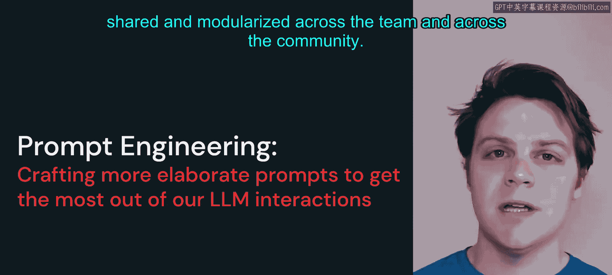
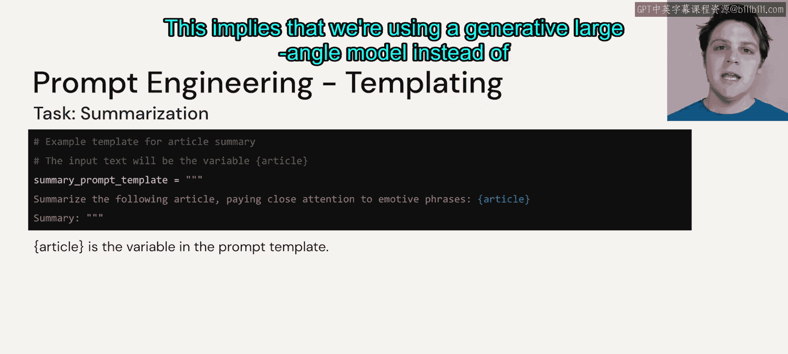
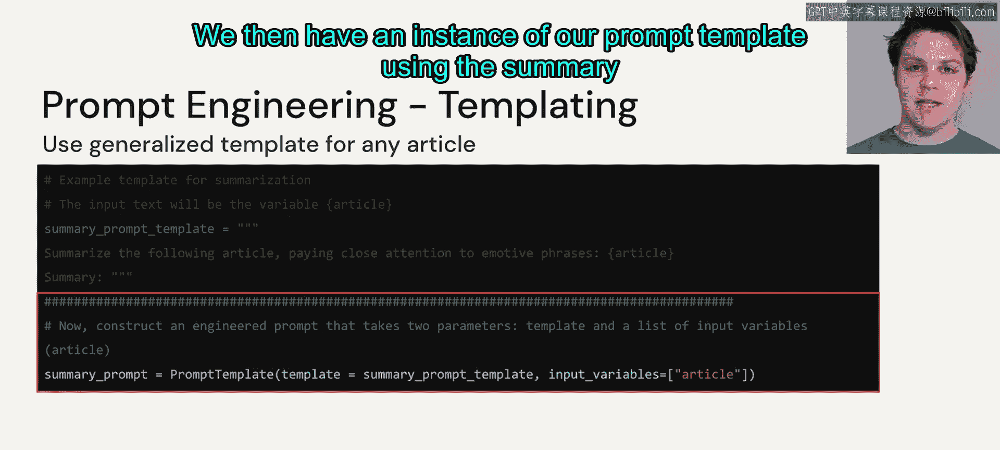
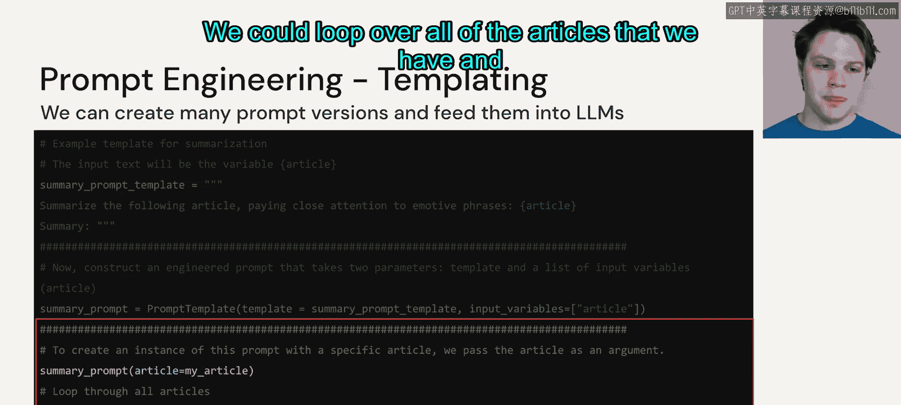
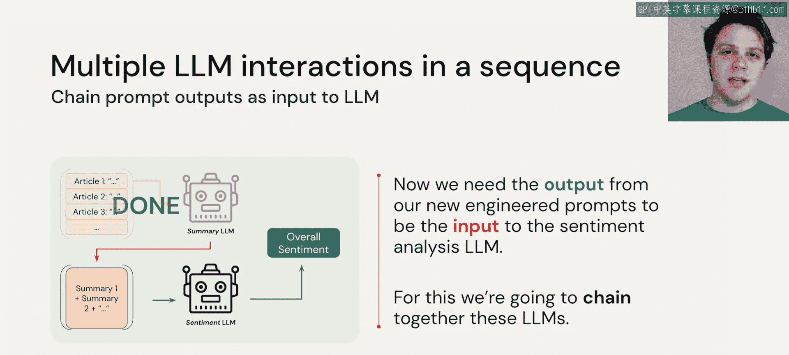
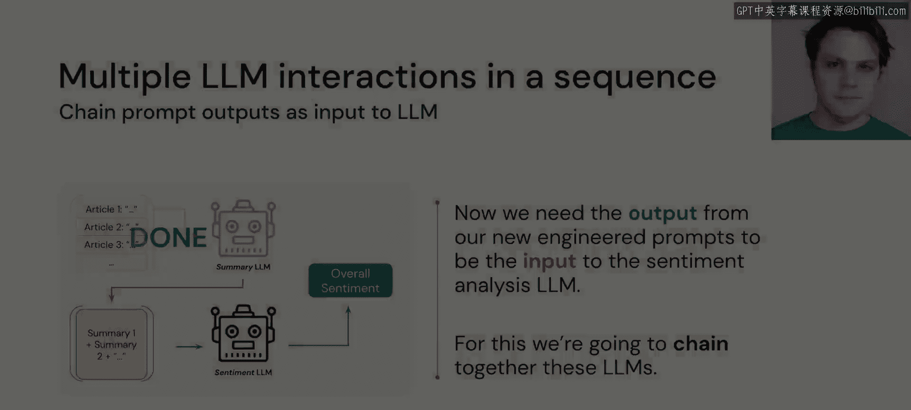

# 32：提示工程


在本节中，我们将学习提示工程的核心概念与实践。一个精心设计的提示能够引导大语言模型生成高质量的响应，而一个设计不佳的提示则可能无法充分发挥模型的潜力。我们将通过一个具体的文章摘要任务，系统地学习如何构建有效的提示。

## 提示工程的重要性

上一节我们介绍了多阶段推理的概念，本节中我们来看看如何通过提示工程来优化大语言模型的使用。一个编写良好的提示不仅能有效引导模型，还能节省大量精力，并且可以在团队和社区中共享和模块化。

## 构建提示模板：逐步指南



以下是构建一个用于文章摘要任务的提示模板的步骤。我们将使用一个摘要模型来处理文章，其输出后续将用于情感分析。

首先，我们需要创建一个摘要提示模板。我们通过逐步构建的方式来完成它。

1.  **任务描述**：我们告诉模型“总结以下文章，并密切关注情感性短语”。第二个子句是为了确保模型在摘要时关注情感色彩，而不仅仅是事实信息。
2.  **定义输入变量**：我们使用花括号 `{}` 来定义一个变量，后续将输入具体的文章文本。例如：`{article}`。
3.  **指定输出格式**：我们以“摘要：”作为结尾，提示模型开始生成摘要内容。这暗示我们使用的是生成式大语言模型，而非我们在入门部分讨论过的分类模型。

综合以上步骤，一个基础的提示模板可能如下所示：

```
总结以下文章，并密切关注情感性短语：
{article}
摘要：
```

## 代码实现：创建与使用提示

接下来，我们将上述模板转化为代码。这里使用了 LangChain 的语法，但其他提示库也有类似的结构。

我们首先创建提示模板的实例。



```python
# 导入必要的库（假设使用LangChain）
from langchain import PromptTemplate

# 定义提示模板字符串
template_string = """总结以下文章，并密切关注情感性短语：
{article}
摘要："""

# 创建PromptTemplate对象
summary_prompt = PromptTemplate(
    input_variables=["article"],  # 定义输入变量名
    template=template_string      # 指定模板字符串
)
```

然后，我们可以为具体的文章生成格式化的提示。



```python
# 假设我们有一篇具体的文章
my_article = "这里是需要被总结的文章全文..."

# 使用模板和文章内容生成最终的提示
formatted_prompt = summary_prompt.format(article=my_article)

# 现在可以将 formatted_prompt 传递给摘要大语言模型以生成摘要
# generated_summary = summary_llm(formatted_prompt)
```



通过循环处理所有文章，我们可以为每一篇都创建摘要。这解决了我们两阶段问题中的第一部分：将文章逐一输入摘要模型。

## 从提示链到模型链

到目前为止，我们所做的是将一个提示模板链接到一个大语言模型。这是通过提示模板完成的。现在，我们需要考虑如何将摘要模型的输出，作为情感分析大语言模型的输入。这意味着我们需要将一个大型语言模型的输出与另一个大型语言模型链接起来。

因此，我们将在下一个视频中深入探讨 **LLM 链** 的世界。

## 本节总结





本节课中我们一起学习了提示工程的基础。我们了解到精心设计提示的重要性，并逐步实践了如何为一个文章摘要任务构建提示模板，包括定义任务、设置变量和指定输出格式。最后，我们通过代码演示了如何创建和使用提示，并引出了将多个模型串联起来的下一个主题——LLM链。