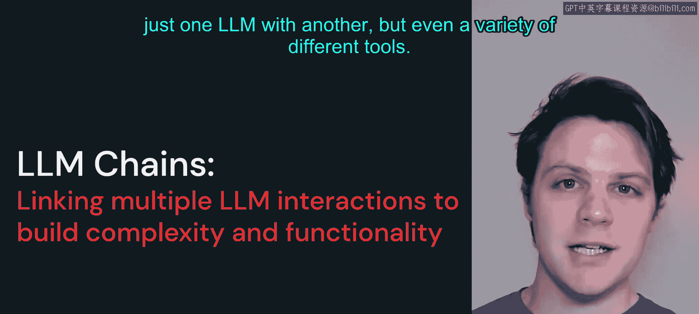
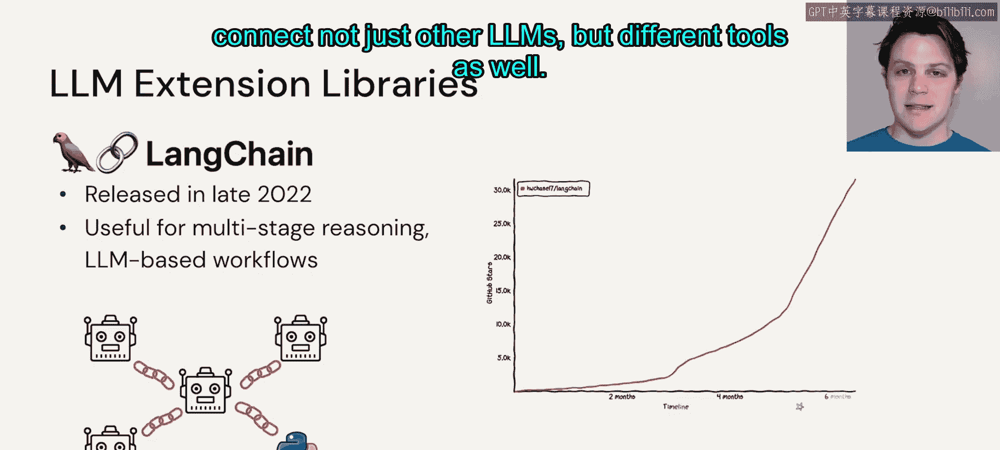
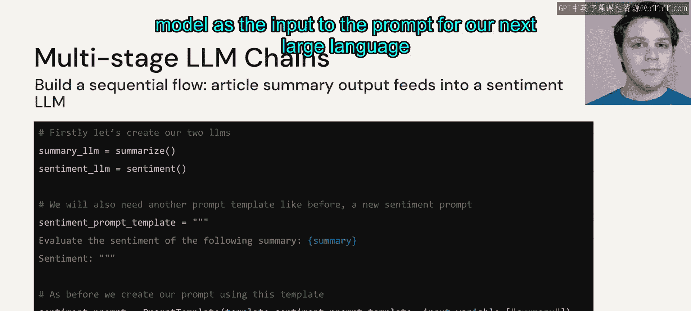
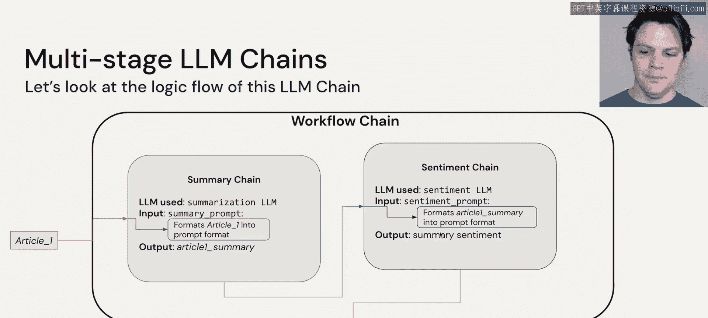
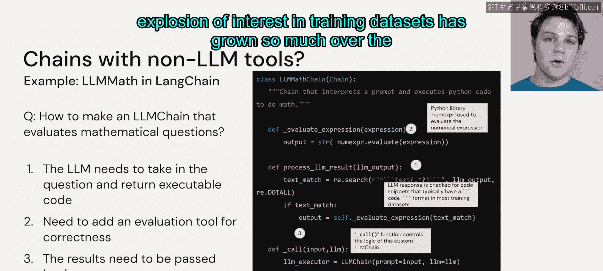
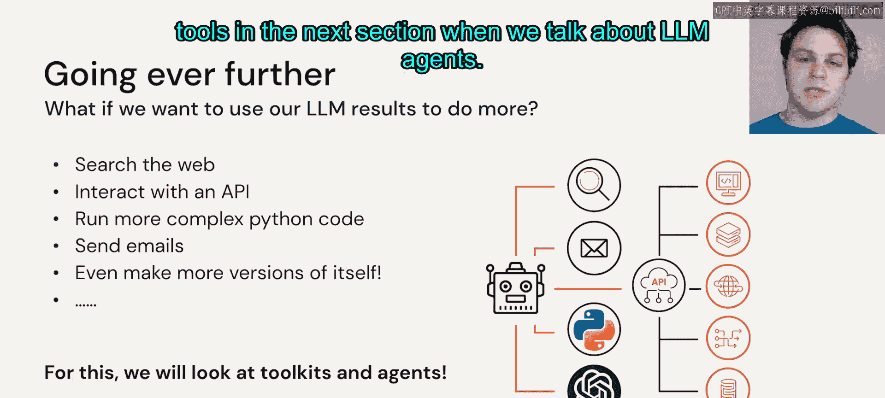

# 33：LLM 链式应用

## 概述

在本节课中，我们将要学习大语言模型（LLM）中一个令人兴奋的领域：**LLM 链**。我们将探讨如何将多个LLM甚至不同类型的工具连接在一起，以构建更复杂、更强大的工作流。

---

现在，让我们从大语言模型最令人兴奋的领域之一开始，那就是 **LLM 链**。在这里，我们不仅可以连接一个LLM与另一个LLM，甚至可以连接各种不同的工具。

LLM 链的概念在2022年底随着 **LangChain** 库的发布而开始流行。自那时起，其受欢迎程度便与日俱增。我们看到使用 LangChain 的应用程序如雨后春笋般涌现，创造出各种令人惊叹的不同类型的产品和工作流。

在本节中，我们将讨论 LangChain 的工作原理，以及我们如何利用大语言模型不仅连接其他LLM，还能连接不同的工具。

---

让我们回到之前的例子。我们已经完成了文章的输入、总结，并创建了一个用于总结的提示模板。现在，我们需要创建另一个提示模板，以便将情感分析纳入我们的工作流。

我们将创建一个新的情感分析提示模板，就像我们为总结所做的那样。模板内容可以是：“评估以下摘要的情感”，然后传入那个摘要。

接着，我们将请求LLM生成情感分析结果。这与我们之前看到的非常相似，我们只是在完成这个问题的闭环。我们有两个大语言模型，它们可能来自同一个提供商，也可能是不同的，这取决于我们如何利用手头的资源。我们可能会使用一个专门为总结微调的LLM，以及另一个专门为情感分析微调的LLM。

现在，我们有了一个提示，它将我们最初文章的摘要作为输入。因此，我们将把第一个大语言模型的输出，作为下一个大语言模型提示的输入。

---

如果我们看看如何将这两者连接起来，最终会得到三个不同的链。

首先，我们有一个**工作流链**，它将所有部分连接在一起。

然后，在这个工作流链内部，有两个较小的链：
*   **总结链**：我们之前看到过，它将提示和文章数据连接到我们用于总结的大语言模型。
*   **情感链**：它将总结链的输出，作为我们情感分析大语言模型提示的输入。

接着，情感链的输出就成为工作流链的输出，即文章1的情感。

这里发生了很多事情，但你可以将其想象成两个小胶囊连接在一起，构成了我们的工作流。

---

我们能做的远不止连接一个大语言模型到另一个大语言模型。通过将大语言模型连接到数学套件、编程工具、搜索库等各种事物，我们可以创造出无穷的创意。

让我们看看如何构建这样的东西，以及需要怎样的思考过程，才能将我们分析的自然语言连接到这些程序化接口。

以下是构建此类连接的基本步骤：

1.  **生成可执行代码**：第一步是接收我们提供的文本或问题，并返回可执行代码（如果我们连接到某种数学库）。
2.  **执行与解释**：代码会被传递给某种解释器执行，就像人类在终端中输入代码一样。
3.  **整合与回应**：LLM接收执行结果，将其与我们最初的问题结合，生成一个自然语言的回应。

例如，我们给出问题：“计算5乘以10”。LLM可能会生成代码 `5 * 10`，解释器执行后返回结果 `50`。然后LLM会生成回应：“5乘以10等于50”。

这个过程虽然看起来复杂，但一步步来看，它真正展示了我们利用这些大语言模型所能拥有的强大能力。当然，这依赖于大语言模型经过足够好的训练，能够根据自然语言输入生成代码片段。许多知名或在课程中会看到的LLM，其训练数据都包含代码部分，这也是过去几年对训练数据集探索和兴趣激增的原因之一。

---

我们可以走得更远，超越简单的Python代码解释器。如果我们的大语言模型训练得足够好或足够专门化，我们实际上可以将其用作一个**核心推理工具**。

我们可以赋予它访问不同类型资源的能力，例如搜索引擎、电子邮件客户端、其他大语言模型。整个互联网世界，只要我们能通过API与之交互，理论上都可以对这些大语言模型开放。

只要我们构建我们的输入和提示，使得LLM的响应包含能与某种API交互的代码或代码片段，并且它能接收该API调用的结果，我们就可以让我们的LLM连接到我们拥有的几乎所有程序化接口。

我们可以以结构化的方式做到这一点，甚至可以让LLM自行决定它应该使用什么工具。我们将在下一节讨论LLM智能体时，重点介绍这些模型如何决定使用它们的工具。

---

## 总结

本节课中，我们一起学习了**LLM链**的核心概念。我们了解到，通过LangChain等框架，可以将多个LLM或工具串联起来，构建多阶段推理的工作流。从简单的总结-情感分析链，到连接代码解释器、API接口，LLM链极大地扩展了大语言模型的应用边界和创造力。关键在于设计合适的提示，让LLM生成可执行的指令，并处理返回的结果，最终整合成流畅的自然语言输出。这为构建更智能、更自主的应用系统奠定了基础。