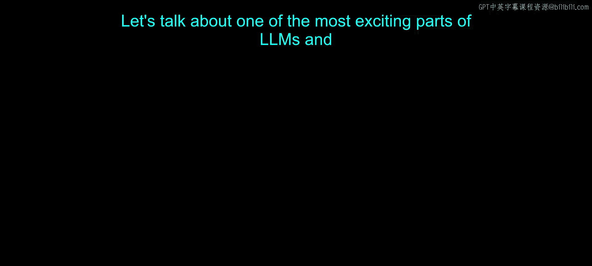
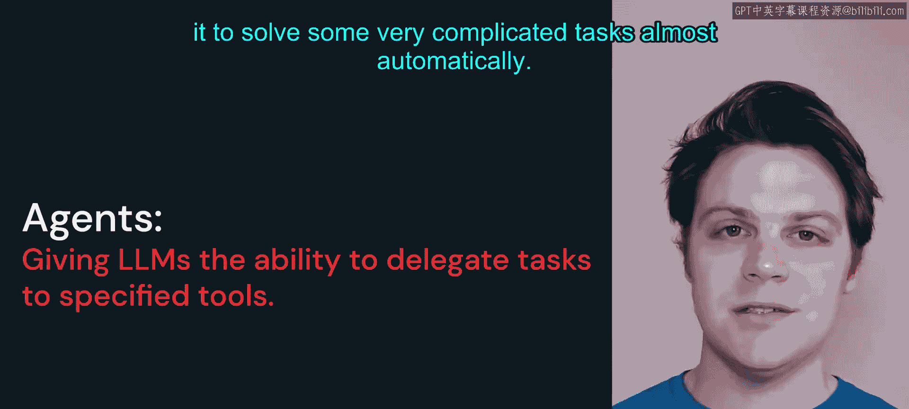
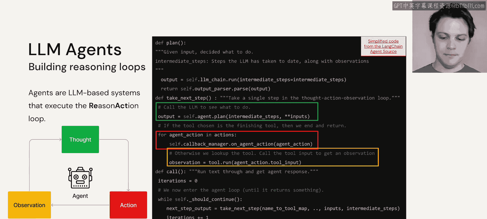
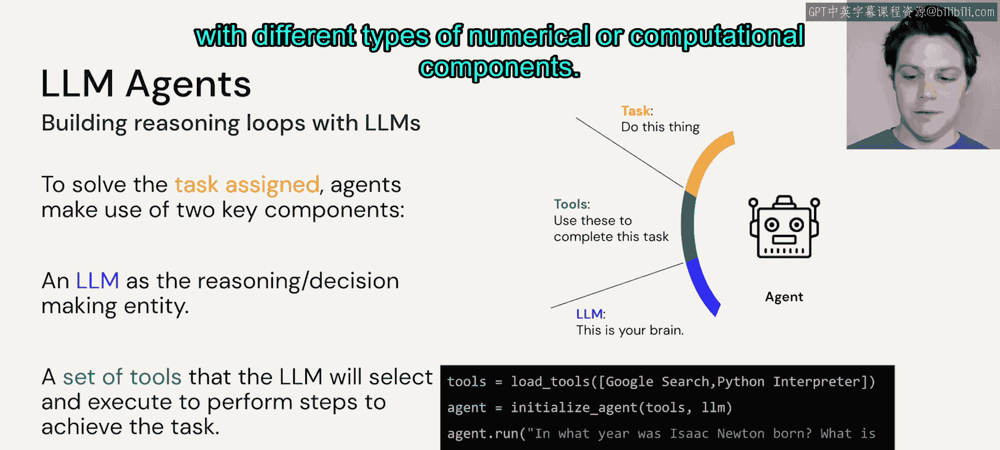
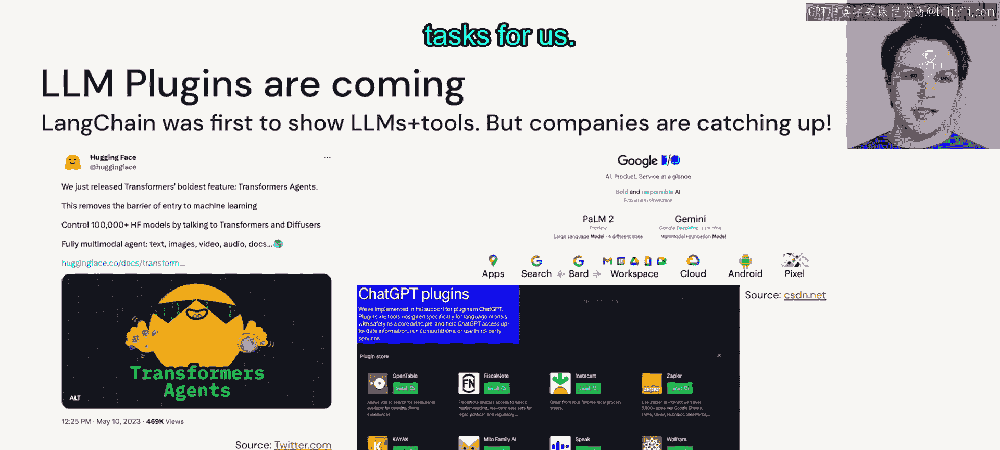
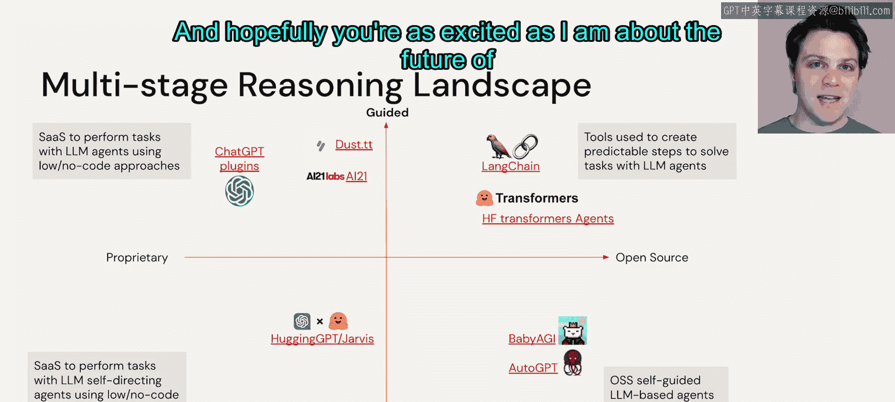
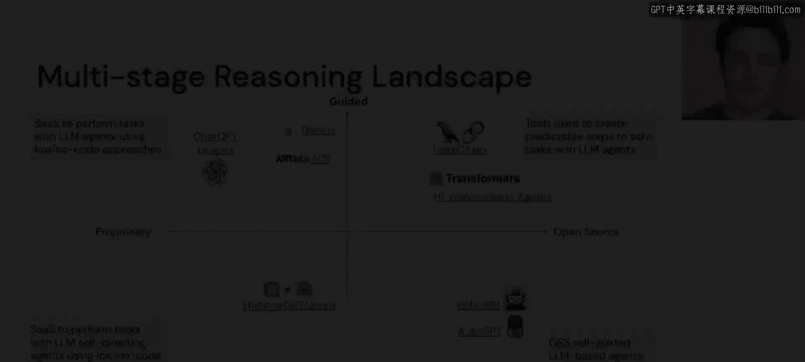

# 34：智能体（Agents）🤖

在本节课中，我们将要学习大语言模型（LLM）中最令人兴奋的部分之一：LLM智能体。我们将了解智能体的核心概念、工作原理、构成要素以及当前的发展生态。

## 概述

LLM智能体将大语言模型作为核心推理单元，并为其配备各种工具和组件，使其能够自动解决非常复杂的任务。这种能力源于语言模型所展现出的强大推理循环。

## 智能体的工作原理 🔄

上一节我们介绍了智能体的基本概念，本节中我们来看看它的核心工作原理。

一个LLM智能体建立在推理循环之上。我们可以给大语言模型一个任务，并要求它提供一个完成该任务的计划或思考过程。然后，我们可以利用这种逐步推进的方法，强制LLM经历一个“思考-行动-观察”的循环。

如果我们观察右侧的代码，可以看到流程始于调用LLM并给予其一个自然语言请求。LLM会审视这个请求，查看其可支配的工具描述，然后决定下一步做什么。接着，它会观察使用特定工具执行该行动的结果，并判断是应该停止并返回已完成的任务，还是应该采取另一步骤，将当前已有的结果作为下一步LLM的输入，继续这个过程。

这个过程会持续进行，直到达到最大迭代次数或满足某些停止条件。这使得LLM智能体成为解决复杂问题的强大工具。

## 构建智能体的要素 🛠️

了解了工作原理后，我们来看看构建一个LLM智能体需要哪些基本要素。

以下是构建LLM智能体所需的三个核心部分：
1.  **一个需要解决的任务**：这是智能体的目标。
2.  **一个具备良好思维链推理能力的LLM**：这是智能体的大脑。
3.  **一组工具**：这些工具能够与大语言模型交互，就像我们在LLM链中看到的数学工具一样。

工具描述非常有用，因为LLM会审视它需要执行的任务请求，查看工具的描述，然后决定应该使用哪个工具以及如何与之交互。由于LLM通常具备输出代码或API交互代码的能力，我们可以利用这一点与不同类型的数值或计算组件进行交互。

## 智能体的发展生态 🌍

现在我们已经知道如何构建一个智能体，接下来看看这个领域正在发生什么。

LLM智能体或LLM插件正开始向公众发布，并由开源社区开发。LangChain是第一个被广泛使用的LLM智能体开源应用，但整个社区正迅速跟进并开发类似的产品。Hugging Face几周前刚刚发布了他们的Transformers Agents。谷歌在今年的I/O大会上展示了PaLM 2与其Workspace的集成。ChatGPT正在逐步向公众发布插件功能，我们可以将不同类型的工具连接到ChatGPT界面，让它为我们完成非常有趣和复杂的任务。

OpenAI承认开源社区正朝着与其相似的方向发展，甚至在讨论插件的文档中引用了LangChain。

## 前沿探索：自主智能体 🚀

如果我们想将这个概念推向极致，实际上可以赋予LLM更多的自主能力，允许它创建自身的副本，从而仅需少量提示即可解决任务。

在2023年初，一个名为AutoGPT的新项目（更准确地说是一个新代码库）被创建出来。AutoGPT使用GPT-4来创建自身的克隆，并将任务委托给这些副本，从而仅通过自然语言提示就能解决真正复杂且令人着迷的任务。

因此，这些多阶段推理工具正在形成一个初步的生态格局。产品之间的差异基于它们是专有的还是开源的，以及它们是否是“有引导的”（如LangChain或Hugging Face Transformers提供的结构化构建模块），还是一些“无引导的”项目（如HuggingGPT、Baby AGI和AutoGPT），这些项目目前正由开源社区积极开发。

我强烈建议你查看所有这些项目，因为它们非常迷人，并且持续更新以展现惊人的能力。我们将在后续的笔记本中学习如何构建其中一些智能体，希望你对LLM智能体生态的未来和我一样感到兴奋。

## 总结

本节课中，我们一起学习了LLM智能体的核心概念。我们了解到智能体利用大语言模型作为推理核心，通过“思考-行动-观察”的循环，结合外部工具来解决复杂任务。构建智能体需要明确的任务、强大的LLM和定义清晰的工具集。当前，从LangChain、Hugging Face Agents到AutoGPT，一个充满活力的智能体生态正在快速发展，预示着AI应用将变得更加自主和强大。