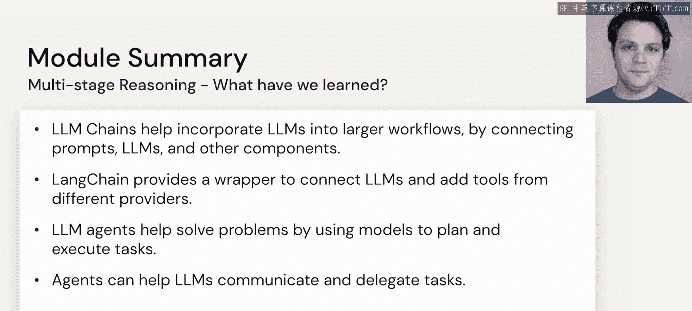

# 35：多阶段推理总结 🧠

在本节课中，我们将回顾和总结第三模块“多阶段推理”的核心内容。我们探讨了如何利用LangChain框架和LLM智能体来构建结构化的工作流，以执行复杂的任务。


---

上一节我们介绍了LLM智能体的强大能力，本节中我们来对整个模块进行总结。

我们首先了解了**LLM链**如何帮助构建结构化的工作流。其核心是将提示模板与执行特定任务的LLM结合起来，逐步生成我们想要的结果。其基本思想可以用一个简单的流程表示：

**工作流 = 提示模板 + 特定任务LLM**

接着，我们探讨了**LangChain**框架。它作为这些链的封装器，使得构建和利用不同工具与架构变得更加容易。这允许我们的LLM执行多样化的任务，不仅限于自然语言处理，还包括编译代码和运行各种复杂逻辑。例如，通过LangChain，我们可以这样组织一个链式调用：

```python
from langchain.llms import OpenAI
from langchain.prompts import PromptTemplate
from langchain.chains import LLMChain

# 定义模板和链
template = "请将以下英文翻译成中文：{text}"
prompt = PromptTemplate(template=template, input_variables=["text"])
llm_chain = LLMChain(prompt=prompt, llm=OpenAI())
```

最后，我们看到了**LLM智能体**如何执行一些真正令人惊叹的任务。它们能够自主使用工具、进行决策，其全部潜力仍有待我们进一步探索。

---

以下是本模块涵盖的三个核心要点：

1.  **LLM链**：提供了将提示与模型结合的标准方法，实现了分步、结构化的任务执行流程。
2.  **LangChain框架**：简化了复杂链的构建与管理，极大地扩展了LLM的应用场景。
3.  **LLM智能体**：代表了更高级的自动化水平，能够动态规划并使用工具来完成目标。



---

本节课中我们一起学习了多阶段推理的关键组件。从构建基础的LLM链，到利用LangChain框架整合复杂逻辑，再到展望LLM智能体的未来潜力，我们看到了如何让大语言模型超越简单的文本生成，成为执行复杂工作流的强大引擎。


希望你已经掌握了本模块的内容。接下来，是时候进入实践环节，在代码笔记本中亲眼看看这些概念是如何运作的了。