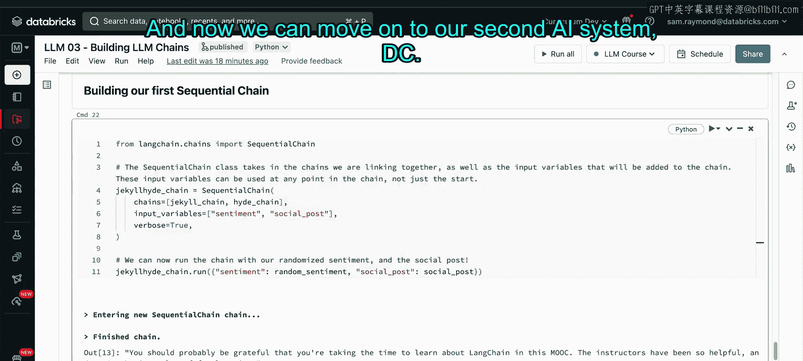

# 36：多阶段推理系统构建


## 概述

在本节课中，我们将学习如何使用 LangChain 构建两个多阶段推理的 AI 系统。第一个系统是一个包含自我审查机制的双 LLM 链，第二个系统则是一个具备网络搜索能力的智能体。

## 环境设置与准备工作

在开始构建系统之前，我们需要完成一些准备工作。

以下是设置环境的步骤：

1.  运行课堂设置单元，配置必要的环境变量并安装所需的 Python 包。
2.  获取并配置 API 密钥。本教程将使用 Hugging Face 和 SerpAPI（用于谷歌搜索）的服务。请参考相关链接注册免费账户并获取密钥。
3.  安全地导入 API 密钥。推荐使用 Databricks Secrets 工具，避免在代码中明文存储密钥。

## 构建“杰基尔与海德”自我审查系统

上一节我们完成了环境配置，本节中我们将构建第一个 AI 系统。这个系统由两个大型语言模型组成，分别扮演“评论者”和“审核者”的角色。

### 第一步：创建评论者（杰基尔）的提示模板

首先，我们需要为评论者模型定义一个提示模板，指导它如何生成评论。

```python
from langchain import PromptTemplate
import numpy as np

jekyll_template = """
你是一个社交媒体评论者。
你将用{sentiment}的情绪回应以下帖子。
{social_post}
评论：
"""
```

我们使用 `PromptTemplate` 类来实例化这个模板，并指定输入变量为 `sentiment`（情绪）和 `social_post`（社交媒体帖子）。

```python
prompt_template = PromptTemplate(
    input_variables=["sentiment", "social_post"],
    template=jekyll_template,
)
```

接下来，我们为系统生成一些输入数据。情绪是随机选择的（“友好”或“刻薄”），而社交媒体帖子内容是固定的。

```python
random_sentiment = "mean"  # 也可以是 "nice"
social_post = "真不敢相信我正在这门慕课中学习 LangChain。要学的东西太多了。到目前为止，讲师们都非常乐于助人。我学得很开心。😊"
```

现在，我们可以用这些数据来填充提示模板，生成完整的提示。

```python
jekyll_prompt = prompt_template.format(
    sentiment=random_sentiment,
    social_post=social_post
)
print(jekyll_prompt)
```

### 第二步：为杰基尔选择大语言模型

有了提示之后，我们需要为杰基尔选择一个“大脑”，即一个大语言模型。这里我们以 OpenAI 的模型为例进行说明。

```python
from langchain.llms import OpenAI

# 实例化 OpenAI 模型，这里使用 text-babbage-001
jekyll_llm = OpenAI(
    model_name="text-babbage-001",
    openai_api_key=你的_openai_api密钥,  # 请安全地替换为你的密钥
)
```

### 第三步：构建杰基尔的 LLM 链

现在，我们将提示模板和大语言模型连接起来，形成一个 LLM 链。这个链将接收输入变量，运行模型，并输出结果。

```python
from langchain.chains import LLMChain
from better_profanity import profanity

jekyll_chain = LLMChain(
    llm=jekyll_llm,
    prompt=prompt_template,
    output_key="jekyll_said",
    verbose=False
)

# 运行链并获取杰基尔的评论
jekyll_said = jekyll_chain.run(
    sentiment=random_sentiment,
    social_post=social_post
)

# 使用过滤器确保输出安全
print(profanity.censor(jekyll_said))
```

### 第四步：创建审核者（海德）的 LLM 链

杰基尔可能发表不当言论，因此我们需要海德来审核。其构建步骤与杰基尔类似。

以下是构建海德链的完整代码：

```python
# 1. 定义海德的提示模板
hyde_template = """
你是一个在线论坛的审核员。
你非常严格，不容忍任何负面评论。
你会查看来自用户的以下评论：{jekyll_said}。
如果它有任何负面内容，你会用符号（如 `####`）替换它并发布。
如果它看起来不错，你会原封不动地保留它并逐字重复。
编辑后的评论：
"""
hyde_prompt_template = PromptTemplate(
    input_variables=["jekyll_said"],
    template=hyde_template
)

# 2. 为海德实例化一个（可能更强大的）LLM
hyde_llm = OpenAI(model_name="text-davinci-003", openai_api_key=你的_openai_api密钥)

# 3. 构建海德的 LLM 链
hyde_chain = LLMChain(
    llm=hyde_llm,
    prompt=hyde_prompt_template,
    verbose=False
)

# 4. 运行海德链，审核杰基尔的发言
hyde_says = hyde_chain.run(jekyll_said=jekyll_said)
print(hyde_says)
```

### 第五步：使用顺序链整合系统

目前，我们需要手动将杰基尔的输出传递给海德。为了创建一个更流畅、模块化的系统，我们可以使用 `SequentialChain` 将两个链自动连接起来。

```python
from langchain.chains import SequentialChain

jekyll_hyde_chain = SequentialChain(
    chains=[jekyll_chain, hyde_chain],
    input_variables=["sentiment", "social_post"],
    verbose=True  # 设置为 True 以查看中间步骤
)

# 现在，只需提供初始输入，即可获得最终审核结果
final_output = jekyll_hyde_chain.run({
    "sentiment": random_sentiment,
    "social_post": social_post
})
```

## 总结



本节课中，我们一起学习了如何使用 LangChain 构建多阶段推理系统。我们首先创建了“杰基尔与海德”双 LLM 链系统，实现了评论生成与自动审核的功能。通过定义提示模板、实例化大语言模型、构建 LLM 链，最终使用 `SequentialChain` 将它们串联，我们完成了一个可以接收初始输入并自动执行多步推理的完整流程。这为构建更复杂的 AI 应用奠定了基础。