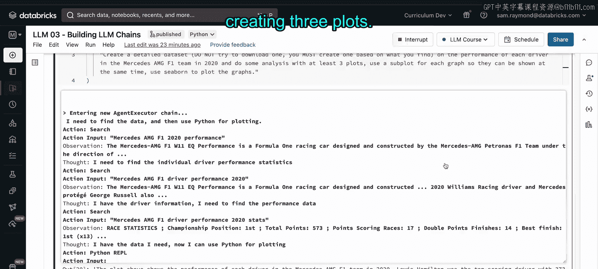
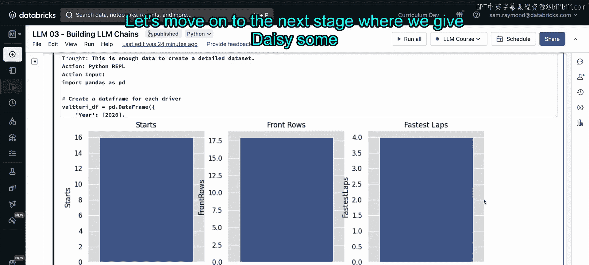

# 37： Notebook Demo Part 2


在本节中，我们将构建一个基于ReAct（思考-行动-观察）循环范式的LLM智能体。这个智能体名为Dacey，它能够接收纯文本指令，并对找到的数据进行科学分析。

上一节我们介绍了Jekyll Hyde智能体，本节中我们来看看如何构建一个更专注于数据科学任务的智能体。

## 构建智能体：Dacey

我们将构建的智能体类型称为“零样本ReAct描述”。这意味着Dacey将使用零样本学习来尝试解决我们给出的任务。我们只需提供提示，并期望Dacey使用其拥有的工具来解决问题。

以下是构建LLM智能体的核心步骤：

### 1. 选择工具集

构建LLM智能体最重要的部分是给它一套合理的工具集。了解智能体的任务将决定你为它配备的工具类型。

对于Dacey，它将可以访问以下工具：
*   Wikipedia搜索API
*   Google搜索API
*   终端
*   Python REPL（读取-求值-打印循环）

Python REPL对于Dacey执行诸如使用Pandas库下载数据、与数据交互等任务非常有用。

### 2. 选择大语言模型

与Jekyll Hyde类似，你可以使用Hugging Face、OpenAI或其他LLM提供商。在本演示中，我们将使用OpenAI的LLM，并且不指定具体模型，让库为这个LLM选择最先进的模型。

**建议**：在构建LLM智能体时，推荐使用你能访问到的更先进的模型，因为任务的复杂性需要一个性能良好、知识丰富的大语言模型来生成所需的代码或推理循环。

### 3. 初始化智能体

我们将使用`load_tools`库加载工具，并传入之前获取了令牌的Wikipedia搜索API、Python REPL和终端命令库。

然后，我们可以使用`initialize_agent`命令类，传入工具、我们指定的LLM以及代理类型（即零样本ReAct描述）来构建Dacey。我们将把`verbose`设置为`True`，以便观察Dacey的思考过程。

**代码示例**：
```python
from langchain.agents import initialize_agent, load_tools
from langchain.llms import OpenAI

# 加载工具
tools = load_tools(["wikipedia", "python_repl", "terminal"], llm=llm)

# 初始化智能体
agent = initialize_agent(
    tools,
    llm,
    agent="zero-shot-react-description",
    verbose=True
)
```

现在，让我们设置好并开始测试Dacey的技能。

## 测试Dacey的技能

### 测试一：基础数据分析

首先，我们使用一个相对简短但明确的提示，要求Dacey创建一个数据集（不是下载，而是创建），并找到关于梅赛德斯AMG F1车队2020年表现的数据进行分析，最后绘制结果。

运行此命令后，我们可以看到Dacey进入了一个代理执行链。它的第一个行动是搜索，因为它意识到需要查找数据并进行分析。它执行搜索动作，获取观察结果并进行思考。接着，Dacey传递结果，查看车队的表现统计数据，然后创建数据集并准备绘制结果。Dacey导入了pandas，构建了一个数据框，并绘制了该赛季车队的不同统计数据。

这是一个相当令人印象深刻的结果，但我们可以做得更多。

### 测试二：更详细的提示

让我们尝试通过给出更详细的提示来改进，要求Dacey至少绘制三个图表，并使用子图将它们同时绘制出来，同时使用Seaborn库让结果更美观。

虽然之前的结果已经很好，但让我们看看Dacey在更详细的提示下能做什么。请注意，这并不意味着Dacey会使用之前的数据或提前下载，它很可能再次从头开始执行。理论上，我们可以保存一些数据并使用不同的工具，以便Dacey能够利用已有的数据，我们将在下一部分看到如何实现。

我们可以看到Dacey找到了比赛统计数据和不同的得分。Dacey现在使用Python REPL，导入pandas和seaborn。Dacey有了一个数据框。现在，我们在绘图输出中可以看到刘易斯·汉密尔顿和瓦尔特里·博塔斯的得分图。

然而，我们要求Dacey绘制三个图表，但这只是一个。不过Dacey确实使用了Seaborn，所以它完成了大部分要求，但并不完美。LLM智能体背后并没有魔法，有时它们是否能给出你想要的精确结果全靠运气，你可能需要运行一两次。

让我们再运行一次这个命令，看看Dacey在第二次尝试中是否能成功。

### 测试三：二次尝试与成本考量



再次运行时，Dacey找到了一些关于该赛季的口述分析，并开始传递信息。请记住，每次运行这类命令时，Dacey都会使用API令牌来访问搜索API以及OpenAI LLM命令或Hugging Face命令，因此请注意你让智能体做什么，以及你对令牌使用的容忍度。

我们可以看到，我们获得了该车队两名车手的数据框。Dacey现在表示它已拥有数据集，并准备创建三个图表。

现在这些图并不是最出色的，它们基本上只是各自绘制了一个变量。然而，这正是我们要求Dacey做的：我们得到了该年度车队取得的杆位数量、前排发车位置数量和最快圈速数量。

这只是LLM智能体能力的初步展示，仅通过提示中非常有限的信息就允许它在网络上搜索。理论上，你可以编写一个极其复杂的提示，包含大量提示和技巧，以进一步引导你的LLM智能体表现得越来越好。但仅凭提示中的少量信息，我认为Dacey已经做得非常好了。

## 本节总结



本节课中我们一起学习了如何构建一个基于ReAct范式的数据科学LLM智能体Dacey。我们了解了为其配备合适工具集的重要性，并使用LangChain库进行了初始化。通过几个测试案例，我们看到了Dacey如何根据文本指令搜索信息、处理数据并生成可视化图表。同时，我们也认识到智能体的输出结果存在一定随机性，且需注意API调用的成本。下一节，我们将探讨如何让Dacey利用已有的数据进行工作。