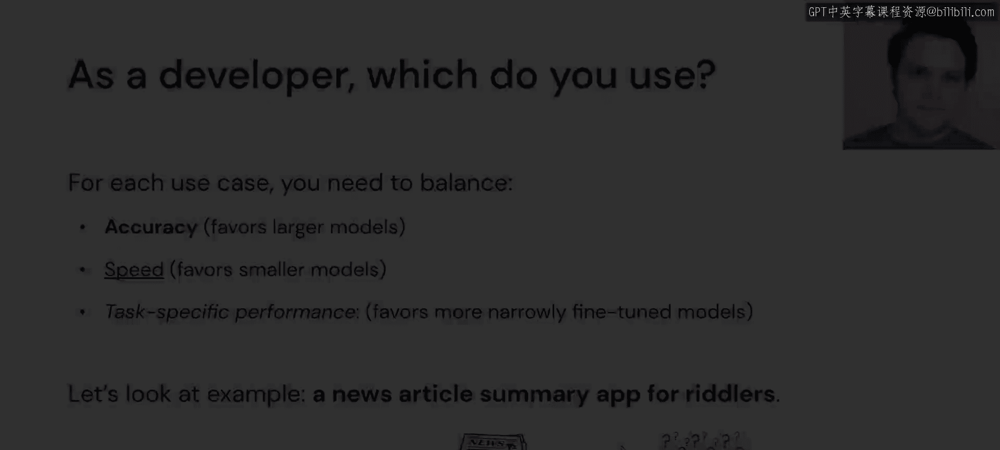

# 40：模块四概述

在本节课中，我们将要学习如何针对特定应用场景，对大型语言模型进行微调和评估。我们将探讨何时需要微调模型，以及如何通过实践操作来定制模型以满足特定需求。

---

欢迎来到模块四。至此，本课程已过半程。我们已经见识了大型语言模型的强大能力：从使用Hugging Face解决几乎所有自然语言处理问题，到模块二中介绍的向量数据库，再到能与LangChain结合使用的各种神奇工具。大型语言模型及其应用似乎为我们提供了构建任何所需功能的灵活性。

但是，如果你认为现有的大型语言模型不完全适合你的应用呢？也许它需要定制化的数据才能工作，或者你只是不确定如何以最高效的方式构建你的应用。本模块的目标就是展示我们如何选取不同类型的大型语言模型，将其应用于构建特定类型的应用，并在认为需要创建专属模型时，走完微调的全过程。

在本模块结束时，你将理解何时以及如何微调不同类型的大型语言模型。通过我们的实践笔记，我们将了解DeepSpeed，以及如何使用Hugging Face模型针对我们的具体用例进行微调。我们还将学习如何评估这些不同类型的大型语言模型，以确保当我们微调或定制这些模型时，它们能给出我们想要的答案。

接下来，我们来谈谈典型的大型语言模型发布。

我们将考虑目前几乎每周都会出现的开源大型语言模型发布。

通常，它们会以多种不同规模发布。我们有一个基础模型，这种模型仅被训练来根据其迄今为止见过的所有文本预测下一个词。这些模型通常有基础尺寸，以及更小和更大的版本。这里的“尺寸”指的是参数数量，或者它可能占用的存储空间或内存大小（以GB计）。

模型也可能以不同的序列长度发布，这指的是我们单次可以输入给模型的令牌数量。

更新的技术（我们将在课程二中介绍其中一些）允许大型语言模型将序列长度扩展到数万，而通常我们被限制在4000左右。我们还可能看到，大型语言模型在发布基础模型（仅用于为生成模型预测下一个词）的同时，会附带一些预微调版本。

我们也可能看到一个基于聊天的模型随此次基础发布一同推出，它被训练用于进行更类人的对话交互。此外，还可能有一个基于指令的模型，它与聊天模型略有不同，因为它专门设计用于响应被赋予的任务。

作为开发者，你可能会疑惑该选择哪个方向，选择哪一个？

在每种情况下，我们都必须权衡准确性、速度和任务特定性能。

准确性往往倾向于更大的模型，因为更大的模型通常由于见过更多训练数据且拥有更多参数来解决不同问题，从而能提供更好的性能。

速度方面，推理速度将是一个重要因素。通常，较小的模型因为占用空间更小且涉及的计算更少，在推理时比大模型快得多。

任务特定性能也是我们需要考虑的因素。大型语言模型虽然可能拥有广泛的知识集，但在特定用例上的效率或性能值可能与专门针对该用例微调的模型不同。

在本模块中，我们将聚焦于一个非常具体的用例，向你展示如何解决你的问题。

我们将构建一个应用程序，它接收一篇新闻文章，对其进行总结，然后将其转化为一个谜语，供该应用程序的用户解答。

---

本节课中，我们一起学习了模块四的总体目标：针对特定应用微调和评估大型语言模型。我们了解了基础模型的不同变体，以及在实际应用中选择模型时需要权衡的要素。在接下来的小节中，我们将深入实践，学习具体的微调与评估技术。