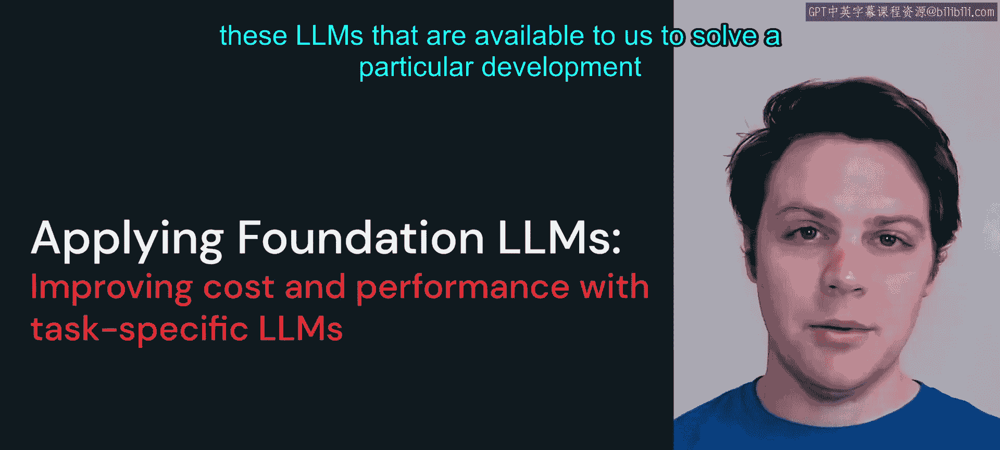
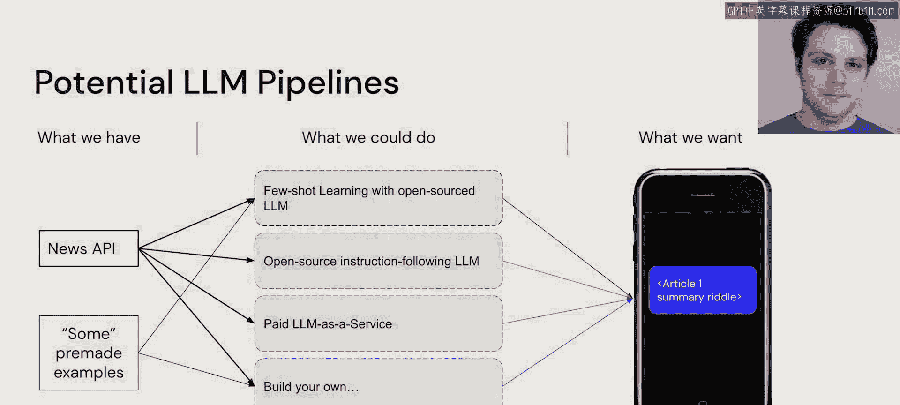

# 41：应用基础大语言模型

在本节课中，我们将通过一个具体的应用开发示例，学习如何应用现有的大语言模型来解决问题。我们将探讨不同的模型选择与实现路径。

## 概述

我们将构建一个新闻应用，其核心功能是总结每日新闻文章，并将其改写为谜语形式，供用户阅读和解谜。接下来，我们将思考如何利用现有工具来实现这个想法。

## 可用的LLM流水线方案

我们拥有多种潜在的大语言模型应用方案。首先，考虑我们已有的资源：我们将通过应用程序接口连接某个新闻媒体，以获取全球每日新闻文章。此外，我们可能拥有一些由我们自己或擅长将新闻改写为谜语的人预先编写的示例。虽然样本数量不多，但足以支持后续进行少量样本学习。

考虑到社区发布的各种大语言模型，我们可以采取以下几种路径：

*   **使用开源LLM进行少量样本学习**：我们可以利用开源的大语言模型，结合我们手头的示例进行少量样本学习。
*   **使用指令遵循型LLM进行零样本学习**：我们可以直接使用能够遵循指令的模型，尝试进行零样本学习。
*   **使用付费的LLM服务**：我们可以选择商业化的、按服务收费的大语言模型选项。
*   **构建自定义模型路径**：我们也可以选择从头开始，构建自己的模型解决方案。

最终，我们的目标是找到一种方法，能够处理新闻文章并最终为用户呈现一个应用界面。下面，我们将逐一探讨这些选项，看看它们如何被实施。