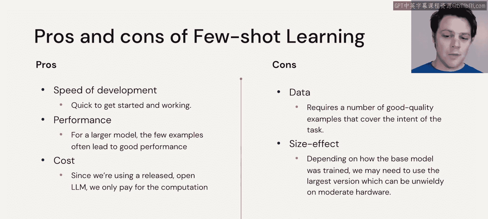
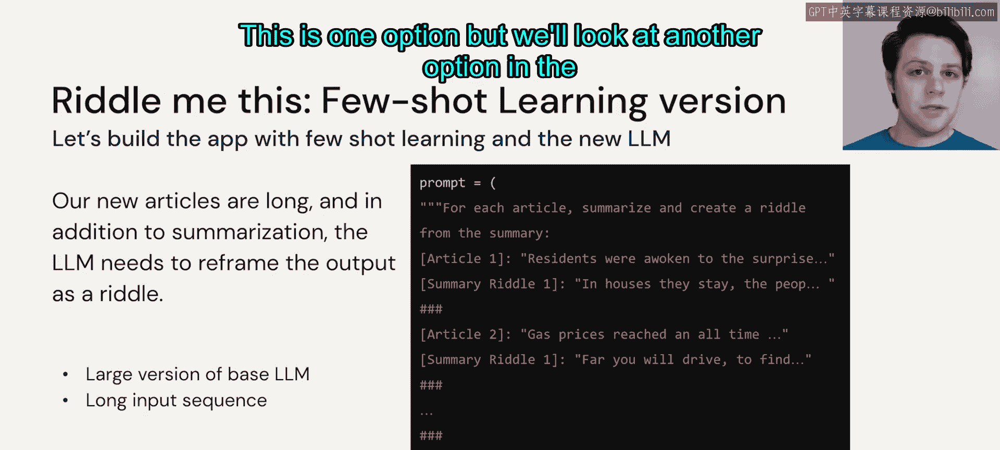

# 42： 微调之小样本学习 🧠


在本节课中，我们将要学习如何利用**小样本学习**来解决将新闻文章转换为谜语的任务。我们将探讨其实现原理、优缺点，并了解如何构建一个有效的提示词。

---

## 概述

我们面临的任务是：利用新闻API获取文章，并将其转换为有趣的谜语。一种直接的方法是**小样本学习**。这种方法无需训练模型，只需在提示词中提供少量示例，引导大型语言模型理解并执行任务。

上一节我们介绍了任务背景，本节中我们来看看如何具体应用小样本学习。

## 小样本学习的优缺点分析

在决定是否采用小样本学习前，我们需要权衡其利弊。以下是其主要优点和缺点：

**优点：**
*   **开发迅速**：我们拥有所需的所有数据，只需直接应用LLM并指定提示词即可。
*   **计算成本低**：由于我们使用的是已发布的开源LLM，不进行任何训练，仅用于推理，因此相关的计算成本极低。

**缺点：**
*   **性能依赖模型大小**：为了在示例较少的情况下获得良好性能，我们可能需要一个更大的模型。使用较小的模型或较少的示例，性能往往不尽如人意。
*   **需要高质量示例**：我们需要相当数量、高质量的示例，这些示例必须覆盖整个任务的意图和范围。我们必须确保提供的少数示例能够涵盖真实世界中可能遇到的文章的足够广度，以便模型能够推断出足够的信息。
*   **模型大小的影响**：如果我们需要使用开源LLM中最大或较大的版本，可能会带来存储空间和计算上的困难，具体取决于模型的实际大小。

## 实现方案：构建提示词

了解了优缺点后，我们来看看如何在应用程序中实现它。核心在于构建一个有效的提示词。

我们将告诉大语言模型，它需要先总结文章，然后根据总结创建一个谜语。为了简化提示词，我们暂时将其视为一个单一的任务步骤。



我们的提示词将包含以下几个部分：
1.  **任务指令**：明确要求模型进行总结并创作谜语。
2.  **示例部分**：提供我们已有的所有文章及其对应的总结谜语作为示例。
3.  **目标输入**：最后一部分是我们需要处理的新文章，并留出空白让模型生成对应的总结谜语。

一个简化的提示词结构可能如下所示：

```
你是一个将新闻文章转换为谜语的专家。请先总结文章，然后根据总结创作一个谜语。

示例：
文章：[示例文章1的全文]
总结谜语：[示例文章1对应的谜语]

文章：[示例文章2的全文]
总结谜语：[示例文章2对应的谜语]

现在，请处理以下新文章：
文章：[需要处理的新文章的全文]
总结谜语：
```

需要注意的是，对于这类应用，我们很可能需要一个支持**很长输入序列**的模型。这可能是模型的某个非常大的版本，或者是一个目前还难以获取的、专门处理长序列的模型。通常，对于小样本学习，你使用的基础或预训练模型越大，性能就越好，这也是需要考虑的因素。

---

## 总结



本节课中我们一起学习了**小样本学习**方法。我们了解到，它是一种快速、低成本的方案，通过精心设计的提示词和少量示例来引导大语言模型完成特定任务。然而，其性能严重依赖于模型的大小和所提供示例的质量与广度。这是一种可行的选项，在下一个视频中，我们将探讨另一种方案。