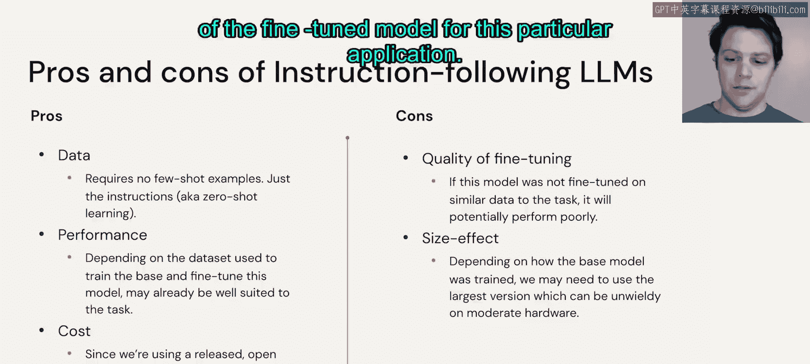
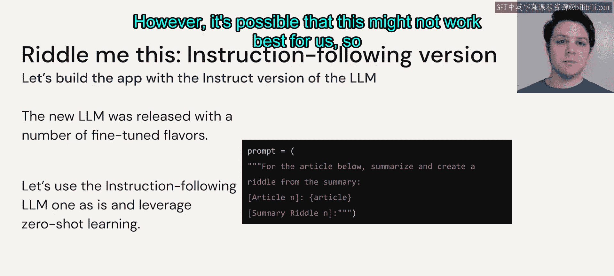
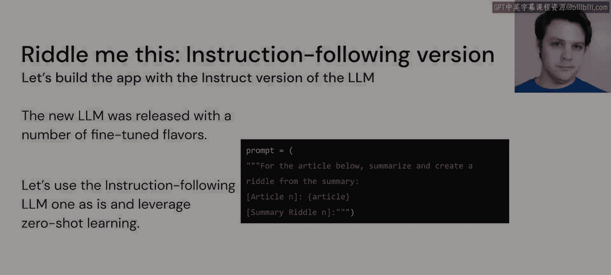

# 43：指令微调大语言模型 🎯

在本节课中，我们将学习如何利用开源社区发布的、经过指令微调的大语言模型来构建应用。我们将探讨在没有任何现成示例的情况下，如何通过零样本学习的方式，仅通过描述任务来让模型执行文本摘要。

## 概述

上一节我们介绍了小样本学习，本节中我们来看看另一种方法：直接使用经过指令微调的预训练大语言模型。这种方法适用于我们没有现成任务示例的场景。

## 使用指令微调模型的场景

假设我们没有任何现成的任务示例。如果我们有示例，可以遵循与小样本学习类似的方法，直接使用基础模型或指令模型。指令模型的表现取决于其训练方式，可能更好、更差或与小样本学习的结果相似。在本例中，我们重点探讨没有任何示例可用的场景。这种情况下，我们需要利用零样本学习：仅描述任务，然后提供待摘要的文章。

应用架构很简单：我们拥有新闻API、一个由开源社区发布的指令遵循大语言模型，以及我们想要创建的应用。

## 方法的优缺点分析

以下是使用预训练指令模型的一些关键考虑因素：

*   **提示词构建**：由于我们假设没有可用数据，可能需要更仔细地构建提示词，确保其具体且经过深思熟虑，以便模型能够遵循。
*   **性能**：根据用于从基础模型进行微调的数据集，该模型可能已经非常擅长解决此类问题，即使是零样本方法。
*   **成本**：同样，因为我们使用的是已经训练好的开源大语言模型，我们只需为推理时的计算付费，自己无需进行任何训练。
*   **潜在缺点**：如果该模型的微调过程并未使其真正学会处理此类任务，则可能导致性能下降，这可能不是一个可行的选择。
*   **模型规模效应**：根据模型的训练方式，我们可能需要为此特定应用使用该微调模型的最大版本（如果存在的话）。

## 实现方式

这种方法的实现方式将使用一个非常简短的提示词，比小样本学习中的提示词小得多。我们只需描述需要解决的任务，然后将文章作为输入变量，并要求其生成输出。

正如之前所说，根据模型的训练效果，我们可能会得到不同的结果。我们可能很幸运，发现模型已经可以直接使用，无需进一步调整。然而，也有可能这种方法对我们来说效果不佳，因此我们可能需要考虑其他选项。

## 总结

本节课中，我们一起学习了如何利用预训练的指令微调大语言模型进行零样本学习。我们分析了这种方法的优缺点，并了解了其简单的实现方式，即通过精心设计的简短提示词来指导模型完成任务。