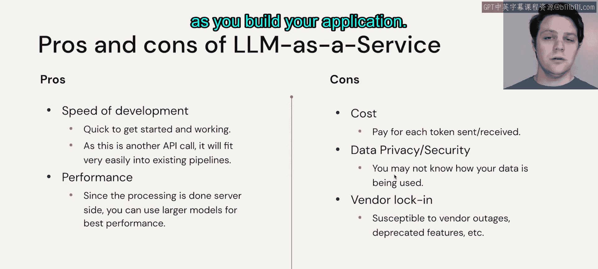
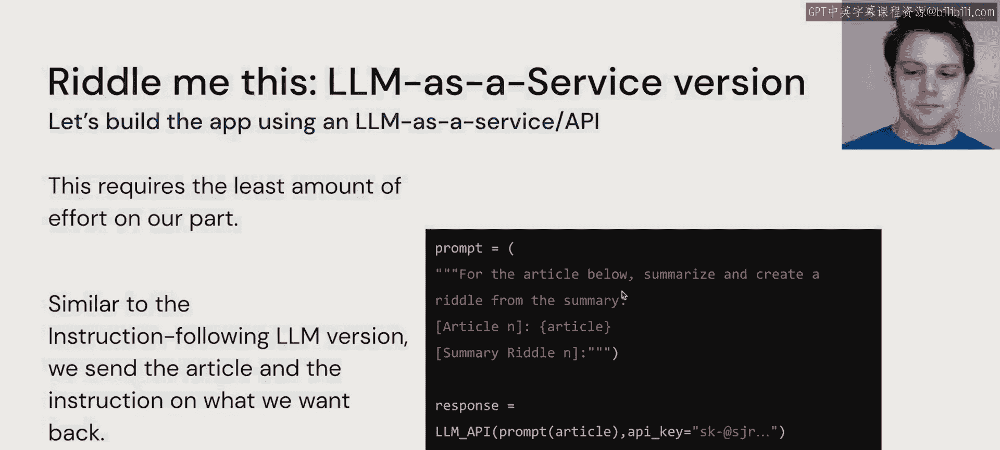

# 44：微调： 将LLM作为服务使用


在本节中，我们将探讨一种不同的方法：利用专有的大语言模型或LLM即服务来解决应用开发问题。


上一节我们讨论了基于开源模型的应用构建，本节中我们来看看如何将商业化的LLM服务集成到我们的工作流中。

## 概述：LLM即服务的工作流

在这种场景下，我们假设没有现成的示例数据可以随新闻API的结果一起发送给模型。当然，你也可以想象，如果我们想为付费的LLM服务提供一些示例以实现小样本学习，我们同样可以做到。但本节的目标是重点审视，将LLM作为服务引入，会如何融入你的应用程序工作流。

## LLM即服务的优势与考量

因为LLM即服务本质上只是另一个API调用，所以启动和围绕此调用构建应用非常迅速。这与调用新闻API的接口方式完全相同。

由于所有的计算和基础设施都由服务提供商处理，因此使用LLM即服务时性能往往更高，因为所有工作都在远端完成，而非本地机器。

当然，选择LLM即服务的缺点在于成本，你需要为发送和接收的每个令牌付费。然而，你仍需将此成本与在自有硬件上运行所有服务的成本进行权衡。

数据隐私和安全也存在风险，因为你发送给LLM提供商的所有数据，他们都能以某种形式访问。你需要根据服务条款，清楚了解你的数据可能被用于何种目的。

同样，正如在任何其他情况下使用供应商一样，你需要警惕供应商锁定的风险。如果供应商遭遇服务中断、弃用某些功能或改变定价结构，这些都是在构建应用时需要牢记的因素。

## 实现方式



以下是实现LLM即服务集成的核心步骤，它相对其他构建LLM应用的方式而言非常直接：

1.  **构建提示**：将我们的需求描述为一系列令牌，构成发送给API的提示。
2.  **身份验证**：通过API密钥（通常关联信用卡或其他支付方式）进行身份验证并发送请求。
3.  **接收响应**：从API提供商的服务端接收响应。

其核心流程可以用一个简单的伪代码表示：
```python
response = llm_service_api.call(prompt=user_prompt, api_key=my_api_key)
```

这是投入精力最少的方式，并且目前从闭源LLM提供商那里往往能获得非常好的性能。在目前大语言模型的发展周期中，专有软件的表现总体上超越了开源社区，尽管开源社区也在竞相提升性能。

## 总结

本节课中我们一起学习了将大语言模型作为服务（LLMaaS）集成到应用中的方法。我们分析了其快速启动、高性能的优势，也探讨了成本、数据隐私和供应商锁定等需要考虑的风险。实现上，它主要涉及构建提示词并通过API进行调用，流程相对简单。



如果这些情况（包括闭源专有版本）都不完全符合我们的需求，或者模型性能未达到预期，那么我们可能真的需要对某个大语言模型进行微调。让我们在下一个视频中探讨这个问题。