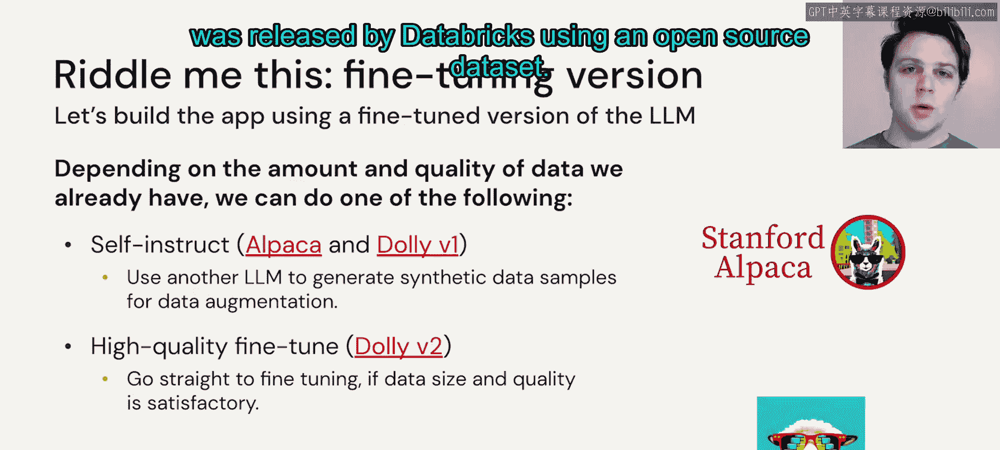
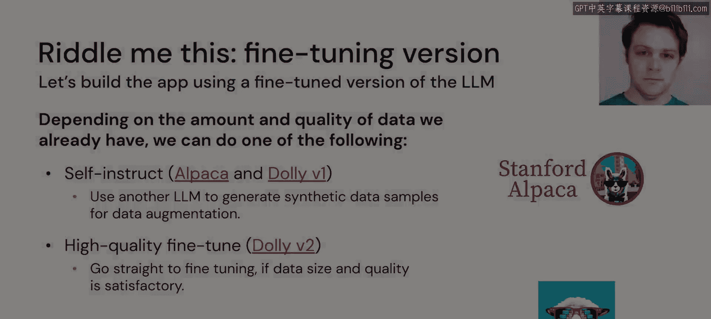

# 45：微调：自己动手

在本节课中，我们将要学习当现有的大语言模型无法满足特定应用需求时，如何通过微调现有模型来创建任务专属版本。我们将探讨微调的优势、挑战以及一个重要的开源项目案例。

假设我们已经尝试了所有其他大语言模型方案，但没有一个能完全给出我们想要的结果。这可能是因为它们没有针对我们应用程序所需的具体数据进行足够的训练。

在这种情况下，我们需要尝试自己动手解决问题。我们假设手头有足够数量的示例，展示了文章被总结并转化为谜语的过程，并且我们拥有新闻API连接，可以获取所需的推理数据。

## 构建模型的两种路径

当我们着手构建自己的模型时，面临两个选择。

以下是两种主要的模型构建路径：

1.  **从头开始构建自己的基础模型**：这包括构建基础模型的架构，需要收集涵盖海量训练数据源的数据集，然后在模型训练完成后对其进行微调。
2.  **采用现有模型并微调**：直接利用我们当前已有的数据集对现有模型进行微调。

我们几乎永远不会选择第一条路径，即从头开始训练基础模型。这需要大型公司的资源才能正确且经济高效地完成。在全球范围内，真正这么做的公司可能只有十几家，并且它们将模型开源。对于其他绝大多数人来说，这需要巨大的时间、成本和资源投入，既不可行也无必要。

上一节我们介绍了两种构建路径，本节中我们来看看更可行的路径：微调现有模型。这条路径有许多有趣的细节需要我们注意。

## 微调现有模型的考量

如果我们要微调一个现有的大语言模型，这意味着我们可以真正为自己创建一个任务特定版本的语言模型。

微调模型也倾向于节省推理成本。一个针对特定用例高度定制的模型，其规模通常可以小于我们使用少量提示工程的大型模型。此外，我们完全控制模型及其数据，确保一切都在我们的掌控范围内。

然而，微调也存在一些缺点。我们需要投入时间和计算成本来微调模型，尽管这个代价通常可以接受。对于我们希望构建的模型类型，可能需要一个大型数据集才能进行适当的微调。我们假设在当前场景中拥有足够的数据。我们还需要一些能够微调这些模型的技能，但如果正在学习本课程，应该没有问题。

## 指令遵循模型的微调进展

在过去的几个月里，指令遵循模型的微调方法已经崭露头角，我们看到斯坦福大学等机构在Alpaca和Dolly V1等项目上取得了非常出色的成果。

然而，这些成果在一定程度上受到限制，因为它们使用了专有数据集，或者至少是带有商业限制性许可证的数据集。就在最近几周，Databricks使用开源数据集发布了Dolly的新版本——Dolly V2。接下来，让我们谈谈为什么Dolly 2如此特别。

本节课中我们一起学习了微调大语言模型的基本概念、路径选择以及相关考量。我们了解到，对于大多数应用场景，微调现有模型是更可行和高效的选择，并且看到了像Dolly V2这样的开源项目如何推动这一领域的发展。