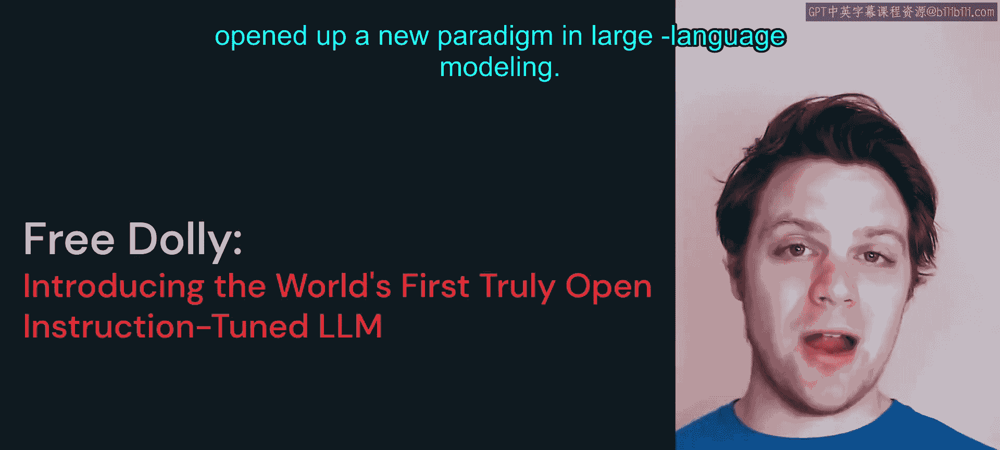
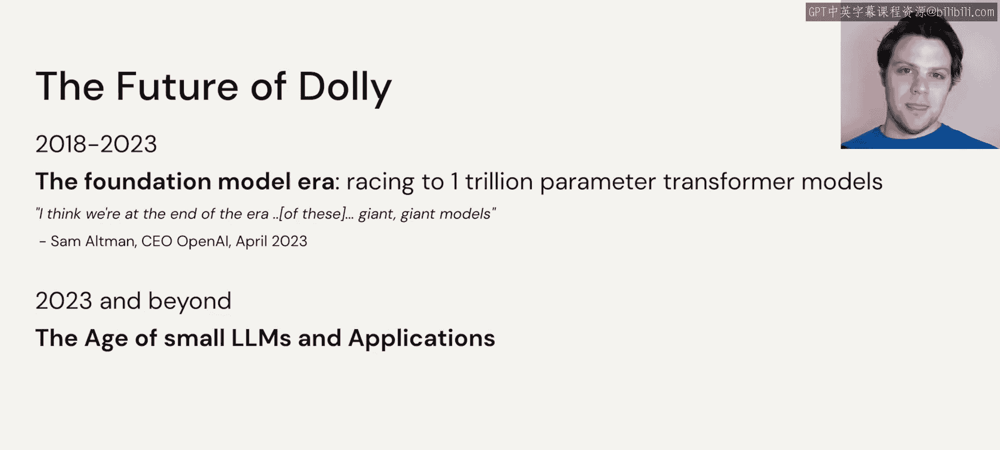
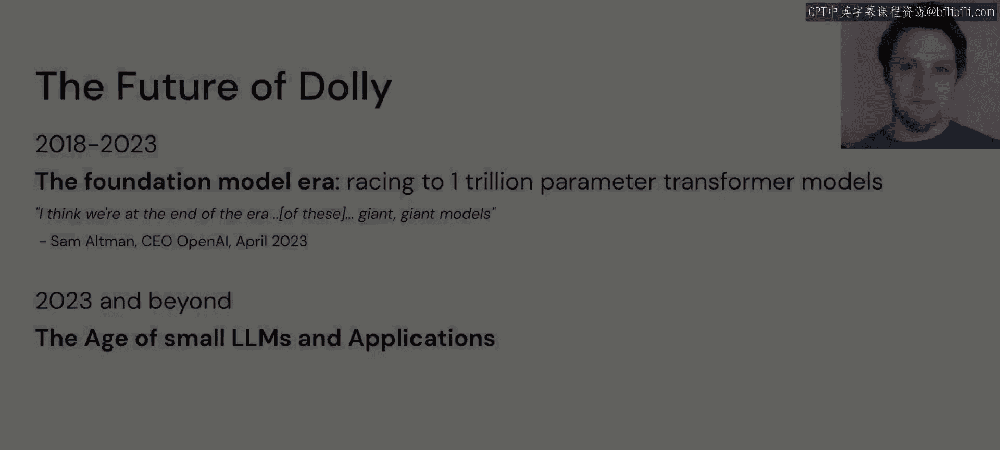

# 46：Dolly 🦙

在本节课中，我们将要学习Dolly模型。Dolly是2023年的一项创新，它真正开启了语言建模领域的新范式。

## Dolly模型简介 🧠

上一节我们介绍了大语言模型的不同类型，本节中我们来看看一个具体的开源指令微调模型——Dolly。

Dolly是一个基于Eleuther AI的Pythia 120亿参数模型的120亿参数模型。Dolly是一个遵循指令的大语言模型，这意味着我们可以要求它执行特定任务，它会按照训练的方式作出回应。

Dolly的特殊之处在于，它代表了一种被开源社区忽视或至少未充分研究的方法。然而，在2023年初的几个月里，我们已经看到这种方向获得了巨大的发展势头。

## Dolly的构建过程 ⚙️

Dolly的构建首先采用了一个开源的预训练基础模型，即Pythia 120亿参数模型，该模型在Pile数据集上进行了训练。Pile数据集由多个不同的开源数据集组成。

然后，对于Dolly，我们使用Databricks Dolly 15k数据集对这个模型进行了微调。这个数据集可能是Dolly之所以特殊的关键所在。

Eleuther AI的120亿参数模型是一个开源模型，我们可以随意使用。然而，它没有以任何特定方式进行微调。如果我们想要一个微调模型，就需要一个高质量的数据集，以便它能产生对我们有用的回应。

## Dolly 15k数据集 📊

以下是关于Dolly 15k数据集的关键信息：

*   Databricks Dolly 15k数据集由Databricks的员工制作。
*   它内部包含了高质量智力任务的指令和回应对。
*   Dolly背后的特殊之处在于，Databricks所有者发布的这个Dolly 15k数据是完全开放且可商用的。

这与之前所有其他方法都不同，因为它们都存在某种许可问题。

## Dolly的意义与影响 💡

Dolly本身并不是一个最先进的模型，它只是一种方法，表明你可以采用像Eleuther AI开源模型这样的模型，将其与高质量的开源数据集结合，从而创造出具有商业可行性的东西。

现在，许多新方法正在将Dolly 15k数据与更新的开源架构相结合。

Dolly的想法源自斯坦福大学的Alpaca项目。在该项目中，他们使用了自行创建的175条指令，并将其提供给OpenAI的text-davinci-003模型，以生成这些任务的合成新版本。

经过反复试验的过程，他们最终得到了大约52，000个高质量的指令遵循示例。他们将其与Meta发布的Llama 70亿参数模型相结合。

不久之后，这个高质量的数据集意味着他们生产出了一个能力非常强的模型。然而，该模型的使用受到了限制，原因既涉及Llama 70亿参数模型的许可，也涉及他们使用OpenAI来生成更多训练数据的事实。这阻碍了斯坦福Alpaca模型在商业环境中的应用。

这暗示我们，实际上可以使用小型模型配合高质量的数据集，来复制我们从这些大型模型中看到的性能。

## 未来展望：小型LLM时代 🚀

现在向前看。OpenAI的首席执行官Sam Altman表达了他的看法，即我们正处于追逐越来越大的大语言模型时代的末期。

2023年及以后的重点，似乎现在是小型LLM的时代，并将其应用于不同的用例。我们已经从试图构建一个“万事通”的广泛方法，转向尝试创建针对不同类型任务的、经过微调的定制模型。

我们将走向何方尚不确定，但看到这个领域不断发展和演进是令人兴奋的。

## 总结 📝

本节课中我们一起学习了Dolly模型。我们了解到Dolly是一个基于开源Pythia模型、使用高质量开源指令数据集（Dolly 15k）进行微调的指令遵循模型。它的重要意义在于证明了结合开源基础模型和高质量开源数据可以创造出具有商业价值的专用模型，并标志着大语言模型的发展重点正从追求模型规模转向开发针对特定用例的小型、定制化模型。