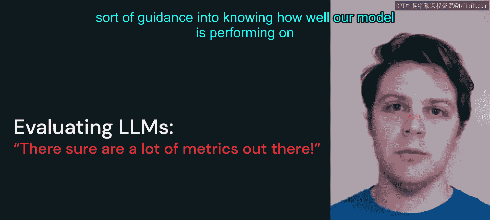
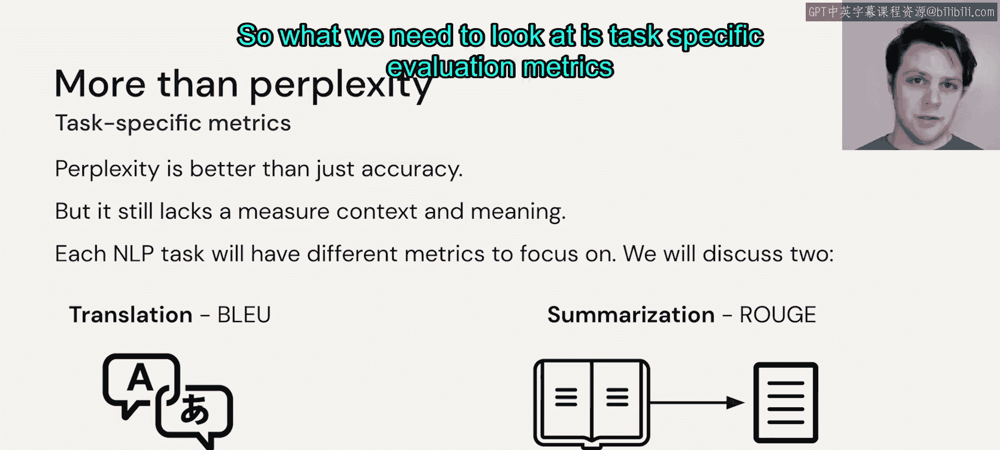

# 47： 评估大语言模型 🧐

在本节中，我们将探讨如何评估大语言模型的性能。虽然微调模型非常有用，但我们必须有方法来判断模型在我们定义的任务上表现如何。

上一节我们介绍了微调的应用，本节中我们来看看如何评估模型性能。直观上，理解一个大语言模型的表现好坏很难用语言描述或形成一个一致的定义。

## 传统评估指标的局限性

在训练过程中，我们当然会关注损失函数或验证分数，因为这些模型本质上是深度学习模型，旨在优化某个损失函数。然而，对于一个优秀的大语言模型，损失值本身并不能告诉我们太多信息。它不像二元分类器那样有明确的传统指标。

大语言模型的核心功能是：在整个词汇表上生成一个概率分布，并选择它认为正确的下一个词。这很难直接与我们关心的目标——例如，是否得到一个好的对话代理或生成高质量的摘要——联系起来。

## 困惑度：一个初步的指标

为了改进仅看“答案是否正确”的评估方式，我们可以观察模型的**困惑度**。

困惑度衡量的是模型在预测下一个词时，其概率分布的集中程度。以下是其核心概念：

*   **低困惑度**：如果模型对下一个词的预测概率分布非常集中（即“尖锐”），这意味着它具有很低的困惑度。模型对自己应该选择哪个词非常有信心。
*   **高准确率**：一个优秀的语言模型应该同时具备高准确率和低困惑度。它既知道下一个词应该是什么，又能正确地选出那个词。

用公式可以表示为，对于一个测试文本序列 \( W = w_1, w_2, ..., w_N \)，困惑度 \( PP \) 定义为：
\[
PP(W) = P(w_1 w_2 ... w_N)^{-\frac{1}{N}}
\]
或者等价于：
\[
PP(W) = 2^{H(W)}
\]
其中 \( H(W) \) 是序列的交叉熵。简单理解，困惑度越低，模型对数据的预测越“不困惑”，性能可能越好。

## 困惑度的不足

然而，困惑度也不是万能的。即使模型自信且正确地预测了下一个词，这也不一定意味着最终生成的整体结果质量高。

模型没有考虑到它在该句子中选择的其他词的上下文。例如，如果它反复选择同一个词，可能在单个词上有很高的准确率和很低的困惑度，但如果用于翻译或摘要任务，生成的内容很可能毫无意义。

因此，我们需要关注**特定任务的评估指标**。我们将在下一个视频中详细探讨这些指标。

## 本节总结

本节课中我们一起学习了评估大语言模型的初步方法。我们了解到，传统的训练损失对于衡量模型最终输出质量帮助有限。**困惑度**是一个有用的指标，它反映了模型预测的确定性，但它主要关注词级别的准确性，无法全面评估生成文本的整体质量和任务适用性。为了进行更有效的评估，我们必须转向针对具体任务设计的评估体系。