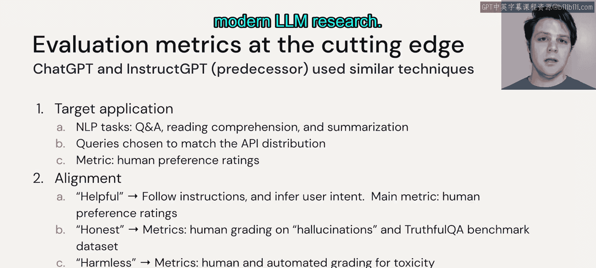

# 48：特定任务的评估指标 📊

在本节中，我们将学习如何评估大语言模型在特定任务上的表现。我们将介绍几种主流的评估指标，包括用于翻译的BLEU分数和用于摘要的ROUGE分数，并了解社区如何通过基准数据集进行模型比较。最后，我们会探讨前沿的评估方向，如模型的对齐问题。

---

## 翻译任务的评估：BLEU分数

上一节我们讨论了通用评估方法，本节中我们来看看针对翻译任务的特定评估指标。对于翻译任务，我们可以使用BLEU指标。该指标通过比较模型输出与我们期望生成的参考翻译样本来进行评估。

在BLEU中，我们计算模型输出与参考样本之间在多个层面的匹配程度。以下是其核心计算步骤：

1.  **计算单字词匹配**：首先，我们计算有多少个“单字词”（即单个单词）同时出现在模型输出和参考样本中。例如，如果一个单词在两者中都出现了六次，那么该单词的单字词匹配得分会很高。
2.  **计算N元词组匹配**：接着，我们扩展到“双字词”、“三字词”和“四字词”的匹配情况。这些N元词组能更好地评估句子的流畅度和结构。
3.  **综合计算最终分数**：BLEU最终会结合所有这些N元词组的匹配精度，计算它们的几何平均值，并施加一个针对过短译文的惩罚因子，从而得出一个总的BLEU分数值。

如果翻译质量很高，模型输出与参考样本匹配得很好，我们就会得到一个较高的BLEU分数。

---

## 摘要任务的评估：ROUGE分数

同样地，对于文本摘要任务，我们可以查看ROUGE分数。ROUGE在将参考摘要与模型生成的摘要进行匹配方面，与BLEU非常相似。

然而，ROUGE还额外考虑了摘要的长度，鼓励模型生成尽可能简洁的摘要。如果一个摘要非常冗长，即使它包含了参考样本中的许多词汇，其ROUGE得分也不会特别高。

ROUGE会寻找那些在参考样本和模型输出中都常见的词汇，同时要求模型输出相对于参考样本尽可能精炼。

---

## 模型间的比较：基准数据集

但是，如果我们想做的事情不仅仅是使用自己的数据呢？如果我们想将自己的模型与其他模型进行基准测试，我们可能没有他们使用的相同数据集。

这就是社区发挥作用的地方。社区已经创建了**基准数据集**，以便我们能够评估自己的模型，并与社区中的其他模型进行比较。

例如，**SQuAD**（斯坦福问答数据集）是一个非常常用的工具包。它包含许多不同的数据集，我们可以用它们来比较不同大语言模型在微调后的性能。

---

## 前沿评估方向：对齐问题

最后，一些更前沿的评估指标关注诸如**对齐**之类的问题。对齐指的是：当我们给一个遵循指令的大语言模型一个特定任务时，它的表现如何。

以下是评估对齐时关注的几个核心方面：

*   **相关性**：模型给出的结果是否基于我们输入的指令，并且是相关的？
*   **幻觉**：模型是否会产生“幻觉”（即编造不实信息）？我们将在下一个模块中更详细地探讨这个问题。
*   **无害性**：模型的回答是否无害？我们可能希望减少回答中的毒性或不恰当内容。

根据特定的用例，研究人员会使用不同的评估指标，并且每天都有更多的新指标被提出。然而，对齐问题仍然是现代大语言模型研究中一个非常关键的组成部分。

---

## 总结

本节课中，我们一起学习了针对不同任务的特定评估方法。我们介绍了用于评估翻译质量的**BLEU**指标和用于评估摘要质量的**ROUGE**指标。我们还了解了如何利用社区提供的**基准数据集**（如SQuAD）来比较不同模型的性能。最后，我们探讨了评估模型**对齐**表现的前沿方向，包括回答的相关性、幻觉和无害性。掌握这些评估工具对于开发和优化实用的大语言模型应用至关重要。