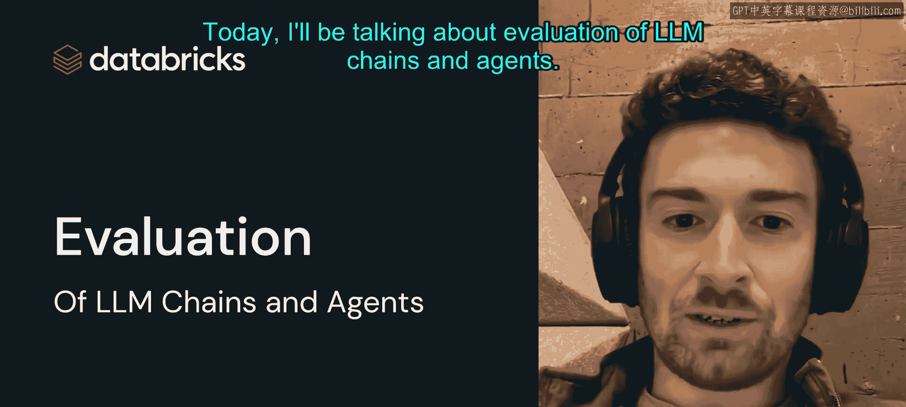
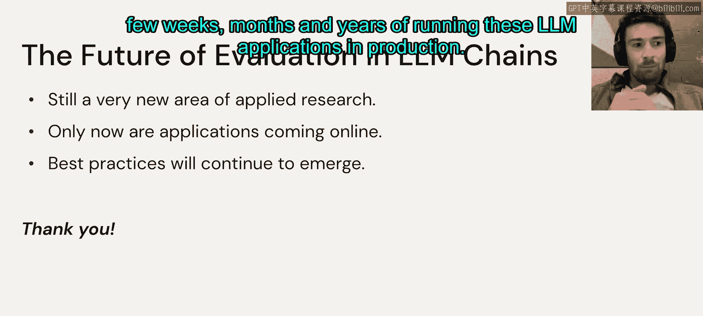
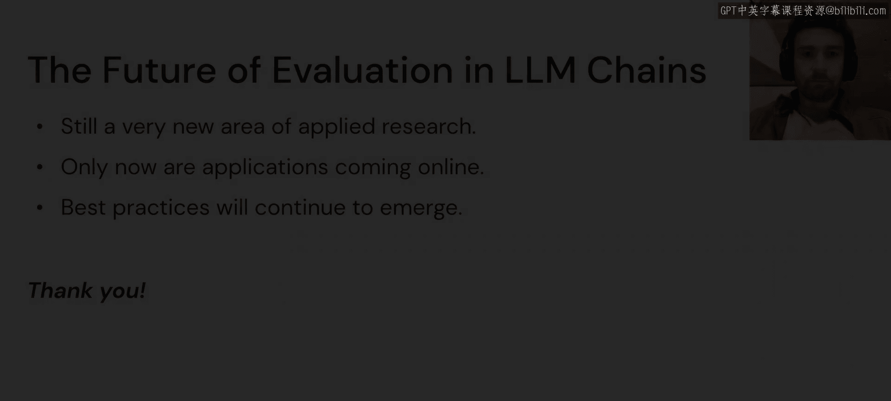

# 49：嘉宾讲座：LangChain创始人Harrison Chase - 评估LLM链与智能体

在本节课中，我们将学习如何评估基于大语言模型（LLM）构建的链式应用和智能体。我们将探讨评估的难点、潜在的解决方案，以及离线和在线评估的具体方法。

## 概述：什么是LLM链与智能体？🤔

LLM链与智能体的核心思想是**将LLM作为推理引擎**。这意味着我们利用LLM来决定如何与其他数据源和计算工具交互。关键在于，我们主要利用这些外部资源的知识，而非LLM本身内嵌的知识。LLM在此更多地扮演一个推理和决策的角色。

一个典型的例子是**检索增强生成**。我们可以将其理解为一个能够回答关于特定文档问题的聊天机器人，这些文档可能是私有的，并且像GPT-3这样的通用模型并未训练过。

这类应用的一般流程如下：

以下是构建一个检索增强生成应用的关键步骤：

1.  **压缩聊天历史**：将对话历史提炼成一个独立的、完整的问题。这一步很重要，因为后续将用这个问题来检索相关文档。如果不进行压缩，仅使用最后一条消息，可能会丢失对话中提及的先前信息。
2.  **检索相关文档**：使用上一步得到的问题，查找并返回一系列相关文档。
3.  **生成最终答案**：将原始问题、聊天历史和检索到的文档一并输入给LLM，生成最终答案。提示词通常会引导模型基于提供的文档进行回答。

在这个流程中，LLM作为推理引擎，接收问题与数据，并基于这些数据进行推理和回答。整个过程都“扎根”于我们检索到的数据，而不是依赖于LLM自身的知识。

## 评估为何困难？😰

上一节我们介绍了LLM链的基本概念，本节中我们来看看评估这类应用为何充满挑战。主要困难源于两点：**数据缺乏**和**指标缺乏**。

### 数据缺乏

与传统机器学习问题不同，开发LLM应用通常不是从一个现成的数据集开始的。开发者往往从一个想法或一个待解决的问题出发，开始构建应用，然后才需要评估它。因此，我们缺少传统意义上的训练数据集。

此外，对于许多问题，数据本身可能就在不断变化。例如，许多问答应用需要处理最新的信息，因此可能不存在一个长期不变的“标准答案”。这使得数据收集变得非常困难。

### 指标缺乏

即使有数据，评估也非易事。首先，**肉眼观察评估就很困难**。回顾之前的链式流程，任何一个中间步骤（如压缩、检索、生成）都可能出错，而仅凭最终输出，我们很难定位问题具体出在哪一步。

其次，**定量评估也很棘手**。在上述问答聊天机器人的例子中，最终答案是自由形式的文本。答案中可能包含一个关键事实，这是我们真正需要评估的，但答案周围通常还包裹着大量对话性文本。因此，我们无法使用简单的**精确匹配**（`exact match`）来评估，而需要更高级的方法。

## 潜在的解决方案 🛠️

面对数据与指标的缺乏，一些最佳实践正在形成。

### 应对数据缺乏

以下是两种常见的获取评估数据的方法：

1.  **提前生成数据集**：可以通过编程方式生成测试集，而LLM本身常常是这个生成过程的一部分。例如，在为文档问答应用生成测试集时，我们可以使用一个链：先将文档分割成块，然后针对每个块，要求LLM生成一个“问题-答案”对，这就构成了应用的测试集。
2.  **随时间积累数据**：如果应用已在生产环境中运行，可以持续记录输入和输出。随着时间的推移，这些记录可以逐渐积累成一个不断增长的数据集。

### 应对指标缺乏

以下是三种关键的评估策略：

1.  **可视化检查**：最重要的是让链中每一步的输入和输出都易于观察。这有助于理解问题是出在检索了错误的信息，还是检索正确但信息合成不当。
2.  **使用LLM进行评判**：我们可以利用另一个LLM来判断最终答案是否正确。这种方法能处理“事实被大量对话文本包围”的情况。LLM会比较自然语言答案和自然语言标准答案，判断它们是否语义等价。
3.  **收集用户反馈**：可以直接或间接地从用户那里收集反馈。我们将在“在线评估”部分详细讨论。

## 离线评估 📊

离线评估通常在模型部署到生产环境之前进行，例如在开发完成后进行最终测试，以判断其是否准备就绪。

其主要方法是：创建一个测试点数据集，然后让链或智能体在这些点上运行。接着，**可视化检查**每次运行的输入和输出，观察每个步骤的表现。当然，这并不具备可扩展性。

因此，下一步是**使用LLM进行自动评分**。你可以完全信任这个自动评分，让它为每次运行标记“正确”或“错误”，然后计算平均分；或者，你也可以将其作为一种引导工具，找出最可能正确或错误的数据点，然后对这些点进行第二轮更深入的可视化检查。

## 在线评估 📈

在线评估发生在模型已经部署、正在生产环境中服务用户之后，目的是确保其持续表现良好。

其主要方法是**收集每个输入数据点的反馈**。

以下是两种收集反馈的方式：

1.  **直接反馈**：在应用中添加“赞”或“踩”按钮，用户可以点击。随着时间的推移跟踪这些反馈。如果你发布了新版本的应用，或者模型因某种原因开始表现不佳，你可能会注意到反馈数据的下降趋势，从而知道需要修复模型。
2.  **间接反馈**：例如，如果你在答案中提供了相关链接，用户点击链接可能意味着你做得好；反之，则可能意味着模型表现不佳。这可以作为一种间接的反馈衡量指标。

这两种方法的共同思想是**随时间跟踪这些指标**，以便在模型性能开始下降时及时察觉。

## 总结 🎯

本节课中，我们一起学习了评估LLM链与智能体的核心内容。我们首先了解了LLM作为推理引擎的应用模式，然后探讨了评估面临的两大挑战：数据缺乏和指标缺乏。接着，我们介绍了应对这些挑战的潜在解决方案，包括生成数据、积累数据、可视化检查、使用LLM自动评判以及收集用户反馈。最后，我们详细说明了离线和在线评估的具体实施方法。评估这些应用是一个新兴且令人兴奋的领域，随着越来越多的LLM应用投入生产，相关的知识体系也将不断发展和完善。