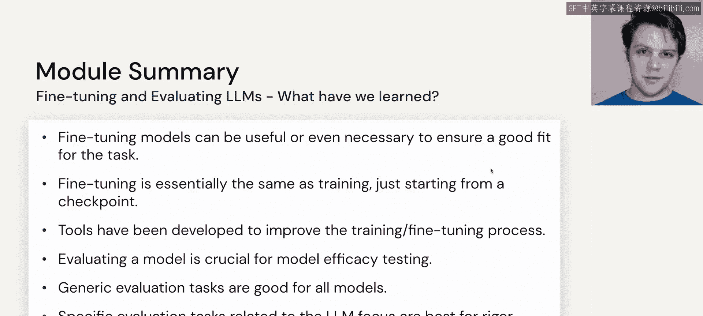

# 50：总结

在本节课中，我们将回顾模块四的核心内容，该模块主要探讨了如何对大型语言模型进行微调，以及如何根据其需要执行的不同任务来评估模型。

上一节我们介绍了模型评估的具体方法，本节中我们来进行整体回顾与总结。

## 模型选择路径

在决定如何使用大型语言模型时，需要明确选择路径。以下是关键的决策点：

*   是否要从头开始训练一个模型。
*   是否要微调一个现有模型。
*   是选择开源模型还是闭源商业模型。

## 评估的重要性

为了确保模型输出符合应用需求，选择合适的评估方法至关重要。你需要根据具体的任务目标来确定评估指标。

---

本节课中我们一起学习了模型微调与评估的核心决策框架。现在，你应该能够更清晰地判断在特定应用场景下，是选择从头训练、微调现有模型还是直接使用预训练模型，并了解如何通过恰当的评估来验证模型性能。

接下来，我们将进入代码实践环节，分别查看一个评估笔记本和一个微调笔记本的具体示例。