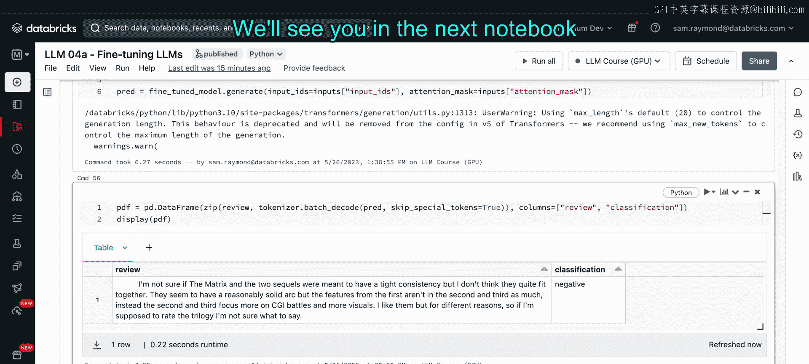

# 51：微调与评估大语言模型：Notebook 演示第一部分


## 概述

在本节课程中，我们将学习如何对大语言模型进行微调。我们将使用一个具体的例子，将T5-small模型微调为一个电影评论情感分类器。课程将涵盖从环境准备、数据处理到模型训练和推理的完整流程，并简要介绍如何利用DeepSpeed技术进行多GPU训练。

## 环境准备与数据加载

首先，我们需要确保运行环境支持GPU加速，因为微调过程计算量较大。我们将安装必要的CUDA库和DeepSpeed软件包。

```python
# 检查GPU可用性
assert torch.cuda.is_available()
```

接下来，我们安装transformers和datasets库，并加载IMDB电影评论数据集。该数据集包含带有“正面”、“负面”或“中性”标签的评论。

```python
from datasets import load_dataset
from transformers import AutoTokenizer, AutoModelForSeq2SeqLM

# 加载数据集和模型
dataset = load_dataset("imdb")
model_checkpoint = "t5-small"
tokenizer = AutoTokenizer.from_pretrained(model_checkpoint)
```

## 数据预处理

原始数据集的标签是数值型的（-1， 0， 1）。为了利用大语言模型的自然语言理解能力，我们需要将这些数值标签转换为对应的文本标签（如“negative”, “positive”）。

以下是转换函数：

```python
def convert_labels(example):
    label_map = {-1: "unknown", 0: "negative", 1: "positive"}
    example["label"] = label_map[example["label"]]
    return example

# 应用转换
dataset = dataset.map(convert_labels)
```

然后，我们使用T5模型的tokenizer对文本进行分词处理，将其转换为模型可接受的输入格式。

```python
def tokenize_function(examples):
    return tokenizer(examples["text"], padding="max_length", truncation=True)

tokenized_datasets = dataset.map(tokenize_function, batched=True)
```

## 设置训练参数与模型

现在，我们设置训练参数并加载预训练模型。我们将使用Hugging Face的`Trainer` API来简化训练流程。

```python
from transformers import TrainingArguments, Trainer

training_args = TrainingArguments(
    output_dir="./results",
    num_train_epochs=1,
    per_device_train_batch_size=16,
    optim="adamw_torch",
    logging_dir="./logs",
)

model = AutoModelForSeq2SeqLM.from_pretrained(model_checkpoint)
```

我们初始化`Trainer`，传入模型、训练参数和分词后的数据集。

```python
trainer = Trainer(
    model=model,
    args=training_args,
    train_dataset=tokenized_datasets["train"],
    data_collator=default_data_collator,
)
```

## 模型训练与监控

我们启动训练过程，并利用TensorBoard监控训练损失等指标。训练将进行一个完整的周期。

```python
trainer.train()
trainer.save_model("./fine_tuned_model")
```

训练完成后，我们可以观察损失曲线。虽然损失仍有下降空间，但当前模型已可用于演示。

## 使用微调模型进行推理

现在，我们使用微调后的模型对新的电影评论进行情感预测。

首先，加载保存的模型：

```python
fine_tuned_model = AutoModelForSeq2SeqLM.from_pretrained("./fine_tuned_model")
```

然后，准备一些示例评论并进行预测：

```python
reviews = [
    "This movie was a complete waste of time.",
    "An absolutely fantastic film with brilliant performances.",
    "I loved every minute of it!",
    "The plot was confusing and the acting was poor."
]

# 对评论进行分词
inputs = tokenizer(reviews, return_tensors="pt", padding=True, truncation=True)

# 生成预测
outputs = fine_tuned_model.generate(**inputs)
predictions = tokenizer.batch_decode(outputs, skip_special_tokens=True)
```

最后，将预测结果整理并展示：

```python
import pandas as pd
results = pd.DataFrame({"Review": reviews, "Predicted Sentiment": predictions})
print(results)
```

模型成功地将评论分类为“负面”或“正面”，展示了微调的有效性。

## 使用DeepSpeed进行扩展训练

上一节我们介绍了在单GPU上的标准微调流程。本节中我们来看看如何利用DeepSpeed技术，以便将来在多个GPU或多个节点上进行更大规模的训练。

DeepSpeed是微软开发的一个优化库，可以显著提升大模型训练的效率和规模。虽然我们在单GPU上演示，但代码只需微小改动即可扩展到多GPU环境。

以下是启用DeepSpeed所需的关键配置更改：

```python
# DeepSpeed 配置文件 (ds_config.json)
{
  "zero_optimization": {
    "stage": 2,
    "offload_optimizer": {"device": "cpu"}
  }
}
```

在训练参数中，我们只需添加DeepSpeed配置文件的路径：

```python
training_args_deepspeed = TrainingArguments(
    output_dir="./results_deepspeed",
    num_train_epochs=1,
    per_device_train_batch_size=16,
    optim="adamw_torch",
    deepspeed="./ds_config.json", # 添加DeepSpeed配置
)
```

然后，像之前一样创建和运行Trainer。需要注意的是，在单GPU上使用为多节点设计的DeepSpeed配置会产生额外开销，因此训练时间可能更长。但这演示了代码的可扩展性——当切换到真正的多GPU集群时，只需修改环境变量和启动命令，而无需重写核心训练代码。

## 总结

本节课中我们一起学习了如何对大语言模型进行端到端的微调。

我们首先准备了GPU环境并加载了IMDB数据集。
接着，我们将数值标签转换为文本标签，并对数据进行了分词处理。
然后，我们设置了训练参数，加载了T5-small预训练模型，并使用`Trainer` API完成了模型的微调训练。
训练完成后，我们保存了模型并演示了如何用它对新评论进行情感分类推理。
最后，我们简要介绍了DeepSpeed技术，展示了如何通过少量代码修改来准备模型，以便在未来需要时利用多GPU资源进行高效训练。



通过这次实践，你将T5-small模型成功微调为了一个电影评论情感分析工具，掌握了微调的核心步骤。在接下来的课程中，我们将学习如何评估微调后模型的性能。