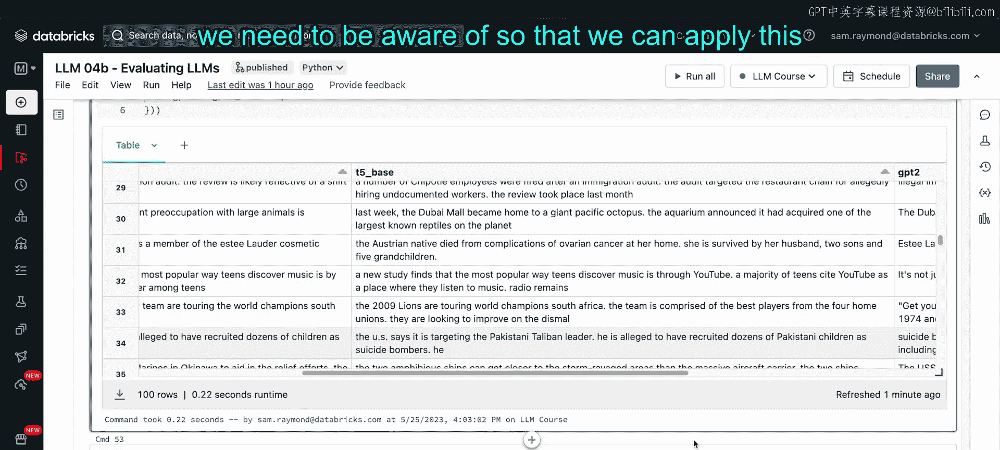
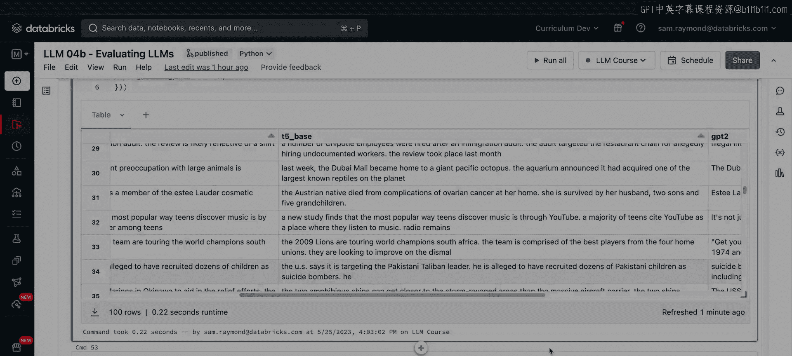

# 52：评估大语言模型性能


## 概述

在本节课中，我们将学习如何评估大语言模型在特定任务下的性能。我们将以文本摘要任务为例，使用在课程中提到的Rouge指标，构建一个完整的评估工作流。我们将分析不同模型以及同一模型不同规模版本的表现，并比较它们的结果。

## 环境准备

首先，我们运行课堂设置脚本，安装必要的库。

## 评估摘要任务

上一节我们介绍了评估的重要性，本节中我们来看看如何具体评估摘要任务。

我们有一个标准的示例场景：处理新闻文章并生成摘要。但如何判断生成的摘要质量好坏呢？假设你正在开发一个智能手机应用，需要实时显示自动生成的摘要，那么了解模型生成摘要的性能就至关重要。

我们将逐步构建评估流程，直观理解Rouge指标的工作原理及其执行方法。

## 加载数据集

我们将使用来自CNN Daily Mail的数据集，该数据集提供了新闻文章及其对应的人工摘要（高亮部分）。我们将把这些人工摘要作为评估的“参考答案”。

我们使用Hugging Face的`datasets`库加载数据，并仅抽取100个样本以加快分析速度。请注意，如果在课堂笔记本之外运行此代码，下载过程可能会更耗时，因为我们已经将部分数据集预加载到了本地缓存目录中。

现在，让我们查看一下刚刚下载的数据集。可以看到，数据集中包含多篇文章，以及对应的“highlights”摘要列。

以下是随机选择的一篇文章及其摘要示例：

**文章片段**:
> (CNN) -- If you're between the ages of 16 and 24, you probably listen to music on YouTube more than any other service, according to a new study...

**摘要**:
> Study: YouTube is top music source for young people.

## 构建摘要评估流程

接下来，我们讨论摘要的工作原理以及如何使用我们的大语言模型。

我们将下载Transformers库中的`AutoTokenizer`和`T5ForConditionalGeneration`，因为我们将使用T5模型。

我们需要创建一个函数来构建评估流程。Rouge分数通过比较生成摘要和参考摘要，进行一元组、二元组和三元组分析，来评估生成摘要的质量。

由于我们从零开始构建，下面将展示如何搭建自己的评估流程。

### 1. 定义批处理生成器

首先，定义一个批处理生成器。该函数接收数据和批大小参数，并使用`yield`语句输出数据批次，直到处理完所有数据。

```python
def batch_generator(data, batch_size):
    for i in range(0, len(data), batch_size):
        yield data[i:i + batch_size]
```

### 2. 使用T5模型进行摘要

接下来，定义使用T5模型进行摘要的函数`summarize_with_t5`。该函数接收模型检查点、文章列表和批大小参数。

该函数将使用T5模型（如T5-base或T5-large）计算摘要。我们假设在CPU上运行此笔记本，但代码也支持在GPU上运行。

我们定义模型和分词器。分词器将输入文本转换为模型可处理的令牌，同时也能将模型输出转换回纯文本。

我们设置最大输入序列长度为1024。

`perform_inference`函数将利用大语言模型进行推理。我们创建输入，使用分词器处理数据批次，并指定最大长度、填充和截断策略。

然后，我们调用模型的`generate`方法生成输出摘要的令牌ID，最后使用分词器将这些令牌ID解码为纯文本。

在`summarize_with_t5`函数内部，我们初始化一个空数组来存储响应。通过为每篇文章添加“summarize: ”前缀来构建模型提示。我们利用之前创建的批处理生成器遍历数据，并将所有生成的摘要添加到数组中。

为了管理内存，在GPU上运行时需要清空缓存并执行垃圾回收。最后，删除分词器、模型等对象以释放内存，并返回包含所有文章摘要的数组。

**流程总结**:
1.  创建批处理生成器。
2.  配置分词器和模型。
3.  执行推理并生成输出。
4.  将输出解码为纯文本。
5.  收集并返回所有摘要。

### 3. 运行T5-small模型

现在，我们将使用T5-small模型检查点。我们可以使用T5-small、T5-base、T5-large等任何兼容此架构的模型。

运行此单元，我们将看到T5模型对示例文章的摘要结果。请注意，运行可能需要一些时间，因为它需要加载所有必要的库和模型信息。

运行完成后，我们得到了T5生成的摘要。现在，我们有了T5生成的摘要和参考摘要，接下来看看如何比较它们。

## 初步评估：精确匹配

我们首先尝试一种简单的方法来评估模型生成的摘要质量：遍历所有参考摘要，如果生成摘要与参考摘要完全相同，则得分为1，否则为0。

在运行之前，请思考获得完全匹配的摘要的可能性有多大。实际上，由于措辞上的微小差异，这种方法几乎总是得分为0，因此无法有效评估摘要性能。

## 引入Rouge指标

这引出了Rouge指标。Rouge通过比较摘要的不同子部分来评估性能。

Rouge由四个不同的分数组成：Rouge-1、Rouge-2、Rouge-L和Rouge-Lsum。定义如下：
*   **Rouge-1**：考察一元组（单个词/令牌），匹配参考摘要中的词是否出现在生成摘要中。
*   **Rouge-2**：考察二元组（词对/令牌对）。
*   **Rouge-L**：考察生成摘要和参考摘要之间最长的公共子序列。
*   **Rouge-Lsum**：在摘要级别进行计算，忽略句子分隔符如换行符。

### 1. 导入Rouge库

我们导入Rouge库来评估模型摘要的表现。需要下载NLTK库用于句子分词，并从Hugging Face的Evaluate库中获取Rouge指标。

### 2. 计算Rouge分数

我们可以直接使用Rouge评分函数，但需要确保输入格式符合评估库的要求。Rouge要求比较摘要时句子由换行符分隔，而我们的T5模型输出可能不满足此格式。

因此，我们创建一个包装函数`compute_rouge_score`来确保输入格式正确。该函数接收生成摘要列表和参考摘要列表，使用NLTK的句子分词器分割句子并添加换行符，然后将处理后的文本传递给Rouge评分函数。我们设置`use_stemmer=True`，稍后会解释其含义。

运行此函数，计算T5-small模型的Rouge分数。

在输出中，我们可以看到每个Rouge值。对于Rouge-1，大约31%的一元组同时出现在生成摘要和参考摘要中。二元组匹配率下降到10%。最长公共子序列得分约为0.2，摘要级得分约为0.3。对于一个小型LLM来说，这是一个不错的分数，但我们相信更大的模型可以表现得更好。

### 3. 理解Rouge分数范围

为了确认我们对Rouge分数的理解，我们再次运行相同的函数，但这次将参考摘要与自身进行比较。这是摘要模型相对于参考摘要所能达到的最佳情况。可以看到每个分数都为1，表示完美匹配。

但这并不意味着模型完美无缺，仅仅意味着输出与参考摘要一致。在处理大语言模型或任何机器学习任务时，我们必须警惕数据中存在的偏见和质量问题。完美的分数通常意味着存在问题，在本例中，它只是验证了自我比较的逻辑。

同样，我们可以查看最低分。如果生成一个空字符串并与参考摘要比较，我们会得到0分。

因此，Rouge给出的分数介于0和1之间。

### 4. 词干提取的作用

`use_stemmer=True`启用了词干提取，可以忽略单词的微小差异。例如：
*   参考摘要：“large language models beat world record”
*   生成摘要：“large language models beating world records”

“beat”与“beating”、“record”与“records”存在细微差别。如果禁用词干提取（`use_stemmer=False`），Rouge-1得分为67%，Rouge-2为40%。如果启用词干提取，忽略这些差异并认为它们在摘要意义上相同，则得到满分。

是否认为这两个句子差异很大或非常相似，这仍然是大语言模型评估中艺术性的一部分。

### 5. Rouge在不同场景下的变化

让我们探索Rouge在不同情况下的变化。假设参考摘要包含一个词，而我们的预测摘要实际上长得多。运行Rouge后，我们看到Rouge-1得分相对较好，但Rouge-2为0，因为没有匹配的二元组。

值得注意的是，Rouge分数在预测和参考方面是对称的。如果长度差异是对称的，我们会得到相同的值。

现在，我们使预测摘要变为两个词并与参考摘要匹配，可以看到Rouge-1、Rouge-2、Rouge-L和Rouge-Lsum的值都更高了。

### 6. 不同Rouge指标的区别

观察Rouge-1与更高阶指标的区别。在Rouge-1中，由于我们匹配每个单词，它实际上没有考虑单词的顺序，因此Rouge-1有时可能是一个误导性的指标。使用更高阶的指标如Rouge-2、Rouge-3和Rouge-L，有助于确保我们获得更高质量的结果。

所有这些努力都是为了尽可能好地评估一项相当主观的任务。

## 比较不同模型

另一种比较方式是查看同一模型家族中不同规模版本的表现。我们一直在使用T5-small模型，现在让我们看看更大的T5-base模型。

### 1. 逐行计算Rouge

为此，我们创建一个新函数`compute_rouge_per_row`。与之前计算整个文章样本集的总体Rouge值不同，此函数将为每个文章计算Rouge分数。这将为每篇文章的生成摘要和参考摘要配对生成一个分数。

### 2. T5-small模型

正如课程笔记中提到的，当一个开源模型发布时，通常会有多种规模，如base、small和large。T5就是这样一个模型。T5-small是T5模型家族中较小的版本，拥有约6000万参数。

运行我们之前的T5-small模型，可以得到摘要的Rouge分数。使用新的逐行计算函数，我们可以查看每篇文章的Rouge分数，从而更细致地了解模型在不同类型文章上的表现。

### 3. T5-base模型

T5-base的规模是T5-small的三倍多，拥有2.2亿参数。其架构相同，只是T5-small的放大版（或者说T5-small是T5-base的缩小版）。

运行相同的`summarize_with_t5`函数，但使用不同的检查点`t5-base`。由于属于同一模型家族，我们可以重用此函数。

计算T5-base的Rouge分数。完成后，我们可以看到T5-base模型的Rouge分数比T5-small好很多，这对于更大的模型来说是符合预期的。分数大约提高了三分之一，对于一个规模大三倍的模型来说，这种提升在预期之内。

同样，查看逐行Rouge分数，可以看到T5-base的值普遍优于T5-small，这在模型架构升级中是直观的结果。

## 比较不同架构的模型

接下来，让我们看一个完全不同的模型家族。T5模型是编码器-解码器类型，我们将在课程2中详细讨论大语言模型的不同架构。正如所见，T5可以完成我们要求其他类型模型完成的一些任务。

GPT（生成式预训练变换器）是仅解码器类型的架构。GPT-2唯一的功能就是生成下一个词。GPT-2是OpenAI发布的开源模型，拥有1.24亿参数。让我们看看GPT-2在相同任务上的表现如何。

由于使用不同类型的模型架构，我们需要使用与T5不同的摘要函数。这里我们创建`summarize_with_gpt2`函数。它接收检查点、文章列表和批大小，与T5模型类似，但需要确保GPT的输入格式处理方式一致。

不同的大语言模型架构和家族需要不同类型的输入，目前行业尚未完全标准化，但正在逐步收敛。

我们的分词器看起来与之前略有不同，但大体相似。我们下载的是GPT-2模型。

执行推理时，我们定义`perform_inference`函数。需要注意的是，由于GPT只是完成句子并生成新文本，我们需要给它一个提示，让它知道需要生成新文本，而不是响应特定指令。

针对GPT-2的一个特点，我们可以通过在文章前添加“TL;DR”提示字符串来引导它完成文章摘要任务。之前使用T5时，我们添加了“summarize:”提示，这里我们使用“TL;DR”字符串。

生成摘要ID后，我们使用分词器的解码器将摘要令牌ID转换回纯文本。然后收集所有摘要并返回。

后处理摘要时，我们需要确保只获取“TL;DR”语句之后的内容，即生成的摘要部分，而不是文章本身。然后进行一些清理以保护内存使用。

现在，我们准备使用GPT-2创建文章摘要。像对T5-small和T5-base一样运行GPT-2。

完成后，让我们看看GPT-2的Rouge分数。你可能会注意到这些分数实际上比之前看到的要低一些。

## 系统比较所有模型

我们使用一个辅助函数将所有模型结果放入一个数据框中，以便系统比较。

创建生成摘要和参考摘要的模型结果，并为每个模型放入数据框，然后查看模型的Rouge-1、2、L和Lsum结果。

传入T5-small、T5-base和刚刚创建的GPT-2结果。我们可以看到，在整个数据集上，T5-small表现相当好，T5-base表现最佳，GPT-2表现最差。

考虑到GPT-2的训练方式，它主要被配置为在看到一段文本后生成下一个词，而T5实际上在包括摘要在内的多种任务上进行了更广泛的训练。

现在，我们可以将所有摘要放入一个数据框，并查看每个模型在每行摘要上的得分。

查看每个模型在不同摘要上的表现。对于第一篇文章，T5-small产生某个输出，T5-base有其输出，GPT-2表现尚可。然而，仔细观察GPT-2的表现，有时它会陷入特定的循环。例如，在第30行，它卡在重复生成相同的输出上。

回顾我们在课程笔记中提到的衡量好模型的准确性和困惑度分数，这是一个例子，说明即使我们可能获得较高的准确性或较低的困惑度，但它产生的内容的相关性和准确性实际上并不是我们真正想要的。“Well it's a zoo, it's not a zoo, it's not a zoo”对于模型来说，在生成下一个词的意义上可能是“正确”的，但显然是无意义的。

相比之下，T5-small的输出“A crocodile is the largest species of octopus on the planet”也不正确，但T5-base实际上做得相当好。

你可以自由探索此笔记本，看看是否能找到在不同类型评估中表现更好的模型。

## 总结





在本节课中，我们一起学习了如何评估大语言模型在文本摘要任务上的性能。我们介绍了Rouge指标及其四个组成部分（Rouge-1, Rouge-2, Rouge-L, Rouge-Lsum），并构建了一个完整的评估工作流。我们比较了T5-small、T5-base和GPT-2模型的表现，发现T5-base在摘要任务上优于T5-small，而GPT-2由于其训练目标和架构差异，在此任务上表现较弱。我们还探讨了词干提取的作用以及Rouge分数的局限性。理解这些评估方法对于开发和部署可靠的摘要应用至关重要。