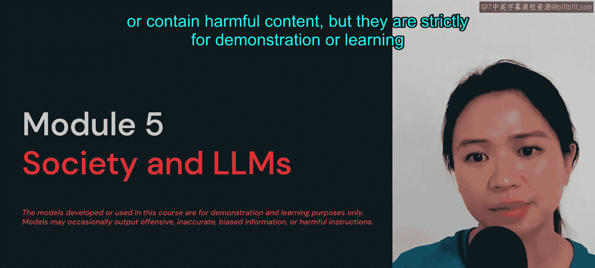
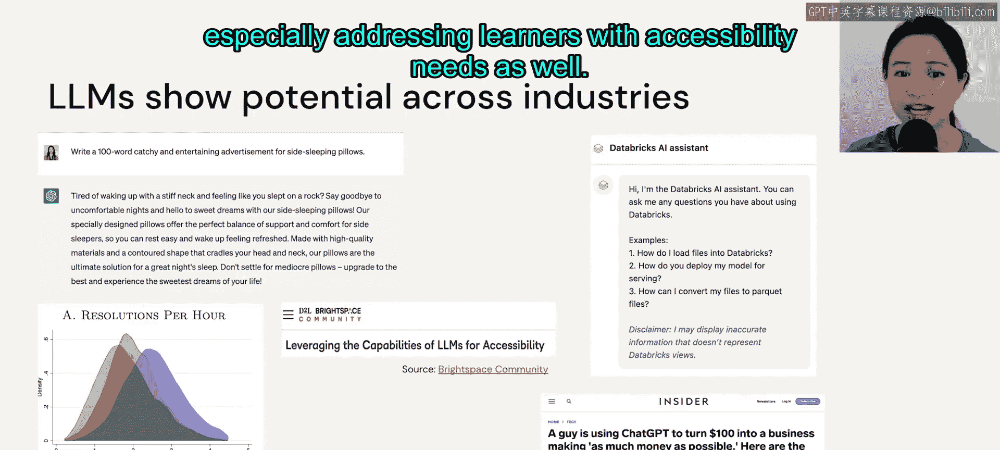

# 54：模块概述 🧭

在本模块中，我们将探讨大语言模型对社会的影响。请注意，本模块中展示的模型结果有时可能具有冒犯性、偏见或包含有害内容，但这些内容**仅用于演示或学习目的**。

## 概述

在本节课中，我们将学习大语言模型的优点与风险、其训练数据的影响、幻觉问题的成因与应对方法，以及如何负责任地使用和管理这些模型。课程结束时，你将能够全面理解大语言模型的社会影响。

上一节我们介绍了本模块的学习目标，本节中我们来看看大语言模型带来的具体益处。

大语言模型正在革新各行各业，它们能帮助减少人力劳动与成本，也能提升内容创作的效率。例如，我们可以要求聊天机器人生成具有营销价值的文案来宣传一款助眠枕头。

此外，大语言模型也能应用于其他客户服务场景。事实上，最近发表的一篇论文表明，使用大语言模型可以提高客户服务案例的解决数量。

我们还可以将大语言模型用作任何网站的聊天机器人，以帮助回答客户问题。

或许最令人兴奋的是，大语言模型有潜力改变我们的学习方式，特别是能满足有特殊需求的学习者。

## 模块学习目标

在本模块结束时，你应该能熟练掌握大语言模型的优点与风险。

我们还将审视常用于训练大语言模型的数据集，以及这些数据集如何影响模型。

## 核心问题：幻觉

接下来，我们将详细探讨幻觉的成因与后果。幻觉是当前大语言模型中一个广为人知的问题。

我们将讨论评估幻觉的方法，以及如何缓解幻觉问题，同时也会探讨大语言模型的其他风险与局限。

## 伦理与治理

最后，我们将通过讨论伦理与负责任的使用方式，以及如何从整体上治理我们的大语言模型来结束本模块。

## 总结

本节课中，我们一起学习了本模块的总体框架，了解了大语言模型对社会带来的益处与挑战，并预览了我们将要深入探讨的核心议题，包括数据影响、幻觉问题以及伦理治理。在接下来的课程中，我们将逐一展开这些内容。