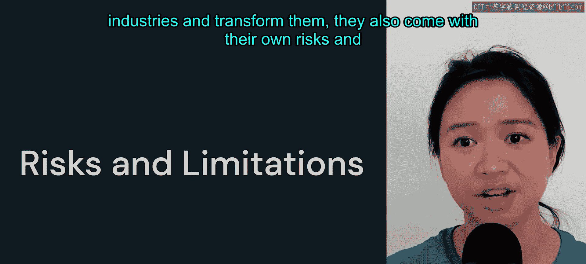
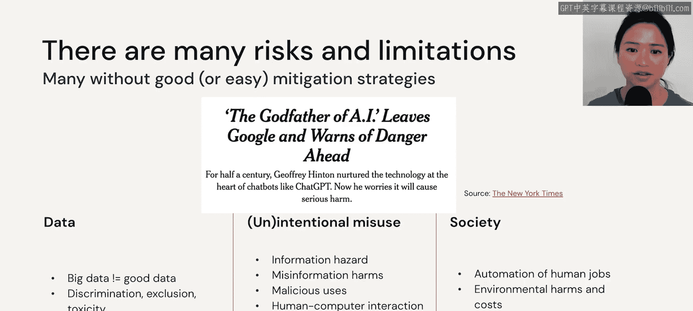
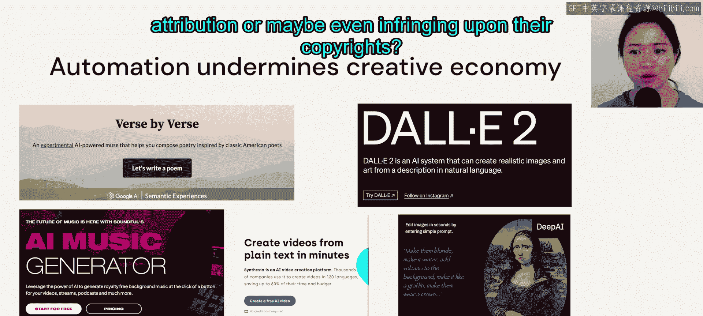
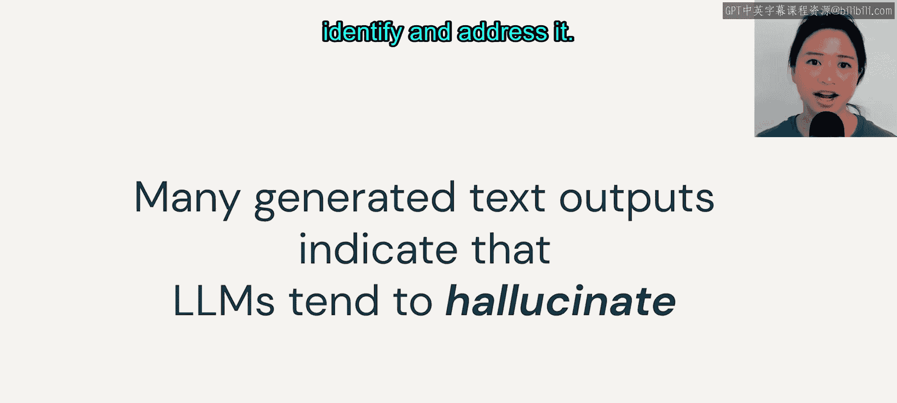

# 55：风险与局限

## 概述
在本节课中，我们将探讨大语言模型（LLMs）在带来巨大变革的同时，所伴随的风险与局限性。我们将从数据来源、模型偏见、滥用风险、就业影响及环境成本等多个角度进行分析，旨在帮助用户和开发者更负责任地使用和构建相关应用。

***

事物总有两面性，大语言模型也不例外。尽管大语言模型具备应用于众多行业并推动其转型的强大能力，但它们也伴随着自身的风险与局限性。

***

许多这类风险和局限很难完全消除，尤其当它们源于蓄意、不负责任或恶意的行为者时。我们首先将审视当今大语言模型能力的源泉——数据，并探讨数据如何导致模型偏见。接着，我们将涵盖不同方面的滥用风险，无论其是否出于故意。我们还将讨论大语言模型对就业的潜在影响及其环境成本。

需要指出的是，列举这些风险和局限，并非要求大家完全停止使用大语言模型。相反，我希望本节内容能作为一个邀请，无论你是用户还是开发者，都来思考我们如何能在与这些模型互动、构建这些应用时，共同承担起更多责任。

***

## 对创意经济与就业的影响

上一节我们提到了大语言模型的双面性，本节中我们来看看它在社会层面的一些具体影响。

虽然大语言模型能极大提升内容创作效率，但我们也必须承认，它可能削弱创意经济。你可能听说过关于“AI生成的艺术是否仍是艺术”的辩论。我们在此不回答这个问题，但它确实揭示了我们对现有内容的可信度存在不确定性，以及我们是否因未给予艺术家署名、甚至可能侵犯其版权，而损害了艺术产业。

***

自动化也可能取代工作岗位。美国劳工统计局数据显示，到2029年，客服人员数量将下降4%。此外，AI引入的许多新角色，在技能发展和职业晋升方面可能机会有限。

以下是几个具体例子：
*   **数据标注员**：从事将文本手动分类或标注（例如，判断文本是否有毒）的工作。这类工作对个人的职业发展可能增长有限。
*   **心理健康风险**：有报告显示，从事有毒文本分类的人工标注员，由于长期持续接触有害内容，出现心理健康问题的几率更高。

***

对于我们许多能观看此视频、能接触互联网和尖端技术的人来说，这些技术进步能带来很多好处。但这同时也意味着，欠发达国家中条件较差的人们可能无法享受到技术红利，从而加剧了全球不平等。

***

## 环境与财务成本

大语言模型还会产生高昂的环境和财务成本。一个普通美国人平均排放的二氧化碳是全球平均水平的**三倍**。

从头开始训练一个大语言模型成本极高。根据一篇论文的估算，每训练**一千个参数**大约需要**1美元**。而要从头训练一个类似ChatGPT的模型，可能需要花费**1.75亿美元**。

如此高昂的成本意味着，大多数组织可能只有一次机会将其做对，甚至根本没有机会，特别是对于小型企业或个人而言。

***

## 数据偏见与局限性

在当今时代，我们很幸运能够利用大数据构建强大的模型。然而，我们必须记住，大数据并不总是意味着好数据。

需要记住，用于模型训练的大部分数据来自互联网。如果你的祖父母和我的一样，他们可能不怎么使用互联网。这意味着互联网数据往往过度代表了年轻人和发达国家的人群。

不言而喻，大部分训练文本都偏向于英语，具体来说主要是英式英语和美式英语。2021年的一篇论文指出，GPT-2的数据来源于Reddit的外链，但Reddit用户中近**70%** 是男性，超过**60%** 的用户年龄在**29岁以下**。

同样，维基百科条目中只有不到**15%** 是关于女性的。这篇论文的核心观点是，或许我们今天使用的大语言模型并没有那么“聪明”，它们更像是非常擅长模仿人类说话的“鹦鹉”。

这意味着，如果数据质量不佳，我们很难指望这些语言模型能表现得更好。

***

我们讨论了数据规模并不能保证数据的多样性。但另一个极具挑战性的事情是审核数据。我们真的有良好的数据质量吗？但当数据量如此庞大时，我们甚至不知从何开始审核。

当模型输入的数据存在偏见时，我们几乎可以肯定模型也会产生偏见。“垃圾进，垃圾出”这句老话同样适用于语言模型。

但当今数据的另一个根本性局限在于，只有特定类型的事件才能成为新闻。例如，和平抗议在报纸上远不如暴力抗议引人注目，因此前者常常未被报道。这意味着我们的模型对此一无所知。

另一个局限是，即使我们能更新数据，我们也无法频繁地更新模型。正如我们之前所确定的，从头训练模型非常昂贵。因此，当我们无法更新数据时，我们就面临着模型过时的风险。

***

## 模型毒性、偏见与信息危害

模型可能具有高度毒性、歧视性和排他性，原因在于我们的数据存在缺陷。如果你看本页幻灯片上的例子，会发现右侧在家庭语境中出现的女性形象远多于政治语境。事实上，该论文发现，听起来像女性的名字常常被描绘得权力较小。

我们可以争辩说这是社会的反映，但这确实也意味着，当模型可能嵌入我们并不希望其包含的偏见时，我们需要仔细考虑如何使用这样的模型。

还有一些模型对某些特定人口群体表现出偏见。由于我们提到的数据问题，这些模型对某些语言的表现也可能较差，这并不令人意外。

***

下一个风险与信息危害有关。这体现在两个方面：
1.  我们可能通过泄露或推断私人信息而意外损害隐私。例如，微软聊天机器人Sydney曾意外透露自己是Sydney；员工也可能因与另一个闭源模型互动而意外泄露公司机密。
2.  更令人关注的是，大语言模型可能会自信地输出错误信息。例如，它可能暗示伴侣间的暴力行为实际上是好事。

***

大语言模型还可能助长许多恶意用例，例如欺诈、审查、监视或网络攻击。

最后，这是我们所有人都容易陷入的情况，即过度依赖这项技术，给予这些模型过多的信任。例如，如果我正在与心理健康问题作斗争，向聊天机器人咨询该怎么做可能并不明智。

许多生成的文本表明，大语言模型倾向于产生“幻觉”。我们尚未详细讨论“幻觉”这个术语，但在下一节中，你将了解到什么是幻觉，以及我们如何识别和应对它。

***

## 总结
本节课中，我们一起学习了大语言模型在广泛应用背后所隐藏的风险与局限。我们探讨了其对创意经济和就业的冲击、高昂的环境与财务成本、源于数据偏见的模型偏见问题，以及包括信息危害和恶意滥用在内的多种风险。理解这些挑战，是为了让我们作为用户和开发者，能够更清醒、更负责任地使用和开发大语言模型技术。