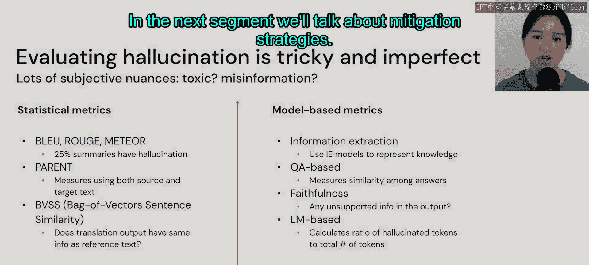

# 56：幻觉问题 🧠

在本节课中，我们将要学习大语言模型（LLM）中的一个核心挑战：幻觉。我们将了解幻觉的定义、类型、产生原因以及如何评估它。

我们经常谈论大语言模型的许多输出表明模型正在“幻觉”，但“幻觉”究竟是什么意思呢？

## 幻觉的定义

根据2022年的一篇论文，幻觉指的是生成的内容**无意义**或**不忠实于**提供的源内容。

这意味着模型的输出可能听起来完全自然且流畅。这也意味着即使输出是错误的，模型也可能表现得非常自信。

## 幻觉的类型

幻觉主要分为两种类型：内在幻觉和外在幻觉。基于个人期望，我们对输出内容的忠实性或事实性可能有不同的容忍度。我们稍后会讨论“忠实”在此语境中的具体含义。

以下是两种幻觉类型的详细说明：

*   **内在幻觉**：指输出内容**直接与源内容矛盾**。
    *   **示例**：如果源文本指出“首个埃博拉疫苗于2019年获得FAA批准”，但摘要输出却显示“首个埃博拉疫苗于2021年获批”。这是一个非常明显的矛盾案例，意味着输出不忠实于源文本，同时也完全不具事实性。

*   **外在幻觉**：指我们**无法从源内容验证输出**，但模型本身可能并没有错。
    *   **示例**：如果我说“爱丽丝上周首次在击剑比赛中获得一等奖”，然后模型告诉我“爱丽丝上周首次在击剑比赛中获得一等奖，她非常兴奋”。爱丽丝首次获奖并感到兴奋很可能是真的，但我们无法从源内容中验证这一点。这意味着我们无法断定输出对源内容而言是事实性的或忠实的。

## 幻觉的成因

上一节我们定义了幻觉的类型，本节中我们来看看导致幻觉的几个主要原因。幻觉的产生主要与数据和模型本身有关。

### 数据相关原因

数据如何收集对模型表现影响巨大。我们在前面的章节讨论过，当数据量庞大时，很难进行有效甚至任何审计。

以下是数据层面可能导致幻觉的几个因素：

*   **数据收集过程**：我们可能在没有任何事实核查的情况下收集所有可用的文本。
*   **重复数据**：大多数时候，我们不会过滤掉完全重复的数据。例如，如果同一个Reddit帖子被收录了两次，这就算作重复。重复数据会**使模型产生偏见**，如果数据中多次出现相同的Reddit讨论，模型就更可能输出来自那些讨论的回应。
*   **生成任务的开放性**：生成式任务本质上是开放式的。例如，在聊天应用中，我们希望聊天机器人更具吸引力，因此期望它对同一问题能给出更多样化的回应。如果聊天机器人总是重复相同的内容，我们可能不会长久使用它。然而，这种为了提升互动性而追求的多样性，也可能与糟糕的幻觉相关，尤其是在我们需要事实性和可靠输出的场景下。当我们询问医疗文献时，对任何非事实内容的容忍度会远低于询问如何制作完美沙拉时。但生成任务的这种开放性是很难避免的问题，也是我们作为模型和应用使用者必须面对的。

### 模型相关原因

第二个导致幻觉的方面是模型本身。

以下是模型内部可能导致幻觉的几个机制：

*   **不完美的编码器学习**：编码器学习了训练数据各部分之间错误的关联。
*   **解码时错误**：当模型尝试生成文本输出时，解码器可能关注了输入源中错误的部分。
*   **解码策略设计**：某些解码策略**旨在鼓励随机性和意外性**。例如，**Top-K采样**策略不是选择最可能的词元，而是从概率最高的K个候选词元中随机选择一个来生成下一个词元。
*   **曝光偏差**：简而言之，这意味着模型倾向于基于其自身历史生成的词元来生成后续输出。这也意味着模型可能会偏离主题，例如，你开始询问洗碗机，模型可能转而开始生成关于烘干机的内容。
*   **参数知识偏见**：总结来说，这意味着模型会**固守其已知的知识**。所有模型都倾向于基于其记忆的内容生成输出，而不是基于提供的输入。

## 幻觉的评估

正如之前提到的，评估幻觉是棘手且不完美的，不同个体对模型行为的期望不同，我们判断某些内容是否有害或是否属于错误信息的决策标准也可能大相径庭。

目前有两类指标可以帮助我们评估幻觉。

### 统计指标

第一类是指标基于统计方法。

以下是几种常见的统计评估指标：

*   **BLEU和ROUGE**：这些指标在自然语言处理领域已存在一段时间。使用这些指标进行评估时，我们发现大约**25%的摘要包含幻觉**，即包含未被源内容支持的信息。
*   **BERTScore**：该指标通过同时使用源文本和输出文本来衡量幻觉。它实际上在后台使用n-gram来捕捉源内容与目标内容的匹配程度，然后计算F1分数。
*   **BLEURT**：它代表“基于向量的句子相似度回归评估”，用于衡量翻译输出是否与翻译参考具有相同的信息量。

### 基于模型的指标

第二类指标是**基于模型的指标**，这意味着我们利用另一个模型来帮助我们评估幻觉。但这类指标也意味着，我们所利用的这些模型本身的任何错误也会随之传播。

以下是几种基于模型的评估方法：

*   **信息抽取**：这对于任何命名实体识别用例尤其有用，我们试图从中提取知识。我们可以用抽取的结果与语言模型的输出进行比较。
*   **基于问答的评估**：我们可以通过衡量对同一问题不同答案之间的相似性来评估忠实度。
*   **忠实度分类**：直接提问：输出是否包含任何未被支持的信息？
*   **基于语言模型的评估**：使用一个语言模型来计算**幻觉词元数量与目标总词元数之比**。

如你所见，有多种指标可帮助我们评估幻觉，但没有一种是完美的。在下一节中，我们将讨论缓解策略。

## 总结

本节课中，我们一起学习了大型语言模型中的“幻觉”问题。我们明确了幻觉是指模型生成不忠实或无意义内容的现象，并区分了内在与外在两种幻觉类型。我们深入探讨了导致幻觉的数据因素（如收集过程、重复数据、任务开放性）和模型因素（如编码错误、解码策略、曝光偏差和参数知识偏见）。最后，我们介绍了评估幻觉的统计指标（如BLEU， BERTScore）和基于模型的指标（如信息抽取、问答评估），并认识到目前尚无完美的评估方案。理解幻觉的成因和评估方法是开发可靠LLM应用的重要基础。