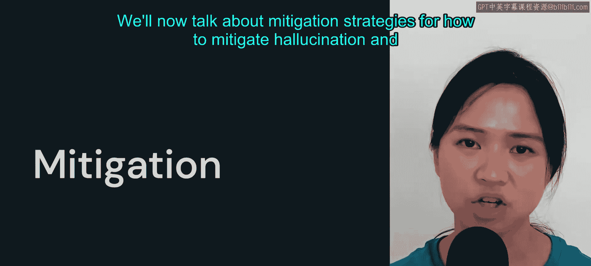
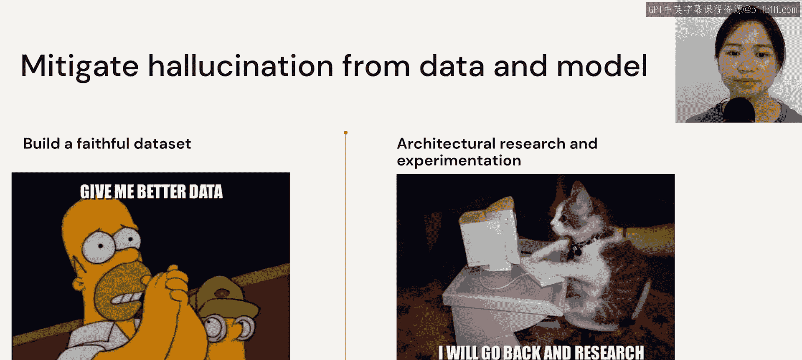
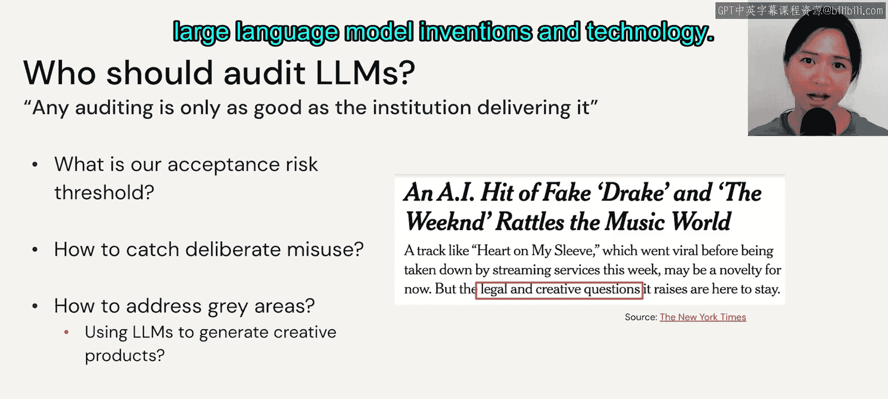

# 57：缓解策略 🛡️

在本节课中，我们将要学习如何缓解大语言模型的幻觉问题，并探讨应对其各类风险与局限性的策略。

## 概述

大语言模型虽然强大，但也存在幻觉、偏见、有害输出等风险。本节我们将从数据和模型两个角度出发，介绍具体的缓解策略，并讨论更广泛的风险治理框架。

## 幻觉的缓解策略

既然幻觉问题源于数据和模型两方面，我们也应从这两个角度来应对。

以下是针对数据层面的策略：

*   **构建可靠的数据集**：这意味着需要人工参与，根据源文本从头开始编写清晰、忠实的目标文本。
*   **改写网络真实语句**：也可能涉及让人类实际过滤掉任何不可靠的数据，或对现有数据进行修正。
*   **扩充输入数据源**：我们可能还需要研究如何用更多数据源来增强输入数据。

上一节我们介绍了从数据入手的方法，本节中我们来看看如何从模型架构与后处理角度进行改进。

以下是针对模型与后处理的策略：

*   **加强架构研究与实验**：改进当前的建模和推理方法，例如更多地使用**强化学习**。
*   **采用多任务学习**：因为幻觉常源于对单一数据集的依赖，多任务学习可能有所帮助。
*   **进行后处理校正**：这同样需要人工介入和检查。

## 通用风险与限制的缓解

那么，我们如何普遍地降低所有大语言模型的风险和限制呢？这包括数据偏见、模型毒性、信息危害以及恶意用户等问题。我们需要一个综合的方案来应对它们。

以下是针对不同风险的具体措施：

*   **应对数据偏见**：我们需要审视数据切片，甚至可能需要更频繁地更新数据。
*   **应对模型毒性**：这需要多管齐下。首先同样涉及数据评估，但我们也可以引入一些后处理工具，例如来自 **Hugging Face** 和 **Spark NLP** 的工具（我们将在后续代码中看到这两个工具）。或者，为这些大语言模型设置防护栏，例如使用 **MIEmo guardrails**。此外，为微调精心策划更多数据也是一个方向。
*   **应对信息危害**：我们需要关注信息的来源。这可以包括为微调精心准备数据，或微调你自己的模型。
*   **应对恶意用户**：要抓住这些不良行为者或恶意行为者，必须要有某种形式的监管。

## 监管与审计框架

我们在大语言模型中看到的许多风险和限制确实需要某种监管来帮助我们规范其使用。

我们可以从一个三层的角度来思考监管。2023年的一篇论文提出，我们可以在三个独立的层面进行审计，而非单一的治理。

以下是提出的三层审计框架：

1.  **技术提供商层审计**：这意味着审计所有为我们提供使用模型的大型公司。
2.  **模型层审计**：这意味着在模型向公众发布之前对其进行审计。
3.  **应用层审计**：这意味着根据用户实际使用模型的方式来评估这些模型的风险。

## 待解决的开放性问题

然而，即使有了这个框架，我们作为一个社区仍有一些开放性问题需要回答。

以下是一些关键的挑战与疑问：

*   当我们无法完全确定用户如何与这些模型交互时，我们如何真正把握全局情况？
*   我们如何审计闭源模型？
*   幸运的是，全球各国最近都在进行大量讨论。
*   或许最大的问题是，即使有了审计框架，究竟应该由谁来执行这些审计？任何审计的有效性都取决于执行它的机构。
*   我们还必须认识到，所有大语言模型都不可能实现零风险。因此，我们必须设定一个可接受水平的任意阈值。
*   我们如何捕捉故意的滥用行为？
*   当我们使用大语言模型生成创意产品时，如何真正处理其中的灰色地带？

## 总结

本节课中我们一起学习了缓解大语言模型幻觉的双重策略（数据与模型），并探讨了应对偏见、毒性等通用风险的方法。我们还介绍了一个三层审计的监管框架，并认识到随着大语言模型技术的发展，社会需要共同应对一系列关于监管、审计和风险阈值的开放性问题。