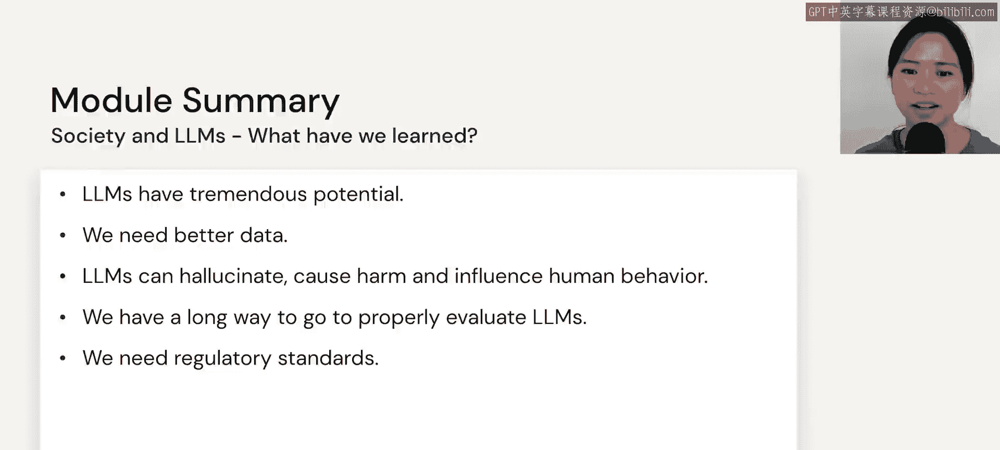
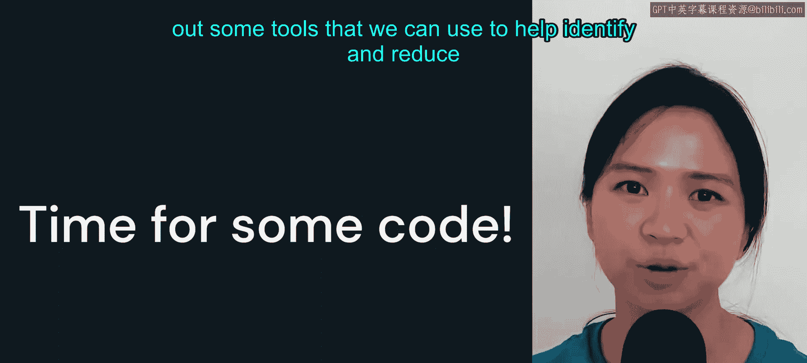

# 58：总结与工具展望 🎯

在本节课中，我们将回顾第五模块的核心内容，并展望后续将学习的实用工具。我们探讨了大语言模型的社会影响、当前挑战以及未来的发展方向。

上一节我们讨论了模型评估的挑战，现在我们来对本模块的内容进行总结。

我们提到，大语言模型拥有巨大的潜力，能够变革并真正革新每一个行业。

但从长远来看，除了训练越来越大的模型，我们需要更好的数据来构建更好的模型。

然而，大语言模型普遍存在可能产生幻觉、造成伤害以及在我们过度依赖时影响人类行为的问题。

要恰当地评估大语言模型，我们仍有很长的路要走，并且我们使用的评估指标往往非常主观。

最后，我们需要监管标准来帮助建立某种规范，以界定什么是合乎道德和负责任地使用大语言模型。

---

现在，是时候转向一些代码，去了解我们可以用来帮助识别和减少模型偏见的一些工具了。

---

本节课中我们一起回顾了大语言模型的社会影响与主要挑战，包括其潜力、数据需求、潜在风险、评估难点以及对监管标准的需求。同时，我们预告了接下来将进入实践环节，学习具体的代码工具来应对模型偏见问题。