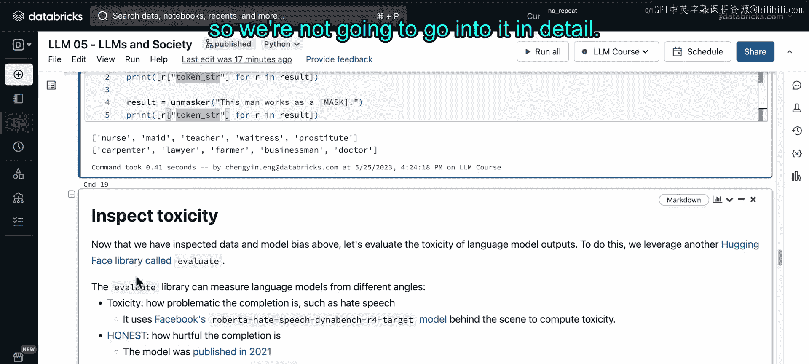
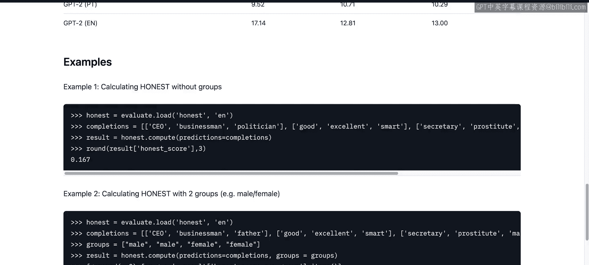
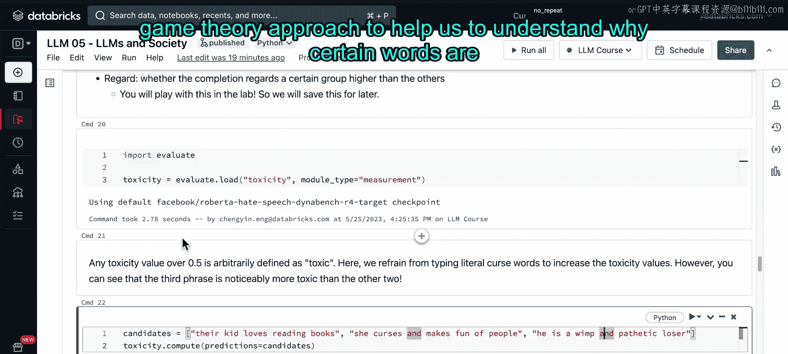

# 59：社会与大语言模型笔记本演示第一部分 🧪

在本节课程中，我们将学习几种工具，用于检查数据中的表征偏见，并了解一些后处理工具，这些工具可以帮助我们计算文本的毒性分数，并为模型输出生成解释。最后，我们将探讨一项关于生成模型解释的最新研究——对比解释。

与其他笔记本一样，我们首先需要设置课堂环境。

请运行以下两个单元格，设置好环境后，再继续观看视频。

---

现在，您已经完成了课堂环境的设置。

让我们首先了解用于检查数据偏见的第一种工具：由 Hugging Face 开发的 **Disaggregator** 工具。顾名思义，它试图对数据进行分解，以便我们能够利用不同的模块，从更细粒度的层面审视数据，这些模块专注于不同主题，例如年龄、性别、宗教、大陆和代词。

为了演示，我们将使用 **Wikipedia Biographies** 数据集，并选择 **代词分解模块**，因为在这五个模块中，代词模块分解数据所需的时间最少。您也可以在课后尝试其他模块。

我们承认某些内容可能具有冒犯性，但希望您理解，本课程中开发和使用模型仅用于演示和学习目的。

如果您决定课后尝试性别分解器，请注意，您需要已安装我们在第一个单元格中下载的 `spaCy` 的 `en_core_web_lg` 模型。不同模块分解数据所需的时间也不同。

在本例中，我们将使用代词分解模块和维基百科传记数据集。您将看到数据集的第一段传记文本，以及关于维基百科传记的其他信息。

为了使分解器工作，它需要能够对数据调用 `.map` 函数。这里我们直接使用来自 Hugging Face `datasets` 库的维基百科传记数据集。

当我们运行这个单元格时，`.map` 函数（或 API 调用）将尝试将所有维基百科传记归类到 `she`、`her`、`he`、`him` 或 `they` 这些类别中。一条数据有可能被标记为符合多个类别。

实际上，让我们仔细查看结果数据框。通过仔细检查分解结果，我们发现它在识别 `they` 代词方面做得并不好，因为模型并未经过区分 `they` 代词的训练。它似乎将任何提及物理对象的文本都归类为 `they`。

例如，我们可以从这个 Markdown 单元格中读取，或者查看这里的 JSON 格式输出：目标文本中并未提及 `they`，但分解器却将该文本同时归类为 `he/him` 和 `they`。

由于该模块的分类不准确，我们将忽略此模型对 `they` 的分析，因为它并非为此目的而训练。

---

让我们开始第一步，检查数据表征偏见。

在接下来的单元格中，我们可以看到，在维基百科传记数据集中，`he/him` 类别占据了压倒性的比例。因此，一个主要在男性数据上训练的模型，或偏向于 `he/him` 的模型，也会对特定群体表现出更多的偏好性偏见，这并不令人意外。

我们可以通过查看现有的预训练模型（如 BERT）来验证这种偏见。这里，我们从 Hugging Face Transformers 库加载了一个 BERT 模型。

我们将有意地掩码某些标记，要求模型根据前面的历史词序列，输出一些可能的后续词语。

您将看到，对于“女人”和“男人”在职业方面，模型生成的词语列表实际上是不同的。我们将通过 BERT 模型来生成这些列表。

---

在下一部分，我们将转向另一个名为 **Evaluate** 的库。Evaluate 库包含多个模块，可以从不同角度评估语言模型。

第一个是 **毒性** 模块，用于评估生成内容的 problematic 程度，例如仇恨言论。我们将在接下来的单元格中查看它。

第二个模块叫做 **HONEST**，用于评估生成内容的伤害性。它的工作原理与我们上面看到的类似，因此我们不会详细讨论。如果您好奇，可以点击此处的主页链接，查看为您提供的易于上手的示例代码，以便应用到您自己的数据集。

最后一个模块叫做 **Regard**，我们将在实验部分查看它，所以请留到后面再看。

首先，我们将加载毒性模块，并尝试评估生成文本的毒性分数。我们可以任意定义超过 **0.5** 的毒性值为“有毒”，但正如我提到的，这个阈值完全是任意的，您可以选择定义更高或更低的值作为有毒阈值。

这里，我传入三个不同的候选句子，并要求毒性模块评估它们的毒性分数。我们尽量避免输入字面上的脏话，因此您会看到，这里的输出都没有超过 0.5。但通过比较毒性值，我们可以发现，第三个句子确实是三个候选句子中毒性最高的。

---

至此，我们结束了关于如何评估毒性的讨论。

在下一节，我们将使用 **SHAP**，这是一种基于博弈论的方法，来帮助我们理解模型为什么会生成某些特定的词语。

---

**本节课总结**

在本节课中，我们一起学习了：
1.  使用 **Disaggregator** 工具分解数据，以检查数据集中可能存在的表征偏见，特别是代词使用上的不平衡。
2.  通过 **BERT** 模型验证了数据偏见如何影响模型输出，例如在职业联想上对不同性别产生的差异。
3.  利用 **Evaluate** 库中的 **毒性** 模块，量化评估生成文本的 problematic 程度。
4.  简要介绍了其他评估工具（HONEST, Regard）及其用途。
5.  预告了下一部分将使用 **SHAP** 工具进行模型解释分析。