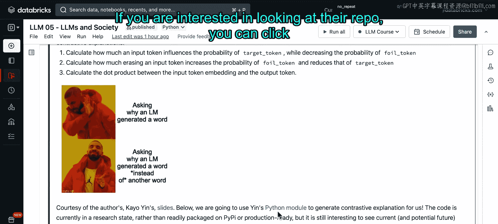
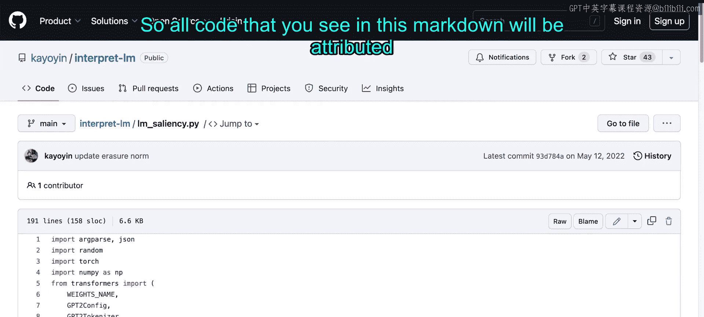
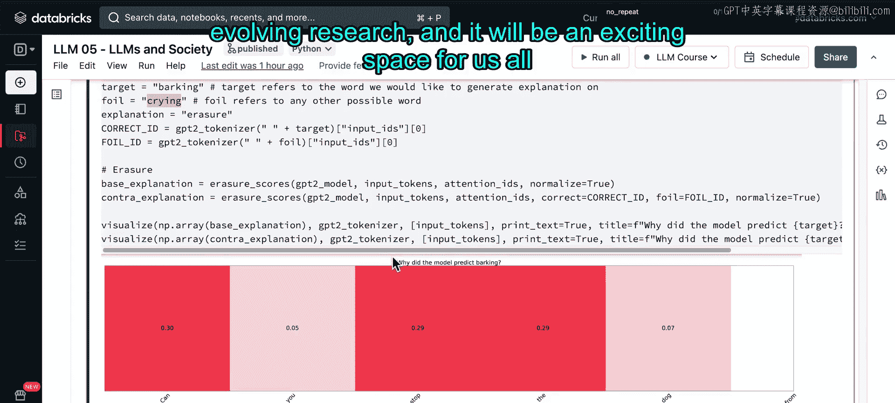

# 60：Notebook 演示第二部分 🧪


在本节中，我们将学习如何使用 SHAP 来解释大语言模型的输出。我们将了解 SHAP 的基本原理，并通过代码演示如何将其应用于 GPT-2 模型，以理解模型生成特定词语的原因。最后，我们将探讨一种更先进的“对比解释”方法。

---

## 概述：SHAP 解释方法

上一节我们介绍了模型解释的重要性，本节中我们来看看 SHAP 这一具体工具。SHAP 代表 **SH**apley **A**dditive ex**P**lanations，是一种基于博弈论的方法。它最初为经典机器学习模型设计，但其模型无关的特性使其也能应用于语言模型。

直观地说，SHAP 是一种基于排列组合的方法。它通过**固定其他所有输入变量，只改变一个输入变量的值**，来观察输出结果的变化。这样，就能将输出的变化归因于那个唯一被改变的输入变量。

以一张图表为例：如果我们想检查“是否允许养猫”这一政策是否影响公寓价格，通过固定其他所有变量（如位置、面积），只改变“养猫政策”，我们确实能看到公寓价格产生了差异。这就是 SHAP 的基本思想。

---

## 应用 SHAP 到语言模型

现在，让我们看看如何将 SHAP 应用到语言模型的输出上。

首先，我们将使用 GPT-2 模型来生成文本，并设置一些模型配置参数。

```python
# 模型配置示例
model_config = {
    "is_decoder": True,  # GPT是解码器模型
    "temperature": 0.0,  # 关闭随机性，使输出确定
    "no_repeat_ngram_size": 2  # 禁止重复的2词序列
}
```

以下是关键参数的解释：
*   **`is_decoder: True`**：因为 GPT 是一个解码器模型。如果你不清楚解码器模型是什么，不必担心，这涉及到语言模型的基础架构，我们将在后续课程中详细讨论。
*   **`temperature: 0.0`**：关闭输出中的随机性。
*   **`no_repeat_ngram_size: 2`**：`N-gram` 是指由 N 个词组成的序列。设置为 2 意味着我们不允许任何重复的 2 词序列出现在同一输出中。例如，如果输出中已经出现过“San Francisco”，那么这个词组就不能再次出现。设置此参数需谨慎，因为在某些情况下，我们确实希望模型生成准确的名字（如“Los Angeles”），此时设置此参数就不太合适。

运行配置单元格后，我们从一个示例输入句子开始：
`“sunny days are the best days to go to the beach so”`
我们期望 GPT-2 能为我们补全这个句子。

为了使用 SHAP，我们需要创建一个解释器对象，并将生成输出的模型以及对应的分词器传递给它。这是因为 SHAP 需要知道我们是如何将句子切分成不同的标记（token）的。

```python
# 创建SHAP解释器
explainer = shap.Explainer(model, tokenizer)
```

这一步可能需要一些时间运行，因为它正在计算模型输出背后的解释。

计算完成后，我们可以通过绘图来检查 SHAP 的输出。在接下来的单元格中查看 SHAP 值，你会立即看到红色和蓝色的条形。
*   **红色** 表示对该特定标记（token）有**正向贡献**。
*   **蓝色** 表示有**负向贡献**。
*   **颜色的强度**（条形的宽度）表示贡献的强弱程度。

将鼠标悬停在某个特定的标记或单词上，可以看到每个词对该输出词的不同贡献值。例如，在补全句子 `“…so we are looking”` 时，悬停在输出词 `“looking”` 上，可以看到 `“so”` 是促成输出 `“looking”` 贡献最大的词，而 `“to”` 则是在负方向上贡献最小的词（即它降低了 `“looking”` 出现的可能性）。

用条形图可以更清晰地看到，`“so”` 是对输出 `“looking”` 贡献最大的词。

让我们尝试另一个输入句子：
`“I know many people who prefer beaches to the mountains”`
然后看看这次 SHAP 会生成什么解释。你会发现 GPT-2 补全了句子，带有偏见地说 `“but I‘m not one of them”`。同样，你可以悬停在任何输出词上，查看哪个输入词对输出 `“not”` 或 `“them”` 贡献最大。在条形图格式中，可以看到 `“I”` 是对输出 `“not”` 贡献最大的标记。

---

## SHAP 的局限性与对比解释

虽然 SHAP 能帮助我们找出哪个词或标记对输出某个特定词贡献最大，但我们知道语言模型存在**对最近标记的偏见**。因此，解释本身也可能带有“近因偏见”，即最近的标记对后续预测标记的影响往往最大。

这是一个很难解决的问题。尽管 SHAP 能让我们了解哪些输入标记可能影响了输出标记，但在某些情况下，它的直接解释可能不那么有用，尽管看起来很有趣。

例如，在这个句子中：
`“can you stop the dog from ___”`
GPT-2 输出应该是 `“barking”`。但其他合理的候选词也可能是 `“crying”`、`“eating”`、`“biting”` 等等。如果我们能知道模型为什么输出 `“barking”` 而不是 `“biting”` 或 `“crying”`，将会更有趣。

探索这些“假设性”的词语，而不是单纯解释已输出的词，就是所谓的 **“对比解释”**。这个概念由一篇 2022 年的论文提出。论文作者认为，与其解释语言模型**为什么**生成一个词，不如去问语言模型**为什么生成这个词，而不是另一个词**。



我们不会深入探讨这篇论文的研究细节，但想指出这是一个非常令人兴奋和有趣的研究方向。未来，我们或许能更清楚地理解语言模型选择某个词而非另一个词的原因。



事实上，我们将使用这两位作者编写的一些代码。如果你对他们的研究感兴趣，可以点击提供的链接直接获取他们的代码。我们将使用他们 `LM_saliency` 文件中的代码，本 Markdown 中的所有相关代码都将归功于他们。

以下是使用对比解释方法的示例：

```python
# 使用对比解释方法
# ‘target_token‘ 是模型实际输出的词（如“barking”）
# ‘foil_token‘ 是其他可行的候选词（如“crying”）
explanation = generate_contrastive_explanation(model, input_text, target_token="barking", foil_token="crying")
```

你会看到它生成了一些可视化结果，帮助我们理解哪个标记对模型生成 `“barking”` 而不是 `“crying”` 贡献最大。

在这个例子中，方框上的分数衡量了每个标记对模型**将更高概率分配给目标词（即‘barking’）**的影响程度。比较两组解释（`barking` vs `crying`）时，可以看到 `“stop”` 这个词无论在 `“barking”` 还是 `“crying”` 的上下文中，贡献度都保持很高。这表明 `“stop”` 这个词会使模型更倾向于预测 `“barking”` 而不是 `“crying”`。而 `“the”` 这个词，在检查输出 `“crying”` 的概率时，其贡献度大幅下降，这意味着 `“the”` 实际上并不影响模型预测 `“barking”` 还是 `“crying”`。

---

## 总结



本节课中我们一起学习了如何用 SHAP 工具解释大语言模型的输出。我们了解了 SHAP 基于博弈论、通过改变单个输入来归因的基本原理，并实践了如何用其分析 GPT-2 模型的生成结果。同时，我们也认识到 SHAP 可能受“近因偏见”影响。最后，我们介绍了一种更前沿的“对比解释”方法，它通过比较模型为何选择此词而非彼词，提供了更深层的解释视角。这是一个快速发展的研究领域，值得我们持续关注。