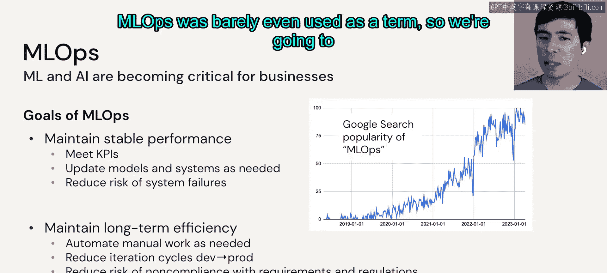
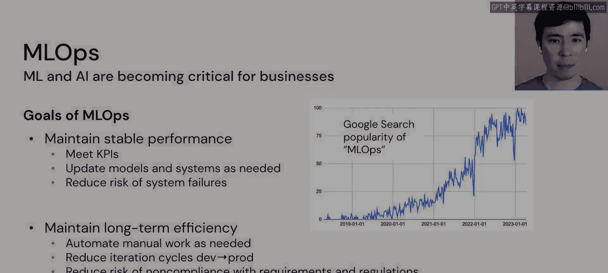

# 62：LLMOps：6.2 模块概述 🚀

在本节课中，我们将学习LLMOps（大语言模型运维）模块的概述。我们将探讨如何将传统的MLOps（机器学习运维）原则应用于大语言模型，并了解将LLM投入生产环境所涉及的端到端工作流、架构以及关键考量因素。

## 传统MLOps的目标

上一节我们介绍了LLMOps模块的整体目标。本节中，我们来看看其基础——传统MLOps。MLOps在过去几年已成为一个重要领域。随着机器学习和人工智能对企业变得至关重要，企业需要认真对待生产部署。

MLOps主要有两大目标：

以下是MLOps的两个主要目标：
*   **维持稳定的性能**：这可能意味着围绕模型的KPI，如准确性或其他指标；也可能意味着围绕系统的KPI，如延迟、吞吐量等。
*   **维持长期的效率**：这可能意味着在需要时自动化手动工作，缩短从开发到生产的迭代周期，并降低不符合任何要求或法规的风险。

在右侧图表中可以看到，就在几年前，“MLOps”这个术语还很少被使用。因此，我们将在下一个视频中花一些时间，介绍传统MLOps的背景知识。

## 从开发到生产的工作流

为了达成上述目标，我们需要一个系统化的流程。在代码实践部分，我们将逐步讲解部署一个可扩展的、由LLM驱动的数据管道，从开发到生产的完整工作流。

本节课中我们一起学习了LLMOps模块的概述，了解了其源于传统MLOps的两大核心目标：**维持稳定性能**与**保持长期效率**。我们还预览了后续将深入探讨的、将LLM投入生产的端到端工作流程。