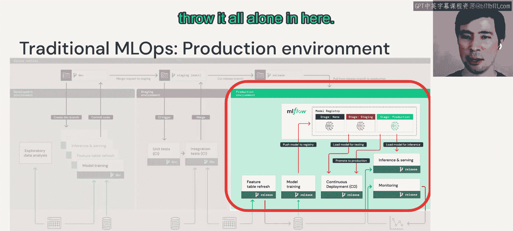

# 63：传统MLOps概述 🏗️

在本节课中，我们将要学习传统机器学习运维（MLOps）的核心概念与架构。MLOps是确保机器学习项目从开发到生产能够高效、可靠运行的一系列实践和自动化流程。

## 概述

上一节我们介绍了LLMOps的目标。本节中，我们来看看其基础——传统MLOps。MLOps可以被定义为 **DevOps + DataOps + ModelOps**，它是一套用于管理机器学习资产（如代码、数据和模型）的流程与自动化工具，旨在提升性能与长期效率。

## 传统MLOps高层参考架构

下图展示了一个传统MLOps的高层参考架构。这是一个通用化的示意图，但它清晰地揭示了其中的关键思想。

架构顶部是用于管理代码的**源代码控制**。底部是**湖仓一体（Lakehouse）数据层**。中间从左到右，分别是**开发（Development）**、**预发布（Staging）** 和**生产（Production）** 环境。

### 开发环境

我们从左侧的开发环境开始。例如，数据科学家在此环境中工作，可能进行探索性数据分析（EDA），或编写面向生产的流水线，例如：
*   **模型训练流水线**
*   **特征表刷新流水线**

这些代码在准备就绪后，可以被提交到源代码控制系统。这是将ML资产（特别是代码）移向生产环境的主要渠道之一。

### 湖仓一体数据层

架构底部是湖仓一体数据层。其关键要素在于，它是一个**跨多种工具的共享数据层**，构成了这个更广泛的MLOps环境和系统集合。

以下是共享数据访问的重要性：
*   在开发环境中操作的数据科学家可能需要**读取**生产数据的权限来进行问题调试。
*   但他们绝对不应拥有**写入**权限。
*   这种灵活的、受控的共享数据访问和单一数据源非常有价值。

### 预发布与生产环境

当我们的代码移向预发布环境时，它会经过**持续集成（CI）** 测试。这些测试包括快速的单元测试和更长的集成测试，以确保代码在模拟生产环境（拥有相同的服务和流水线集合）中能正常工作。

一旦测试通过，代码就可以移向生产环境。在生产环境中，所有在开发阶段创建和测试的流水线都会被实例化。

以下是生产环境中典型的流水线流程：
1.  数据从底部左侧被读取。
2.  一个**特征表刷新作业**以批处理或流式方式将数据写入特征表。
3.  这些数据可能被输入到一个**自动模型重训练流水线**中（例如，每周运行一次）。
4.  新产生的模型被放入顶层的**模型注册表（Model Registry）** 中。

如果你不熟悉模型注册表，可以将其理解为**具有特定规范的模型仓库**。它记录模型的多个版本，并跟踪每个版本所处的阶段（开发、预发布或生产），管理模型向生产就绪状态的演进。

推动模型进入生产环境的过程由**持续部署（CD）** 流水线完成。它通过增量发布或多阶段测试，最终将模型标记为可用于生产。随后，模型可以被加载到右侧的**推理和 serving 系统**中，并进行监控。

## 总结

本节课中，我们一起学习了传统MLOps的基本架构。它为我们提供了一个关于ML项目如何从开发走向生产、并在此过程中保持管理和监控的粗略框架。现在，我们可以转向下一个核心问题：**当我们将一个大语言模型（LLM）引入这个框架时，会发生什么？**

