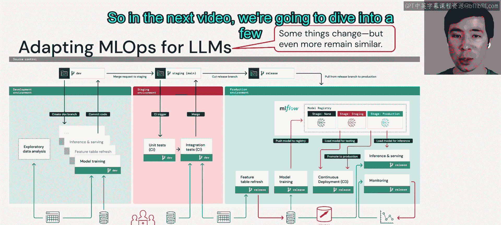

# 64：LLMOps 与传统 MLOps 的对比 🧩

在本节中，我们将探讨 LLMOps 与传统 MLOps 架构的异同。我们将分析当大型语言模型被引入现有机器学习工作流时，哪些部分会发生变化，哪些部分会保持不变。

## 概述

首先，让我们回顾一下上一节中看到的传统 MLOps 架构图。我们将以此为基础，分析引入 LLM 后可能发生的变化。

## 发生变化的部分

以下是引入 LLM 后，架构中可能发生变化的几个关键领域。

### 模型训练

在传统 MLOps 中，模型经常需要频繁地重新训练。然而，对于 LLM 而言，从头开始进行完整的训练通常是不可行的。因此，训练方式可能会被更轻量级的方法所取代。

以下是几种可能的替代方案：
*   **模型微调**：这种方法仍然会生成一个新的模型，但比完全重新训练要高效。
*   **流水线调优或提示工程**：这些方法不产生新的模型，而是通过调整输入或处理流程来优化模型性能。

需要注意的是，无论采用哪种方法，这些流水线或微调后的模型，本质上仍然是模型或代码片段。我们现有的 MLOps 基础设施知道如何处理它们。

### 人工反馈

人工反馈对于 LLM 至关重要。在架构图的左下角，我们对此有两点说明。

首先，来自用户的反馈应被视为从开发到生产阶段都可用的一项重要数据源。这里称之为“数据源”，是因为你可能需要聚合来自内部和外部多个潜在来源的反馈。

其次，传统的、通常可自动化的监控，可能需要通过持续的人工反馈循环来增强。与人工反馈相关的自动化质量测试可能会变得非常困难，因此需要结合人工评估来进行补充。

### 部署与生产工具

在部署方面，实践可能会有所不同。传统 MLOps 中，你可能会对离线的批量数据集进行测试。而在 LLMOps 中，更可能采用增量式发布策略。

具体做法是：先将模型或 LLM 流水线展示给一小部分用户，观察他们的反应，随着信心的增加，再逐步扩大用户范围。

在生产工具层面，大型模型可能需要将服务从 CPU 迁移到 GPU。你的数据层也可能出现新的对象，例如**向量数据库**。

### 成本与性能

成本和性能也可能带来挑战。在架构图的左侧，模型的训练和重新调优可能需要谨慎管理。在服务端，你可能会面临更高的成本，并需要在性能之间进行权衡，尤其是在比较自己微调的模型与付费的第三方 LLM API 时。

需要说明的是，这里的比较是针对“传统 MLOps”而言的。如果你来自计算机视觉或 NLP 背景，已经对深度学习的训练、微调和推理成本很熟悉，那么 LLM 在这方面会显得比较类似。

## 保持不变的部分

尽管有上述变化，但如果你仔细观察这张图，会发现更多的部分保持不变。

开发、预发布和生产环境的分离，以及执行这些分离的访问控制，仍然相同。用于交付流水线和模型的渠道，仍然是 Git 和模型注册表。用于管理数据的湖仓一体架构仍然至关重要。我们的持续集成基础设施可以复用。MLOps 的模块化结构也得以保留，我们仍然在开发图中方框所示的模块化数据流水线和服务。

## 总结

本节课中，我们一起学习了 LLMOps 与传统 MLOps 架构的对比。我们看到了在引入大型语言模型后，模型训练、人工反馈整合、部署策略、生产工具以及成本管理等方面可能发生的变化。同时，我们也认识到，开发流程、基础设施、数据架构和模块化设计等核心部分在很大程度上保持不变。既然我们已经提到了这些变化，在接下来的视频中，我们将更深入地探讨其中的一些细节。

