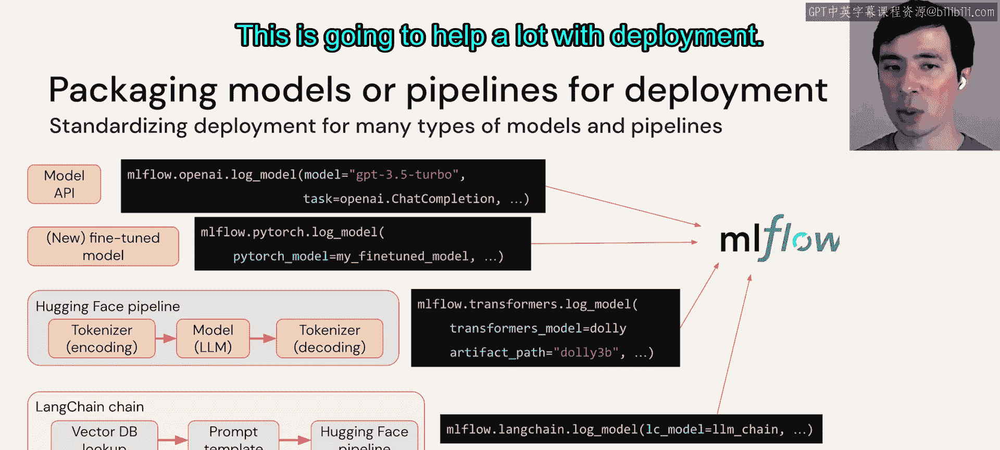
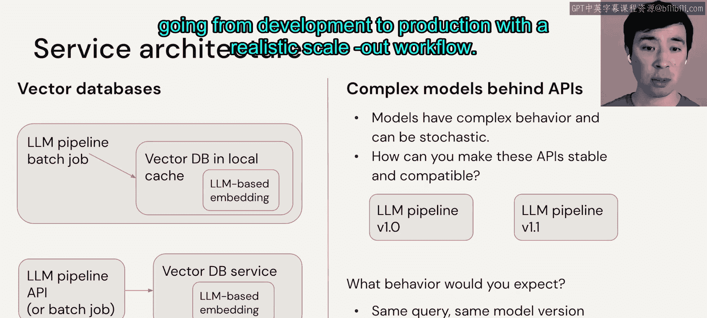

# 65： LLMOps 细节详解

在本节课中，我们将深入探讨LLMOps（大语言模型运维）的具体细节。我们将涵盖从提示工程到模型部署、成本管理以及服务架构等多个关键主题，帮助你理解如何将LLM应用从开发阶段顺利推进到生产环境。

## 提示工程：从追踪到自动化

上一节我们介绍了LLMOps的总体概念，本节中我们来看看提示工程在运维中的具体实践。提示工程不仅是模型开发的一部分，其某些方面对于生产部署也至关重要。

在提示工程中，你可能会按以下顺序遇到需求：首先是追踪，其次是模板化，最后是自动化。

以下是提示工程实践的具体步骤：

1.  **追踪**：追踪查询和响应，进行比较，并迭代优化提示。在快速迭代和查询量较少的开发阶段，可以使用如MLflow这类提供原生LLM功能的工具进行详细比较。
2.  **模板化**：当需要标准化提示格式时，可以使用如LangChain或LlamaIndex等工具来构建模板。这些工具的API有的会显式处理模板，有的则在底层隐式处理。
3.  **自动化**：最终，你可能希望用更自动化的提示调优来替代手动工程。这类似于传统的超参数调优，使用数据驱动的方法来优化提示。你可以将提示视为一个复杂的超参数，并使用工具如DSP（Demonstrate-Search-Predict）进行调优。

## 模型与流水线打包部署

接下来，我们讨论如何为部署打包模型或流水线。我们的目标是标准化多种类型模型和流水线的部署流程。

MLflow是我们的首选工具。它提供了所谓的“风味”（flavors），用于以统一格式记录这些不同的模型，这将极大地简化部署工作。

如果你不熟悉MLflow，这里有一个简要总结：它是一个用于机器学习生命周期的开源平台。你可以将各种库或自定义代码记录为MLflow“模型”（一种标准化的元数据格式），连同指标、参数等信息一起记录到MLflow跟踪服务器。随后，模型可以在模型注册表中进行注册，跟踪其走向生产的过程，并最终以多种方式部署，如内联代码、容器、批处理、流式评分或自定义服务等。

关键在于，左边是多种不同的模型或库，右边是多种部署选项，而中间的操作部分需要尽可能标准化，这正是MLflow的作用。

## 扩展计算与成本性能权衡

现在，我们来看看如何为更大的数据和模型扩展或分布式计算。如果你熟悉传统机器学习，概念是相同的，但工具可能有所变化。

*   对于微调和训练，我们可能会使用分布式TensorFlow、PyTorch、DeepSpeed等工具，它们可以运行在Apache Spark或Ray等现有扩展框架之上。
*   对于实时推理服务，需要可扩展的端点。
*   对于流式和批处理推理，则需要可扩展的流水线，这些可能与传统ML（如Spark和Delta Lake）所用的类似。

在管理成本与性能的权衡方面，我们已涵盖了一些相关主题，如训练和推理的成本，以及通过微调和创建更小模型来降低成本的技术。

以下是一些通用的成本优化建议，具体采用哪种取决于你的应用场景：

1.  **从简到繁**：从使用现有模型和API开始，后续再考虑降低成本或提升性能。
2.  **投资提示工程**：提示工程可以带来显著提升。
3.  **考虑微调**：尤其是在收集到足够的标注数据后，微调模型通常能超越通用模型。
4.  **预先评估成本**：预估开发与生产成本，对于生产环境，需考虑预期的查询负载和单次查询成本。
5.  **实施降本措施**：首先采取快速简便的方法，如缩短查询和响应长度，或调整推理配置以加速计算。然后考虑使用更小的模型，这可能涉及微调，或采用知识蒸馏、量化、剪枝等技术。
6.  **获取人工反馈**：模型运行速度的提升相对容易，但了解对最终用户的影响则需要通过反馈。
7.  **避免过度优化**：这是一个快速变化的领域，六个月后你正在优化的权衡点可能已经不同。

## 人工反馈、测试与监控

我们已经确立了人工反馈的重要性，因此需要为其做好规划。你可以明确付费获取反馈，但更应考虑从一开始就将反馈机制构建到应用程序中。

在操作层面，人工反馈可以像任何其他数据一样处理，输入到你的数据湖仓中。这意味着它既可用于生产时的监控，也可用于开发阶段的进一步分析和调优。

以下是两个内置隐式反馈的应用示例：
*   左侧：一个生成图像的模型，用户点击图像下载即表示他们喜欢或想要该图像。
*   右侧：一个技术支持机器人，在给出答案的同时提供更多信息的来源链接（暗示答案可能不够充分或某个来源特别相关），或提供一个直接与人工客服聊天的“逃生舱口”（明确表示机器人的回答无用）。

## 部署模型与部署代码

一个非常有趣且可能复杂的话题是：部署模型与部署代码的区别。你从开发转移到生产的资产是什么？在我们的参考架构中，我们讨论了同时使用版本控制管理代码和模型注册表管理模型。

我强调，在你的架构中可能会同时使用这两者，但重要的是要思考在具体实例中你正在做什么。

为了解释这一点：
*   **部署模型**：在开发环境中编写代码，生成一个模型，然后将这个具体的模型推向生产环境。
*   **部署代码**：编写用于生成模型的代码，然后将这段代码推向生产环境。在生产环境中，实际使用的模型是在生产环节创建的。

部署代码听起来可能更昂贵，但请记住，在开发/预演环境中，你可能只在很小的数据集上训练，而真正的训练只在生产环境进行。此外，你在生产环境拥有持续部署流水线，可以在那里进行测试。关键点在于，思考你在哪里进行测试——即你知道在哪个时间点产生最终要投入生产的模型或代码（即那个“工件”），那么你就知道在哪里需要测试它。

以下是一些具体场景的考量：
*   **提示工程与流水线编排**：可以将其作为代码部署，但考虑将其作为模型部署可能更简单，因为MLflow提供了将其打包为“MLflow模型”并注册到模型注册表的方法。
*   **微调或训练模型**：两种路线皆可。需根据你的需求、参考架构以及成本来决定。例如，从头训练一个新模型可能耗资百万美元量级，而微调一个模型可能只需100美元，因此在生产环境设置自动化的微调任务可能是合理的，但设置自动化的全新训练任务则可能不合理。
*   **多流水线/多模型部署**：考虑服务架构（此处使用宽松的定义），基本上考虑将推动这些不同模型或流水线走向生产的各个过程解耦。

## 服务架构考量

这里提供两个可能频繁出现的例子：

并非所有LLM应用都需要向量数据库，但有些需要。当需要时，需考虑LLM应该将向量数据库作为单独的服务调用，还是将其作为LLM流水线内部使用的本地库或工具。

例如，在进行文档问答时，主要的LLM流水线是文档问答LLM，它会调用向量数据库以获取上下文文档。
*   在上方的示意图中，它被展示为一个批处理作业。在批处理、流式处理设置或演示中，向量数据库可能仅保存在本地缓存中，不作为独立服务。
*   在下方的示意图中，它被抽离为独立服务。当有多个LLM流水线需要调用它，或者你希望解耦以便更独立地更新它们时，这种做法是合理的。

另外请注意，这里可能涉及两个LLM：左侧用于文档问答的主要LLM，以及向量数据库使用的嵌入模型。这个嵌入模型与另一个LLM是相当独立的，可以独立更新。

关于复杂模型与API的稳定性：当你开始思考服务架构时，需要考虑稳定性。但LLM可能具有复杂行为且具有随机性，如何使这些基于LLM的API稳定且兼容？

例如，你正在从左侧的LLM流水线V1.0升级到右侧的V1.1。在这种情况下，你期望什么行为？即使你没有升级模型，你是否期望查询始终返回相同的响应？如果你使用某些付费API（如OpenAI的API），它们会强制你指定API版本，这为你部分解决了这个问题，强制用户维持稳定的API版本。此外，我们在之前的模块中提到过一些推理配置，可以使模型更具确定性，减少随机性。

当你为组织内部或外部用户提供由LLM驱动的API服务时，这一点尤为重要。在这种情况下，请考虑对你的端点进行版本控制，并确保你的用户知道如何设置配置以实现确定性。

本节课中我们一起学习了LLMOps的多个核心细节，包括提示工程的运维实践、模型打包部署、计算扩展与成本优化、人工反馈的集成、部署策略的选择以及服务架构的设计考量。希望这些内容能为你针对具体用例进行规划提供良好的思路。在接下来的代码部分，我们将通过一个从开发到生产的、具有现实扩展性的工作流详细示例进行实践。