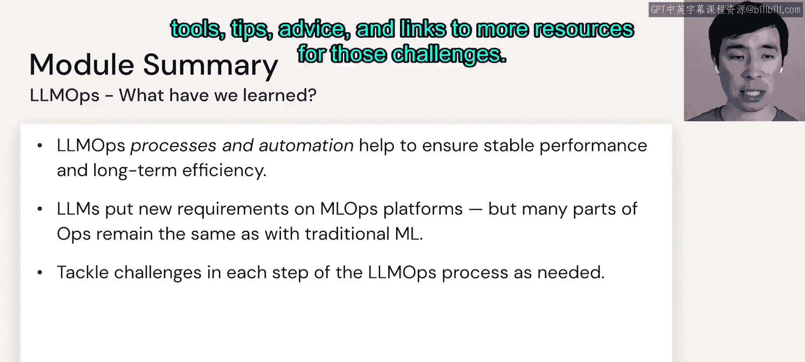

# 66：LLMOps 总结 🎯

在本节课中，我们将回顾第六模块关于LLMOps的核心内容。我们将总结如何通过流程和自动化来确保大语言模型在生产环境中的稳定性能与长期效率。

---

上一节我们介绍了LLMOps的各个组成部分，本节中我们来对整个模块进行总结。

我们讨论了LLMOps的流程与自动化。这些流程与自动化有助于确保模型性能的稳定性和长期的运行效率。

这与传统的MLOps非常相似，但大语言模型对这些平台提出了一些新的要求。尽管如此，许多部分仍与传统机器学习保持一致。

因此，我们的核心建议是：**根据需求，逐一应对LLMOps流程每个步骤中的挑战**。

为了应对这些挑战，我们提供了多种工具、技巧、建议以及更多资源的链接。

---

本节课中我们一起学习了LLMOps的核心理念。我们了解到，虽然LLMOps继承了传统MLOps的许多思想，但针对大语言模型的特性需要新的解决方案。关键在于采用系统化的流程和自动化工具，并灵活运用所提供的资源来应对实际部署中的挑战。