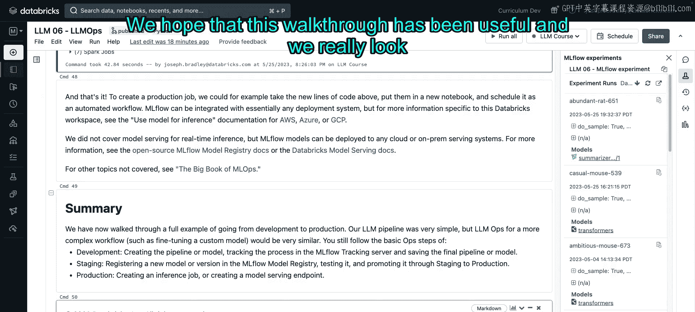

# 67： Notebook 演示


在本节中，我们将通过一个具体的 Notebook 示例，讲解 LLMOps 的完整流程。我们的目标是：将一个由大语言模型驱动的数据处理管道，从开发阶段推进到生产环境。这个管道本身非常简单，它使用一个预训练模型来总结新闻文章。我们将重点关注其中的运维环节。

## 概述

我们将构建一个基于 LLM 的数据增强管道。你可以将其类比为一个数据增强流水线：我们输入原始数据，然后利用 LLM 计算出一个或多个新列来增强这些数据。在本例中，这个新列就是文章的摘要。这个模式可以推广到其他场景，例如处理语音、文本或其他可以被 LLM 处理的有趣数据。

我们将按照熟悉的开发、预演和生产三个阶段来推进。在开发阶段，我们将使用 MLflow 跟踪来仔细记录我们的工作，以确保后续的可审计性和可复现性，并使用 MLflow 模型来打包我们的模型或管道，以简化未来的部署。在预演阶段，我们将展示如何使用 MLflow 模型注册表来跟踪模型从测试到生产的进度，并以编程方式演示未来 CI/CD 自动化所需的 API。最后，在生产阶段，我们的目标是构建一个可扩展的批量推理管道，并强调 MLflow 如何帮助我们编写与模型无关的部署代码，从而简化部署工程师的工作。

我们将使用以下工具：MLflow 模型注册表、Apache Spark DataFrames 和 Delta Lake。如果你不熟悉后两者，不用担心，我们会在生产阶段进行介绍。

现在，让我们开始运行课堂设置。在运行期间，请注意，本 Notebook 将使用我们熟悉的数据集和 Transformer 模型：数据集是 XSum 新闻文章数据集，而 T5 Transformer 将作为一个多用途的 LLM 用于摘要生成。

## 开发阶段：构建与跟踪

上一节我们介绍了本教程的目标和工具。本节中，我们来看看如何开始开发我们的 LLM 管道。

首先，我们导入必要的库并加载数据。对于开发，我们只使用数据集的一个非常小的子集。同时，为了后续生产管道的需要，我们将这个测试子集写入 Delta 格式。

```python
from datasets import load_dataset
from transformers import pipeline

# 加载数据集
dataset = load_dataset("xsum")
# 使用一个小子集进行开发
test_subset = dataset["test"].select(range(10))
```

接下来，我们创建熟悉的 Hugging Face 管道。这与我们在模块 1 中所做的完全相同。请注意，我们特意提取了用于指定管道配置的参数，以便稍后将其显式记录到 MLflow 中。

```python
# 定义模型参数
model_id = "t5-small"
task = "summarization"
# 创建管道
summarizer = pipeline(task=task, model=model_id)
```

我们可以调用这个摘要生成器来处理一个特定的文档，并查看生成的摘要。这很简单，也是数据科学家开发 LLM 时所做的全部工作，我们在课程中已经介绍过。

然而，我们想要重点强调的是**跟踪**。假设我们在一个更大的样本集上进行测试，本例中我们的样本只有 10 行，但它为我们提供了一组查询和响应，我们将把这些记录到 MLflow 中。

以下是 MLflow 中的几个关键术语：
*   **实验**：MLflow 跟踪中的最高级别组织单元。一个实验通常对应创建一个主要模型或管道。
*   **运行**：一个运行可能对应一次超参数调优试验，或者在本例中，由于我们每个 Notebook 运行只创建一个管道，因此一个 MLflow 运行对应此 Notebook 的一次执行。

运行不仅可以包含创建的模型或管道，还可以包含其他元数据。现在，让我们看看代码实现。

```python
import mlflow

# 设置 MLflow 实验
mlflow.set_experiment("LLM06_MLflow_Experiment")

# 开始一个 MLflow 运行
with mlflow.start_run():
    # 记录模型配置参数
    mlflow.log_param("model_id", model_id)
    mlflow.log_param("task", task)

    # 生成预测（摘要）
    documents = test_subset["document"]
    summaries = [summarizer(doc, max_length=50)[0]['summary_text'] for doc in documents]

    # 记录输入和输出（查询和响应）
    mlflow.log_table(data={"document": documents, "generated_summary": summaries}, artifact_file="predictions.json")

    # 为模型推断签名（输入/输出模式）
    from mlflow.models import infer_signature
    signature = infer_signature(documents[0], summaries[0])

    # 记录模型到 MLflow
    model_info = mlflow.transformers.log_model(
        transformers_model=summarizer,
        artifact_path="summarization_model",
        task=task,
        signature=signature,
        input_example=documents[0]
    )
```

通过这段代码，我们完成了模型的开发与跟踪。我们记录了配置、预测结果，并将整个管道打包成了一个 MLflow 模型。这个 `model_info` 对象包含了已记录模型的元数据，例如模型 URI，我们稍后将用它来重新加载模型。

现在，我们可以查询 MLflow 跟踪服务器。在 Databricks 环境中，你可以通过 UI 查看实验和运行。在 UI 中，你可以看到自动记录的源代码链接、我们显式记录的参数以及我们记录的工件。例如，我们记录的预测结果以 JSON 文件形式存储，模型本身也存储在其中，包含了我们记录的模式、环境规范等，这对于可复现性和向生产环境迁移非常重要。

回到 Notebook，我们可以使用保存的模型 URI 重新加载模型。MLflow 可以将其加载为一个普通的 Python 函数进行调用，也可以处理多个文档。

```python
# 加载模型为 Python 函数
loaded_model = mlflow.pyfunc.load_model(model_info.model_uri)
# 对单个文档进行推理
single_summary = loaded_model.predict([documents[0]])
# 对多个文档进行推理（使用 pandas DataFrame）
import pandas as pd
df = pd.DataFrame({"document": documents})
batch_summaries = loaded_model.predict(df)
```

至此，开发阶段完成，我们准备进入预演阶段。

## 预演阶段：测试与模型注册

上一节我们完成了 LLM 管道的开发与跟踪。本节中，我们来看看如何将其注册到模型注册表，并通过测试将其推向生产。

首先，我们需要将模型注册到 MLflow 模型注册表。我们生成一个注册名称，然后进行注册。这将创建一个新的注册模型，其初始版本指向 MLflow 跟踪服务器中保存的模型，并处于“None”（即开发）阶段。

```python
# 生成唯一的模型注册名称
import uuid
username = "user" # 在实际中替换为你的用户名
model_name = f"summarizer_{username}"

# 注册模型
mlflow.register_model(model_info.model_uri, model_name)
```

现在，让我们进入预演环境。我们的目标是测试 LLM 管道，并跟踪该模型在模型注册表中从开发到生产的移动过程。

我们首先导入 MLflow 客户端，它将允许我们以编程方式与 MLflow 模型注册表和跟踪服务器交互，这对于实现 CI/CD 至关重要。

```python
from mlflow import MlflowClient
client = MlflowClient()
# 可以搜索已注册的模型
client.search_registered_models(filter_string=f"name='{model_name}'")
```

在 UI 中，你可以看到刚刚创建的摘要生成器模型及其初始版本，它链接回定义和创建该管道的源运行，并处于“None”阶段。在 UI 中，拥有权限的管理员可以手动将模型阶段过渡到“Staging”或“Production”，并生成审计日志。但在实践中，我们更倾向于以编程方式完成。

以下是如何以编程方式加载一个已注册的模型。注意，模型 URI 以 `models:/` 开头。

```python
# 加载特定版本的已注册模型
stage = "None"
model_version = 1
prod_model_uri = f"models:/{model_name}/{model_version}"
loaded_model_v1 = mlflow.pyfunc.load_model(prod_model_uri)
```

现在，我们将这个模型版本过渡到“Staging”阶段。客户端中有一个方法可以实现这一点。

```python
# 将模型版本过渡到 Staging 阶段
client.transition_model_version_stage(
    name=model_name,
    version=model_version,
    stage="Staging"
)
```

过渡后，你可以在模型注册表 UI 中看到状态更新。在实际的 CI/CD 工作流中，你会以编程方式加载处于 Staging 阶段的模型进行测试。测试可以结合我们在评估模块中介绍的自动化和人工方法。这里为了演示，我们假设人工检查了摘要结果并批准了该模型。

```python
# 假设我们进行了测试并批准了模型
print("手动检查摘要结果：通过。模型优秀，应替换当前生产模型。")
# 将模型过渡到 Production 阶段
client.transition_model_version_stage(
    name=model_name,
    version=model_version,
    stage="Production"
)
```

这样，我们就以编程方式完成了与模型注册表的交互和阶段过渡，这些是实施 CI/CD 工作流的关键要素。现在模型已进入生产阶段。

## 生产阶段：批量推理与扩展

上一节我们完成了模型的测试与注册。本节中，我们来看看如何在生产环境中部署一个可扩展的批量推理管道。

我们将创建一个批量推理工作流。你可以使用批量推理、流式服务端点甚至边缘设备。这里我们在同一个 Notebook 中展示如何使用 Apache Spark DataFrames 和 Delta Lake 格式进行批量推理。当需要高吞吐量、低成本的扩展作业时，这非常有价值。

首先加载数据。回想一下，在演示开始时，我们将数据保存到了一个 Delta 表中。现在我们使用 Spark 的读取功能将其读入。为了快速演示，我们限制为 10 行，但这展示了基本思路。在实际的大型管道中，我们会使用可扩展的自动伸缩集群来处理更多数据。

```python
# 读取 Delta 格式的测试数据
test_data_path = "/path/to/delta/test_subset" # 替换为实际路径
spark_df = spark.read.format("delta").load(test_data_path).limit(10)
```

之前我们使用 `mlflow.pyfunc.load_model` 加载模型，但那是为了 Python 函数。现在，为了在 Spark 上高效处理大数据，我们需要将其加载为 Spark 用户定义函数。

这里的关键点是，这段部署代码是**与模型无关的**。我们只是说想加载一个可以大规模应用于 Spark DataFrame 的东西。我们传递 Spark 会话对象、模型 URI，并指定用于复制开发阶段环境的 Python 环境管理器。无论底层是 Hugging Face 管道、LangChain 链还是其他类型的 LLM 模型/管道，这段代码几乎不需要改变，因为 MLflow 在底层隐藏了模型或库特定的细节。

```python
# 加载模型为 Spark UDF
import mlflow.pyfunc
udf = mlflow.pyfunc.spark_udf(
    spark=spark,
    model_uri=f"models:/{model_name}/Production", # 加载生产阶段的最新模型
    env_manager="virtualenv", # 确保环境一致
    result_type="string"
)
```

加载 UDF 可能需要一些时间，因为它会设置一个虚拟环境来确保复制开发环境。一旦用户定义函数加载完毕，我们就可以将其应用到 Spark DataFrame 上。

```python
# 应用 UDF 进行批量推理
df_with_summary = spark_df.withColumn("generated_summary", udf("document"))
```

现在运行批量推理。请注意，这只是在一个小型机器和一小部分数据上运行，但我们所经历的工作流程可以扩展到数百万或数十亿行以及更大的集群。推理完成后，我们可以显示结果。

```python
# 显示推理结果
display(df_with_summary)
```

得到 Spark DataFrame 后，我们可以将推理结果写入另一个 Delta 表。这里我们的目标是追加模式。

```python
# 将推理结果写入 Delta 表
output_path = "/path/to/delta/llm06_inference_results"
df_with_summary.write.mode("append").format("delta").save(output_path)
```

我们特别使用了 Delta 格式，因为它与 Spark 和其他扩展技术配合良好，支持批处理和流处理管道，并允许对表进行具有 ACID 事务的并发读写。要创建生产作业，你可以将其转换为 Databricks 或你使用的任何编排工具中的自动化工作流。

## 总结

本节课中，我们一起学习了一个从开发到生产的完整 LLMOps 示例。我们的管道虽然简单，但对于更复杂的工作流（例如微调自定义模型），其运维过程将非常相似，只是开发过程会被替换。你仍然会遵循开发、预演和生产的基本步骤，并在其中使用我们已经看到的工具：用于跟踪的 MLflow Tracking Server、用于打包的 MLflow Models、用于阶段管理的 MLflow Model Registry、用于批量推理的 Apache Spark 和 Delta Lake，或者用于实时推理的模型服务端点。

我们希望这个详细的演练对你有所帮助，并期待看到你的 LLM 管道在生产环境中运行。



