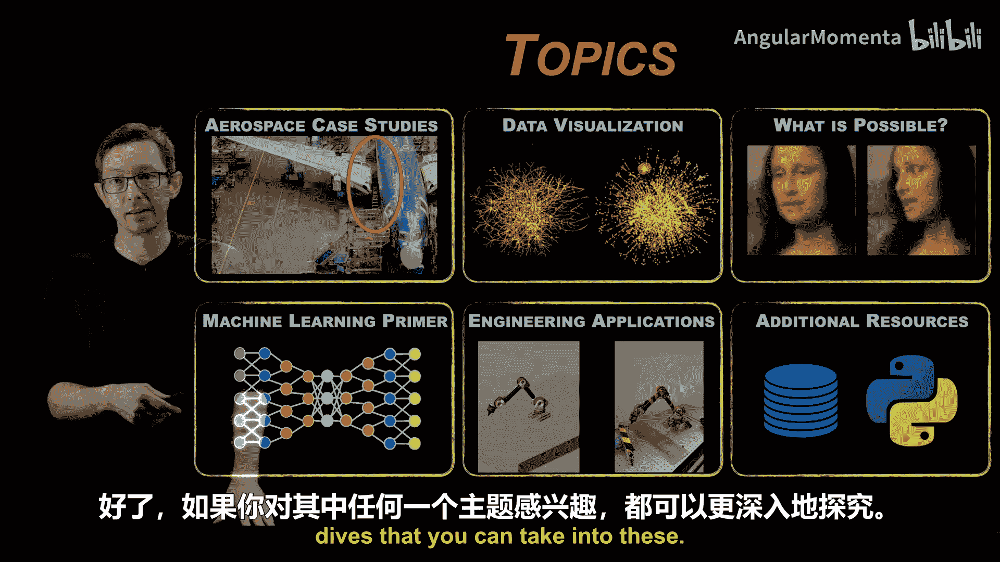
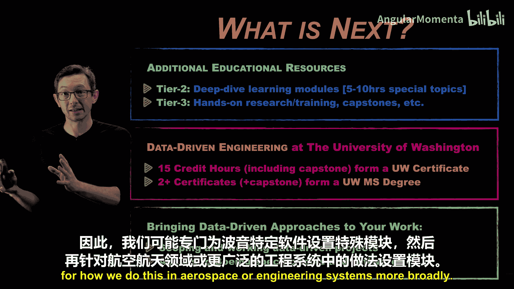
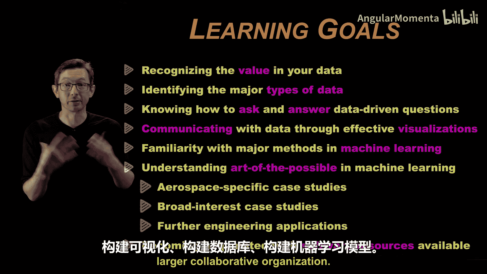
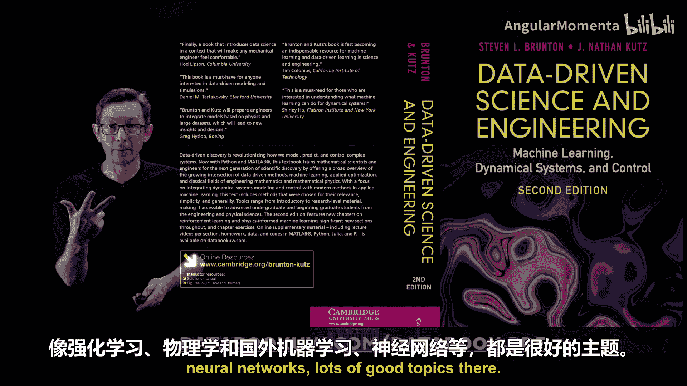
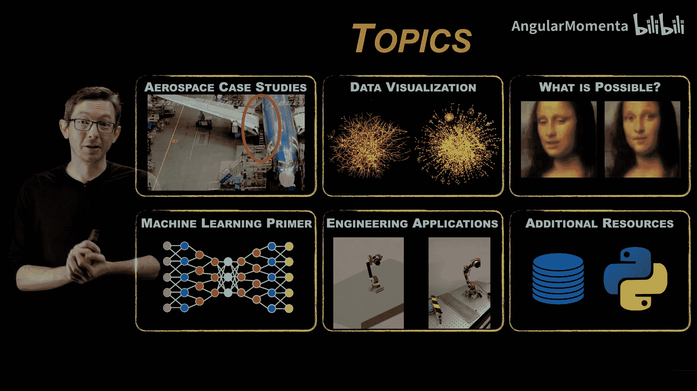

# 001：机器学习和人工智能概述 🚀

在本节课中，我们将学习数据密集型工程的核心概念，特别是机器学习和人工智能在航空航天等工程领域的应用。我们将从整体上了解课程结构、学习目标以及后续的进阶路径。

## 概述

本课程由华盛顿大学与波音公司的工程师合作开发，旨在帮助工程师快速掌握数据可视化、机器学习等现代数据科学技术。课程内容专为航空航天工业量身定制，但其中的原理和方法也广泛适用于其他工程领域。

## 课程结构

我们将按照以下六个主题展开学习，每个主题都旨在构建您对数据驱动工程的理解。

### 1. 行业动机与案例研究

首先，我们将探讨为何当前是航空航天工业与数据密集型工程结合的关键时刻。我们将通过具体的航空航天案例来激发学习兴趣，例如：
*   **先进制造**
*   **飞行测试评估**
*   **飞机机翼设计**

### 2. 数据可视化

数据可视化通常是我们处理数据密集型问题的首要手段。以下是数据可视化的核心作用：
*   **理解数据**：通过可视化探索数据，以理解其内涵。
*   **问答与叙事**：利用数据提出并回答问题，用数据讲述故事。
*   **评估数据价值**：航空航天业拥有大量历史数据（如生产、测试、飞行、维护记录），可视化有助于评估这些数据的潜在价值，并识别可解决的问题。

### 3. 机器学习的可能性

在深入工程细节之前，我们先概览现代机器学习技术的“艺术可能性”。我们将了解机器学习在以下领域取得的革命性成就：
*   **图像科学**
*   **自然语言处理与语音翻译**
*   **音频与图像信号处理**

这为我们理解机器学习如何变革传统领域提供了背景，并启发我们在航空航天科学中寻找应用机会。

### 4. 机器学习的基本原理

了解了机器学习的广泛可能性后，我们将聚焦其内部机制。本节旨在将这个庞大且快速发展的领域分解为易于理解的基本构建模块。我们将学习：
*   **基本数学原理与构建块**
*   **机器学习模型的构建与训练方式**
*   **模型的优势与局限性**

这将帮助我们理解如何将机器学习应用于航空航天工程中的特定数据类型。

### 5. 高级工程应用

接下来，我们将深入探讨机器学习和数据驱动方法在工程领域的当前应用。这不仅仅是图像识别或语言处理，还包括：
*   **机器人臂控制**
*   **新型超级合金设计**

### 6. 实践工具与资源

最后，如果您希望将所学知识融入日常工作，我们将介绍相关的额外资源。这包括：
*   **协作工具**
*   **版本控制**
*   **数据库构建**

本入门模块预计耗时2至4小时，将重点深入讲解数据可视化和机器学习这两个最具实用性和前景的领域。

## 进阶学习路径

本课程是三级学习平台中的第一级（Tier 1），旨在帮助您构建技能并精通数据驱动工程。

**Tier 1：快速概述**
*   **目标**：熟悉术语，理解数据的价值，了解技术的可能与局限、易与难。

**Tier 2：深度专题课程**
在完成Tier 1后，您可以进入Tier 2的深度专题学习。这些是5到10小时的短期课程或训练营，专注于特定主题，例如：
*   `机器学习在流体动力学中的应用`
*   `优化训练营（系列课程）`
*   `高级数据可视化`

**Tier 3：实践应用与研究**
第三级提供实践研究、培训和顶点项目的机会，旨在将Tier 2学到的理念和技能整合到您的实际工作和日常项目中。

华盛顿大学工程学院正在基于此三级模块体系开发学位项目，例如**数据密集型工程**或**航空航天系统高级机器学习与优化**等领域的15学分证书。累积多个证书并完成顶点项目，即可获得华盛顿大学工程学院的硕士学位。

## 学习目标

本入门课程（Tier 1）围绕以下核心学习目标设计：
*   **认识数据价值**：即使您日常工作不直接构建模型，理解所接触数据的价值在协作性企业中也至关重要。
*   **识别主要数据类型**：理解数据并非同质，例如图像数据、声学数据、文本日志等各有特点。
*   **掌握数据问答方法**：学习如何提出并回答数据驱动的问题，讲述数据故事。
*   **进行有效数据可视化沟通**：这对每个人都极为重要。
*   **熟悉主要机器学习方法**：了解各类模型的能力范围，知道在航空航天及广义工程中，什么容易实现，什么更具挑战。
*   **了解相关软件与资源**：熟悉在大型协作组织中用于构建可视化、数据库和机器学习模型的工具与资源。

## 推荐资源与后续内容

课程中涉及的许多机器学习与数据驱动工程的数学基础，可以参考由我和Nathan Kutz撰写的书籍。您可以免费下载PDF版本。我们的许多深度模块也将参考此书中的章节，例如**强化学习**、**物理信息机器学习**、**神经网络**等。

本系列视频将发布在YouTube等平台。除了这些核心课程，还有大量背景材料和扩展主题视频可供学习，以拓宽您的知识面。

## 总结

本节课我们一起了解了数据密集型工程导论课程的全貌、学习路径和核心目标。接下来，我们将从航空航天案例研究开始，逐步构建起对数据可视化、机器学习及其工程应用的系统理解。

感谢您的参与，我们即将开始正式的学习旅程。