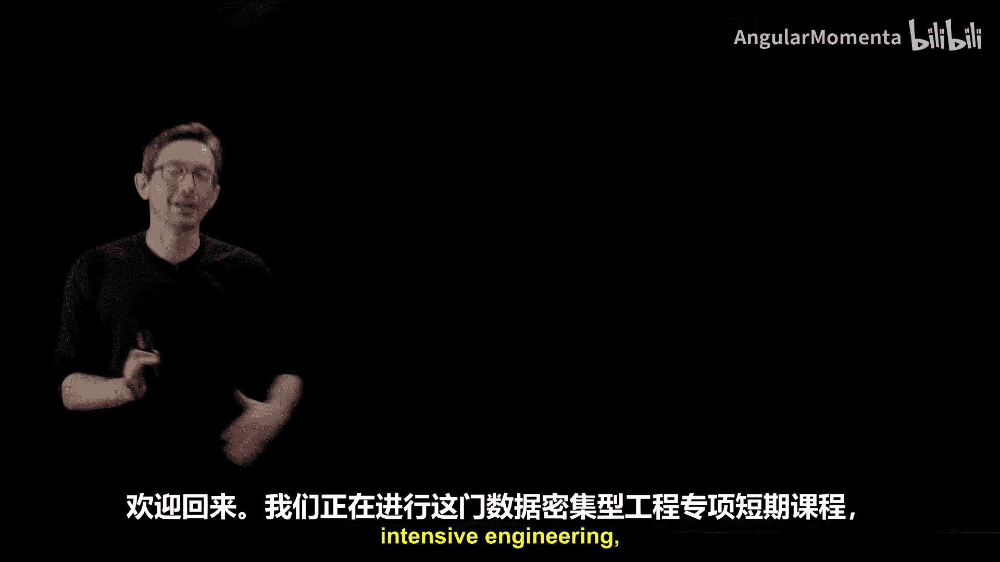
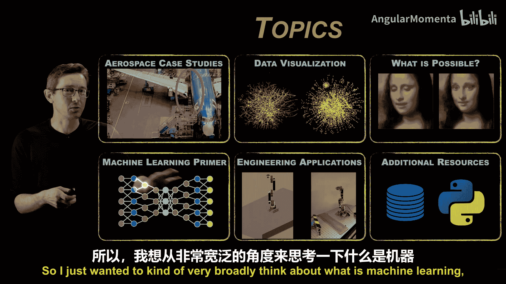
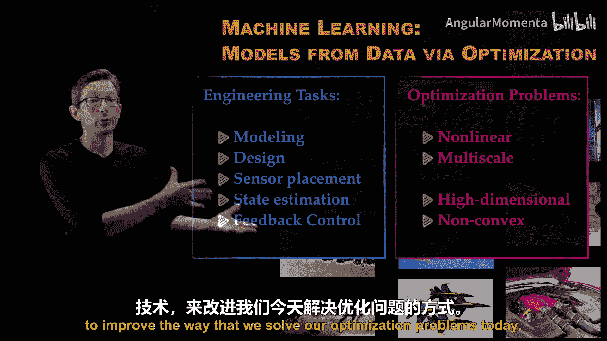
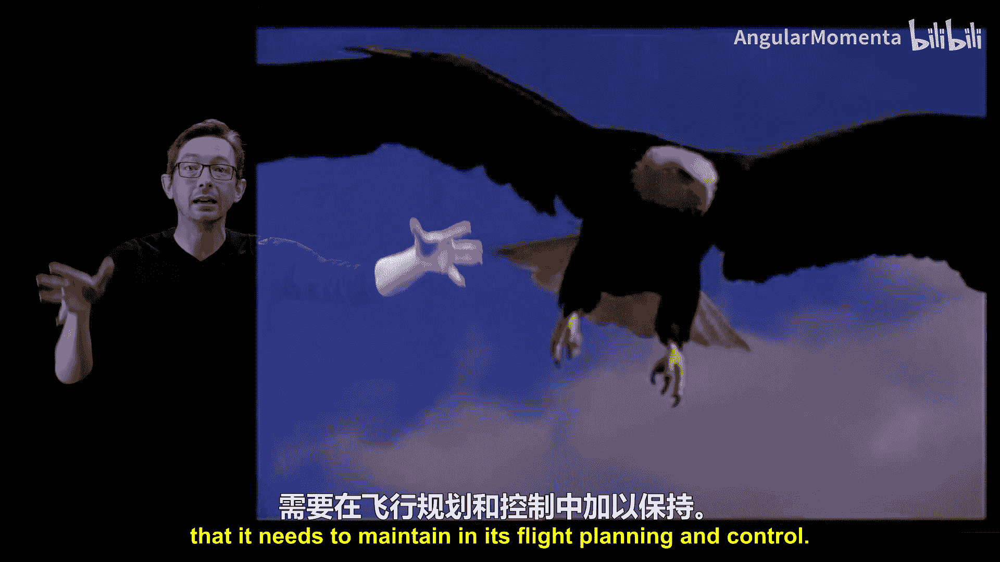
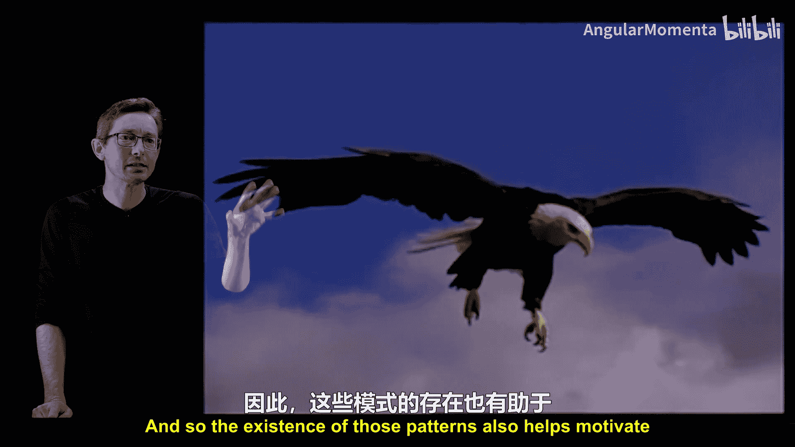

# 002：动机与案例研究 🚀

欢迎回来。我们正在学习这门关于数据密集型工程的精炼短期课程，并讨论六个广泛的主题。在本节中，我们将聚焦于**机器学习**，特别是其在工程和航空航天工程应用中的动机。我们将首先探讨机器学习的本质，然后分析它如何解决工程领域的核心挑战，最后通过几个案例研究来展示其实际应用潜力。

## 什么是机器学习？🤖

机器学习是过去十年间世界发生的重要新事物之一，其发展日新月异。我们需要从宏观上理解什么是机器学习，因为它是一个备受关注的话题。更重要的是，我们需要尽早了解它如何融入工程领域。

虽然以下定义并非100%准确（可能只有90%），但它是一个非常好的工作定义：**机器学习是通过优化或回归算法，从数据中构建模型的过程**。

我这样定义的原因是，它揭开了构建机器学习模型过程的神秘面纱。事实上，在工程领域，我们使用优化和回归从数据中构建模型的历史至少已有七十年，可以追溯到20世纪50年代的卡尔曼滤波器。更现实地说，如果不算上千年，我们也已经这样做了数百年。我们最早的天文模型就是从数据中构建的模型，它们可能没有被写成优化问题，但肯定是根据观测数据调整而来的。最早的作物周期也与恒星和行星的数据，即天体的运动有关。因此，我们一直在做这件事。

这就是我以这种方式提出它的原因，因为它在一定程度上解释了机器学习的本质。然而，在过去的10到20年间，也出现了许多新事物：

*   **数据集规模巨大**：由于先进的传感器、更便宜的存储和数据传输，我们的数据量爆炸式增长，远多于10年或20年前。
*   **应用数学和统计算法更优**：用于执行这些优化和回归任务的算法有了显著进步。
*   **高性能计算架构更强大**：得益于摩尔定律以及图形处理器和张量处理器的发展，计算机速度更快。
*   **大规模开源投资**：大型公司投入数十亿美元，提供免费的开源软件和模型来训练这些机器学习模型。

因此，机器学习既是古老的，也是崭新的。

## 机器学习如何融入工程？🔧

我们日常考虑的许多工程任务，例如建模、设计、优化、传感器布置（例如，如果我想在机翼上放置五个传感器，应该放在哪里才能最好地估计该机翼上的流场？）、状态估计以及最终的反馈控制（例如，通过反馈操纵工程系统的行为），都是非常困难的优化问题。

它们之所以困难，通常是因为所处理系统的物理特性是非线性的。以飞机上的流体流动为例，这是一个非常非线性的物理过程，并且在空间和时间上都是多尺度的。流体流动具有高度的多尺度特性，存在大的相干结构，以及中型、小型乃至微小的涡流。所有这些尺度交织在一起。非线性与多尺度的结合意味着，为这些工程任务求解的优化问题是**高维且非凸的**。

*   **高维**意味着有大量的自由度需要优化。例如，考虑机翼的形状，定义其几何形状可能涉及许多变量，对所有变量进行优化是困难的。
*   **高度非凸**意味着存在许多局部最小值，很难找到全局最优解。

这些粉红色标记的挑战相当艰巨，几十年来一直是我们工程师努力解决的任务，即试图通过求解这些极其困难的优化问题来完成这些任务。但我想指出，**机器学习恰恰在解决这类优化问题上变得非常擅长**，尤其是在数据日益丰富的背景下。例如，训练一个深度神经网络本身就是一个高维非凸优化问题，只要有足够的数据和足够快的计算机，我们就能解决这些问题。因此，我们开始获得利用机器学习解决这些优化问题的工具，这确实令人兴奋。

这将成为一项关键的技术推动力，帮助我们在建模、设计、传感器布置、估计、控制以及更多工程任务中获得先进能力。这些只是我日常思考的任务。我经常思考流体流动，它同样是非线性和多尺度的。但许多其他过程也是如此，例如制造过程：如果你有一个工厂车间，正在建造一个大型航空航天系统，那也是一个在空间和时间上非线性、多尺度的过程，同样会导致高维非凸优化问题。

我想指出的是，航空航天工业本身就是由优化专家组成的。建造一架飞机、一台喷气发动机，这些都是高度严格的多目标优化问题，存在相互竞争的目标和非常严格的设计参数。因此，航空航天工程师通常是优化专家，他们处理的就是这类极具挑战性的非凸、高维、多目标优化问题。我认为，这为航空航天工程领域提供了一个明确的机会，即真正采用这些先进的机器学习技术，以改进我们当前解决优化问题的方式，这非常令人兴奋。

## 为什么我们认为这是可能的？🔍

我们之所以认为在一般系统中构建这些模型是可能的，是因为数据中存在着**模式**。

这几乎是一个普遍真理：如果你有高维数据，并且它尚未被压缩，那么你的数据中就会出现低维模式。无论是瓜达卢佩岛过去的云层形成数据，还是其他数据，都是如此。当我说“低维”时，你可以用肉眼看到非常清晰的周期性模式，可能只需要几个自由度就能建模。尽管模拟这个复杂系统可能需要我们动用顶级超级计算机来解析其中一些尺度。因此，即使这个系统在计算机或电影中的表示方式（这是一部百万像素分辨率的电影）非常高维，但其中确实出现了这些低维模式。这就是所有机器学习和数据密集型科学的基石思想：**你可以从数据中提取这些模式，并将其用于可操作的决策**。

当我们思考一只鹰在飞行时，这也是正确的。生物飞行一直是我整个职业生涯中使用的激励性例子。我喜欢开玩笑说，我会一直使用这个例子，直到我们作为工程师有能力建造出如此先进的东西为止。换句话说，我可能在我的职业生涯余下时间里都会展示这个例子。

这只鹰体现了我们在思考智能系统应具备的能力时所考虑的许多方面。因此，当我们思考机器学习时，我常常喜欢回到生物学习中去寻找灵感和动机，并思考如果我们提高从经验数据中学习的能力，可能会实现什么。

这只鹰正在与一个极其复杂的湍流阵风场互动。它能够熟练地与这种湍流互动，以维持升力、阻力和转弯力矩，从而轻柔地降落在岩石上。我们没有证据表明鹰获得了流体力学博士学位，它也无法获得其尾流中速度场的完整三维测量数据。它所拥有的是一套相当复杂的传感器：翅膀上有非常好的传感器（这些羽毛可以感知流过翅膀的气流）、一个精密的惯性导航和视觉系统，以及它一生的经验，可能还包括其祖先编码化的经验。

因此，这被称为**存在性证明**，它证明了与极其复杂的流场互动并拥有极其先进的、非常鲁棒的性能能力是可能的，而无需测量一切，也未必需要拥有控制系统或流体动力学的博士学位。

我们再次认为这是可能的。尽管模拟这个系统超出了我们的能力范围，即使使用世界上最大的超级计算机，我们也无法模拟流体、机翼的顺应表面、羽毛以及其大脑和身体中的神经肌肉机械控制系统的所有尺度。我们认为鹰能够实施这种极其鲁棒的控制，是因为它不必关心周围所有的流体自由度，以及其翅膀、肌肉和羽毛中的所有自由度。在那个流场和它的身体中，存在着低维模式，这些才是它为了日常生活、维持升力、阻力和转弯而需要注意和关心的东西。在所有它可能经历的流体涡旋中，可能存在着大型前缘涡旋，这是它在飞行规划和控制中需要维持的。

因此，这些模式的存在也有助于激发我们在机器学习中试图实现的目标。

## 从生物学到工程学的启示 🦋

这不仅仅是鹰在飞行。我们华盛顿大学经常从更宏观的角度思考飞行问题，既包括人类设计的航空航天系统（如飞机），也包括像这只蛾子这样的生物系统。这是**天蛾**，大小约与我的手相当。华盛顿大学及世界各地的研究人员已经表明，所有飞行昆虫的翅膀上大约有**20个应变敏感神经元**，它们在日常生活中设计飞行控制器时会用到这些神经元。值得注意的是，这些传感器使蛾子能够对风的阵风干扰做出反应，其反应速度比信息传递到大脑再返回到肩部肌肉的速度还要快。这意味着它正在进行**局部分布式传感**，并在其肩部肌肉中进行**局部计算和控制**，某种程度上绕过了其更高级的大脑功能。

这再次是一个存在性证明，表明你可以在一个极其简单的平台上实现分布式传感、计算和控制，并具有极高的鲁棒性能。

我在这里告诉你的不仅仅是关于蛾子。你将在整个系列中学到的是**如何发现这些模式的数学基础**：为什么这些模式存在，如何识别它们，并利用它们进行高效的稀疏传感、低维计算和先进控制。这些数学算法和基础原理，我们最初是在蓝天研究中学习的，因为我们感兴趣的是昆虫如何飞行。然而，应用于蛾子翅膀上的稀疏传感器布置的数学原理，同样适用于我们设计波音机翼或一般机翼时。

因此，这是一个非常酷的项目集合，始于华盛顿大学，并促成了华盛顿大学与波音公司之间卓有成效的合作。我们使用完全相同的传感器技术，来优化波音公司在制造飞机机翼、机身以及将它们连接在一起时的流程。你将会听到更多关于这个具体航空航天案例研究的内容。我只是想以此说明，我们对这个机器学习过程的基础数学和理解越深入，我们就能做得越多，并将其转化到航空航天和一般工程系统中。这是一个很酷的成功故事，你很快就会听到。

具体来说，Cth Amanohar（这可能是某个过程或项目的名称，此处保留原文）是我们使用那种蛾子传感器技术改进的过程的艺术再现。Crithha（可能指代某人）将带你了解该过程的所有步骤，以及这项技术是如何构建并转化为波音公司实际生产技术的，从而为他们节省了大量资金和时间，帮助他们利用现有的传感技术制造高质量的飞机。

## 总结 📚

本节课中，我们一起学习了机器学习在数据密集型工程中的应用动机。

1.  **机器学习的本质**：我们将其定义为通过优化或回归从数据中构建模型的过程，这既是历史悠久的实践，也因现代大数据、先进算法和强大算力而焕发新生。
2.  **工程挑战与机遇**：工程中的核心任务（如建模、设计、控制）常归结为高维非凸优化问题，而这正是现代机器学习擅长的领域。航空航天领域作为优化专家的聚集地，尤其适合引入机器学习来提升能力。
3.  **模式的普遍性**：数据中普遍存在低维模式，这为机器学习提供了可行性。生物系统（如鹰和蛾子）的存在性证明表明，通过关注关键模式而非所有细节，可以实现鲁棒、高效的控制。
4.  **从研究到应用**：对模式发现的基础数学研究（如稀疏传感）不仅能解释生物现象，也能直接转化为工程解决方案，例如优化航空航天制造流程，展示了基础研究与产业应用之间的紧密联系。

总之，利用日益增长的数据、更优的算法和更高性能的计算架构来构建模型，并将其用于设计、生产、测试和认证航空航天系统，存在着巨大的机遇。这一切即将展开，令人非常兴奋。