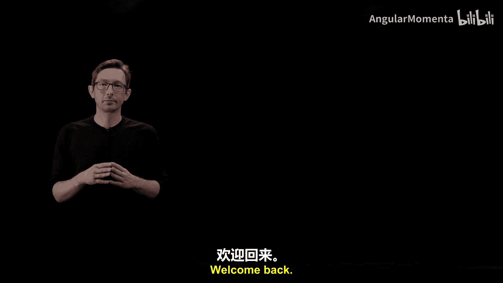
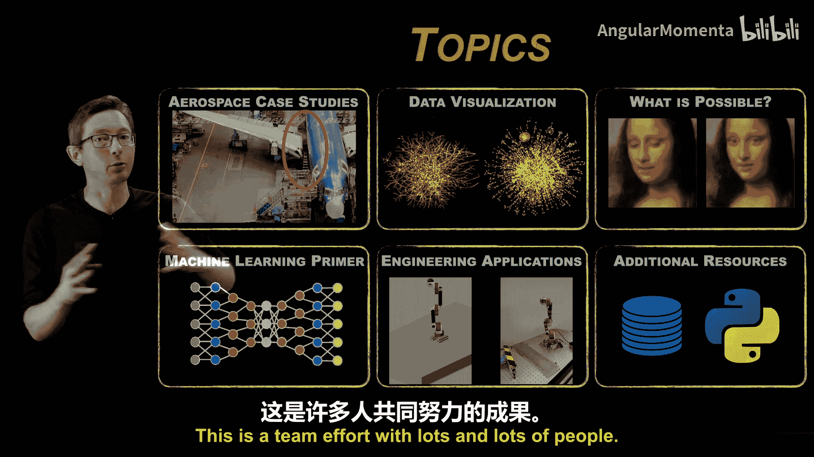
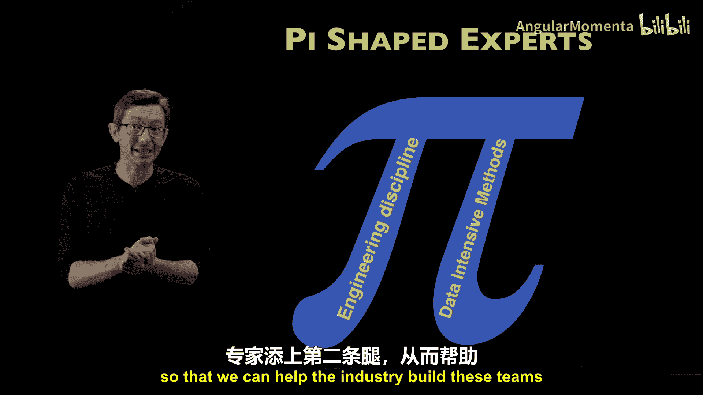
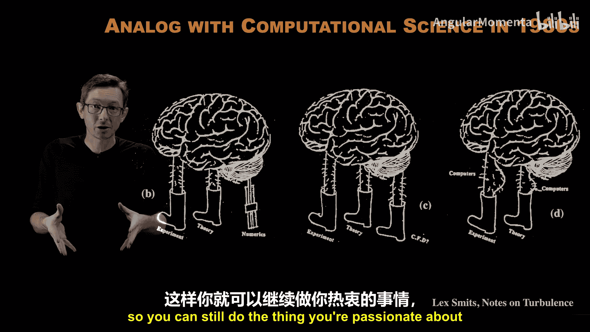
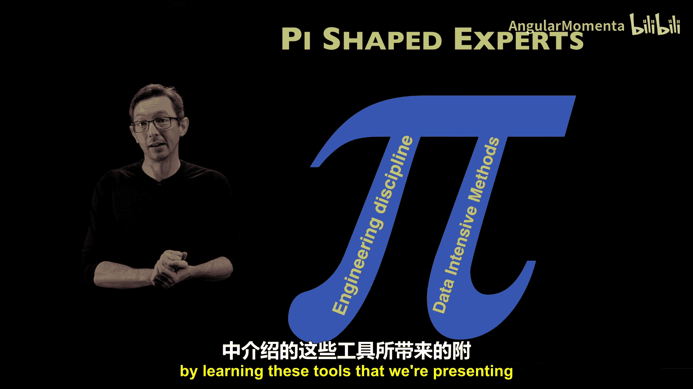

# 003：π形工程师团队

在本节课程中，我们将探讨数据密集型工程在大型协作环境中的角色，并介绍一种新型的专家团队模型——π形工程师团队。我们将看到，数据科学家和工程师的深度融合，正如同过去计算科学融入传统学科一样，将极大地增强我们解决问题的能力。

## 🚀 团队协作中的数据科学

上一节我们介绍了数据密集型工程的基本概念。本节中我们来看看，在航空航天这类高度复杂的系统工程领域，数据科学如何融入团队协作。

航空航天工程不是单打独斗的领域。你无法独自在地下室建造一个大型航空航天系统。这是一个需要大量人员共同努力的团队工作。因此，我们需要思考，数据科学和数据密集型工程如何融入这个更大的协作环境。

## 🖖 将“斯波克”置于舰桥

在华盛顿大学，我们有一个称为“将斯波克置于舰桥”的例子。对于《星际迷航》爱好者来说，你们知道一个有趣之处在于，他们的首席科学官斯波克并不在飞船的底层进行工程维护，比如修理引擎。斯波克在舰桥上与柯克舰长一起做出决策，提供他作为科学家的专业知识。这就是我们的核心理念：我们希望数据密集型工程师不仅仅是需要时才被呼叫的、位于某处的数据科学农场中的成员。我们希望数据科学家就在解决问题的团队之中。

我们讨论的是组建由拥有经典工程经验和数据密集型经验的问题解决者组成的团队。

## 🔄 与控制理论的类比

这与过去四十年的控制理论发展有一个有趣的类比。在过去，当你建造一个大型航空航天系统时，你会先把它造出来。组装完成后，并非所有系统都能按设计工作，然后你会请控制工程师来“修复”这些问题。在现代，控制工程师从早期设计阶段就参与其中，以确保这些问题根本不会发生，系统从一开始就被设计成可控制的。这节省了大量时间和金钱，并最终使我们能够获得性能更高、鲁棒性更强的产品。将数据科学家纳入这些决策循环中，也有明确的相似之处。

## π 📐 形专家 vs. T 形专家

我们经常思考所谓的 **π形专家**。

这与经典的 **T形专家** 形成对比。工程院系通常培养、航空航天公司通常雇佣的是T形专家。你在某个工程学科（如材料、空气动力学或控制系统）拥有深厚的领域知识，同时你也有广泛的涉猎，了解许多邻近领域。这样你就可以与同事交流并组建团队共同解决问题，这就是传统的T形专家。

如今，越来越需要 **π形专家**，即你在数据密集型方法（如数据可视化或机器学习）中拥有第二条专业知识支柱。

拥有这两大支柱，使你能够组建由同时具备经典工程专业知识和数据密集型专业知识的专家组成的强大团队。因此，我们开发这门课程，本质上就是为了帮助为π形专家增添这第二条支柱，从而帮助行业组建那些能将“斯波克置于舰桥”决策过程中的团队。

## 💻 与计算科学兴起的类比

这与20世纪80年代计算科学的兴起有相似之处。当时计算机开始普及并变得足够便宜，人们广泛讨论计算机将如何融入劳动力队伍和我们的工作方式。这是来自莱克斯·史密斯关于湍流的笔记，他特别在流体力学或湍流研究领域阐述了计算机将如何改变我们的工作。在那之前，该领域一直依赖于实验和理论这两大支柱。

问题是，数值计算会成为支撑这个框架的“拐杖”，还是会成为看起来非常笨拙的“第三条腿”？结论是，计算机首先不会取代实验和理论，也不会成为拐杖或第三条腿。它们本质上将成为让你能更好地完成现有工作的“肌肉”。它们将为现有的实验和理论领域增添能力。

我认为，这与机器学习和数据密集型方法的兴起绝对有相似之处。它们不会取代我们今天所做的工作，不会取代仿真，不会取代实验，也不会取代理论。它们将增强我们的能力，因为所有这些领域都会产生数据，而机器学习和数据密集型科学总体上是一个理解和从数据中提取价值的统一框架。它使我们能够以一种以前无法做到的方式，将实验和仿真中的数据联系起来，从而带来许多新的机遇。

但就像20世纪80年代有人声称这将取代实验、我们再也不会做风洞测试一样，这从未发生。我们仍然进行风洞测试并运行仿真，它们协同工作。机器学习不会取代这些经典领域，它们将协同运行，帮助我们做到以前无法做到的事情。

## 🛠️ 成为未来的基础技能

就像20世纪80年代开始时，大型组织实际上必须雇佣计算机科学家来运行计算机系统。今天，我们期望所有工程师都具备基本的计算机操作能力来完成日常工作。无论你是否是计算机科学家，即使你进行实验，你仍然需要知道如何使用计算机来收集数据并进行后处理和分析。

同样的事情也将发生在机器学习上。这将迅速成为一套我们所有人都被期望具备半熟练程度的标准日常工具集。我们仍然会有机器学习专家来开发系统并真正推动极限，但我们所有人都将需要机器学习这些基本“肌肉”来完成日常工作，就在不久的将来。

因此，这也是我们在这里真正关注的事情之一：如何尽快建立这种基本熟练度，以便你仍然可以做你热爱的事情、你真正想做的事情，但同时拥有数据可视化、机器学习或某些数据密集型工程领域的额外熟练度和专业知识。

## 📝 本节总结

本节课中，我们一起学习了数据密集型工程在团队协作中的重要性。我们引入了“将斯波克置于舰桥”的理念，强调数据科学家应深度融入决策团队。通过对比传统的T形专家和新兴的π形专家模型，我们理解了同时掌握领域知识和数据技能的复合型人才的价值。最后，通过类比计算科学的历史发展，我们认识到机器学习不会取代传统工程方法，而是作为强大的增强工具，未来将成为所有工程师的基础技能。掌握这些工具，将帮助你在热爱的领域做得更好。

