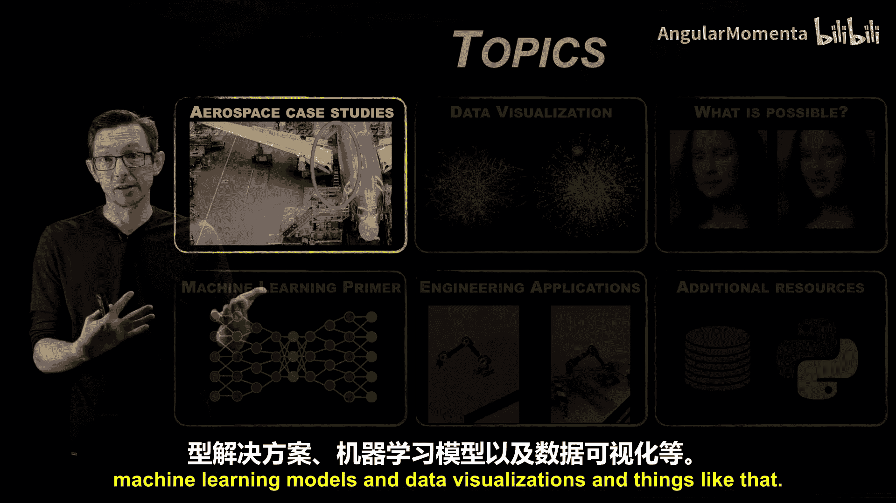
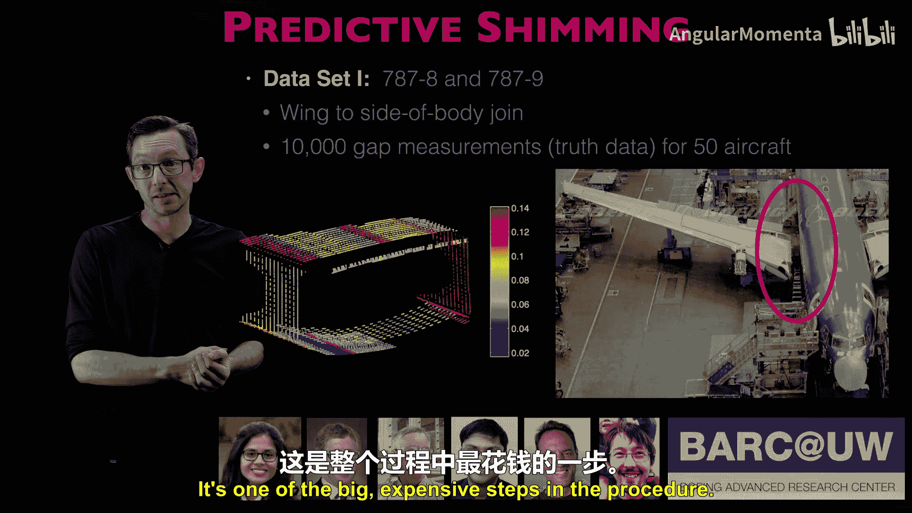

# 004：案例研究 - 飞机装配的预测垫片（波音与华盛顿大学合作）🚀

在本节课中，我们将通过一个具体的工业案例，探讨数据可视化、机器学习与数据驱动方法如何解决复杂的工程问题。我们将深入了解波音公司与华盛顿大学合作，在飞机装配中应用预测垫片技术的成功故事。




上一节我们介绍了数据驱动方法的基本概念，本节中我们来看看一个将这些概念成功应用于航空航天制造领域的真实案例。

## 案例背景 ✈️

该合作项目在华盛顿大学的BAR实验室进行。其核心思想是解决飞机装配中的一个长期挑战。在飞机制造中，所有零件都按照极其严格的公差制造，精度非常高。然而，当将这些零件组装成大型结构（如波音787或777的机翼）时，微小的误差会累积起来，导致结构连接处出现缝隙。

这些缝隙本身不一定是安全问题，因为飞机结构设计通常留有很高的安全裕度。但为了获得最佳的空气动力学性能、良好的疲劳寿命以及尽可能长的材料使用寿命，需要尽可能消除这些缝隙。传统方法是在装配时，使用垫片来填充这些缝隙。

## 传统与现代方法的挑战 ⏳

以下是传统与现代测量方法及其局限性的对比：

*   **传统方法（如20世纪70年代）**：需要“干装配”飞机，即先将零件组装起来，由工人进入内部手动测量所有缝隙并记录。然后拆卸飞机，根据测量数据为每个缝隙位置手工制作垫片。这相当于将飞机建造了两次，成本极高。
*   **现代数字化方法**：使用昂贵的计量设备测量所有零件，获得点云数据，然后在计算机中进行数字化的“干装配”以估算缝隙。这比物理干装配节省了大量时间，但仍然需要在制造关键路径上增加数小时的测量和超级计算机模拟时间，成本依然很高。

## 数据驱动的解决方案 💡

通过与波音公司和华盛顿大学的研究人员合作，我们采用了标准的数据科学方法来解决这个问题。

我们分析了50架已制造并经过细致测量的飞机的垫片缝隙数据。研究发现，由于制造工艺具有高度可重复性，这些缝隙的分布存在可识别的**模式**。

基于此，我们设计了一种**算法**来学习这些模式。该算法的核心公式可以概括为：利用历史数据中的模式，预测新飞机的缝隙分布，从而显著减少未来新飞机所需的测量点数量。

```python
# 概念性代码：利用历史模式预测新测量需求
def predict_required_measurements(historical_gap_patterns, new_aircraft_part_data):
    """
    基于历史缝隙模式，优化新飞机部件的测量方案。
    :param historical_gap_patterns: 从多架飞机数据中学习到的模式
    :param new_aircraft_part_data: 新飞机部件的部分初始测量数据
    :return: 优化的测量点位置列表，用于精确表征缝隙
    """
    # 1. 将新数据与历史模式进行匹配
    matched_pattern = find_closest_pattern(historical_gap_patterns, new_aircraft_part_data)
    # 2. 根据匹配到的模式，推断出信息量最大的关键测量位置
    optimal_sensor_locations = calculate_optimal_locations(matched_pattern)
    return optimal_sensor_locations
```

这一方案带来了根本性的改变。对于生产线上的新飞机，现在只需进行更少的测量。原本需要超级计算机完成的“干装配”模拟，现在可以在更便宜、更快的计算机上完成。这为每架飞机的生产节省了大量时间，因为测量点更少，计算量也更小。

## 跨领域的技术迁移 🦋

这个解决方案并非凭空想象。其核心数学原理最早在研究昆虫飞行的背景下得到探索。例如，飞蛾、果蝇等昆虫的翅膀上具有应变敏感神经元，它们利用这些神经元来感知和推断空气动力学环境的关键特征。



由于流经昆虫翅膀的流体存在模式，昆虫无需测量翅膀上的每个点，而是选择能提供最关键信息的特定位置进行感知。寻找这些模式并利用它们来设计**最优稀疏传感器布局**的数学算法，可以直接迁移到飞机制造场景中。

这正是机器学习和数据驱动工程的魅力之一：其数学基础在不同问题中是相通的。在一个领域（如生物学）取得的突破，常常能直接转化为另一个完全不同的应用（如从昆虫翅膀到波音机翼）。

## 总结 📝

本节课中我们一起学习了预测垫片技术在飞机装配中的应用案例。这个波音与华盛顿大学的合作项目成功表明：
1.  通过分析历史制造数据，可以发现其中存在的、可重复的**模式**。
2.  利用机器学习算法提取这些模式，能够**优化**未来的生产流程，例如减少必需的测量点数量。
3.  数据驱动解决方案能够显著**节省时间和成本**，将原本耗时数小时的关键路径工序大幅压缩。
4.  基础科学的原理（如生物感知中的稀疏传感）与数学算法，具有强大的**跨领域迁移能力**，能够解决看似不相关的工业难题。

这个案例是数据密集型工程如何推动工业制造进步的一个典范。