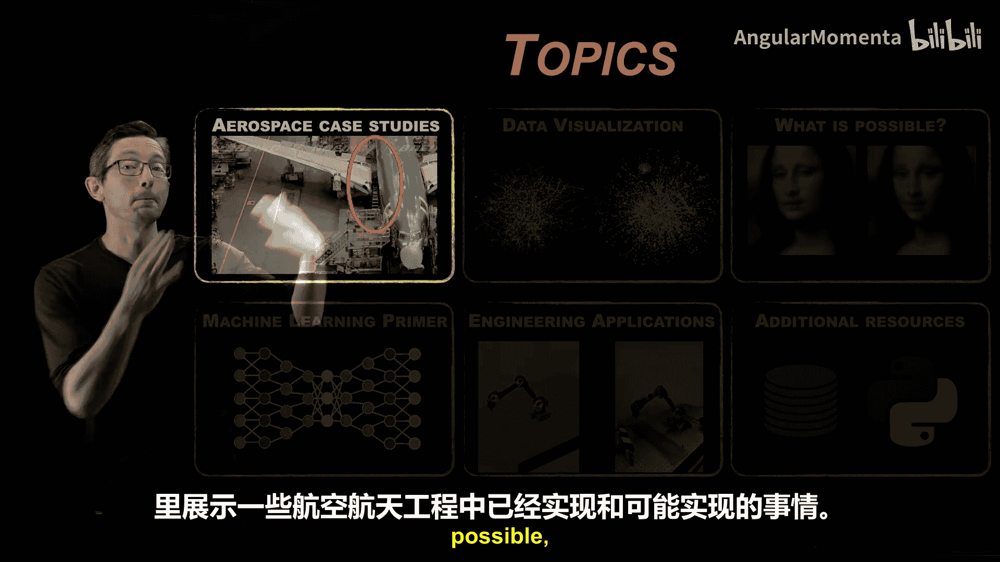
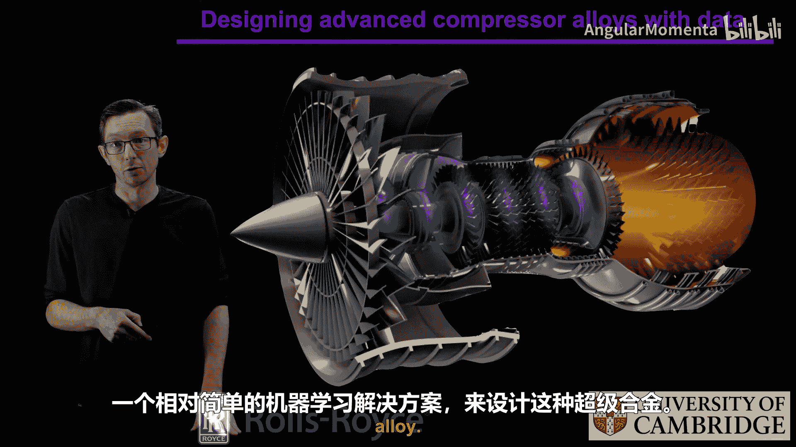
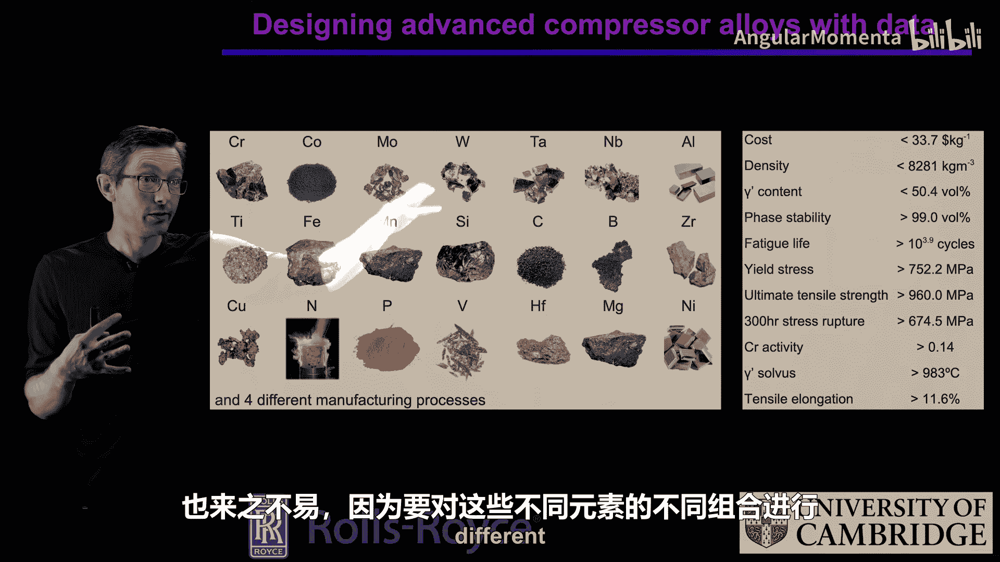
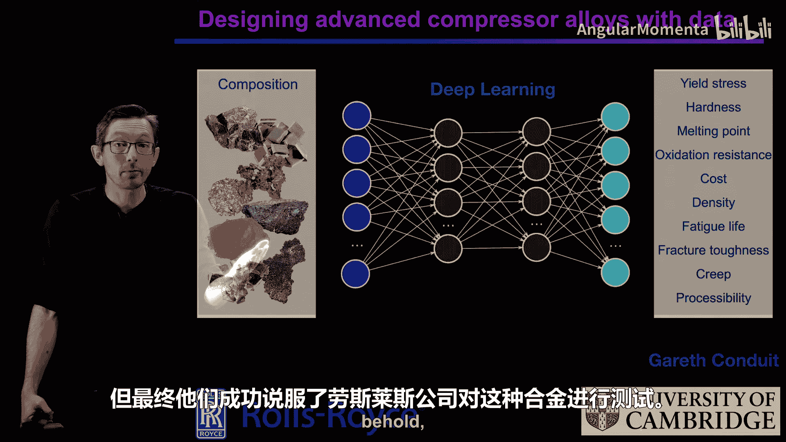
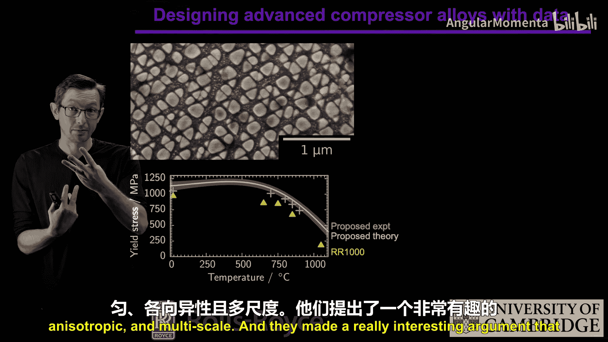
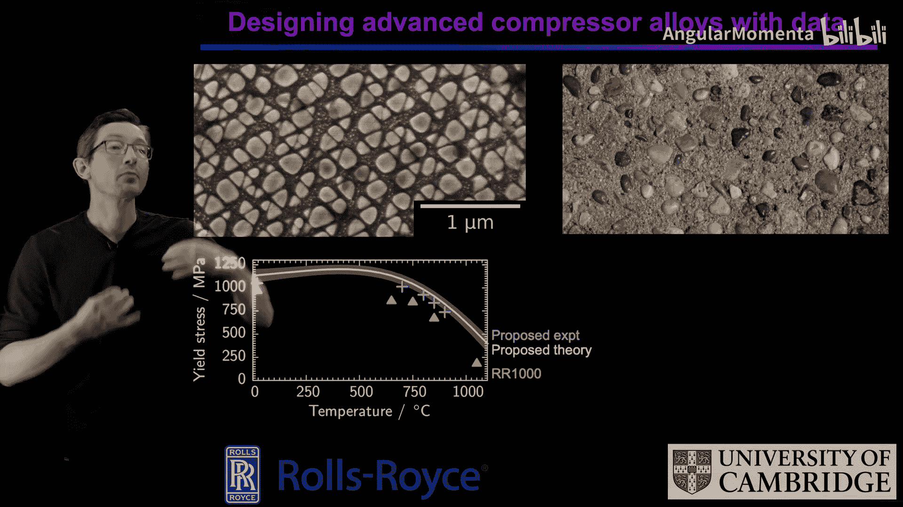

# 005：材料科学案例研究——用机器学习设计超级合金 🧪

在本节课中，我们将通过一个航空航天领域的案例研究，探讨如何利用数据驱动的方法解决复杂的工程问题。我们将重点关注罗尔斯·罗伊斯公司与剑桥大学合作，使用机器学习设计新型超级合金的实例。这个案例展示了如何利用历史数据构建模型，并通过优化算法发现性能更优的新材料。

上一节我们介绍了数据密集型工程在航空航天领域的广阔前景，本节中我们来看看一个具体的材料科学应用案例。

## 案例背景：喷气发动机的挑战 ✈️

现代喷气发动机的压气机叶片需要在极高温度下工作，以实现高效率的能量转换。这些温度通常**高于叶片材料本身的熔点**。为了防止叶片熔化，工程师采用了复杂的主动冷却技术，例如在叶片内部制造微型冷却通道，利用燃料进行冷却。然而，这种方案成本高昂、维护复杂且可靠性面临挑战。

因此，更理想的解决方案是**设计一种具有更高熔点的合金**。但传统冶金学和材料科学的研究表明，开发一种熔点能提升10%的新型超级合金极其困难。

## 机器学习解决方案的引入 🤖

罗尔斯·罗伊斯公司与剑桥大学（研究团队名为Conduit）的合作项目，引入了一种相对简单的机器学习方法来解决这一难题。

其核心思想是：合金由多种元素以特定比例构成，并经过特定的制造工艺（如熔炼、混合、按特定温度曲线冷却和退火）处理。这个过程决定了合金的最终性能，包括熔点、疲劳寿命、屈服应力、成本等。

以下是该方法的输入与输出关系：

**输入 (X):**
*   元素组成（多种元素的配比）
*   制造工艺参数（如退火温度曲线）

**输出 (Y):**
*   材料性能（熔点、屈服应力、疲劳寿命等）

在过去的几十年里，工业界和学术界已经测试了**大量不同成分和工艺的合金**，并记录了它们的性能数据。这些数据构成了一个宝贵但获取成本高昂的训练数据集。

## 构建与优化代理模型 🔬

Conduit团队利用这些历史数据，训练了一个机器学习模型（例如神经网络），来建立从**合金配方与工艺**到**材料性能**之间的映射关系。

这个模型本质上是一个**代理模型**。与在现实中花费数万英镑制造并测试一种新合金相比，在计算机上运行这个代理模型的成本可以忽略不计。

只要模型足够准确，能够忠实反映真实世界的物理过程，我们就可以在这个模型上进行优化。例如，我们可以设定优化目标为**最大化熔点**，同时保证其他性能参数（如屈服应力）在可接受范围内。

通过优化算法在代理模型中搜索，可以得到一个**候选的合金配方**。这个配方在模型中预测具有更优的性能。

## 从虚拟到现实的验证 ✅

通过代理模型优化得到的候选配方，并不保证在现实中一定表现最佳。因此，必须进行实际的制造和测试。

Conduit团队成功说服罗尔斯·罗伊斯公司测试了他们通过机器学习发现的新合金配方。这种新合金使用了比传统配方更多的元素，并采用了独特的退火工艺。

测试结果令人振奋：新合金在**熔点和屈服应力**这两个关键性能指标上，均超越了罗尔斯·罗伊斯公司之前最好的合金RR1000。

## 微观结构与性能分析 🔍

研究人员进一步分析了新合金的微观结构，以理解其性能优异的原因。他们发现，这种合金具有**各向异性、多尺度和异质性**的特征。

有趣的是，这些特征与生物超材料（如指甲、牙齿、头发）的特性相似。研究人员提出了一个生动的类比：这种结构就像混凝土中的坚硬石子，能够阻止裂纹（或类比为热应力）的传播。对于这种合金，其异质性和多尺度的微观结构有效地**阻碍了热量的传播**，从而使其能在更高温度下保持固态而不熔化。

## 案例总结与启示 💡

本节课中我们一起学习了利用机器学习设计超级合金的完整流程：

1.  **明确任务**：目标是找到具有更高熔点的合金材料。
2.  **利用数据**：基于大量已测试合金的历史成分、工艺与性能数据。
3.  **构建代理模型**：训练一个能快速预测新材料性能的机器学习模型，替代昂贵耗时的物理实验。
4.  **模型内优化**：在代理模型上运行优化算法，寻找性能更优的候选配方。
5.  **现实验证与分析**：制造并测试候选配方，并通过微观分析理解其优异性能的原理。

这个案例充分展示了机器学习在材料科学等领域的巨大潜力。在这些领域中，材料的性能上限是一个开放性问题，其设计空间是高维且非凸的。利用机器学习工具和历史数据，我们可以更高效地在这个复杂空间中导航和优化，从而加速新材料的发现与创新进程。