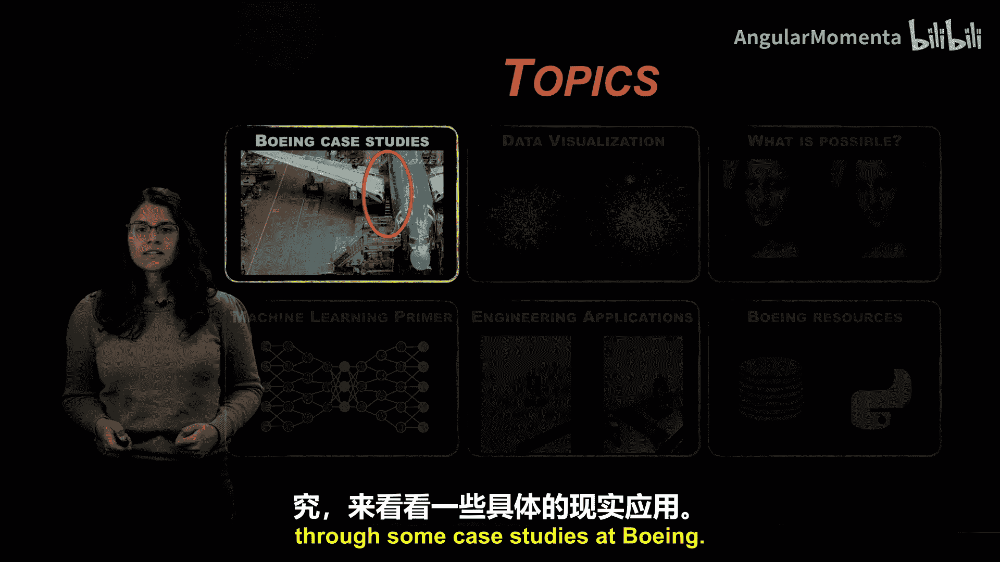
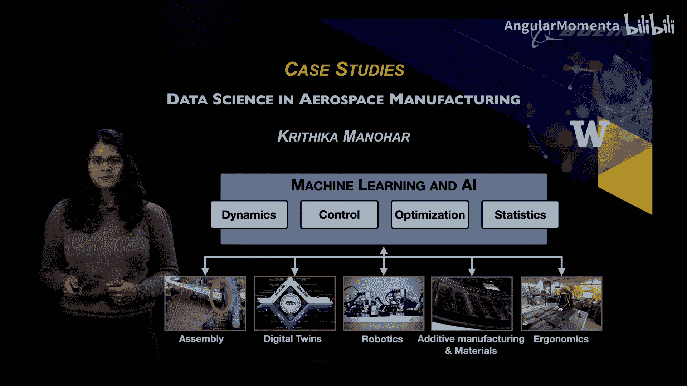
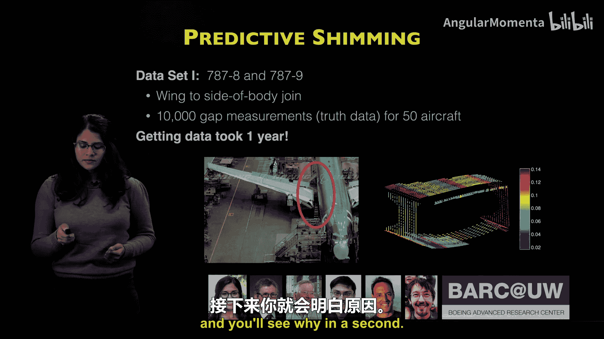
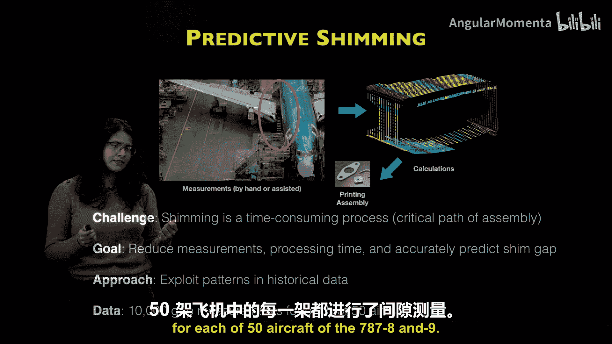
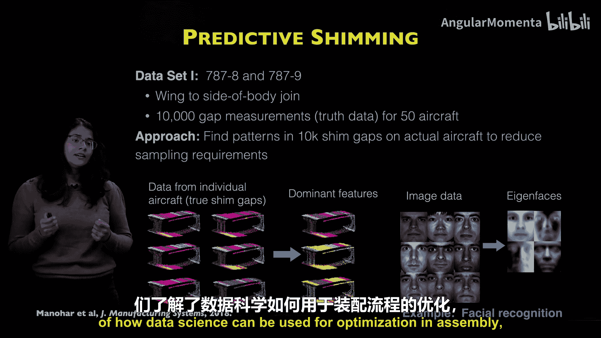
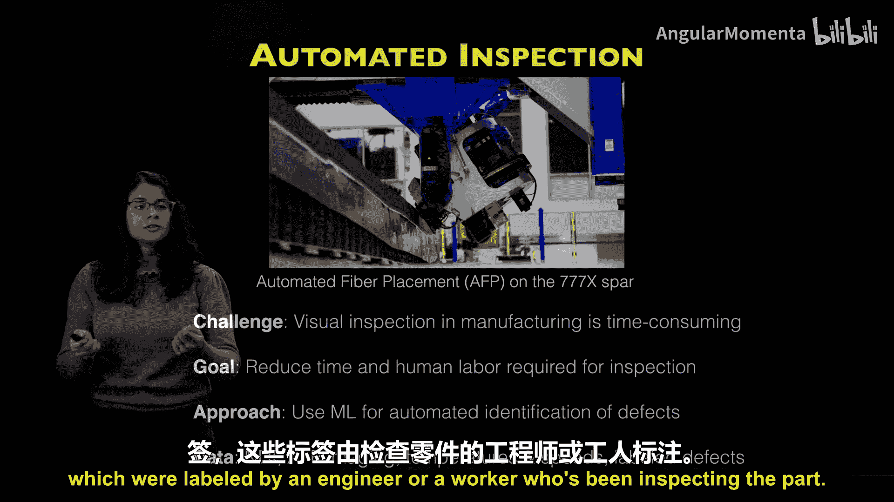
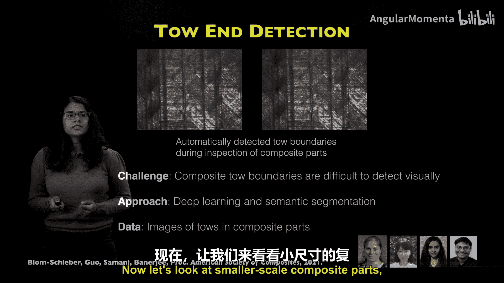
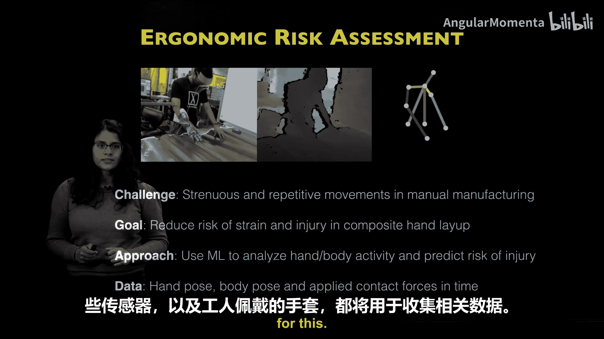
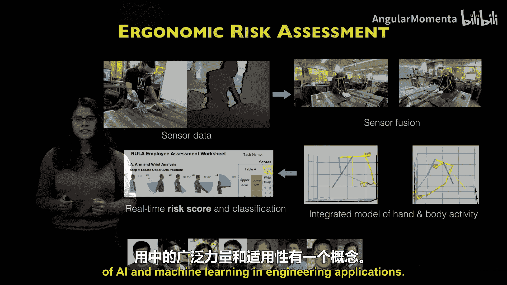
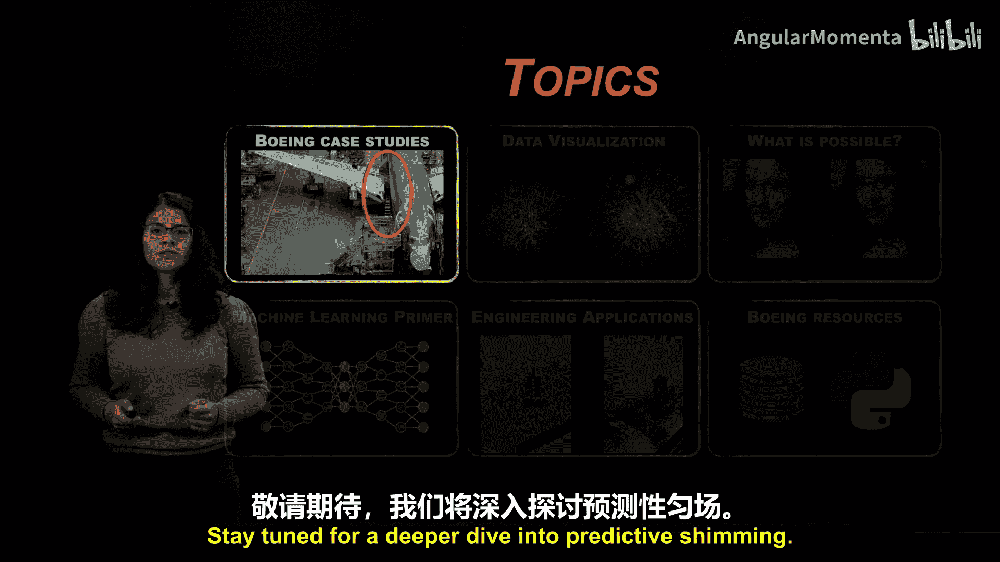

# 006：波音案例研究与克里希卡·马诺哈尔教授

在本节课中，我们将通过波音公司的具体案例研究，了解机器学习和数据科学在复杂工程过程中的实际应用。我们将探讨预测性垫片、自动化检测以及人体工程学风险分析等场景。

## 概述

上一节我们介绍了机器学习和数据科学的基础概念。本节中，我们将跟随克里希卡·马诺哈尔教授，看看这些技术如何被应用于波音公司，对复杂的工程过程进行建模、控制和优化。这些应用涵盖了装配与复合材料制造、检测与自动化，以及人体工程学与安全等领域。

## 案例一：预测性垫片

首先，我们来了解什么是垫片。垫片是制造出来的填充部件，用于填补制造过程中连接部件之间产生的间隙。

这些间隙的产生，源于复合材料结构的巨大规模和复杂性，以及它们通常是分开制造，并在装配前经历各种运输和检测过程的事实。

这里展示的是机翼与机身连接处的一个例子。它形成了一个盒状结构，如右图所示。图中显示了来自787-8和-9机型的10,000个间隙测量数据，我们拥有每种机型50架飞机的数据。需要强调的是，这个数据收集过程非常具有挑战性，耗时一年。稍后您会明白原因。

### 预测性垫片中的“预测”部分

由于需要进行测量，垫片工艺是一个耗时的过程，并且这个测量过程处于装配的关键路径上。因此，历史上，这通常是通过将两个部件进行干式装配、测量间隙、制造垫片，然后再将部件与垫片重新组装在一起来完成的。这意味着飞机基本上被建造了两次。

近年来，人们开始使用计量学和机器人扫描来生成两个部件的点云数据，这些数据需要经过计算量极大的对齐和数据处理程序，才能得到您在图右侧看到的漂亮的10,000个点的间隙分布图。图中的每个点代表一个间隙测量值，红色表示最大的间隙，蓝色表示最小的间隙。

我们的目标是通过利用历史数据中的模式，来减少这种测量和处理时间。我们拥有50架飞机中每一架的这些间隙测量数据。

### 数据处理与降维

为了预览我们使用的一些数据处理工具，我们获取这些原始数据，并使用鲁棒主成分分析等先进工具，提取数据中的主要特征，并根据它们在数据中的贡献或重要性进行排序。

这项技术与图像处理和面部识别应用非常相似。在这些应用中，高维图像通常被降维到由重要元素组成的特征空间。例如，在人脸识别中，每张脸都由少量特征脸构成，其数量远少于图像中的像素数。

当我们进行这种降维时，它使我们能够优化并减少重建每个间隙分布所需的测量次数。事实证明，使用这种降维方法，我们能够将测量次数减少10倍，同时仍能保持精度，并将99%的未测量垫片间隙重建到波音制造公差范围内。这同样是在测量次数减少10倍的情况下实现的。

## 案例二：自动化检测

现在，我们已经了解了数据科学如何用于装配优化。让我们回到流程中的另一个步骤：检测。

这些大型复合材料结构通常使用先进的纤维铺放技术（如自动纤维铺放）进行铺层，如图所示。这些大规模的复合材料铺层程序需要非常仔细地进行质量检测。这个过程非常耗时，并且通常对于波音的工人和工程师来说，手动完成过于困难。

我们的目标是减少检测这些大型部件所需的时间、人力以及可能导致的疲劳。这是一套用于自动识别缺陷的机器学习方法，接下来我将向您展示一个具体的例子。

### 数据来源与检测示例

这类自动化检测方法的数据可以来自多种来源，包括无损检测或成像、铺层过程的视频或热成像图像，以及自动纤维铺放的传感器数据，如温度、速度、压力和部件几何形状等。我们还可以利用这些信息来判断部件的质量。数据也可能包括由检查部件的工程师或工人标记的有缺陷和无缺陷部件的标签。

其中一个极其困难的检测程序例子是纤维束端头检测。纤维束是这些复合材料的纤维束，在检测中我们通常需要知道边缘落在哪里。从上面显示的图像可以看出，这些复合材料纤维束的边界很难通过视觉检测，并且成像产生的伪影可能与实际的纤维束端头混淆。您可以看到，通过右侧的红线，被识别的纤维束端头被正确显示出来。

实际上，我们可以从复合材料部件中数百上千张纤维束图像以及这些纤维束端头的一些标签中学习，并应用深度学习和语义分割工具来自动生成这些纤维束端头检测线。

## 案例三：人体工程学与安全风险分析

现在，您已经了解了机器学习如何用于检测。接下来，让我们看看规模较小的复合材料部件，这些部件仍然需要波音工人和技术人员进行大量的手动铺层、装配和制造工作。

这些手动过程，如复合材料手工铺层、铆接、铺覆和安装，通常涉及费力且重复的动作。这些动作是导致手部、腕部潜在劳损和压力性损伤以及其他肌肉骨骼疾病的已知原因。

根据美国职业安全与健康管理局的数据，与员工流动、生产力损失和工伤赔偿相关的直接和间接成本预计每年在整个工业领域总计达1200亿美元。因此，迫切需要降低这些过程中的劳损和伤害风险，并能够调整这些流程，使其对工人的伤害更小或产生伤害的风险更低。

我们的目标是开发一种数据驱动的方法，分析工人在执行这些任务时的手部和身体活动，并预测伤害风险。我们特别关注复合材料铺层，我们从波音技术人员那里收集手部和身体姿势数据以及随时间变化的施加接触力。所有这些传感器，包括运动跟踪传感器以及工人佩戴的手套，都将用于收集此项目的数据。

### 方法论概述

以下是该方法的概述。传感器使用安装在工人头上的动作捕捉设备、压力感应手套以及两个用于估计身体姿势的网络摄像头，来收集手部和身体姿势的原始数据。

我们对所有这些原始传感器数据进行传感器融合，以获得随时间整合的手部和身体活动模型。然后，该模型用于实时数字风险评分，这个数字代表人体工程学风险的概率，并将这种人体工程学风险分类为高、中、低风险级别。

这是使用既定的人体工程学技术完成的，例如RULA（快速上肢评估），该技术目前用于工业中评估流程的安全性。它提取关节角度、背部弯曲角度、颈部扭转和扭矩等特征以生成分数。

因此，我们拥有一个完全数据驱动的方法来评估人体工程学风险。

## 总结

本节课中，我们一起学习了波音公司如何将人工智能和机器学习应用于工程实践。我们探讨了三个具体案例：利用数据降维优化装配流程的**预测性垫片**、应用深度学习进行**自动化缺陷检测**，以及通过传感器融合实现**人体工程学风险实时评估**。这些案例展示了数据科学在提升效率、保证质量和保障工人安全方面的强大能力与广泛适用性。希望这能让您对AI和机器学习在工程应用中的广泛能力和适用性有一个初步的认识。