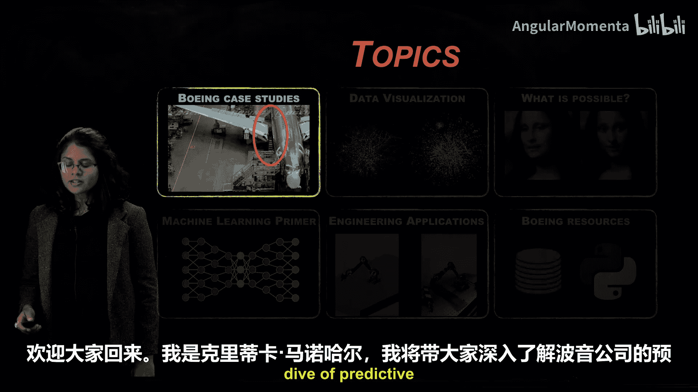
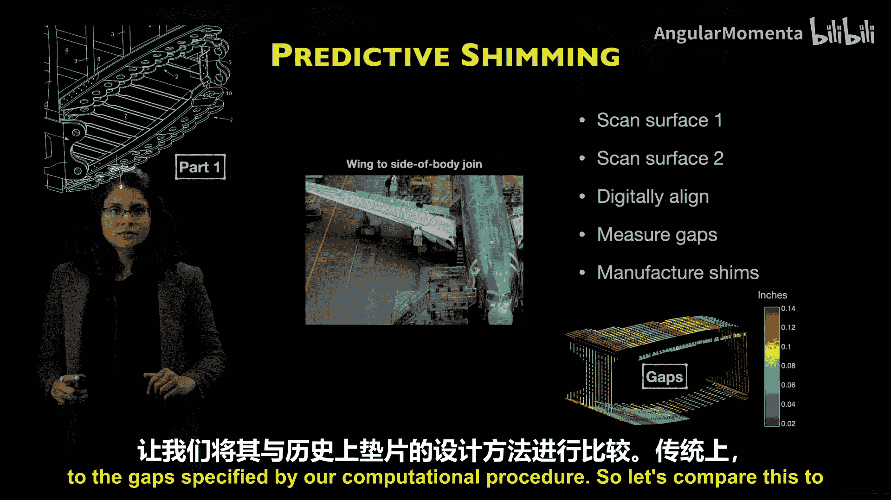
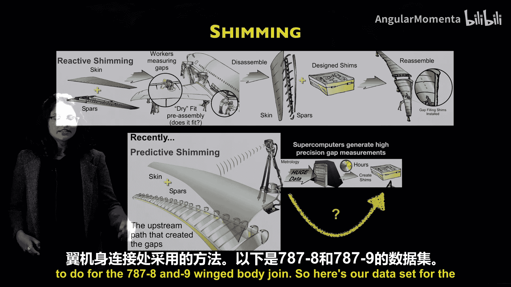
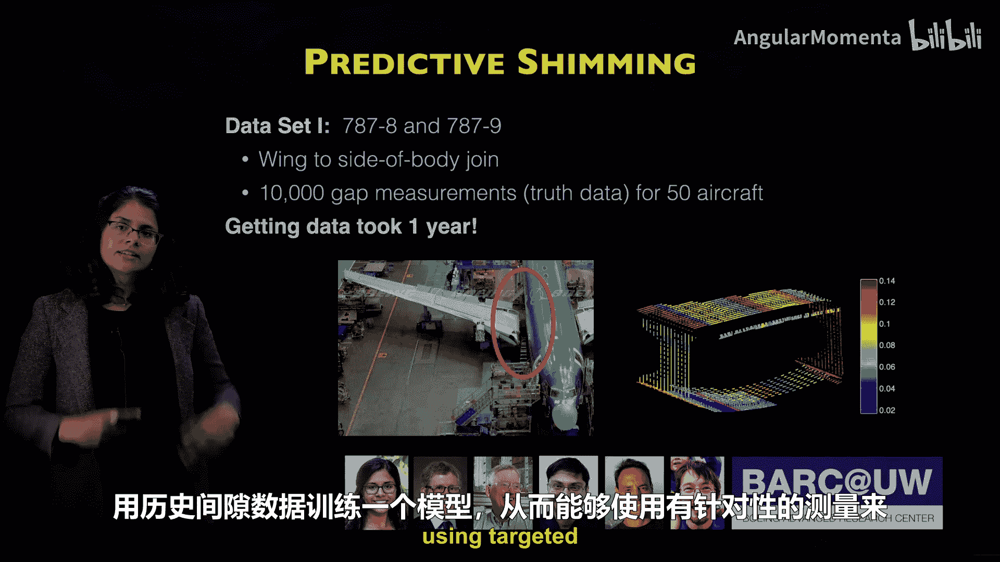
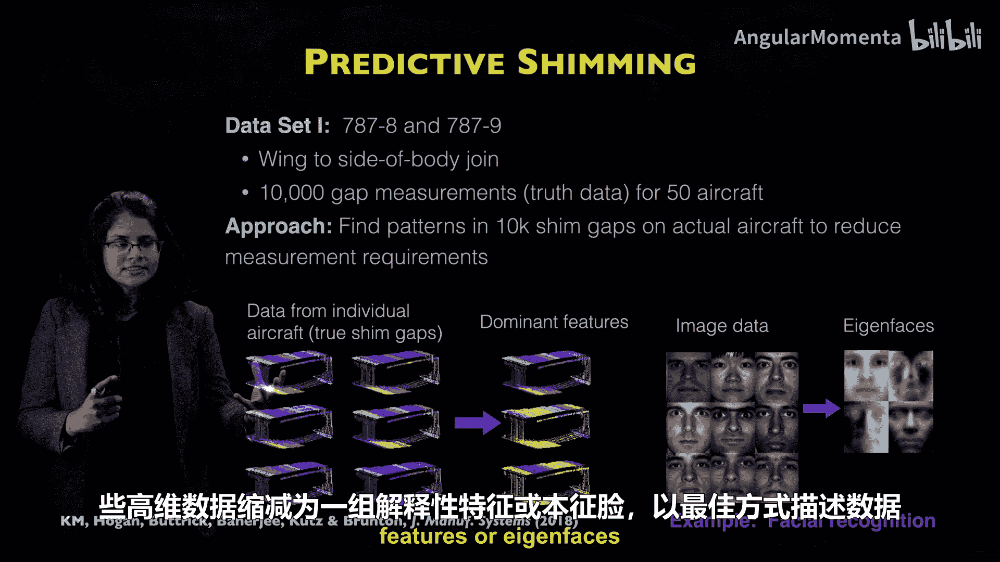
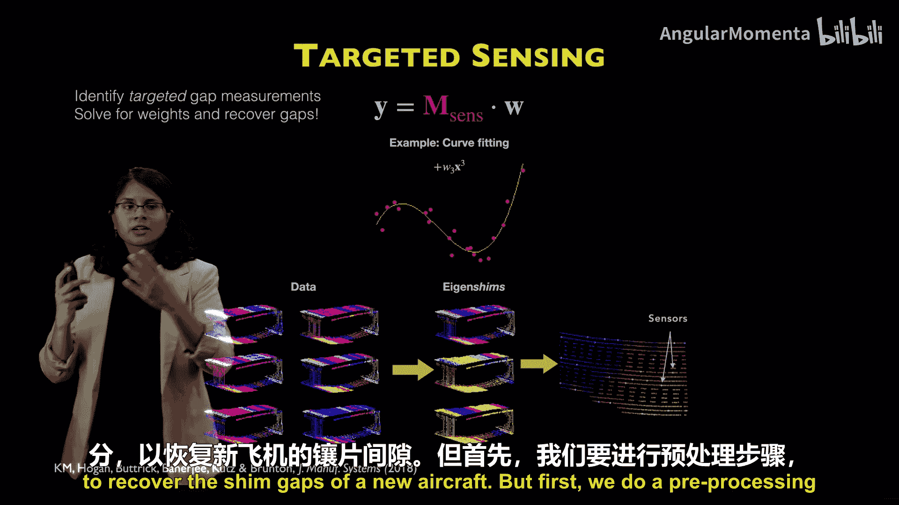
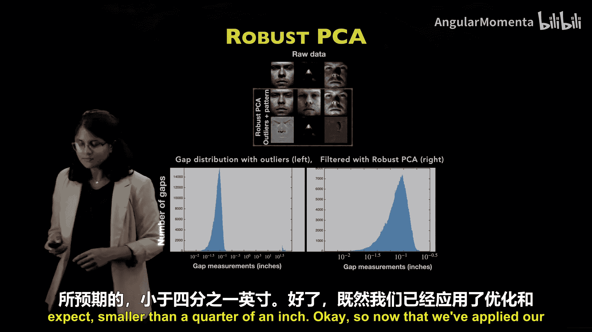
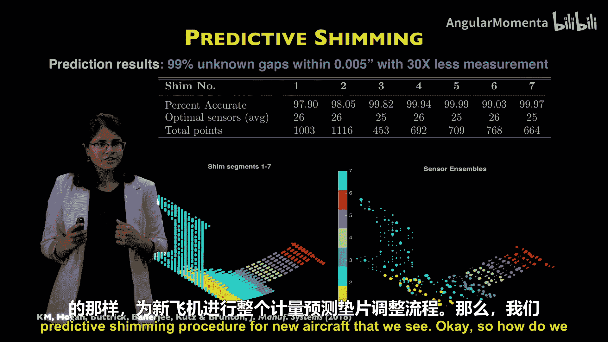
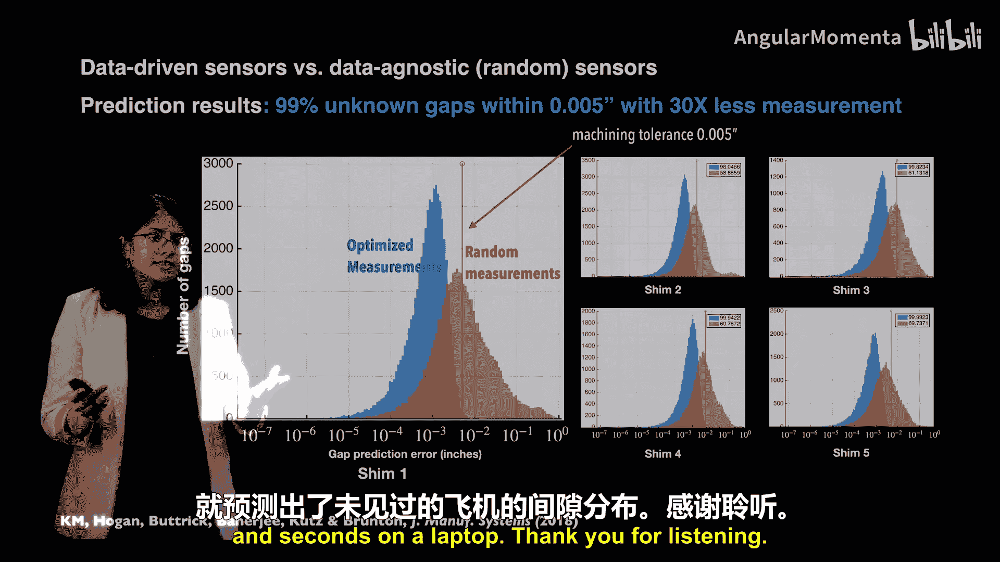

# 007：波音公司预测垫片案例研究 🛩️

在本节课中，我们将深入探讨波音公司如何应用数据科学方法进行“预测垫片”优化。这是一个将高维数据处理技术应用于实际工业制造，以显著节省时间和成本的经典案例。

## 什么是垫片？

垫片是由各种材料制成的填充部件，其制造和设计目的是为了适配装配中零件之间的间隙。

## 传统垫片方法的局限

上一节我们介绍了垫片的基本概念。本节中我们来看看传统的垫片方法是如何进行的。

传统垫片方法通常是反应式的：
1.  将两个复杂零件装配在一起。
2.  手动测量它们之间的间隙。
3.  拆卸这两个零件。
4.  根据测量结果制造垫片。
5.  重新进行装配。

对于机翼与机身对接或蒙皮与翼梁对接这类复杂结构，此过程计算成本极高且劳动密集。这正是我们转向预测垫片方法的原因。

## 预测垫片方法

预测垫片方法的核心步骤如下：
1.  扫描第一个表面（例如机身内部）。
2.  扫描第二个表面（例如机翼对接处外部）。
3.  使用计算方法在数字环境中对齐这两个表面。
4.  在数字对齐的坐标系中测量零件之间的间隙。
5.  根据计算程序指定的间隙制造垫片。

这种方法允许我们在数字环境中测量对接间隙，并处理数据以生成高精度间隙测量值。然而，由于计量和扫描过程会产生数万到数十亿个点云数据点，此过程通常仍需数小时。

## 项目目标：利用历史数据进行预测

我们讨论的是预测性垫片，这意味着：我们能否利用同一飞机部件其他实例的历史数据，直接从一组精简的测量值出发，预测出所需的整套垫片？

这正是我们为波音787-8和-9机型机翼与机身对接所进行的研究。

以下是我们的数据集：
*   我们拥有来自50架不同飞机的计量或预测垫片程序数据，包含10，000个点（即间隙测量值）。
*   我们的目标是减少后续的测量需求，因为这能为制造流程节省数百万美元。垫片制造处于关键路径上，在关键路径上节省的任何时间或资源都直接意味着每架飞机可节省数百万美元。

这些数据本身具有很高的保真度，获取它们就花费了一年时间。我们希望探索是否能基于历史间隙数据训练一个模型，从而利用针对性测量来预测新飞机的间隙。

## 方法论：借鉴图像处理的降维思想

以下是前六架飞机的10，000个间隙测量数据。可以看到这些机翼与机身对接处确实存在某种结构，但很难在要求的制造公差内通过观察一架飞机来预测另一架。

我们的方法是在10，000个垫片间隙中寻找模式，从而减少测量需求。这与图像处理或人脸识别中的高维数据处理非常相似。

给定高保真度的人脸图像，你可以使用机器学习和人工智能中的标准技术快速对其进行分类。我们可以将这些高维数据降维为一组具有解释性的特征或“特征脸”，以最优方式描述数据中的变化。

这些模式可以通过一种称为**主成分分析（PCA）**的方法从数据中提取。

其核心思想是：每个高维数据点或高分辨率图像都可以写成从数据中学习到的主导特征或主成分的加权和。这个过程在你的笔记本电脑上几秒钟即可完成。

例如：
*   你的图像可能由 60% 的“特征脸1”和 20% 的“特征脸2”等构成。
*   我的图像可能由 50% 的“特征脸1”和 30% 的“特征脸2”等构成。

因此，每个图像（每个人的照片）仅通过知道这些权重就可以重建。实际上，每个千维图像仅用50到100个这样的权重就可以重建。

我们将应用类似的思想，从针对性测量中学习完整的间隙分布。因此，识别这些针对性的间隙测量以重建这些权重，就等价于求解这个关于权重的线性方程组，并恢复完整的图像（在此案例中是间隙）。

这个想法与曲线拟合非常相似：你拥有测量得到的数据点，并指定可能拟合它们的函数类型。但在本案例中，这些函数是从数据中学习到的主导特征或主成分。在曲线拟合中，这些函数或特征基本上是x的不同函数，例如线性函数、二次函数和三次函数。

我们将利用“每张人脸在特征脸的函数空间中是低维的”这一思想，来学习我们必须测量的稀疏传感器位置，以重建整个空间。

## 应用于预测垫片

我们将类似的思想应用于预测垫片：
1.  从数据中提取这些“特征垫片”或模板垫片。
2.  利用这些特征垫片揭示的模式，沿着机翼与机身对接的不同区段布置一定数量的稀疏传感器。
3.  根据这些传感器的测量值，我们优化一个线性方程组。该方程组依赖于这些选定的传感器以及我们从数据中提取的主成分，以预测新飞机的垫片间隙。

但在应用PCA之前，我们进行了一个预处理步骤：我们应用**鲁棒主成分分析（Robust PCA）**，从数据的基础真实模式中提取异常值。

例如，在人脸图像中，可能存在阴影、眼镜或胡子，这些并不代表所有人脸的整体分布。这些是必须使用鲁棒主成分分析等方法从数据中提取的异常值。

我们对整体间隙分布做了类似处理。当我们绘制所有飞机的整体间隙分布对数直方图时，可以看到存在少量极大的间隙（大于30英寸的异常值）。这很可能是数值伪影，不应纳入我们的分析。因此，我们使用鲁棒PCA过滤数据，使得剩余的间隙测量值反映出一个更有结构性的分布，正如我们所预期的那样，小于四分之一英寸。

## 结果与验证

在应用了优化和主成分分析后，我们通过求解线性方程组尝试进行重建。

我们的方法揭示了这些垫片传感器的最佳布置方案。我们将该方法分别应用于机翼与机身对接的不同区段，以提取这些垫片区段中的局部模式。

我们发现：
*   **99%的未测量间隙**的预测误差在**0.005英寸**以内（这是波音公司的加工公差）。
*   测量需求减少了**30倍**。

例如，对于第7区段，我们只需在大约20到25个目标垫片位置进行测量，就能重建或恢复近1000个未测量的间隙。当我们这样做时，我们可以以极高的保真度和应用指定的制造公差，预测98%到99%的未测量间隙。而且，我们在笔记本电脑上几秒钟内就完成了这项工作，而不是对新飞机进行整个计量预测垫片程序。

那么，如何验证这些最优传感器是有效的呢？

我们将这些数据驱动的最优传感器与数据无关的随机点传感器进行对比，以评估预测间隙分布的效果。我们观察间隙预测误差的概率分布。

结果显示：
*   使用我们的优化测量方案，该误差分布的概率质量主体（几乎98%到99%）位于加工或制造公差（0.005英寸）以内。
*   如果使用随机测量进行重建，几乎一半的概率质量会超过0.005英寸。

## 总结

本节课中，我们一起学习了波音公司预测垫片的案例。

我们成功实现了仅使用少量针对性测量，并在笔记本电脑上花费数秒时间，就能预测一架未知飞机的间隙分布。这项技术通过大幅减少关键路径上的测量需求，为飞机制造流程节省了巨大的时间和成本，是数据密集型工程在工业界成功应用的典范。