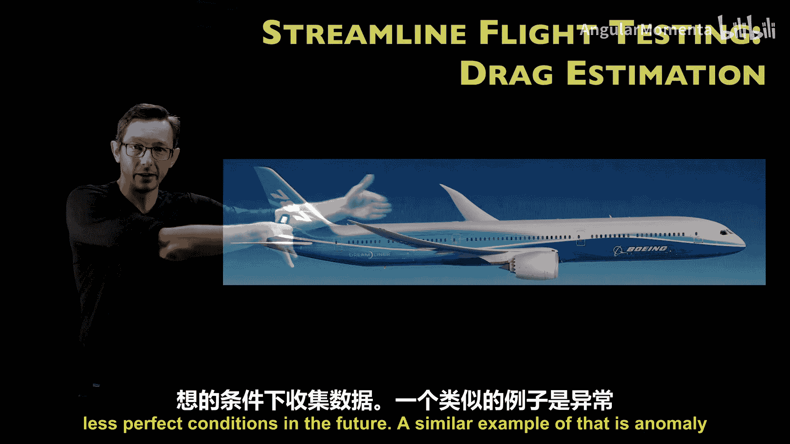
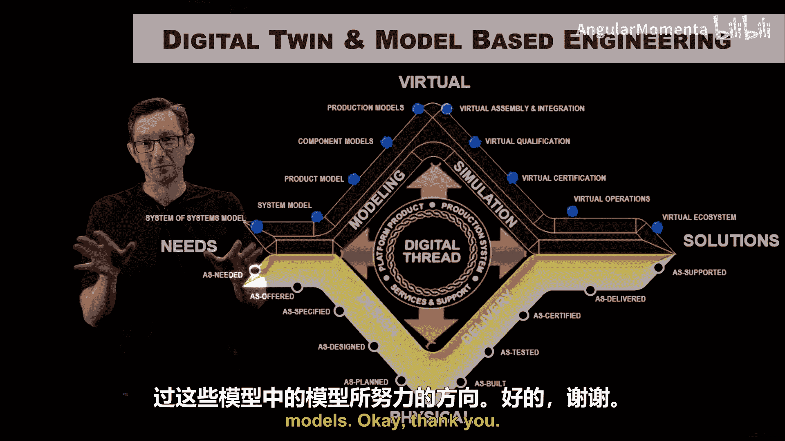

# 008：波音案例研究与史蒂夫·布鲁顿教授

## 概述
在本节课中，我们将通过几个航空航天领域的实际案例，来了解数据密集型方法、机器学习和可视化技术在该领域的具体应用。这些案例大多来自华盛顿大学与波音公司的合作项目，它们展示了如何利用数据科学解决复杂的工程问题，从零件标准化到飞行测试优化。

---

## 零件标准化：减少飞机上的独特支架数量

上一节我们介绍了数据密集型方法在航空航天领域的潜力，本节中我们来看看一个具体的应用：通过标准化减少飞机上的独特零件数量。

这个案例研究发表在《制造系统杂志》上，核心思想是减少飞机上独特零件的数量，即实现**标准化**。具体来说，是针对飞机上的**支架**。一架现代飞机（如波音787）拥有数万个独特的支架，每个都针对飞机的特定需求设计，例如固定线缆束或支撑部件。

在设计过程中，工程师为特定情况设计一个新支架，通常比从包含上万个零件的目录中查找更简单。这导致零件库不断膨胀，形成一个不稳定的过程。

我们与波音工程师合作，获取了现代商用飞机上实际设计和使用的支架数据库。我们运用机器学习和数据科学的思想，试图找出一个核心支架子集，使其能够满足大多数使用场景。目标是：将约一万个独特支架减少到几百个，同时完成80%的工作。

我们称这个项目为“支架的支架化”，旨在寻找“特征支架”或标准化支架。这个概念借鉴了量子力学中的**狄拉克符号**（bra-ket notation），其中 bra 和 ket 的内积用于计算两个状态的相似度。在这里，我们计算每对支架在某种特征空间中的**点积**（或内积），以判断它们的相似性。

具体做法是：计算数据集中每个支架与所有其他支架的相似度得分，形成一个相似度矩阵。然后，我们使用**层次聚类算法**，寻找那些与尽可能多其他支架相似的“代表支架”。通过设定不同的相似度阈值，我们可以选择不同数量的代表支架来描述整个集合。

通过这种方法，我们确实实现了独特支架数量的显著减少。然而，也存在一些“长尾”情况——部分独特支架与其他任何支架都不相似，必须手工设计和制造。但任何可以合并或标准化的支架，都将为工程师节省时间，并通过规模经济和减少仓储需求来节约成本。

这种标准化机会不仅限于支架，也适用于电气连接器和其他一次性设计的零件。这是一个将相对标准的聚类算法应用于解决航空航天实际工程问题的典型案例。

---

## 飞行测试评估：利用数据密集型方法优化流程

在了解了零件标准化后，我们转向另一个关键且昂贵的环节：飞行测试评估。

对新飞机进行飞行测试至关重要，但也极其昂贵。为了认证飞机，需要进行全面而广泛的测试。当一架飞机为新的飞行测试进行改装时，会安装数千个传感器，测量所有能想到的参数。这些传感器每次飞行都会记录海量数据（TB级别）。

如果能缩短这个过程几天时间，将带来巨大的成本节约，并能让飞机更快交付给客户。

以下是我们在该领域合作研究的几个例子：

### 阻力估算
以波音787为例，其复合材料的机翼形状实现了前所未有的燃油经济性和阻力最小化。为了测试其在不同重量条件和马赫数下的阻力性能，传统方法需要在近乎完美的“蓝天”条件下飞行，以确保测量校准的准确性。等待这种天气条件非常耗时且昂贵。

我们的解决方案是：利用历史飞行测试数据。我们既有在完美“蓝天”条件下的基准数据，也有在恶劣天气条件下的数据。我们构建了一个**机器学习模型**，能够“提升”不完美的数据，恢复出在“蓝天”条件下本应得到的阻力估算值。

其原理是：虽然人类很难写出这些复杂的解析关系，但数据中存在足够的模式和关联性，机器学习模型可以学习这些相关性，从而清理非理想的阻力测量数据。这是一个利用历史数据，使得未来能在不完美条件下更快收集数据的典型案例。

### 异常检测
在飞行测试中，飞机上遍布大量传感器。有时传感器会发生故障，可能在测试结束后才发现数据无效，导致测试需要重做，这非常昂贵且令人沮丧。

然而，由于传感器数量多、冗余度高，且测量的是飞行测试的各个方面，我们通常可以**实时检测**传感器何时出现异常（例如读数变得不物理或与其他测量值失去关联）。

首先，系统可以标记故障，建议立即降落并修复传感器，避免浪费更多时间。更进一步，有时我们可以利用其他传感器的统计模式和相关性，通过**统计相关性**的力量，来填补故障传感器在正常工作时应测得的数据。因为这是一个物理系统，一个位置的测量很可能与下游另一个位置的测量存在物理关联。

这里的机遇包括：利用数千个测量值之间的相关性来预警传感器故障、提高传感器数据的保真度、填补缺失或错误的数据。甚至，随着数据动态积累，我们可以设想一种未来：或许不需要为特定测试运行专门的飞行任务，而是让测试持续进行，当数据积累到足以认证某项指标时，系统自动将其从待办清单中勾选。这虽然是一个未来构想，但潜力巨大，因为飞行测试耗时耗资，且必须确保正确。

---

## 数字孪生：数据密集型工程的未来愿景

以上讨论的案例，无论是飞行测试、制造还是新材料设计，很多都归属于一个更宏大的概念：**数字孪生**。

像波音这样的大型航空航天公司，坐拥从概念设计、早期制造、生产制造、飞行测试评估到在役记录的庞大数据山。这些数据跨越数十年、各大洲和多个尺度。

这些数据可以支撑起一个**超级模型**。数字孪生本质上是一个“模型的模型”，一个涵盖整个流程（无论是整个工厂车间还是整架飞机从始至终）的层次化超级模型。这个资产的数字版本，与在整个生命周期中收集的实际数据紧密相连，使得基于模型的工程能够实现惊人的功能。

正如我们之前看到的，可以通过**代理模型**来设计超材料并进行快速优化。同样，拥有工厂或飞机的代理模型，允许你以更快速、更精简的方式优化这些流程，而无需建造多个不同的工厂或飞机进行测试。

利用代理模型进行优化，是机器学习与数据密集型科学融入航空航天工业的一个重大未来目标。这涉及**降阶建模**、**不确定性量化**、**机器学习**、**传感器融合**等多种技术。它是众多新技术的迷人结晶，将使我们能够以更少的资源，更快地设计出更安全、性能更高的飞机。这至少是我们的承诺，也是我们通过构建这些“模型的模型”所努力的方向。

---

## 总结
本节课中，我们一起学习了数据密集型方法在航空航天领域的几个具体应用：
1.  **零件标准化**：利用聚类算法减少飞机独特支架数量，实现降本增效。
2.  **飞行测试优化**：
    *   **阻力估算**：通过机器学习模型，利用历史数据在不完美天气条件下获得准确的阻力估计。
    *   **异常检测**：利用传感器间的相关性实时检测故障，并可能填补缺失数据。
3.  **数字孪生**：整合全生命周期数据构建超级模型，是实现未来高效、优化设计与管理的关键愿景。

这些案例展示了数据科学如何解决实际工程挑战，并指明了该领域未来发展的激动人心的方向。