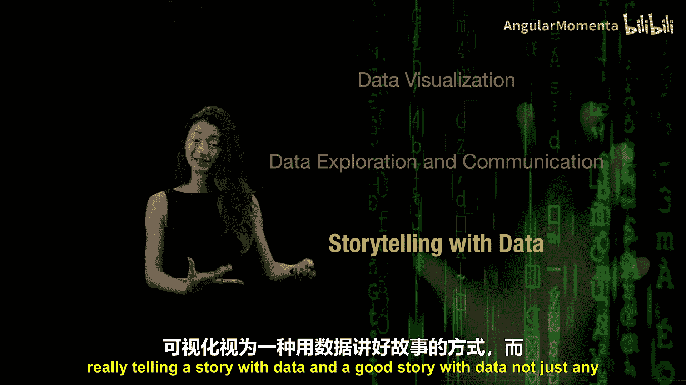
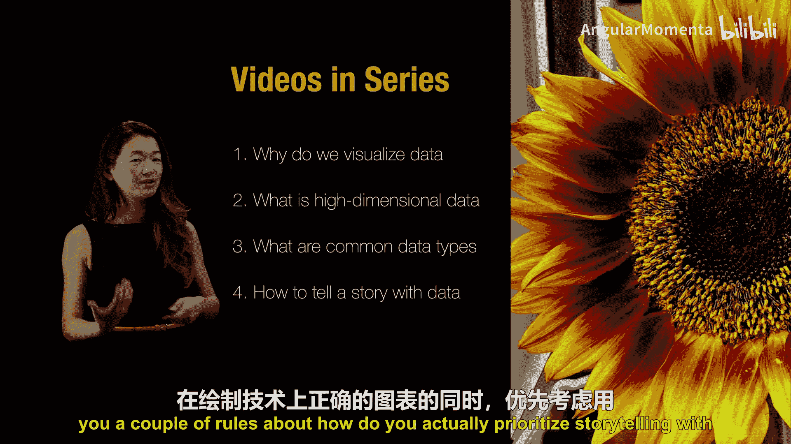

# 010：可视化简介 🎨

在本节课中，我们将要学习数据可视化的基本概念、目的以及它在数据科学工作流中的核心地位。我们将探讨为何需要可视化、如何理解高维数据、常见的数据类型，以及如何通过可视化有效地讲述数据故事。

大家好，我是布伦顿，西雅图华盛顿大学的教授。这是一个关于数据可视化的简短课程。

作为一名科学家，我热爱数据。但如今的数据可能非常庞大，它们类型繁多，从各种仪器中产生的数据量巨大且易于获取，这常常令人困惑。本课程的目标是帮助你理解数据可视化，将其作为建模、分析和理解这一生态系统中的工具，用于基于数据做出决策。

在谈论数据可视化时，我并非仅仅讨论如何用数据制作图表，许多其他课程已经涵盖这一点。我的目标不仅仅是制作图表，尽管我和其他人一样喜欢制作图表。数据可视化真正关乎的是**数据探索**与**沟通**。这种沟通包括与他人交流你的数据，也包括与未来的自己交流数据。也许一年后你已经忘记了收集的数据，数据可视化是完成此任务的非常有用的工具。

通过数据与人沟通，我们实际上是在**讲述一个故事**。因此，本课程的目标是将数据可视化更多地视为一种讲述故事的艺术，而非纯粹的技术学科，并且是讲述一个**好的**数据故事，而非随便一个故事。

我今天对大家的目标有几个方面。我并非试图让你成为使用最新数据可视化工具的专家，而是我们将专注于如何像数据科学家一样思考可视化数据。一个人可能会考虑哪些方面？数据类型等因素有哪些考量？诸如此类。此外，即使你不是实际制作数据可视化的人，我也将重点介绍如何沟通，如何使用数据科学的语言与团队中实际制作可视化的人交流，并理解他们在科学或工程团队中可视化数据方面的贡献。

在此过程中，我希望教你熟悉现代数据的不同类型和可视化工具。如果你已经大致了解可以完成哪些类别的任务，实现其余学习目标也会容易得多。

如果你愿意加入这次学习之旅，以下是我们的行程安排。我们将有一系列五个短视频，专注于五个非常具体的目标。我们将提出以下五个问题：

*   第一个是，我们究竟为什么想要可视化数据？它的用途是什么？我们如何使用它？我们如何将其整合到实际用数据做决策的过程中？
*   第二个视频，我们将探讨什么是高维数据。如今我们经常听到高维数据。它是什么？它与低维数据有何不同？“高维”有多高？诸如此类。拥有高维数据实际上意味着什么？
*   当然，我们还将讨论常见的数据类型以及一些深奥的数据类型，以及如何处理那些不符合我们通常处理的常规类型的数据。
*   然后，我们将更多地回到“用数据讲故事”这个理念。我将给你一些规则，告诉你如何在实际中优先考虑用数据讲故事，而不仅仅是制作一个技术上正确的图表。
*   当然，最后，在你或他人制作了一个非常漂亮的图表之后，我将告诉你如何识别一个糟糕的图表。请注意，用数据讲故事也可能意味着用数据讲述一个**误导性的**故事。这就是最后一个视频将要讨论的内容。

如果这听起来很有趣，接下来的五个视频链接将在下方提供，期待再次见到你。

---

本节课中我们一起学习了数据可视化的核心目的——探索与沟通，并概述了本系列课程将围绕的五个关键问题：可视化的目的、高维数据的理解、数据类型的处理、数据故事的讲述以及如何识别误导性可视化。掌握这些基础概念是有效利用可视化工具的第一步。