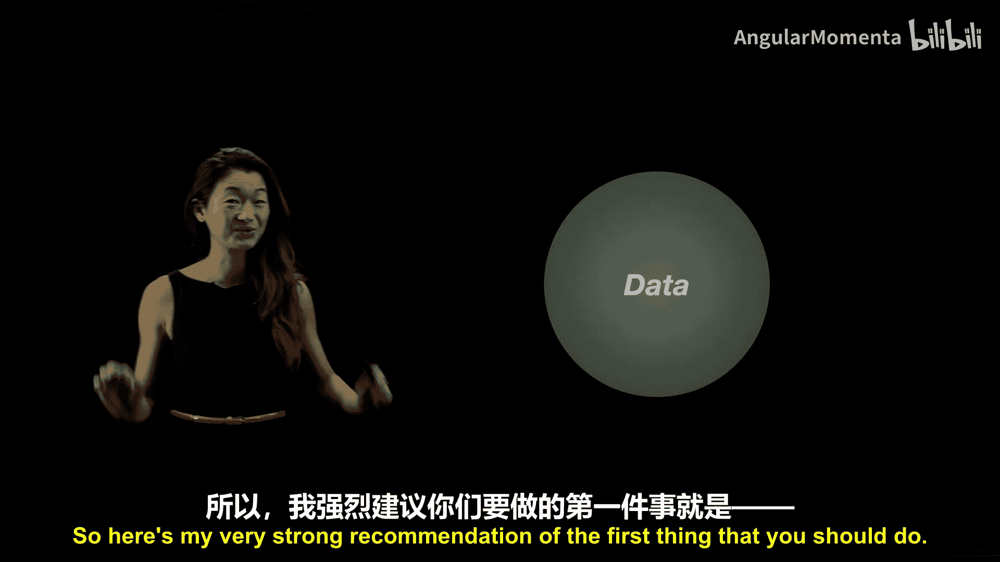
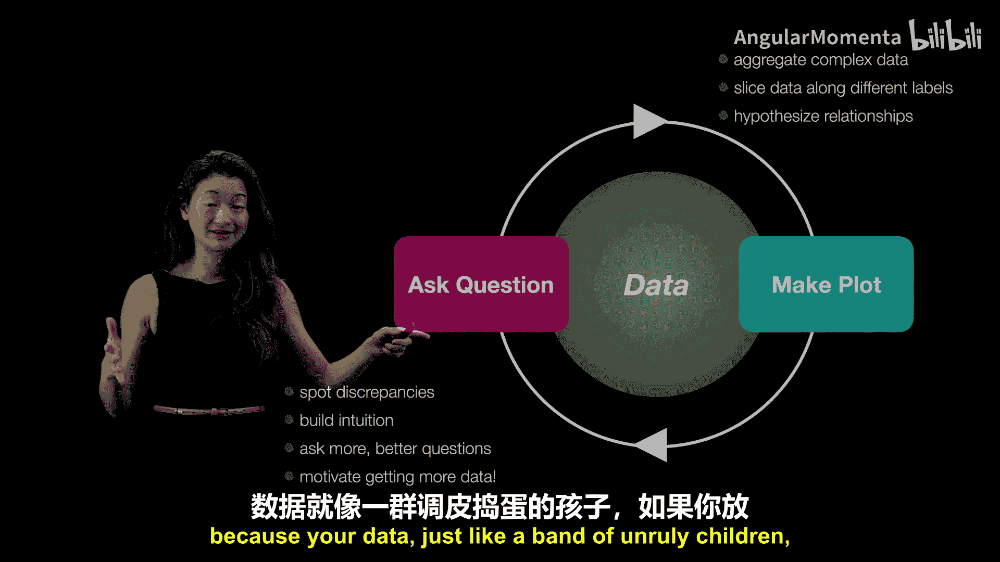

# 011：通过图表用数据提问和回答问题 📊

在本节课中，我们将探讨数据可视化的根本目的：如何通过图表向数据提问并从中获取答案。我们将学习一个循环迭代的过程，帮助你从复杂的数据集中建立直觉、发现问题并最终讲述一个引人入胜的故事。

---

上一节我们介绍了数据可视化的系列课程。本节中，我们将从头开始，讨论我们为何首先要进行数据可视化。

最初，你面对你的数据，彼此对视，思考如何相互了解。这里有一个非常强烈的建议：你应该做的第一件事是**针对你的数据提出一个问题**，然后利用这个问题，**制作一个图表来回答它**。

无论你问的是什么问题，例如你认为两个变量之间可能存在某种关系，都应尝试制作你能想到的最简单的图表，以某种方式将答案可视化。

这样做的原因在于，我们的数据通常很复杂。因此，分析和理解数据的很大一部分任务，在于通过在不同维度上“切片”来聚合复杂数据，试图观察事物之间的关系，或者寻找比直接审视全部数据更简单的视角。通过这种方式，我们可以假设关系，并真正地了解我们的数据。

通过制作这个图表，你还能获得大量关于数据的直觉。更重要的是，你可以**发现数据中的异常**。

以下是制作图表可能帮助你发现的几种异常情况：
*   某天收集数据时仪器出现故障。
*   某条记录存在偏差。
*   收集人口统计数据时，有人填错了选项。

制作图表是发现这些差异的最简单方法之一，从而避免它们在后期的分析中影响你。

建立对数据的直觉至关重要，因为它能让你提出更多、更好的问题。这不是一个一步到位的过程，而是**提问 -> 制图 -> 利用获得的直觉提出更多、更好问题**的循环。

这个循环过程还可能促使你获取更多数据。此时，正确的做法可能不是草草收场、强行编造故事，而是意识到“我真的需要更多数据，目前这些根本不够”。在数据分析与数据科学路径的每一个环节，建立这种直觉都是一件极其重要的事情。

因此，我主张采用一个**循环过程**：通过提问来聚合复杂数据，制作图表，以这种高度可视化的方式了解你的数据，从而在未来提出更好的问题。

这个循环过程之所以超级重要，还因为你的数据就像一群孩子，如果放任不管，它们会做出疯狂的事情。

因此，我总是建议从简单开始。如果能做散点图，就不要做更复杂的图；如果能进行线性回归分析，就不要寻找更复杂的方法。**先做简单的事**。当你发现简单的方法不奏效时，更重要的是，明确它**在哪些具体方面**不奏效、缺乏什么，这时你才有充分的理由动用更复杂的工具。

当你不断提问和制作图表时，你将**迭代这个过程，直到找到一个值得讲述的故事**。在准备讲述这个故事时，你将不断精炼你的故事，确保你问的是正确的问题，而不仅仅是第一个可能被想到的问题。这样，你才能最终制作出图表，讲述一个真正引人入胜的故事。

在后续的视频中，我将更多地讨论这种过程具体包含哪些内容，这取决于你拥有的数据类型，以及一些你可以实际采用的最佳实践，以便出色地传达、交流你的数据，并讲述你想要讲述的故事。

---

本节课中，我们一起学习了数据可视化的核心目的与循环方法。我们了解到，可视化始于一个具体的问题，通过制作简单的图表来回答它，不仅能验证假设、发现数据异常，还能建立关键的数据直觉。这个过程是迭代的：从简单图表开始，根据发现精炼问题，逐步深入，直到构建出清晰、 compelling 的故事。记住，先做最简单的事，只有在明确需要时才使用复杂工具。