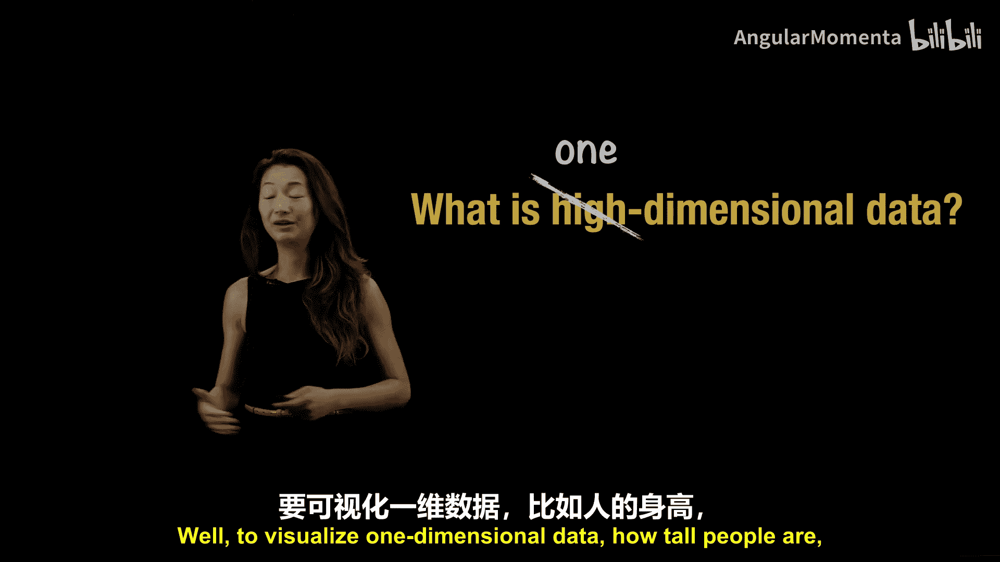
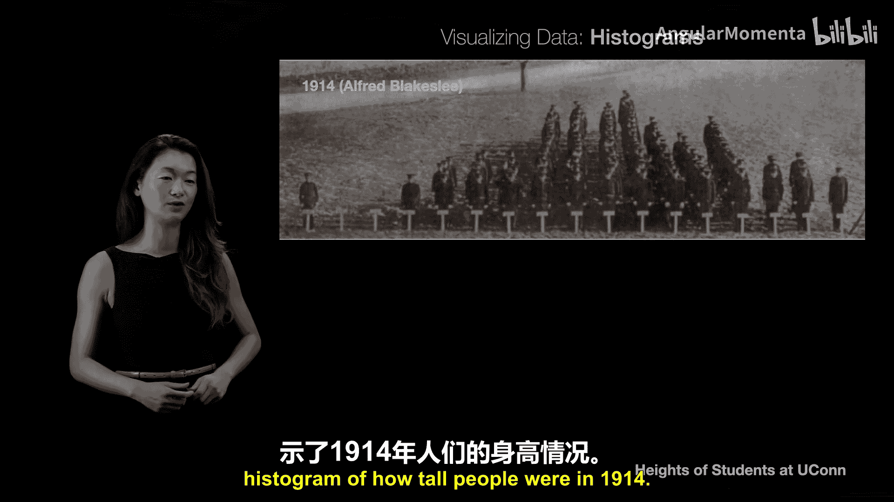
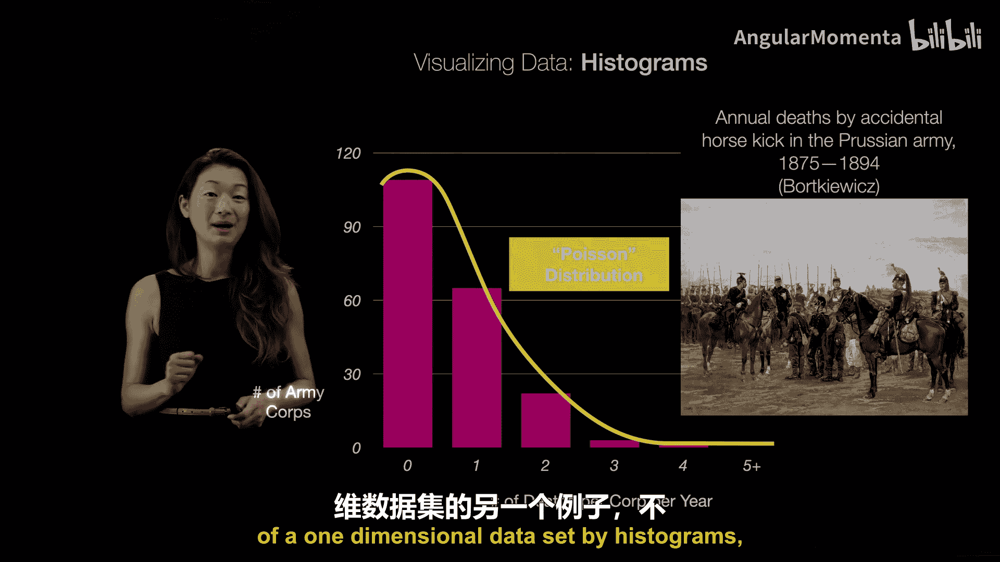
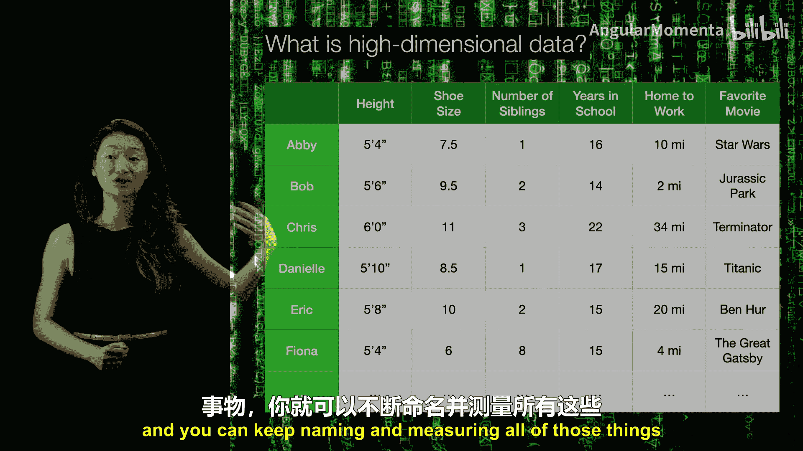
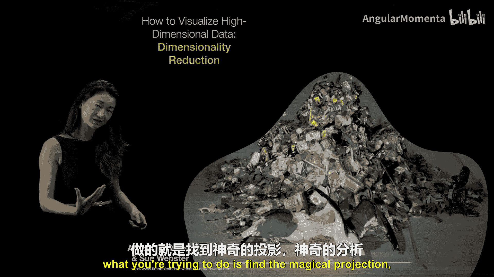
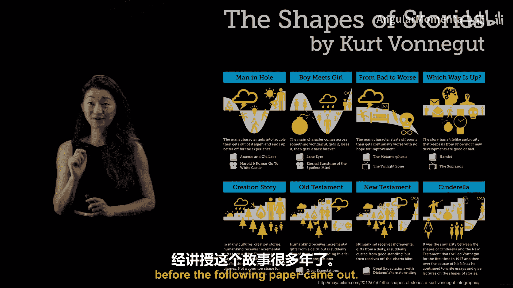
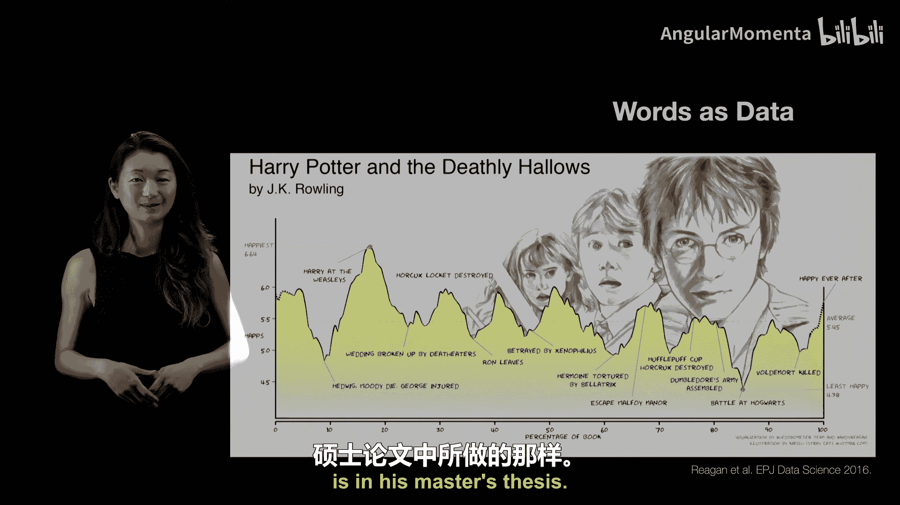
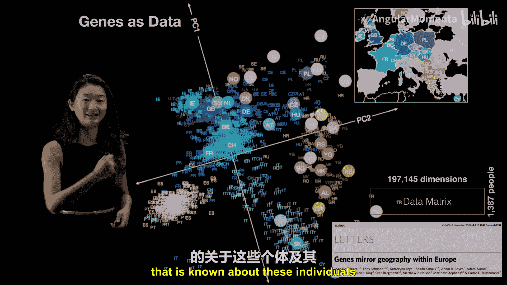
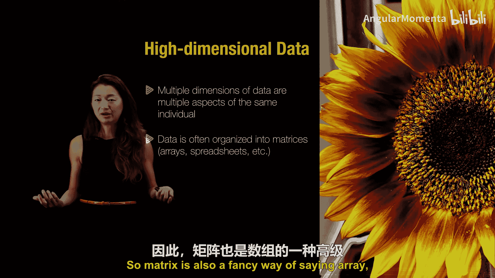

# 012：可视化高维数据

在本节课中，我们将要学习什么是高维数据。高维数据听起来可能很神秘复杂，但其概念实际上非常简单。我们将从一维数据开始，逐步理解高维数据的含义、用途以及处理方法。

## 从一维数据开始

在讨论高维数据之前，我们先从一维数据入手。一维数据是最简单的形式，它只包含一个维度的信息。

一个易于理解的例子是人的身高。假设我们收集的数据集只包含每个人的身高信息，这就是一个一维数据集。

可视化一维数据非常简单，甚至不需要电脑。历史上，人们通过让不同身高的人在足球场上按身高排队，就能形成一个直观的“真人直方图”。

下图展示了1914年康涅狄格大学军乐队学生的身高分布。每个人站在代表自己身高的标签后面，形成了一个清晰的一维数据可视化直方图。

这个分布非常接近我们所说的**正态分布**或**高斯分布**，其概率密度函数公式为：
`f(x) = (1 / (σ√(2π))) * e^(-(x-μ)²/(2σ²))`
其中 `μ` 是均值，`σ` 是标准差。由于其曲线形状，它也被称为**钟形曲线**。

1994年，Linda Schsberg在康涅狄格大学重复了这个实验，男女分开（白衣为女，黑衣为男），可以看到男性和女性的身高分布略有不同。

## 一维数据的其他例子

直方图非常适合描述各种一维数据。另一个历史更悠久的例子是19世纪普鲁士军队中每年因意外被马踢死的人数。

这个数据集记录了每年每个军团发生此类死亡事件的次数。通过绘制直方图，经济学家Burrkowitz发现，数据分布符合**泊松分布**。

泊松分布描述了事件在固定时间间隔内以恒定平均速率随机且独立发生的概率分布。其概率质量函数为：
`P(X=k) = (λ^k * e^(-λ)) / k!`
其中 `λ` 是单位时间内事件发生的平均次数，`k` 是实际发生的次数。

分析表明，每年约有1个军团会发生4起死亡事件，这完全符合随机事件的预期，从而排除了士兵虐待马匹的猜测。这再次证明，直方图是可视化一维数据集的有效工具。

## 理解高维数据

上一节我们介绍了一维数据的可视化。然而，我们每个人都是多维的，描述我们的远不止身高。

我们可以创建一个电子表格，每一行代表一个人，每一列代表一个描述此人的特征（维度）。最初，我们可能只有“身高”这一列。

随着我们添加更多列，如“鞋码”、“兄弟姐妹数量”、“受教育年限”、“通勤距离”、“最喜欢的电影”等等，这个数据集就变成了**高维数据**。

关于这个高维数据集，有几个关键点需要注意，我们将在后续课程中深入探讨。

以下是数据类型的简要分类：

*   **数值型变量**：这类数据是数字。
    *   **连续变量**：如身高，可以是任何实数（如170.5厘米）。
    *   **离散变量**：如兄弟姐妹数量，通常是**非负整数**（0, 1, 2...）。
*   **分类型变量**：这类数据不是数字，而是类别。例如，“最喜欢的电影”是一个类别。将其映射为数字并不直观，需要特殊处理。

因此，高维数据可以表示为一个**矩阵**或**数组**，其中每行是一个观测对象（如一个人），每列是一个特征（维度）。这个矩阵可能包含不同类型的数据。

## 高维数据的挑战与可视化

正如你所见，这个数据矩阵可以变得非常庞大，行数（个体数量）和列数（特征数量）都可能非常多。

人类大脑擅长处理三维空间，但难以直接可视化超过三维的数据。然而，我们很容易获得具有成千上万甚至数百万维度的数据。

因此，可视化高维数据的关键技巧在于**降低复杂度**，将其转化为我们视觉皮层能够处理的二维图片或三维物体。

未经处理的高维数据就像一堆杂乱无章的垃圾，我们无法从中看出任何模式。**数据降维**的目标就是找到一个“神奇的投影”角度。

这类似于艺术家Tim Noble和Sue Webster的装置作品：当一束光以特定角度投射到一堆废品上时，墙上的影子会显现出两个清晰的人形。

这个“投影”既是视觉上的，也是数学上的概念。就像那束光的角度和墙壁的位置至关重要一样，数学降维技术旨在找到那个能将高维数据投射到低维空间的最佳方向，从而让数据中的“故事”浮现出来。

## 降维的另一种视角：寻找共性模式

我想分享的第二个关于降维的思维模型，来自作家库尔特·冯内古特。他为其硕士论文总结了故事的几种“形状”。

在阅读了大量小说和短篇故事后，他将它们归纳为几种经典的故事弧线，例如“男人陷入困境”、“男孩遇见女孩”、“从军营归来”等。

这为我们理解高维数据降维提供了另一个视角：当你聚合大量高维数据样本时，你可以将整个数据集简化为几个**典型的维度**或模式。因为数据内部存在关联，相似类型的数据会聚集在一起。

后来，研究人员用数学方法实现了冯内古特的直觉。他们使用一种称为“情感测量仪”的工具，将文本（如《哈利·波特与死亡圣器》）转化为随时间变化的“幸福分数”序列。

通过对谷歌语料库中大量书籍进行这种操作，他们获得了一个高维数据集（每本书是一条时间序列）。然后，他们使用**主成分分析**等数学降维技术，成功提取出了与冯内古特所归纳的相似的故事基本形状。

## 高维数据实例：基因数据

另一个将数据转化为数字并进行降维的例子是基因数据。

在一个研究中，科学家测量了约1300个人的近20万个基因组变异位点（即近20万个维度）。然后，他们将这个近20万维的数据降维到二维。

结果非常惊人：根据降维后的二维图对个体按其欧洲祖源进行着色，得到的分布图竟与欧洲的地理地图高度吻合。

这个例子很好地展示了如何将关于人的极高维度数据（基因变异），通过降维投射到有意义的低维空间（反映了已知的地理和祖源信息）。

## 课程总结

本节课中，我们一起学习了高维数据的基本概念：

1.  **高维数据的本质**：多个维度只是同一事物不同方面的度量。我们可以用一个**矩阵**（或电子表格）来表示，其中行是个体，列是特征。
2.  **数据类型**：高维数据可以包含混合类型，如**数值型数据**（连续或离散）和**分类型数据**。通常我们需要将非数值数据转化为数值形式以便分析。
3.  **可视化挑战**：人类难以直接理解高维数据。因此，核心技巧是通过数学方法**降低数据复杂度**，进行**降维**。
4.  **降维的比喻**：
    *   像用**手电筒将一堆废品的影子投射到墙上**，寻找能形成清晰图案的投影角度。
    *   像从大量故事中**总结出几种经典的故事模式**，用少数典型维度概括复杂数据。
5.  **实际应用**：我们看到了降维技术在文本情感分析和基因地理图谱中的强大应用。

在下一个视频中，我们将更深入地探讨本节课提到的混合数据类型及其处理方法。