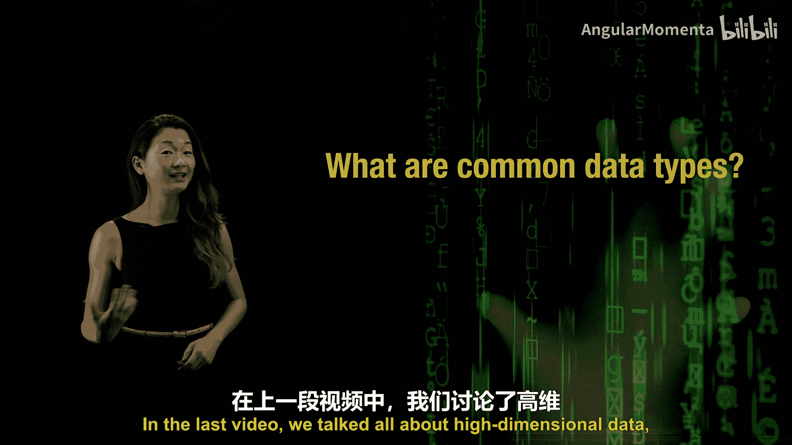
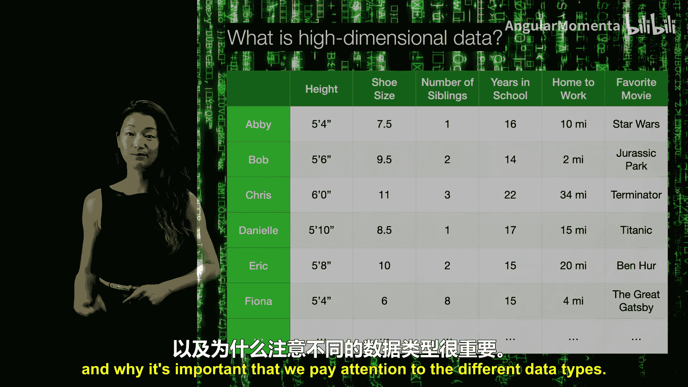
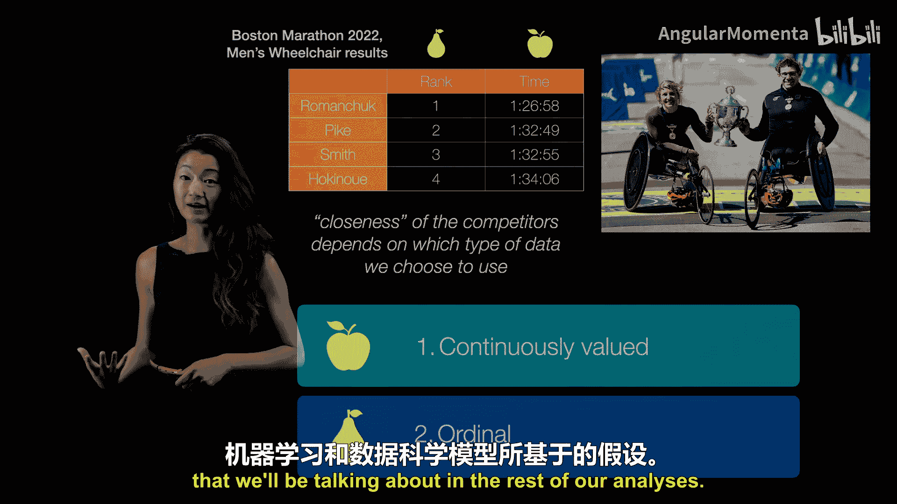
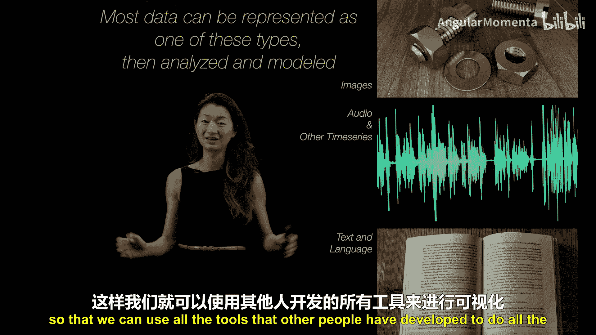
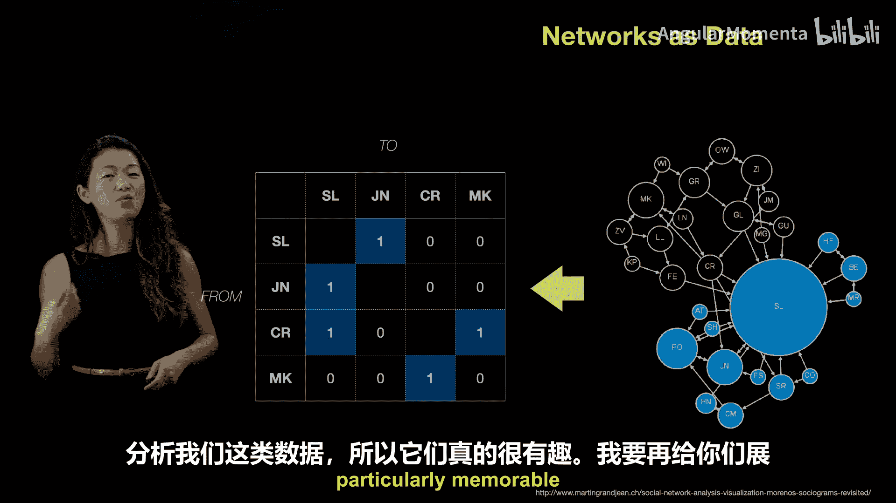
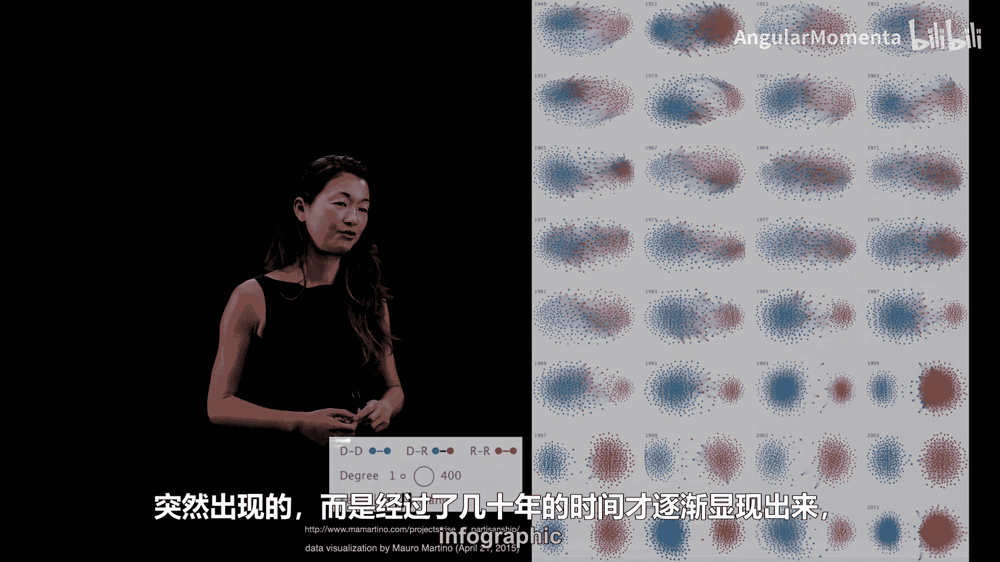

数据密集型工程导论：P13：13种不同类型的数据

在本节课中，我们将要学习数据的基本类型，以及为什么关注数据类型对于数据分析和可视化至关重要。上一节我们讨论了高维数据，本节中我们来看看构成这些数据的基本单元——数据类型。

理解数据类型是数据科学的基础。不同的数据类型决定了我们如何测量数据点之间的“距离”或“相似性”，而这一概念是机器学习、建模和可视化的核心。

我认为存在三种基本的数据类型，我将它们称为：**连续数值型**、**序数型**和**分类型**。关注它们是什么非常重要，因为尝试混合比较它们就像比较苹果和橘子。

**连续数值型**是最直观的数据类型。它就是一个数字。这些数字可以是正数、负数、整数、分数或小数。这类数据通常是我们能够测量的东西，比如你的身高（厘米）或手指的长度。

**序数型**数据听起来很像连续数值型，但有一个重要区别。序数型数据是**有序的非负整数**，用于表示顺序，例如第一名、第二名、第三名等。你不能得到“第一名半”或“负2.75名”。它们必须是表示顺序的非负整数，这一点很重要，原因将在稍后说明。

**分类型**数据比较直观，但必须与前两种类型区分开。分类数据存在于**不同的类别**中。例如，动物可以是浣熊、鳟鱼或冠蓝鸦。这些是不同的动物类型。浣熊不像鳟鱼，鳟鱼也不像冠蓝鸦，它们彼此截然不同，并且不明确一个类别是否比另一个更“接近”。

我们之所以关心这三种基本数据类型，是因为跟踪你所拥有的数据类型，能让你理解一个数据点与另一个数据点有何不同。这种“接近度”和距离度量的概念，即一个事物与另一个事物有多接近，是一个真正基础的概念，因为它构成了我们在建模、机器学习以及可视化中所做一切工作的基础。

我们如何衡量某物是否接近另一物，意味着我们可以建立定量关系，包括构建回归模型、分类模型，以及利用这些距离将事物放置在纸上或电脑屏幕上进行可视化。

以下是一个例子，说明你拥有什么类型的数据以及使用什么数据类型来计算距离度量，为何至关重要。最直观的距离度量可能用于前两种类型：连续数值型和序数型。

以2022年波士顿马拉松男子轮椅组的成绩为例。以下是比赛的前四名选手及其各自的完赛时间。我们可以看到，这是相同的结果：这四个人以这些时间完赛，分别获得了第一、第二、第三和第四名。

但如果你更仔细地观察，会发现第一名选手的完赛时间显著快于第二、第三和第四名。第二和第三名选手的完赛时间仅相差几秒，而他们落后第一名几分钟。大约一分钟后，第四名选手冲过终点线。

因此，如果我们将时间作为**连续数值型变量**使用，我们会说第一名选手与第二、三名选手相距甚远，而第二和第三名选手则更接近，因为他们的时间更接近。

相反，如果我们使用**序数型变量**，只看他们的排名顺序，那么你会说第一名与第二名的距离，和第二名与第三名的距离是相等的。所以，这里的选择很重要，并且没有标准答案。这是相同的结果，我们可以使用这两列数据中的任意一列来运行模型和可视化技术。但你选择哪一个很重要，因为这些竞争者之间的“接近度”取决于我们选择使用的数据类型。

正如我所说，这里没有标准答案，但关注这一点很重要，因为连续数值型和序数型变量对“接近度”的定义方式，是所有可视化技术以及我们将在后续分析中讨论的大多数机器学习和数据科学模型所基于的底层假设。

因此，即使你使用的数据不属于这些不同类型之一，大多数数据集也通常会被整理并归入这些数据类型之一，因为这些数据类型使我们能够计算距离和度量，从而决定后续如何处理它们。

例如，图像是一种非常常见的数据类型。图像可以很容易地转换为一组数字。一种常见的方法是获取每个像素，获取其强度数值（例如在RGB红、绿、蓝通道中的值），并将其转换为一组数字。

同样，如果你有一个音频序列或某种其他时间序列，你可以通过查看每个时间采样点，测量记录信号的振幅（正数或负数），并将其转换为一系列数字。在高维数据术语中，有时我们将每个时间点视为一个维度。这是一种方法，并非唯一方法，但这是将时间序列数据转换为高维数据的一种方式。

上一节我们简要提到了文本和语言数据，并介绍了一种将这种神秘类型数据转换为数字集合的方法。当然，还有很多其他方法，但处理文本和语言数据最常见的方式是将其转换为某种数字。

因此，思考这些数据类型非常重要。如果你的数据不属于这些类型之一，最常见的做法之一（我强烈推荐）是思考你拥有的数据最接近哪种类型。如果你能将你拥有的任何数据（比如光谱图像、某种脑成像研究）转换为类似于图像、音频或某种文本的东西，那么你就有能力利用学习和可视化领域中大量现成的工具。

这是一个非常重要的事情需要记住：这三种基本数据类型是什么，以及你如何将你拥有的任何数据转换为这些数据类型之一，以便我们可以使用其他人开发的所有工具来进行可视化和建模。

接下来，我将介绍几种不完全符合上述分类但可以转换为数字的数据类型。

第一种在不同情境下既有趣又有用的数据类型是**网络数据**。网络包含节点和关系。我将用一个非常简单的例子来说明。

我们在这里看到的网络可视化了某个一年级班级的孩子们。他们所做的调查是询问每个孩子：“如果你想选两个人坐在旁边，你会选谁？” 所有孩子都完成了这个小调查，结果可视化如下：每个圆圈代表一个个体，蓝色圆圈代表女孩，黑色圆圈代表男孩，圆圈的直径表示有多少人选择了这个人（即有多少人想坐在他/她旁边）。

你可以看到，SL非常受欢迎，一年级每个人都想坐在SL旁边。这里的社交动态通过这个网络可视化一目了然：有一个受欢迎的人，每个人都想坐在她旁边；然后男孩们想彼此坐在一起，女孩们也想彼此坐在一起，这是一年级非常典型的社交动态。

到了三年级，情况有所改变，不再有一个非常受欢迎的人，人们形成了四个友谊小组，但男孩和女孩之间仍然存在相当明显的隔离，他们更愿意与同性的朋友坐在一起。

到了八年级，情况发生了巨大变化。因此，通过将网络视为数据并观察这种网络可视化，可以揭示许多非常有趣的社交动态。

我想在这里非常明确地说明，如何将网络数据转换为我们讨论的三种基本数据类型那样的数值数据。我将再次查看这个一年级网络，展示一个子集，并明确说明如何将此类数据转换为一组数字。由于数据量稍大，我不在这里展示整个数据集，只展示四个个体。

我们将创建一个数字矩阵，每当一个人说他们想和另一个人坐在一起时，就在对应位置放一个1，否则放0。解读方式是：如果JN想坐在SL旁边，那么这个元素变为1；但JN没有说想坐在CR旁边，所以那是0；JN也没有说想坐在MK旁边，所以那里也是0。

如果你填写调查结果并将其放入此类矩阵中，我们就将网络数据转换为了数值数据。这也被称为**有向图**或**有向网络**，因为关系不一定是相互的。例如，CR想坐在SL旁边，但SL不想坐在CR旁边。因此，这可能是单向关系，所以这个矩阵不一定是对称的。

有很多工具可以用于可视化网络，也可以用于分析网络，它们非常有趣。

我将展示另一个我见过的、在可视化网络数据方面特别令人难忘的例子。这个例子是为了可视化国会议员以及他们多年来如何投票而创建的。

这里我们看到的是1951年的一个例子。每个点代表一位国会议员。他们根据自我认同是民主党还是共和党成员而被着色。每个点都与其他点相连，连接线基于他们是否曾在投票法案时意见一致。如果两位国会议员在任何法案上投票方式相同（无论是赞成还是反对），他们之间就有一条线。就是这样。

你可以看到1951年的情况：一边是蓝点，另一边是红点，但它们之间有很多连接线，因为国会议员在投票支持或反对特定法案时实际上经常彼此同意（这是对整个一年的总结）。

这是1951年。这是1993年发生的情况。正如我们将在未来的视频中讨论的，这是一个数据可视化使信息超级明显的案例。我认为我不需要多说1951年和1993年之间的区别。这真的很明显：蓝点和红点之间的隔离更加鲜明，如果你看它们之间，很难看到任何连接蓝点和红点的线。

这种可视化在许多年里重复进行，因此你可以看到蓝点和红点之间隔离的差异并非一夜之间发生，也并非在某一年发生，而是在事实上经过数十年逐渐形成，并达到了2011年（最下面的信息图）的程度，那时红点和蓝点几乎完全分离成不同的集群。

本节课中我们一起学习了数据类型，特别是介绍了三种基本数据类型：**连续数值型**、**序数型**和**分类型**。我们讨论了为什么了解你正在处理的数据类型非常重要，因为它决定了你如何分析和可视化数据。

这是一个重要的观点，因为这些数据类型通常是所有数学工具构建的基础。因此，如果你的数据不属于这些类型之一（例如，你有一个图像、一个音频文件或其他非自然属于这些类型的东西），你首先要做的事情之一就是思考可以将你的数据转换成这些数据类型中的哪一种。如果你能做到这一点，那么你就可以利用其他人构建的大量不同工具来处理你的数据，而无需从头开始发明一切。因此，关注你拥有什么类型的数据至关重要。