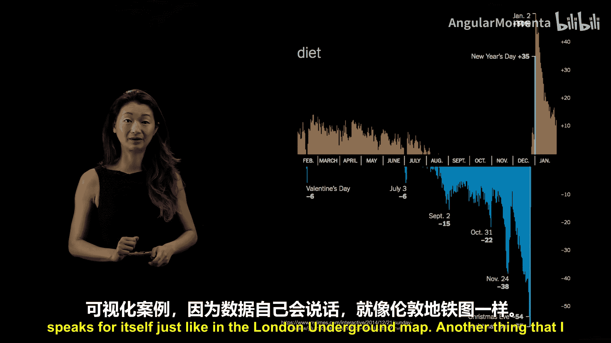
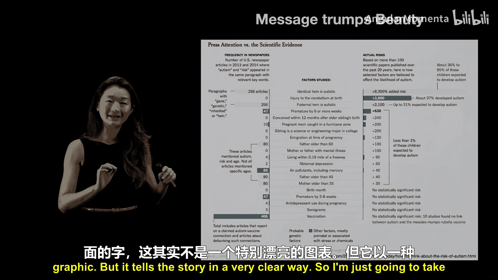
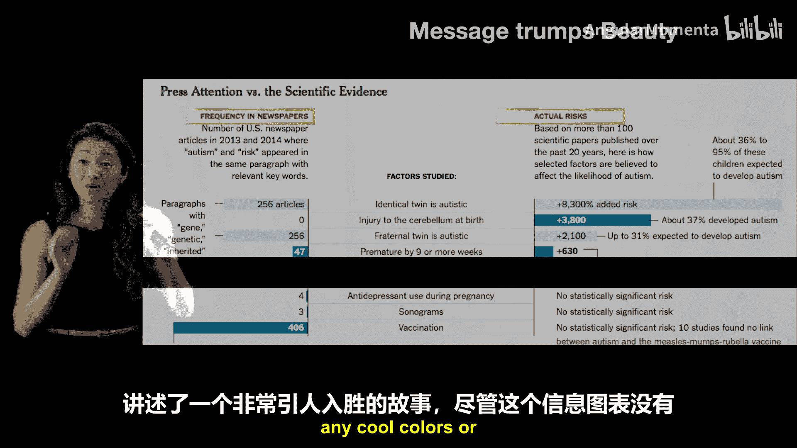

# 014：用数据可视化讲故事

在本节课中，我们将学习如何通过数据可视化来有效地讲述故事。我们将探讨几个关键原则，并通过具体示例说明如何制作能够“自己说话”的图表，从而清晰、有力地传达信息。

## 原则一：为清晰而简化，而非为精确而复杂

上一节我们介绍了数据可视化的目标。本节中，我们来看看第一个核心原则：有时，为了让信息更清晰，我们需要牺牲图表在物理意义上的绝对精确性。

一个经典的例子是伦敦地铁地图的演变。1908年的地图试图精确地按地理位置标注所有站点和线路。

然而，这张地图存在几个问题：
1.  市中心站点密集，在地图上挤在一起，难以辨认。
2.  大量空间被遥远的郊区站点占据，存在许多无用的空白区域。
3.  整体上，它无法有效地向乘客传达如何从一站到达另一站的关键信息。

因此，哈利·贝克在1931年重新设计了地铁图。这张图放弃了地理位置的绝对精确，转而专注于乘客最需要的信息：**站点之间的连接关系和换乘路径**。这种设计后来被全球各地的地铁系统广泛采用，因为它更简洁地传达了地下交通的核心信息。这个例子表明，通过忽略甚至“扭曲”次要信息（如真实地理位置），可以使图表对特定受众（地铁乘客）和特定故事（如何乘车）变得更加有用。

## 原则二：让图表自己“说话”

就像伦敦地铁图一样，最好的数据可视化通常不需要过多解释，其含义一目了然。

以下是体现这一原则的一个绝佳示例。这张图展示了“diet”（节食）一词在谷歌上的搜索频率，按一年中的日期排序。

图表自身清晰地讲述了一个故事：
*   在**1月1日**（新年伊始）出现一个巨大的峰值。
*   随后在年内几次小幅上涨，例如美国情人节前后和7月4日独立日前。
*   在下半年，搜索频率急剧下降，在**圣诞节**和**新年前夜**达到全年最低点。
*   然后，在下一个**1月1日**再次飙升。

这个故事关于“新年决心”和节假日对人们行为的影响，非常明显，无需额外文字说明。这就是一个成功的数据可视化，因为数据自己讲述了故事。

## 原则三：信息重于形式

我们经常看到非常精美的信息图。虽然欣赏它们，但我想强调一个信条：**传达的信息比美观的形式更重要**。

我最喜欢的数据可视化之一来自《纽约时报》，它对比了媒体对自闭症成因的关注度与科学证据显示的实际风险。

这张图并不特别“漂亮”，但它以极其清晰的方式讲述了故事。图的**左侧**列出了报纸中常被提及的“因素”及其出现频率，**右侧**则展示了科学已知的这些因素导致自闭症的实际风险。

例如，“疫苗接种”在媒体中被频繁讨论，但**没有任何科学研究**表明疫苗接种会导致自闭症风险。而“同卵双胞胎”有很高的科学风险关联，在媒体中的讨论却相对较少。

通过这种左右对比和中间的因素列表，它讲述了一个极具说服力的故事。尽管没有花哨的图形或炫酷的颜色，它仅凭清晰的布局就有效地传达了信息。

## 核心要点总结

本节课中，我们一起学习了用数据讲故事的两个关键要点，并通过示例进行了说明。

**第一，图表应让核心信息脱颖而出。**
在制作图表前，你应预先确定想要传达的核心信息。这个信息必须是观众看图时**视觉上最突出、最先被注意到**的内容。图表应该是不言自明的，不需要大量文字注解或专人解释。观众应能直接从图表中获取你想传达的要点。有时，同一数据集可以支持多个故事，这时你应该制作不同的图表来分别讲述，但每条图表都应遵循“信息突出”这一原则。

**第二，信息重于形式。**
你不必制作最光鲜亮丽的信息图来让信息突出。我的建议是始终遵循 **3C 原则**：
*   **清晰**：信息明确，不易被误解。
*   **简洁**：能用更少的文字或线条表达，就绝不使用更多。
*   **紧凑**：如果没有必要，减少留白；能用两种颜色就不要用五种。力求以最简化的形式有效传达你的信息。

在数据讲故事中，首要任务是准确、有力地传达信息，而非追求视觉上的极致美观。

