# 015：人工智能与机器学习的新进展 🚀

在本节课中，我们将探讨机器学习领域“可能性的艺术”。我们将通过一系列案例研究，回顾过去十年间机器学习能力的飞速发展，并分析哪些任务从困难变得简单，哪些仍是当前面临的挑战。理解这种动态变化的格局，有助于我们把握技术趋势，并思考如何将其应用于科学和工程领域。

## 可能性的艺术：不断变化的边界 🎯

上一节我们介绍了课程背景，本节中我们来看看“可能性的艺术”这一概念。它指的是机器学习领域能力的边界在不断扩展和变化。我们将通过一系列小案例，展示过去对机器学习而言很困难、如今已变得简单的任务，并指出一些目前仍具挑战性、但未来有望解决的问题。

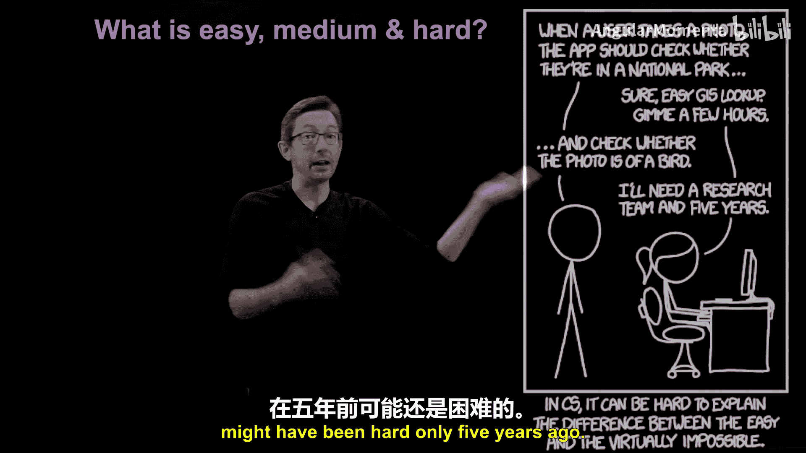

## 从漫画看技术变迁：图像识别的飞跃 📈

以下是理解技术发展速度的一个生动例子。

有一幅著名的XKCD漫画：当用户拍摄一张照片时，应用应该检查他们是否在国家公园里。程序员认为这很简单，只需地理空间查询。但当应用需要检查照片中是否有鸟时，程序员却说这需要一个研究团队花五年时间。

这幅漫画的有趣之处在于，它创作时，从照片中识别鸟类确实是一个需要多年研究的难题。然而现在，这已成为一项商品化的、现成的机器学习技术，集成在我们的手机中。这幅漫画在短时间内就因其“元”含义而变得更有趣，它生动地展示了“简单”与“困难”的边界在过去几年里移动得有多快。

## 图像科学的革命：从前沿到普及 📸

上一节我们看到了一个生动的对比，本节中我们来看看推动这一变革的核心领域：图像识别。面部识别和图像识别在过去十年中，已从一个前沿挑战变成了一个基本解决的问题。

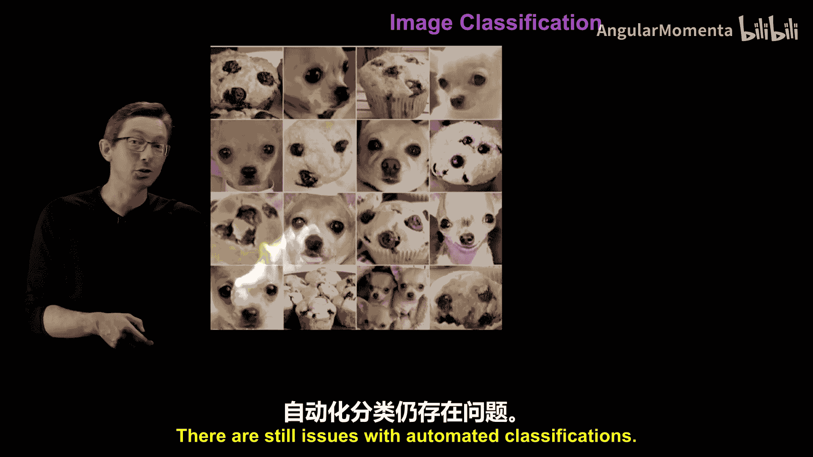

例如，现在可以非常准确地判断图像中是否有人脸，并能识别出是谁。十年前，这还是现代机器学习研究的前沿。如今，这已成为一项基本解决的任务。

这一突破主要归功于ImageNet数据集和深度神经网络的发展。2010年至2012年间，研究人员通过训练深度神经网络来解决ImageNet图像分类问题。

*   **ImageNet数据集 (2009年)**：由李飞飞团队构建。这是一个非常庞大的、带有标签的训练数据集，包含数百万张图像、数千个类别，每个类别都有许多手工标记的示例。这些高质量的训练数据是后续成功的基础。
*   **ImageNet神经网络模型**：这是一个能够将这些图像分类到各个类别的神经网络模型。

虽然人们的注意力常集中在神经网络模型上，但这场始于十年前的、让机器学习模型达到人类水平分类性能的革命，其真正的功臣实际上是**ImageNet数据集**。这提醒我们，一切通常都始于**数据**。一旦有了这样的训练数据，训练出强大的分类器模型几乎是必然的。

那么，为什么在2010年左右，神经网络训练能实现如此大的飞跃呢？就在几年前，神经网络还不是主流的机器学习范式。工业界主要使用决策树、支持向量机等。促成这一飞跃的因素包括：

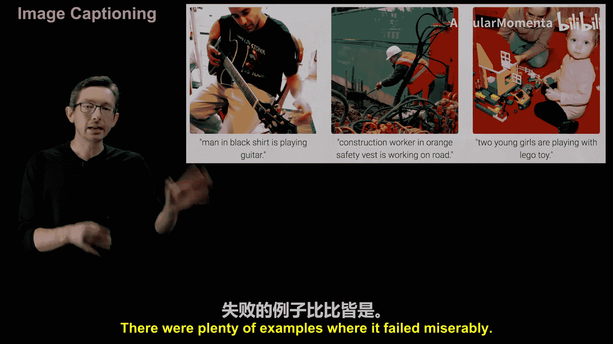

1.  **计算能力的快速提升**：尤其是非常适合神经网络并行计算的图形处理器单元。
2.  **显著改进的算法**：用于训练和优化神经网络权重以拟合训练数据。
3.  **大量的行业投资**：投入到如TensorFlow和PyTorch等开源软件和工具链中。
4.  **海量数据集**：规模越来越大。

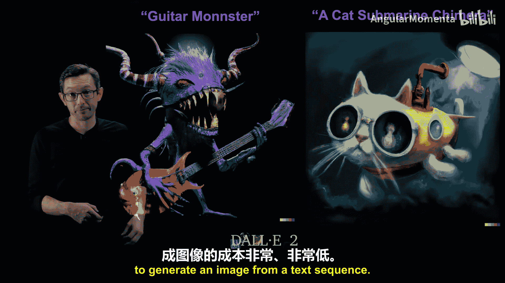

**高性能计算、更好的训练算法、海量数据集和行业投资的结合**，共同催化了过去十年机器学习的巨大加速。大多数人认为，现代机器学习时代始于图像分类领域的ImageNet突破。

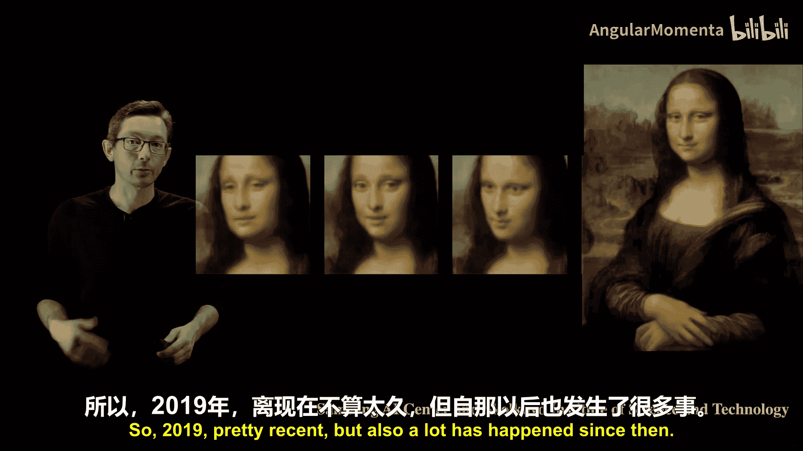

当然，它并非完美。自动分类仍存在一些问题，例如将吉娃娃误认为蓝莓松饼，或将炸鸡误认为狗。但这些更多是边缘案例，表明算法已经非常强大，只有在极端情况下才会出错。

## 从静态到动态：图像处理的扩展应用 🎬

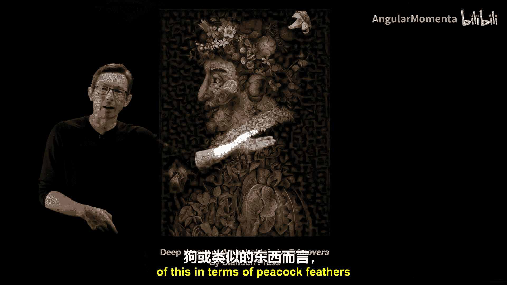

上一节我们介绍了图像分类的突破，本节中我们来看看其能力的扩展。图像分类取得重大突破后，监控成为了一个目标应用。虽然分类单张图像容易，但处理连续的图像序列需要处理更多数据，对实时性要求更高。如今，监控也基本成为一个已解决的问题，能够实时分割图像、跟踪物体、识别变化和新颖事物。

过去十年，生成式图像也取得了巨大进展。例如，模型可以生成以假乱真的花朵、收割机和西兰花图像。除非仔细观察，否则很难分辨。如今，我们有了深度伪造技术，可以生成难以辨别真假的假人视频。

大约五年前，图像描述成为一个有趣的话题。机器学习算法可以查看一张图片，并尝试生成一句话来总结或描述它。虽然2017年时还不完美，会出现一些可笑的错误描述，但在过去五年里，这项曾很困难的任务已变得异常简单，几乎成为已解决的问题。

我们现在正在研究**逆向问题**：根据一段文字提示，生成符合描述的图像。例如，DALL-E 2等模型可以根据“吉他怪物”或“猫潜艇嵌合体”这样的提示，生成极具创意和视觉吸引力的原创图像。五年前不可想象的事情，如今已成为唾手可得的商品化服务。

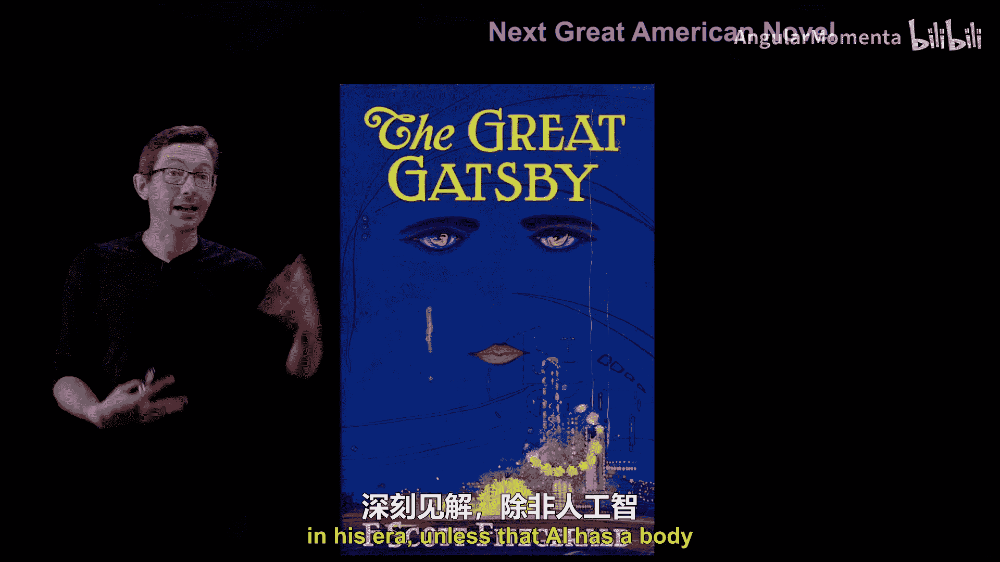

## 风格迁移：从艺术到物理的挑战 🎨

图像科学的趋势几乎都是如此。例如在2019年，三星和斯科尔科沃科学技术研究院合作，展示了如何对单张静态图像进行“风格迁移”，让蒙娜丽莎“开口说话”。自那时起，又发生了很多进展。

这让人联想到更早的Google DeepDream技术，它可以将图像分解并重构成由壁虎、小狗或花朵组成的怪异图片。这种将复杂图像分解为抽象部分，或将其风格转换为梵高等著名画家风格的能力，如今已成为机器学习的标准能力。

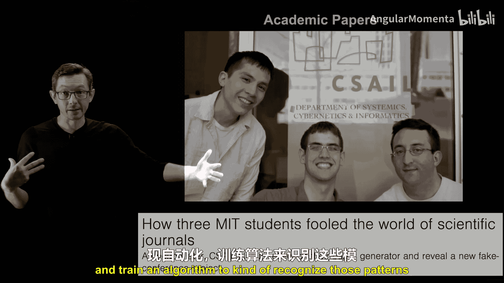

当前一个开放的研究难题，是希望将这种**风格迁移**思想应用到物理系统和工程系统中。例如，我们有一个低雷诺数的简单流体绕圆柱流动的模拟。用现成的算法，我们可以用著名艺术家的风格重新绘制这张图，这很容易。

但我们想做的是：将这种低雷诺数流动的“纹理”，迁移到高雷诺数（如真实飞机飞行时）的流动上。我们不仅希望它看起来像，还希望它在**质量、动量和能量守恒**等物理量上是定量准确的。这对于流体流动、材料科学等物理系统来说，目前还很困难，但全球的研究人员正在为此努力。

## 自然语言处理：从笨拙到革命性突破 📝

除了图像，自然语言和文本处理也经历了巨大变化。例如，让AI写出下一部伟大的美国小说，可能仍然极具挑战性，因为它需要对社会有深刻的洞察力，除非AI拥有身体并能与世界互动。

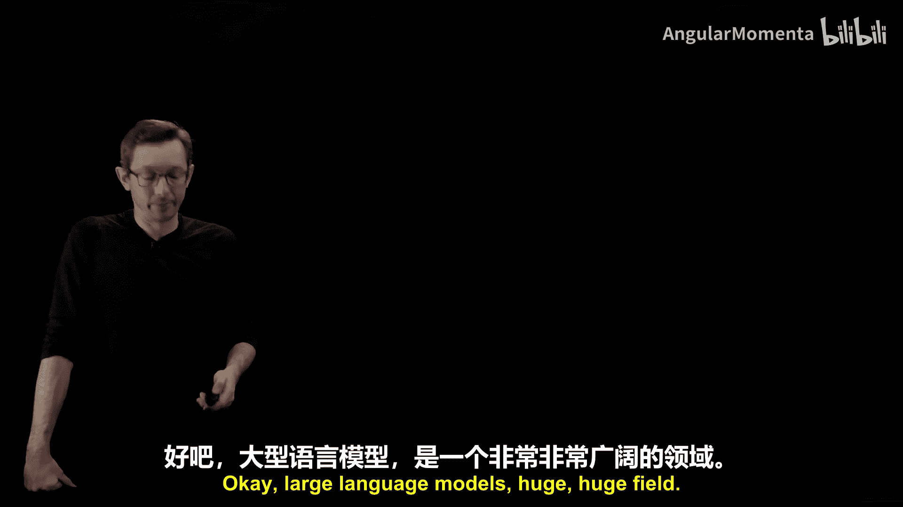

但这并不意味着它不能生成某些类型的小说。几年前，有研究利用《哈利·波特》原著和同人小说训练算法，生成新的同人小说文本。结果不算太差，但距离优秀还有很长的路。更早之前，甚至有算法能生成被顶级期刊会议接受的虚假学术论文，这或许更多地反映了学术出版的现状。

然而，就在最近，**ChatGPT等大型语言模型**彻底改变了可能性的边界，以远超预期的速度大幅提升了生成类人自然语言的能力。例如，研究人员将塞缪尔·泰勒·柯勒律治那首著名的未完成诗《忽必烈汗》的开头输入ChatGPT-3，它能够以柯勒律治的风格续写这首诗。虽然不完美，但已经相当不错。

这是一个重大突破。这些大型语言模型将改变我们日常的许多工作，如编写技术手册、为代码编写单元测试或自动文档、写邮件、代码自动补全等。我们才刚刚开始探索这些模型的潜力，而这项在几年前还非常困难的技术，现在正以惊人的速度加速发展。

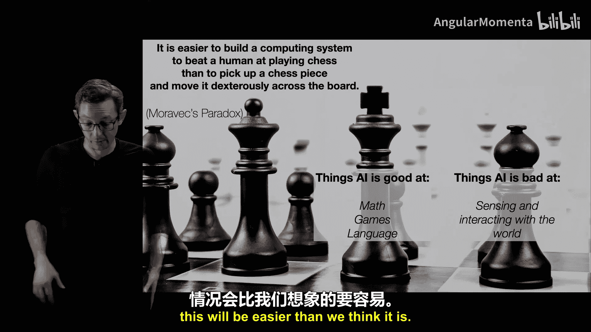

## 机器人学与游戏：思维与身体的差距 🤖

转向其他系统，有一个有趣的“莫拉维克悖论”：让计算机系统在象棋上击败人类，比让机械手拿起棋子并在棋盘上移动更容易。AI擅长数学、游戏，现在也非常擅长语言。但它目前还不擅长感知和与世界互动。

可以说，AI的“大脑”能力正在飞速发展，但“身体”方面的进展却远没有那么快。机器人学是一个超级令人兴奋的领域，有很多进展，但机器人实体的进步不如机器人思维的进步那样显著和快速。未来，这可能会是一个重要的区分点：有些事情需要与世界互动来收集信息、激发好奇心，从而丰富超越数学、游戏和语言的模型。目前这很难，但也许五年后会变得比我们想象的容易。

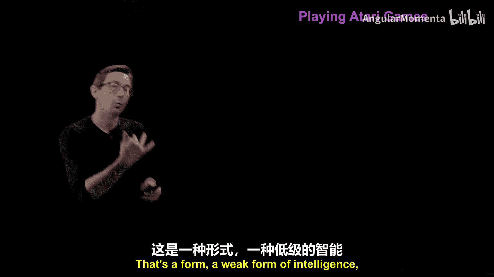

在游戏方面，机器已经表现得非常出色。2015年，DeepMind通过深度神经网络Q学习算法展示了强化学习的强大能力，可以在大多数老式雅达利游戏上达到或超过人类水平。例如，在一个打砖块游戏中，经过四个小时的训练，AI不仅学会了玩，还学会了只有人类专家才掌握的技巧：集中攻击一侧，利用游戏物理机制来帮助达成目标。这在我看来是一种弱形式的智能体现。

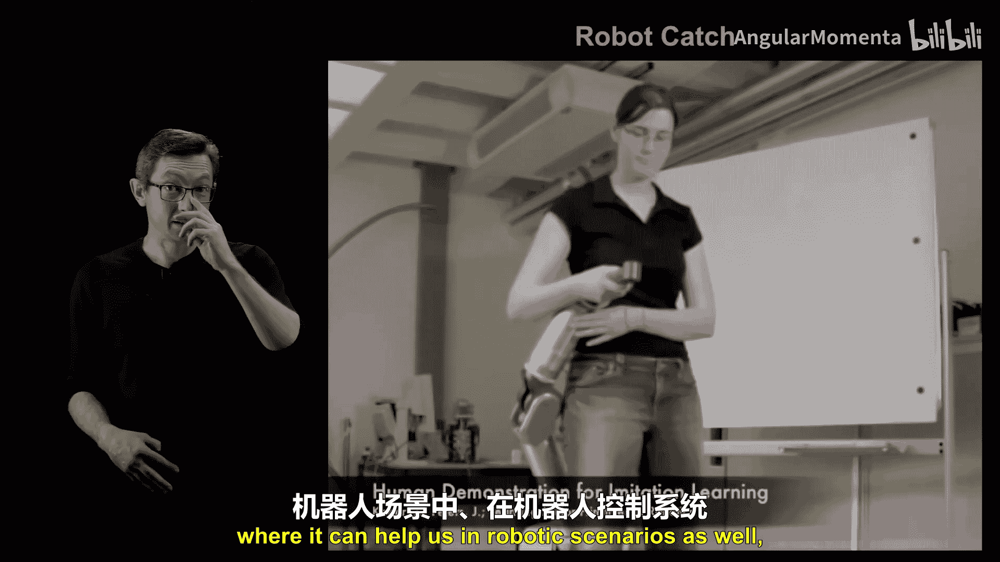

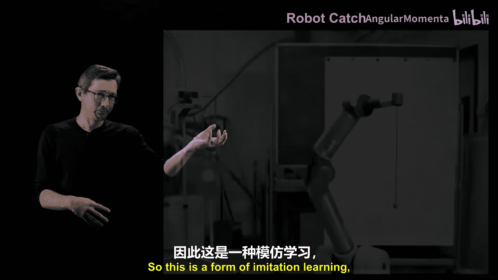

强化学习总体上是一个令人兴奋的领域，虽然进展速度可能不如其他一些领域快，但人类已无法在象棋或围棋上击败计算机。强化学习正发展到可以帮助机器人控制系统的阶段。例如，通过模仿学习，机器人经过几十次试验，可以学会用杯子接球，其学习速率已接近人类水平。

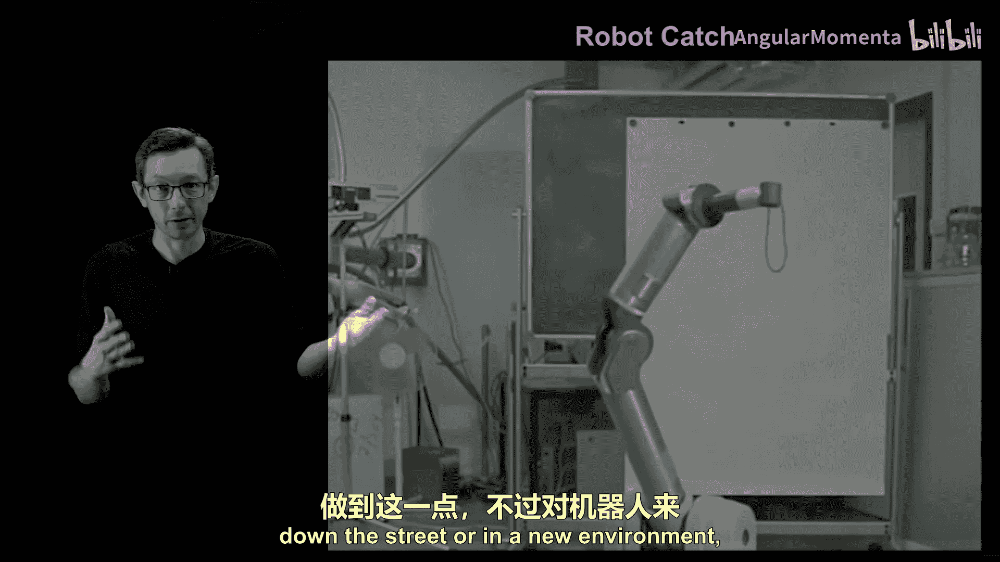

当然，对于每一个强化学习算法在游戏或机器人上成功的新例子，都有无数失败的例子。机器人非常具有挑战性，像波士顿动力这样的系统很大程度上依赖于精心调整的基于物理的模型，学习算法在机器人领域仍然挣扎。但在过去五年中已有重大进展，它不再是一尝试开门就摔倒。这个领域发展非常迅速，但仍有很长的路要走。

## 固有的挑战与伦理考量 ⚠️

我们已经涵盖了图像、语言、机器人和游戏。需要指出的是，有些问题由于其数学和物理本质，可能永远都是困难的。例如**预测混沌系统**（如飓风路径或下周天气），无论模型多好，基于给定的测量精度，其预测能力都存在理论极限。

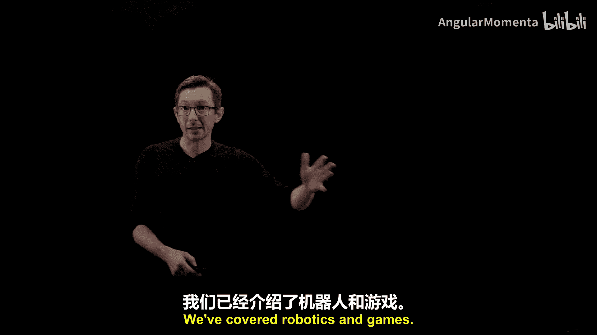

此外，有时我们的机器学习模型会产生意想不到的后果。例如，亚马逊的推荐算法可能会因为数据中的购买模式，向购买某种物品的用户推荐镁条和铝粉（这是制作铝热剂的配方），而不会考虑其后果。

因此，在“简单、中等、困难”之外，还有其他维度，比如我们能否为这些技术设置“护栏”，以防止它们给出不道德或危险的解决方案。这在当前ChatGPT和大型语言模型领域尤为突出，因为这些模型拥有令人信服的语言技巧，可能被滥用。

## 总结与展望 🌟

本节课中，我们一起学习了机器学习领域“可能性的艺术”。我们回顾了过去十年间，图像识别、自然语言生成等领域如何从困难挑战变为成熟应用，也探讨了机器人控制、物理系统建模等当前仍面临的难题。我们看到了技术边界快速移动的特点，并思考了其中的伦理与安全影响。

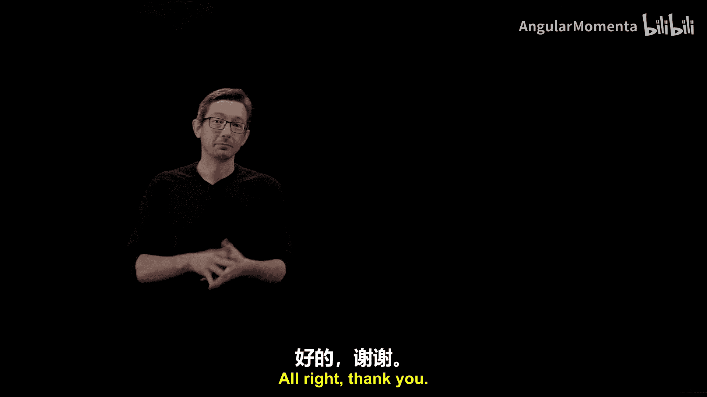

对于工程师和观众而言，一个令人兴奋的前沿是，将所有这些为图像科学和语言模型开发的技术，迁移到受物理定律（如F=ma）支配的世界中，应用于飞机、汽车等工程系统。推动机器学习解决科学和工程挑战，将是未来五到二十年一系列非常引人注目的发展方向。