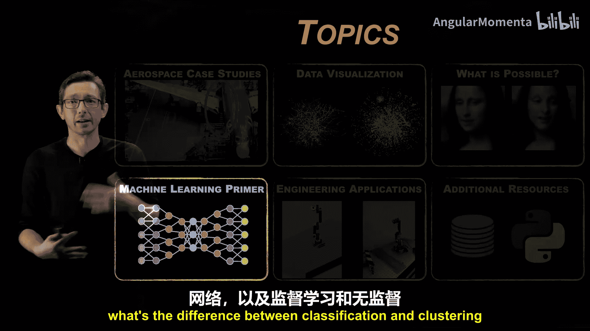
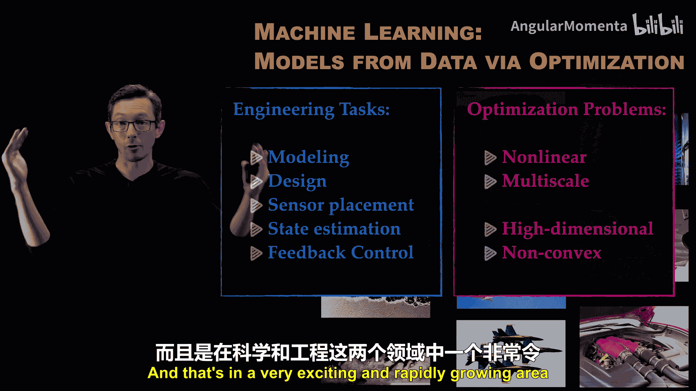
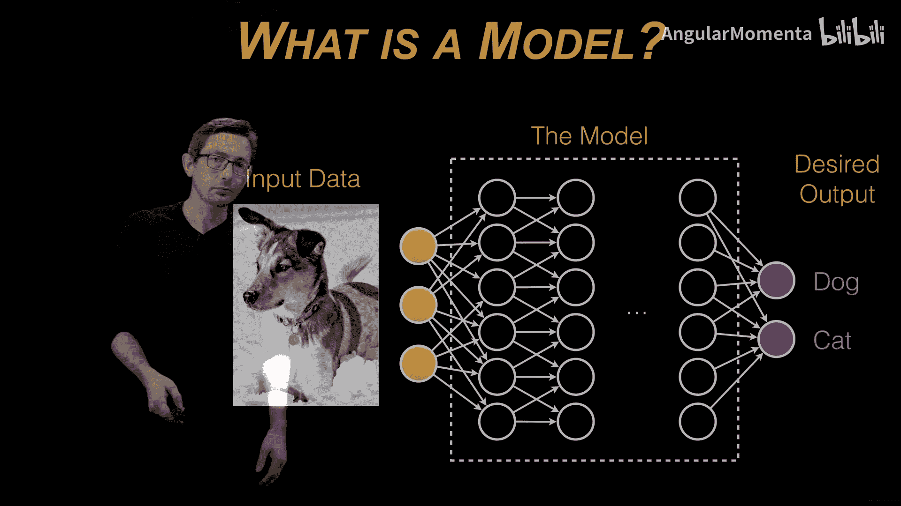
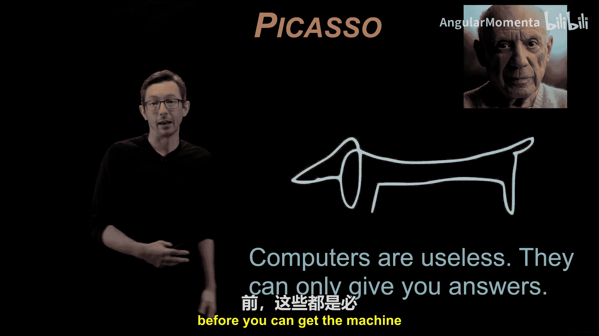
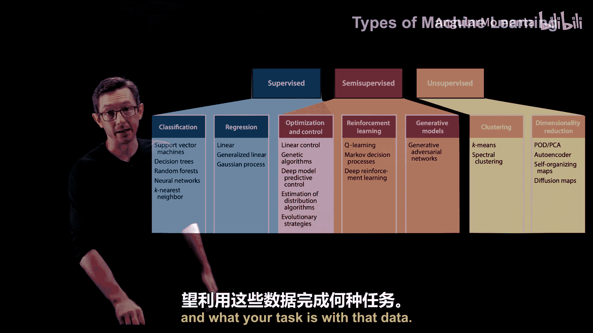
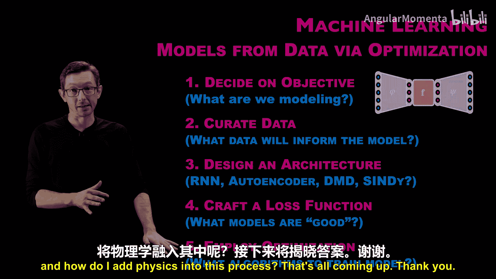

# 016：如何构建ML模型

在本节课程中，我们将学习机器学习的基础构建模块。我们将了解机器学习的工作原理、如何构建模型，并揭开机器学习的神秘面纱。你将看到模型是如何构建和训练的，以及有哪些类型的模型能实现我们所见过的惊人功能，如图像分类、大语言模型等。首先，我将概述所有类型的机器学习及其含义，然后我们将特别讨论神经网络，以及分类与聚类、监督学习与无监督学习等概念之间的区别。

我经常用一个玩笑来开场，因为当我向普通听众介绍机器学习时，他们常常觉得机器学习很神奇。亚瑟·C·克拉克有一句名言：“任何足够先进的技术都与魔法无异。”某种程度上，我的iPhone对我来说就像魔法，因为它能完成惊人的事情，而我并不完全了解其原理。虽然我知道它基于晶体管、天线、电池和软件，并非完全不可理解，但它确实感觉像魔法。因此，我们的目标是快速揭开机器学习的神秘面纱。

我将进行一个高度简化的概括：**机器学习本质上就是从数据中构建模型的过程**。通常，我们使用优化或回归算法从数据中构建这些模型。

这样表述就澄清了机器学习的本质。机器学习本质上就是执行某些任务的输入输出模型。它们使用优化和回归算法，基于现实世界的数据进行训练。这个定义虽不完全精确，但在大多数情况下足够准确，是一个很好的工作定义。我们从数据中构建模型已有数十年历史，因此我们理解如何去做。机器学习之所以新颖有趣，是因为我们现在拥有更多数据、更好的优化算法，以及更具代表性和灵活性的模型（如神经网络），并且最终能在高性能计算架构上进行训练。从数据中构建模型的概念对我们来说是合理的。

通常，我们通过解决优化问题来从数据中构建这些模型。同样，我们日常考虑的许多工程任务，如建模、设计、传感、估计、控制，最终都是困难的优化问题，具有高维、非凸等特性，这与我们训练大多数机器学习模型时遇到的问题相同。训练深度神经网络也是高维和非凸的。因此，这两者结合得非常好，我们可以使用机器学习工具来解决工程和优化问题。这是一个在科学和工程领域都非常令人兴奋且快速发展的领域。

那么，什么是模型？如前所述，机器学习是从数据中构建模型的过程。

模型本质上可以看作一个函数，它接收输入数据，并输出人类关心的某些值。这个函数内部如何评估输入输出关系，有无数种方式可以在计算机程序中表示这个模型。但归根结底，它是一个输入输出程序。在这个例子中，输入数据可能是一张狗或猫的高分辨率图像（这是我的狗Mordecai）。输入数据会被送入模型，模型是输入数据 `x` 的某个函数 `f(x)`。

这个模型会对数据进行一系列计算。它可能运行一个小的卷积滤波器，可能寻找耳朵和口鼻部。谁知道它具体做了什么，它可能是一个复杂的函数。完成所有这些数值计算后，输出将是某个期望的输出。例如，如果我试图构建一个区分狗和猫的分类器，那么我的输出可能是一个二维向量，包含它是狗的概率和它是猫的概率。如果我的模型做得很好，当我输入一张狗（Mort）的图片时，这个向量应该返回 `[1, 0]`，因为它非常确信这是一只狗。这就是我们所说的机器学习模型。

同样，模型内部不一定是神经网络。你可以使用决策树、随机森林、支持向量机等。有许多不同的方法来训练和表示这个输入输出函数。事实证明，神经网络是表示函数最灵活的方式之一，因此如今被广泛使用。但机器学习远不止神经网络，这也是一个非常重要的认识。

这个例子和图片来自我的朋友Nathan Cus，我非常喜欢它。自从他提出这个例子后，它就印在了我的脑海里。这是毕加索的一句话：“计算机是无用的，它们只能给你答案。”我认为Nathan在毕加索的这句话和机器学习之间建立了非常深刻的联系。机器学习也是如此：**机器学习是无用的，它只能给你模型输出**。你必须自己决定要建模什么、模型的输入和输出是什么。因此，在构建这些机器学习模型的过程中，仍然需要大量的人类专业知识和指导。你需要设计架构，决定模型要实现的目标，整理训练数据，并决定如何运行优化。这些都是需要人类在让机器为你生成答案之前提出的问题。

机器学习有许多类型，这里的分类只是粗略的，实际类型比我展示的更多。但这是一个大致的分类。一些主要的分类包括监督算法和无监督算法，我稍后会详细讨论。核心思想是：**监督算法的训练数据带有标签**。如果我有一堆狗和猫的图片，并试图构建一个分类器，如果所有这些训练数据图片都被人手工标记了（这张是狗，那张是猫，另一张又是狗），那么你开发的用于区分狗和猫的机器学习算法就是一个分类器。因此，监督学习有标签。如果我想根据标签区分狗和猫，我会构建一个分类器。有很多技术可以做到这一点，如支持向量机、决策树、随机森林。神经网络是当今非常强大的一种方式，但根据你拥有多少数据、数据类型是什么、是否需要可解释性等因素，还有很多其他选择。

在**无监督学习**的世界里，当我没有标签时，如果我给你一大堆狗和猫的图片，但不告诉你哪张是哪张，你仍然可能从这堆数据中提取信息，并发现存在两种不同动物的大类别。但没有标签，这更像是一种聚类算法。也许我会学习到一个主要对应狗的聚类，和另一个主要对应猫的聚类。但这是一个不同的任务，这更像是从数据中挖掘模式，是在不知道标签的情况下发现规律。

此外，还有很多介于两者之间的方法，我们称之为**半监督学习**，其中存在部分知识、部分标签或部分数据被标记。像强化学习和生成模型通常属于这种模糊的中间地带。

我们会更多地讨论所有这些类型，但我只想让你知道机器学习有很多不同的类型，通常取决于你拥有什么类型的数据以及你对该数据的任务是什么。

在结束机器学习入门模块的这一部分之前，我想在抽象层面谈谈训练和构建机器学习模型需要哪些步骤。

机器学习通常是通过解决优化问题从数据中构建模型的过程。因此，我想简要地概述这些步骤，因为稍后，请记住我们是工程师和科学家，我们将进行物理信息机器学习，并从数据中构建物理模型。我希望你理解所有阶段，并记住你将能够将物理学知识、你对物理和工程原理的先验知识融入到所有这些步骤中。

到目前为止，第一步，回想一下毕加索的话，你必须首先决定你要问的问题，决定目标。给定什么数据，我的机器学习模型的输入和输出是什么？我希望模型基于该数据做出什么决策？这是需要人类决定的事情。这是人类专业知识介入决定目标的地方。

训练的第二部分是**获取训练数据**。如果你不是从训练数据中构建模型，那就不是机器学习。哪些数据将为模型提供信息？你可以访问哪些训练数据？它是否有标签？它是否包含你正在寻找的函数的输出？我将在这里使用什么数据？

第三步，也是很多关注点所在的令人兴奋的一步，是**设计架构**。我打算使用神经网络吗？如果是，使用哪种类型的神经网络？是循环神经网络还是自编码器？我打算使用像DMD这样的线性回归技术吗？我将使用什么实际架构来表示那个输入输出函数？我已经决定了一个函数，现在我要决定哪种架构可能表示我试图学习的输入输出关系。是循环神经网络、自编码器还是其他？

一旦我们有了一个架构（这是一个架构的例子，它是一个具有特定形状和结构的特定神经网络，我认为它可能适合学习某些类型的输入输出关系），接下来我就可以写下我要优化的**损失函数**或**目标函数**。这就是我们判断模型好坏的方式，即它在这个损失函数上的得分如何。损失低更好，损失高则差。因此，我要做的基本上是写下一个数学表达式，根据我的数据和我的输入输出函数，来衡量它与训练数据的匹配程度，这告诉我我的模型做得好还是坏。

最后，我们实际上必须采用某种**优化算法**。也许我必须编写自己的优化算法，或者使用现成的优化器，它本质上通过改变权重、调整架构的权重来最小化这个损失函数，以最好地拟合数据并满足目标。

这就是一个完整的大致流程。你必须选择要建模的内容，必须找到能为该模型提供信息的数据，选择一个你认为可以表示你试图近似的函数的架构，写下一个损失函数或目标函数来判断训练后是否做得好，然后优化架构的权重以最小化数据上的损失函数。简而言之，这就是机器学习的整个过程。所有这些环节都充满了让人类专家介入、影响和引导这个过程的机会。这不是一个自动化的过程，无论从外表看起来多么像，它都不是即插即用的。机器学习是一项人类事业，是人类从实际数据中建模现实世界的工具，我们可以指导所有这些步骤。

最后一点是，如果我有一个物理系统，一个受 `F=ma` 或某种工程第一性原理支配的系统，我通常有机会在每个阶段加入这些第一性原理，使我的机器学习模型更好、更符合物理。这被称为**物理信息机器学习**。我们肯定会在工程系统的背景下讨论这个问题。这是一个巨大的机会，可以显著改进物理系统的机器学习，并从这些模型中获取更多性能和洞察力。例如，如果我对流体流动建模，我可能希望我的模型是能量守恒的，我可以将这一点纳入这个过程的不同阶段。

好的，概述就到这里。接下来我们将开始深入探讨什么是神经网络，监督学习和无监督学习之间的区别，以及如何在这个过程中加入物理知识。这些内容即将到来，谢谢。

**本节课总结**
在本节课中，我们一起学习了机器学习的基础概念。我们明确了机器学习是从数据中构建模型的过程，通常通过优化算法实现。我们了解了模型本质上是输入输出函数，并区分了监督学习（有标签）和无监督学习（无标签）等主要类型。更重要的是，我们详细拆解了构建机器学习模型的完整流程：1）定义问题与目标；2）获取训练数据；3）选择模型架构；4）定义损失函数；5）执行优化训练。我们认识到，机器学习并非全自动魔法，每个步骤都需要人类的专业知识和引导，尤其是在工程领域，我们可以将物理原理融入其中，形成更强大的物理信息机器学习。下一节，我们将开始深入探讨神经网络的具体构成。