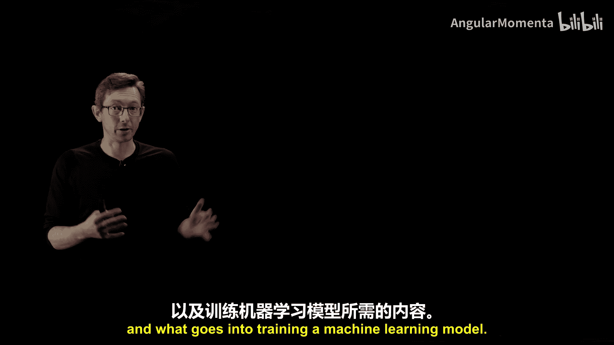
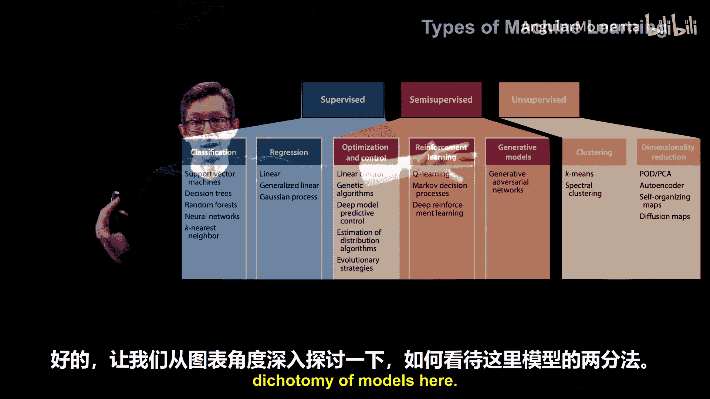
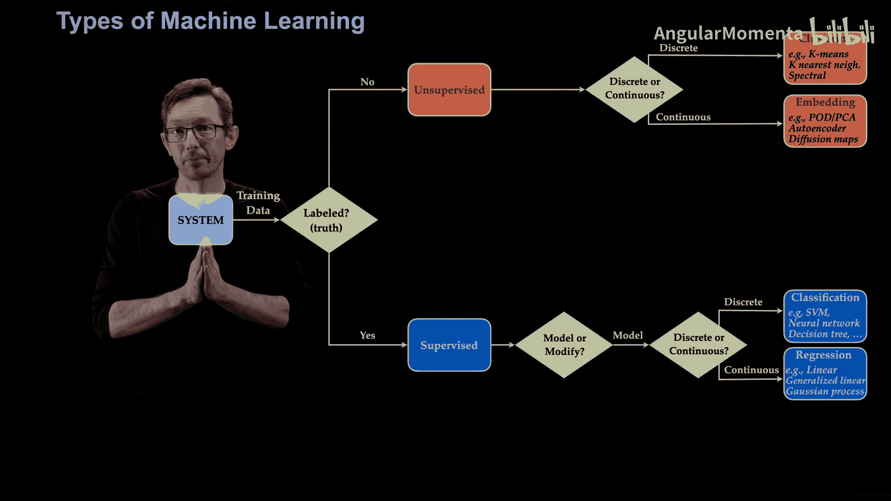

# 017：监督与无监督机器学习 🧠

在本节课中，我们将深入学习机器学习的核心分类，特别是监督学习和无监督学习的区别。我们将探讨如何根据数据的特性（如有无标签、标签是离散还是连续）来选择合适的学习任务类型，并简要介绍介于两者之间的半监督学习领域。

## 机器学习分类概述

上一节我们介绍了机器学习的基本概念，本节中我们来看看其核心的分类体系。机器学习算法主要根据训练数据的性质进行划分，其中最关键的区别在于数据是否带有“标签”。

## 核心分类：监督 vs. 无监督

机器学习的一个主要二分法是**监督学习**和**无监督学习**。

*   **监督学习**：你的训练数据包含了你希望模型预测的目标值，这些目标值被称为**标签**。模型的目标是学习从输入数据到这些已知标签的映射关系。
*   **无监督学习**：你的训练数据**没有**标签。模型的目标是从数据本身中发现内在的结构、模式或分布。

值得注意的是，在这两者之间存在一个广阔的灰色地带，即**半监督学习**。许多前沿研究，如强化学习和生成模型，都发生在这个领域。

## 深入监督学习

如果我们拥有带标签的训练数据，就进入了监督学习的范畴。接下来，我们需要根据标签的性质进一步确定任务类型。

以下是判断流程：

1.  **问题**：我的标签（即模型要预测的目标）是**离散变量**还是**连续变量**？
2.  **离散标签（分类任务）**：标签代表有限的、不同的类别。例如，区分图片中是“狗”还是“猫”，或者识别不同的人。这类任务称为**分类**。
3.  **连续标签（回归任务）**：标签是可以取任意数值的连续量。例如，预测机翼的**升力**或**阻力**。这类任务称为**回归**。常见的算法包括线性回归、逻辑回归和高斯过程等。

**示例**：
*   如果你有一组不同翼型的模拟数据，并且知道每个翼型对应的升力和阻力值，那么你拥有带连续标签的数据，适合构建一个**回归模型**来预测新翼型的性能。
*   如果你有一组已标记为“狗”或“猫”的图片，那么你拥有带离散标签的数据，适合构建一个**分类模型**来识别新图片。

## 深入无监督学习

如果我们没有带标签的训练数据，则属于无监督学习。此时，我们需要根据数据本身的内在结构来判断任务类型。

以下是判断流程：

1.  **问题**：我相信我的数据本质上是形成**离散的簇**，还是遵循一种**连续的分布**？
2.  **离散结构（聚类任务）**：数据点天然地聚集成不同的群组。例如，即使没有标签，一堆狗和猫的图片也可能在特征空间中形成两个明显的簇。这类任务称为**聚类**。
3.  **连续结构（嵌入/分布学习任务）**：数据点在一个连续的空间中分布，没有清晰的边界将其分割成独立的簇。这类任务常被称为**嵌入**或**分布学习**。例如，分析不同几何形状翼型周围的流场数据（但没有升力/阻力标签），这些流场数据可能遵循一个复杂的连续分布。

## 重要的中间地带：半监督学习

当训练数据只有**部分标签**时，我们进入半监督学习领域。这可能意味着只有一部分数据有标签，或者标签本身不完整。

在这个领域，任务的目标通常可以进一步区分：

*   **生成模型**：目标是学习数据的整体分布，以便能够生成新的、类似的数据样本。**生成对抗网络（GANs）** 和“深度伪造”技术就属于此类。
*   **强化学习**：目标不仅是建模系统，还要**与系统交互并修改它**，以达成某种控制或优化目标。它涉及一个反馈循环，算法根据输出结果调整自身行为，从而改变系统生成数据的方式。这是机器学习与控制理论的交叉前沿领域。

同样，在监督学习中，模型也可用于系统优化和控制，强化学习可以看作是经典非线性优化与控制算法在部分可观测场景下的一种延伸。

## 总结与关键要点

本节课中我们一起学习了机器学习的主要分类框架。

核心要点可以概括为以下决策流程：
1.  数据有标签吗？ → 决定是**监督**还是**无监督**学习。
2.  标签/数据是离散还是连续？ → 决定是**分类/聚类**还是**回归/嵌入**任务。

这构成了经典机器学习的四种主要任务类型：**分类、回归、聚类、嵌入（分布学习）**。此外，还有更高级的**生成模型**和**强化学习**存在于半监督的中间地带。

最后需要强调的是，**机器学习并不等同于神经网络**。上述每一种任务类型都有多种算法可以实现，神经网络只是其中一类强大的工具。具体选择哪种算法，取决于你的数据特点和目标。