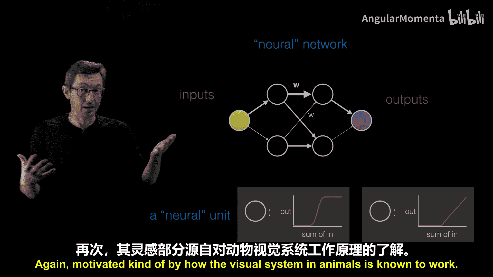
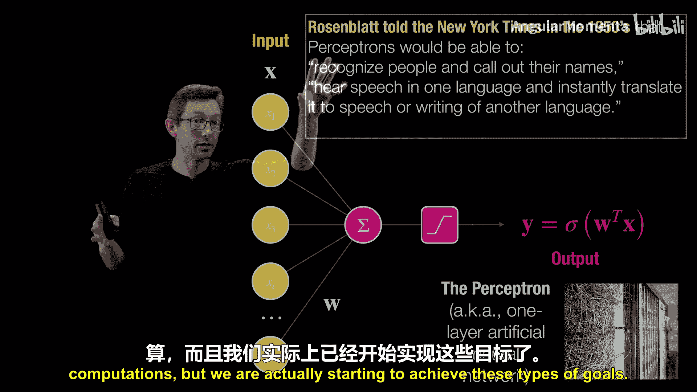
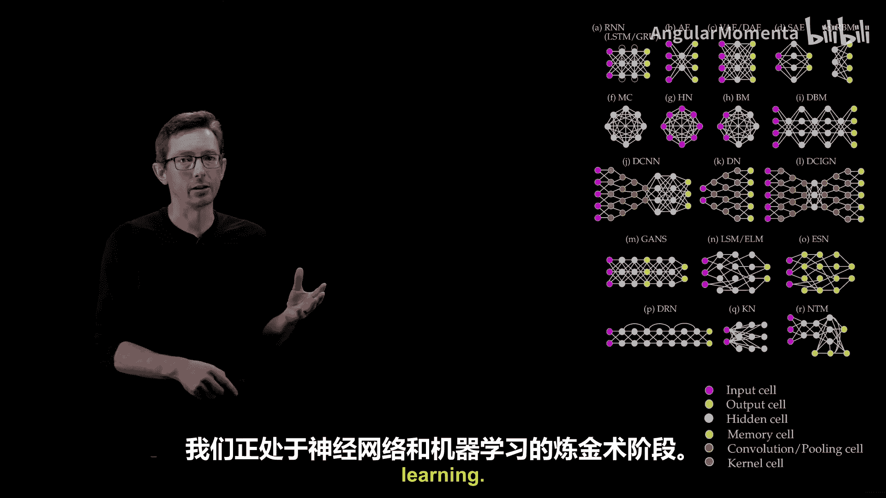
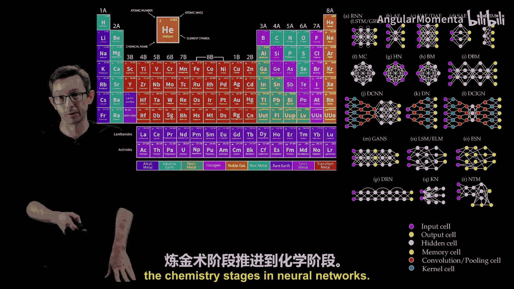
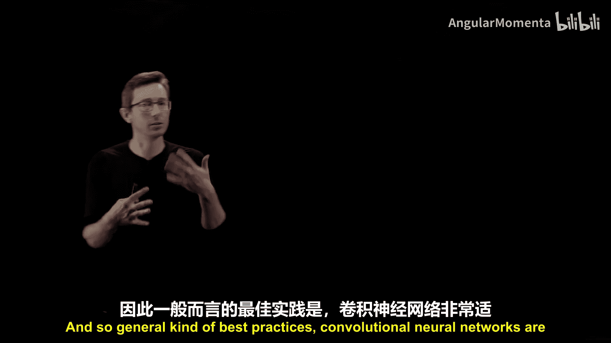
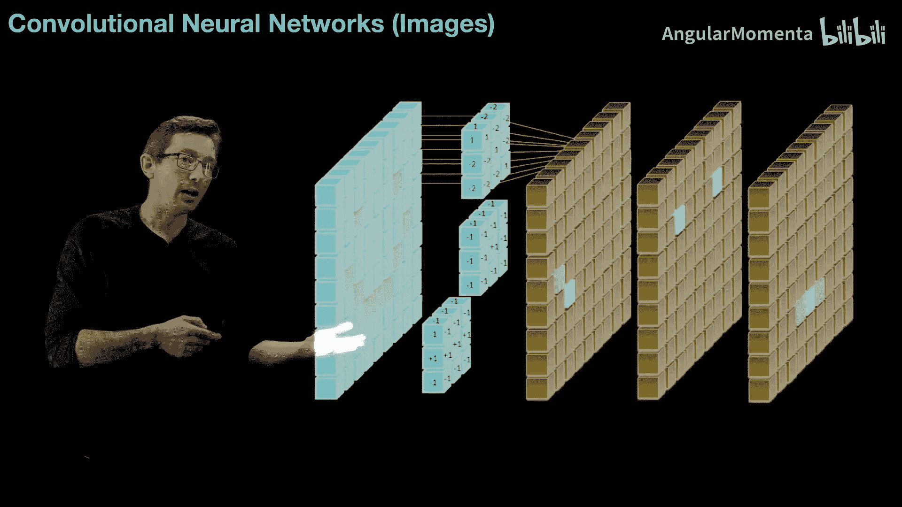
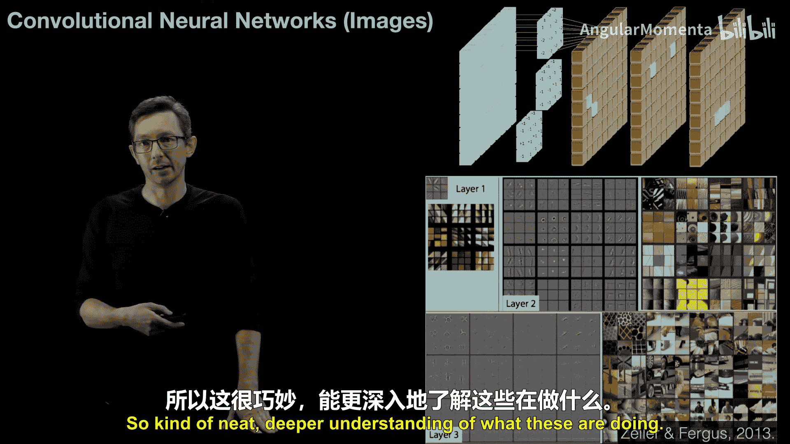
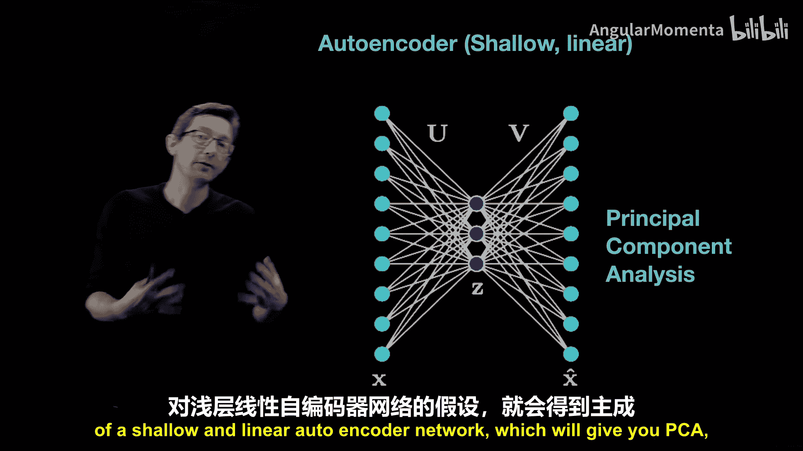
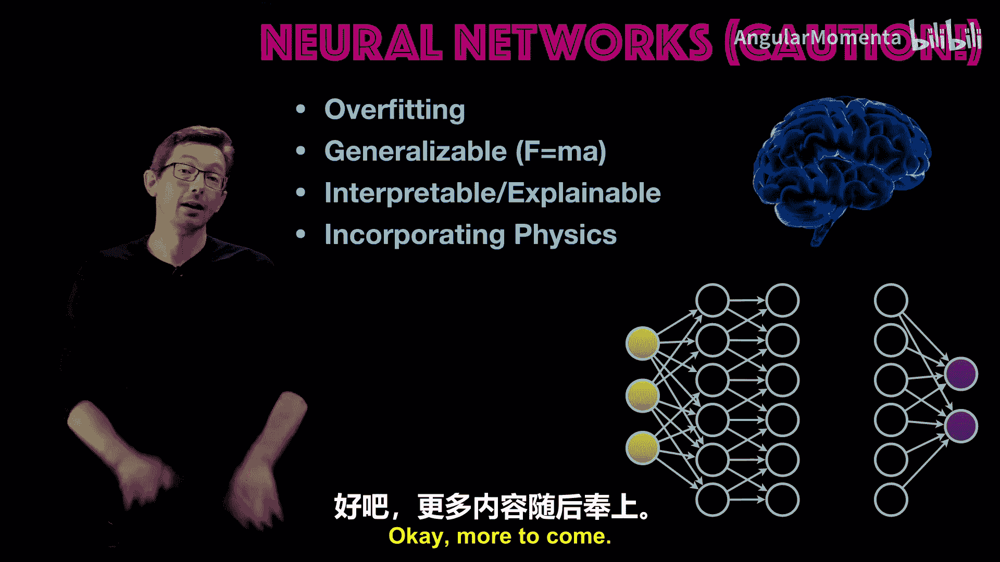

# 018：神经网络入门 🧠

在本节课中，我们将要学习机器学习中最强大的架构之一：神经网络。我们将介绍其基本概念、工作原理、发展历程以及不同类型的网络架构。

## 概述

上一节我们讨论了机器学习及其不同类型。本节中，我们来看看什么是神经网络。神经网络是机器学习中最强大的架构之一，在过去十年中已主导了从图像分类到大型语言模型等大多数机器学习任务。

## 什么是神经网络？

神经网络的设计灵感最初来源于生物学，旨在模拟大脑或神经系统中耦合神经元网络的学习方式。

本质上，神经网络由输入和输出组成。图中的每个圆圈被称为一个**节点**或**神经单元**。每个节点对其输入执行一些基本的数学计算，并产生一个输出。单个神经单元接收其输入数据的总和，并输出一个关于这些输入的函数。



经典的神经单元函数是**S型函数**或**双曲正切函数**，这源于生物神经元的特性：信号过弱时不激发，信号过强时激发速率存在饱和，中间存在线性响应区域。然而，现代神经网络常使用**整流线性单元**，其函数形式如下：

```python
# ReLU (Rectified Linear Unit) 函数示例
def relu(x):
    return max(0, x)
```



这些神经元或节点被堆叠在一起，形成一个神经网络，通过一系列计算从输入构建输出。

## 神经网络的工作原理

输入数据信号进入第一层神经元进行计算。这些神经元的输出作为输入，进入下一层神经元。这些输入经过加权求和，并通过非线性函数处理，产生新的输出。这个过程层层传递，最终得到网络的输出。

因此，神经网络的核心是一种带有权重的**函数嵌套组合**。这些权重通常是训练神经网络模型时需要学习的**自由参数**。训练开始时，权重可能被随机初始化，然后通过**学习过程**来更新这些权重，从而调整网络的连接方式。

这是一个相当简单的网络。实际上，网络可以有很多层，每一层都在进行计算的抽象，将庞大的计算分解为更小的部分，这在一定程度上受到了动物视觉系统工作方式的启发。

## 从感知机到深度学习



**感知机**是几十年前提出的单层神经网络。它接收一个输入向量（如图像或时间序列），计算输入的加权和，然后通过一个非线性函数（如S型函数）产生输出。其数学表达非常简单：

**输出 = σ(W · X)**





其中，`σ` 是非线性激活函数，`W` 是权重向量，`X` 是输入向量。

从感知机到今天的革命，关键在于**深度神经网络**或**深度学习**。“深度”通常指具有多层计算抽象。多层结构允许网络拥有更强的表达能力和更高的性能。但随之而来的挑战是，需要学习的所有这些自由参数（连接权重）要求大量的训练数据和非常快速的大型计算机。幸运的是，我们正处在拥有海量数据和强大计算资源的时代，能够训练非常深、非常大的神经网络。



深度神经网络通过分层抽象特征来工作。例如，在图像识别中，一层可能识别小的边缘或角落，下一层可能将这些特征组合成眼睛或鼻子等更大的特征，更深层则可能识别出整张脸。这种分层、层次化更复杂的计算，是当前解决许多困难机器学习建模问题的核心策略。



## 神经网络的类型与选择

目前存在许多不同的神经网络架构，每种架构适合解决不同的问题。以下是一些主要类型及其适用场景：

*   **卷积神经网络**：非常适合处理图像数据。如果你的数据具有空间相关结构（如图像），并且需要考虑平移不变性（例如，识别图片中的狗，无论狗在图片的哪个位置），那么卷积神经网络是一个很好的选择。它通过滑动滤波器在图像中寻找特征。
*   **循环神经网络**：非常适合处理时序数据，如音频或时间序列。与信息单向传播的前馈网络不同，循环神经网络具有反馈回路，能够记忆和学习时间序列中的趋势，因此常用于建模微分方程和随时间演化的系统。
*   **自编码器**：非常适合处理高维数据（如大型图像、流场），并相信其中存在低维结构。自编码器通过一个信息瓶颈将高维数据压缩到低维表示，然后再重建数据。线性自编码器等价于主成分分析，而非线性深度自编码器可以学习数据所在的低维子流形，通常能获得更好的压缩效果和高度可解释的模型。

选择并设计适合特定问题的神经网络架构，目前仍是一个巨大的挑战，甚至被比作“炼金术”。我们正努力从神经网络的“炼金术”阶段迈向“化学”阶段，即建立更系统的原理来指导架构与问题的配对，尤其是在科学和工程领域。

## 神经网络的局限与未来方向



尽管神经网络非常强大，但我们应记住它们并非万能，也存在局限：

1.  **过拟合风险**：神经网络，特别是大型网络，容易过度拟合训练数据。
2.  **泛化能力**：神经网络可能难以学习到像 `F=ma` 这样的普适物理定律，其预测能力可能局限于训练数据所覆盖的范畴。
3.  **可解释性差**：网络通常有数百万甚至数十亿的自由参数，其内部决策过程如同“黑箱”，难以理解。这在设计飞机、自动驾驶等安全关键系统时是一个重大挑战。
4.  **需要大量数据与算力**：训练深度网络需要海量数据和强大的计算资源。

为了解决过拟合、泛化能力和可解释性等问题，一个重要的研究方向是将**物理知识**融入到学习过程、网络架构、训练方法或损失函数中。通过构建更符合物理规律的神经网络，我们有望获得更可解释、更可泛化、甚至可认证的模型。

## 总结



本节课中，我们一起学习了神经网络的基础知识。我们了解了神经网络是一种受生物启发的、由多层计算节点组成的强大机器学习架构。我们回顾了从单层感知机到深度学习的演进，并介绍了卷积神经网络、循环神经网络和自编码器等几种主要类型及其适用场景。最后，我们讨论了神经网络当前存在的局限性，如过拟合、泛化能力与可解释性挑战，并指出了将物理原理融入神经网络设计是未来重要的研究方向。