# 019：机器学习的高级工程应用 🚀

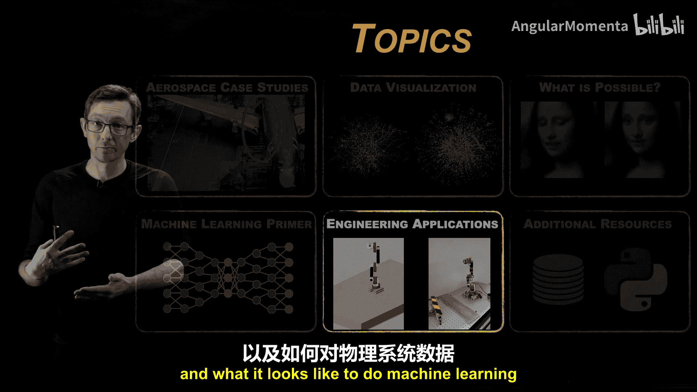

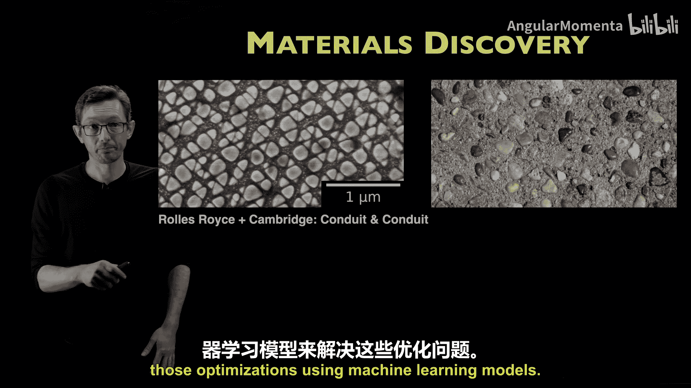

在本节课中，我们将探讨机器学习在高级工程领域的应用。我们将看到，将物理原理嵌入机器学习过程至关重要，并了解如何处理物理系统数据。我们将通过几个具体的案例，展示如何将现成的机器学习技术应用于工程问题，并深入探讨为何以及如何将物理知识整合到模型中，以获得更好的性能。

## 从材料发现到自主系统 🧪🤖

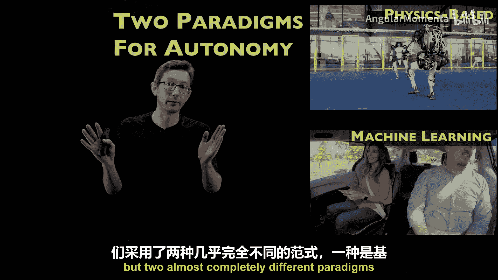

上一节我们介绍了数据密集型工程的基础概念。本节中，我们来看看机器学习在高级工程中的具体应用。

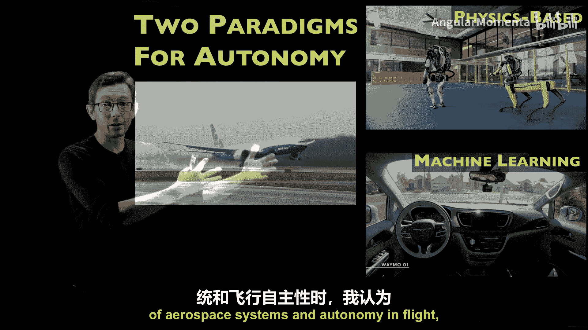

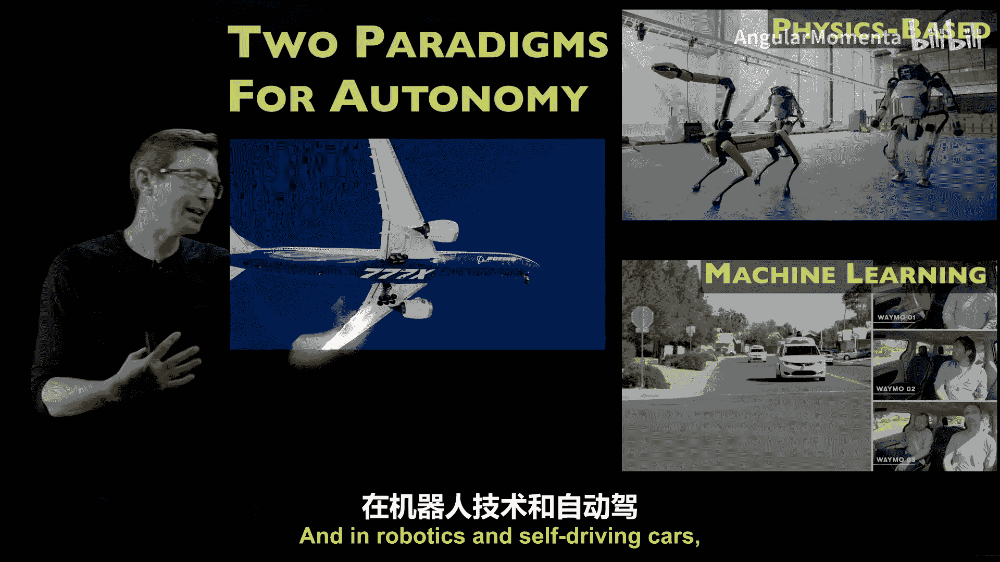

我们已经看到了一些很酷的例子，比如利用训练数据设计超级合金的材料发现。这只是众多可以通过机器学习技术开发的高级工程相关技术之一。如果你想设计一种像牙齿、骨骼、头发和指甲这样的生物材料一样，具有**异质性、各向异性和多尺度性**的先进材料，你将面临一个**高维非凸优化空间**。你可以开始使用机器学习模型来解决这些优化问题。

在工程领域，还有另一个能体现机器学习价值的例子。我们有两种经典的自主系统范式：
*   **基于物理的范式**：通常用于机器人等领域（例如波士顿动力公司），主要依赖于精心推导的物理方程来控制。
*   **机器学习范式**：通常用于自动驾驶汽车等领域，主要依赖于计算机视觉等技术。

这两个系统都表现出非常先进和令人印象深刻的性能，但它们是两种几乎完全不同的范式。

## 融合物理与机器学习 🔄

当我们开始思考下一代航空航天系统和飞行自主性时，我认为我们将开始真正看到基于物理的解决方案和机器学习解决方案的融合。在机器人和自动驾驶汽车领域，你也会开始看到物理原理融入机器学习，机器学习方法也融入物理建模。我们正努力兼收两者之长。

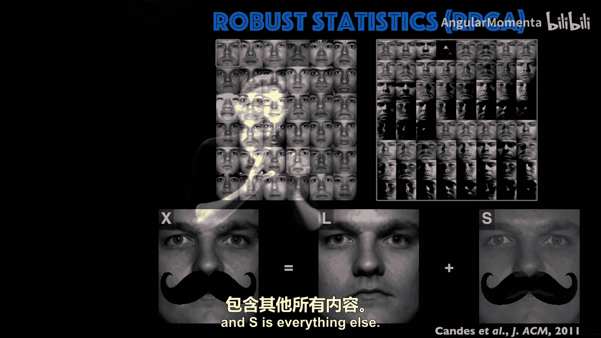

因此，理解这些方法的优缺点和优势非常重要，这不仅是本系列课程的重点，也是未来系列课程要深入探讨的内容。

## 案例一：流体力学中的机器学习应用 🌊

在我热爱的流体力学领域，有很多利用机器学习来改进模型、控制器以及理解、预测和操控流体流动的绝佳机会。

这是一个非常酷的例子，由Benjamin Herman与TU Brantriig的Richard Zeieman实验室合作完成。他们使用相对现代、可解释的机器学习技术，从实验湍流数据中构建了非常好的模型。这些数据来自一个D形体的尾流实验，类似于高速公路上的运输卡车模型。通过在尾部边缘施加周期性吹气（同相或异相），并在不同频率和强度下，会产生不同的“锁定”现象，即尾流会锁定到吹气频率，从而改变升力、阻力和所有空气动力学特性。

通过一个本质上是**人类可解释的微分方程**的机器学习模型，Benjamin几乎完美地匹配了那些发生“锁定”现象的区域。这个机器学习模型可以作为**代理模型**，用于设计控制器和传感器布局等。这在流体动力学中有大量应用，这只是我最喜欢的例子之一。

现在，我将开始介绍几个小案例，展示我们如何将经典的机器学习方法应用于工程系统。这将引出将物理原理嵌入过程的必要性。

## 案例二：将图像技术应用于物理系统 📸➡️🌪️

我最喜欢的例子之一是鲁棒主成分分析。这个想法很简单：如果你有一个大型训练数据集（例如人脸图像），你可以从数据的统计相关性中学习统计模式。对于一个新图像，该算法可以将其分解为两个图像之和：**L**（在统计分布中）和**S**（其他所有部分）。这是经典技术。

我要展示的是，当你将这项技术应用于物理系统时会发生什么。

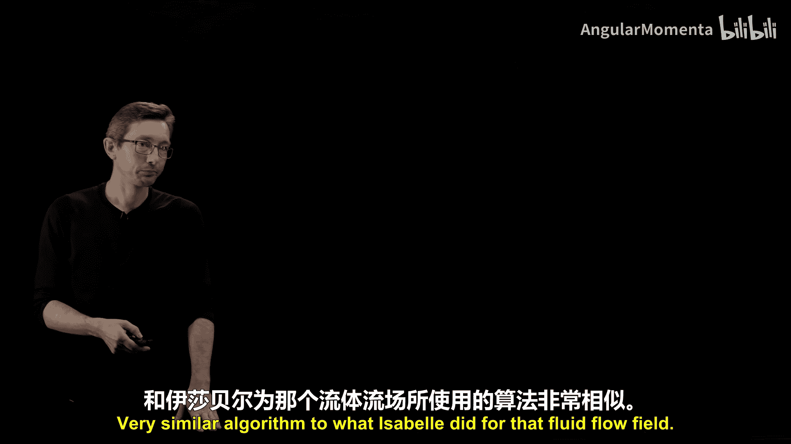

这项工作由Isabel Sherll（当时是华盛顿大学的博士生）完成。她将RPCA应用于流体流场数据。实验数据通常带有“椒盐噪声”和异常值。当Isabel将这种鲁棒主成分分析技术应用于这些数据时，她能够将流场分解为两个“电影”L和S之和，其中L包含所有低维特征和模式，而S是所有异常值、损坏和椒盐噪声的稀疏矩阵。

这听起来好得令人难以置信，因为有无穷多种方法可以将X分解为L和S之和。我们之所以认为这不是“好得难以置信”，是因为数据中存在统计相关的模式。具体来说，这是所有无穷多分解方式中，**唯一能最小化L的秩（即低维结构）和S的零范数（即尽可能稀疏）的优化解**。

但这是一个非凸优化问题，无法随摩尔定律扩展。诀窍在于存在这个优化问题的凸松弛方法：用**L的核范数**（奇异值之和）代替秩，用**S的一范数**（绝对值之和）代替零范数。这些都是凸范数，可以随摩尔定律扩展。过去20年应用数学和统计学的一大进步就是，我们可以在高概率下，将难解的非凸NP-hard优化问题松弛为可解的问题，并收敛到相同的解。这就是Isabel实现的算法。

关键要点是：如果你的数据看起来像电影、图像、音频序列或自然语言序列，**先尝试现成的算法**。对于图像和音频数据，有极其强大的算法可用。有时它会像魔法一样有效。这与推荐系统、Netflix奖和矩阵补全背后的技术本质相同。

## 案例三：超分辨率技术的启示与局限 🔍➡️📈

另一个在高科技行业（如谷歌、Facebook）发展已久的技术是**超分辨率**概念。即从低分辨率图像推断出与之一致的高分辨率版本。

同样，你应该问自己：这好得令人难以置信吗？在这种情况下，同样存在大量的统计相关性和模式。我们可以将这项技术应用于物理系统。事实上，物理信息机器学习中最激动人心的前沿研究领域之一就是：如何对流体流动、材料等多尺度且难以全分辨率模拟的事物进行超分辨率处理。

我们的团队也在研究这个。这里强调一个例子：我们使用约翰霍普金斯湍流数据库的高分辨率数据，将其下采样为低分辨率数据，然后训练一个**浅层解码器**来从低分辨率细节填充高分辨率细节。这是一个非常简单的超分辨率挑战。

结果相当显著，几乎完美地从下采样图像重建了真实的流场。然而，我们做的第一个测试是经典的机器学习方式：训练数据在时间上随机采样。在测试数据上，当它们与训练数据随机交错时，我们做得几乎完美。

但你会注意到，这是一个**插值任务**——所有测试数据点都夹在训练数据之间。神经网络非常擅长插值任务。如果未来部署的情况可以看作是训练数据的插值，神经网络将表现完美。

但它们不擅长**外推**。因此，我们让模型训练前70%的时间序列数据，然后预测未来的30%。结果发现，在训练数据结束后不久，预测效果还不错，但随后迅速恶化，直到与真实流场毫无相似之处。

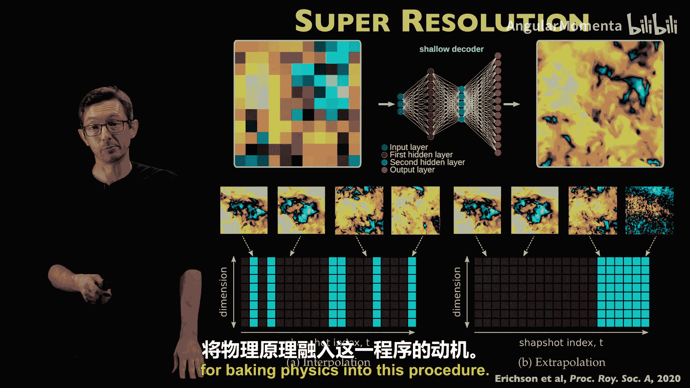

这指出了一个关键点：**神经网络通常不擅长向未来外推**。而物理模型往往是能够外推的模型。一个很好的物理工作定义就是：一个能推广到我从未见过的新条件的模型。因此，我认为，要在神经网络或机器学习模型中获得这种外推性能，唯一的方法就是在过程中融入一些物理先验知识（例如，我知道这是不可压缩流，遵守能量、质量和动量守恒）。如果能将这一点融入算法，也许我们能在未来获得更好的外推性能。这是一个非常重要的经验教训，也是将物理原理融入过程的动机。

## 案例四：差异模型与数字孪生 🤖💡

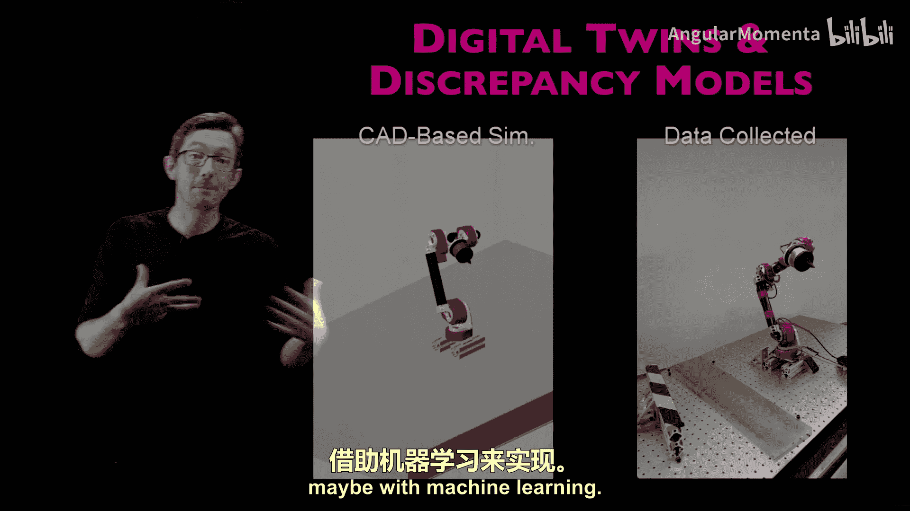

另一个案例是机器学习如何用于所谓的**差异模型**和**数字孪生**。这是一个基于第一性原理的机器人仿真，与在实验室中测量的实际机器人对比。你会注意到它们在一段时间内吻合得很好，但最终会因为模型与真实情况之间的微小差异而开始发散。

特别是如果我们的模型随时间老化，或者存在线性轴承颤动、风阻等难以用第一性原理物理模型描述的因素，这些差异可以用机器学习来建模。在数字孪生这个大图景中，一个非常重要的概念是：我们试图建模的更大资产（无论是工厂、飞机还是汽车）的所有部分，其模型都是不完美的，而数据（可能借助机器学习）将帮助我们更新这些模型。

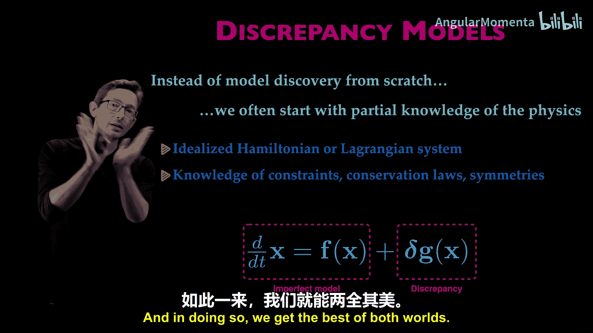

这里的想法是，与其完全从头开始用机器学习发现机器人手臂的模型（这非常困难），我们通常从部分物理知识开始。我们可能有一个理想化的方程（哈密顿或拉格朗日系统），知道约束方程、守恒律或对称性。我们希望兼收两者之长：从物理模型开始，建模那些我们知道但机器学习难以建模的约束、守恒和对称性；然后用机器学习来建模那些物理难以建模的差异。

我喜欢展示这个视频：它展示了一个基于理想化哈密顿或拉格朗日模型的模型预测控制器，可以非常接近地将这个双摆系统摆起，但由于模型中未包含的轴承颤动、风阻和摩擦等差异，它并不完美。然而，当你将差异模型添加到物理模型中时，这额外的一部分使得能够实现完美控制。有时，微小的差异就是控制器成功与失败的关键。

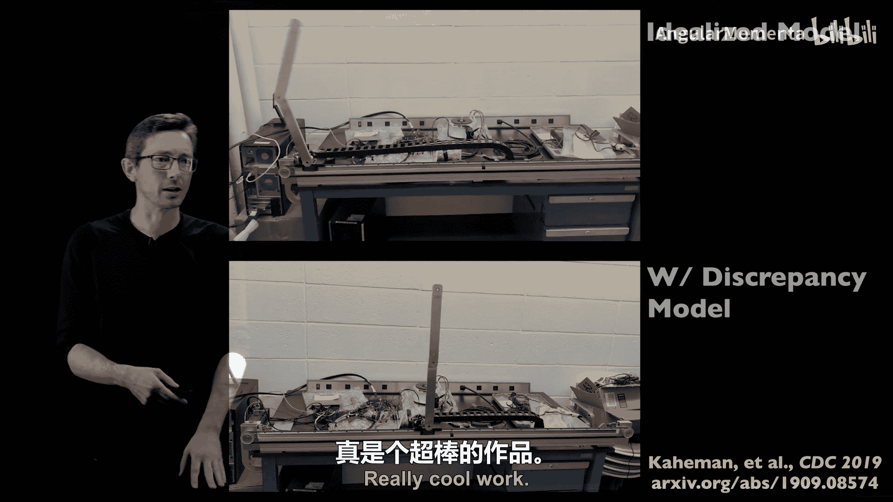

这里的理念是存在两个轴：有些东西（如建模扰动和未知物理）很难从第一性原理出发；有些东西（如融入已知物理）对机器学习来说很难，但用纸笔很容易做到。我们希望有一类模型不仅能连接这两点，而且能在帕累托最优前沿上取得最佳平衡——既能轻松获得机器学习容易的部分，也能轻松获得第一性原理容易的部分。差异模型就处在这个位置。

在更大的图景中，随着我们开始为数字孪生开发这些更大的模型集合（其中一些基于物理，一些基于机器学习，一些是混合模型），并且随着系统老化、演变和变化不断收集数据，这种方法将非常有用。我们可以不断更新这些模型，建模差异以匹配数据。

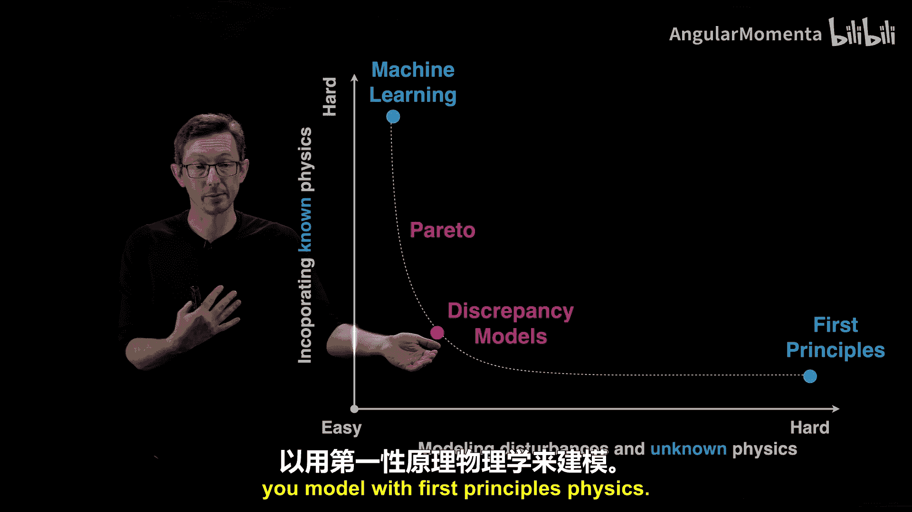

## 总结 📚

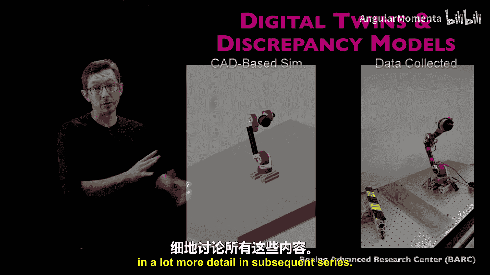

本节课中，我们一起学习了机器学习在高级工程系统中的多个应用案例。我们看到，有时可以直接使用现成的技术（如RPCA用于流场去噪），在材料科学、流体动力学、机器人、自主系统和数字孪生等领域都有巨大优势和前景。同时，我们也认识到神经网络的局限性（如外推困难），并强调了将物理原理嵌入机器学习过程以获得更好、更可推广模型的重要性。通过差异模型等方法，我们可以结合物理建模与机器学习的优势，构建更强大的工程系统模型。未来充满机遇，我们将在后续系列中更详细地探讨所有这些主题。